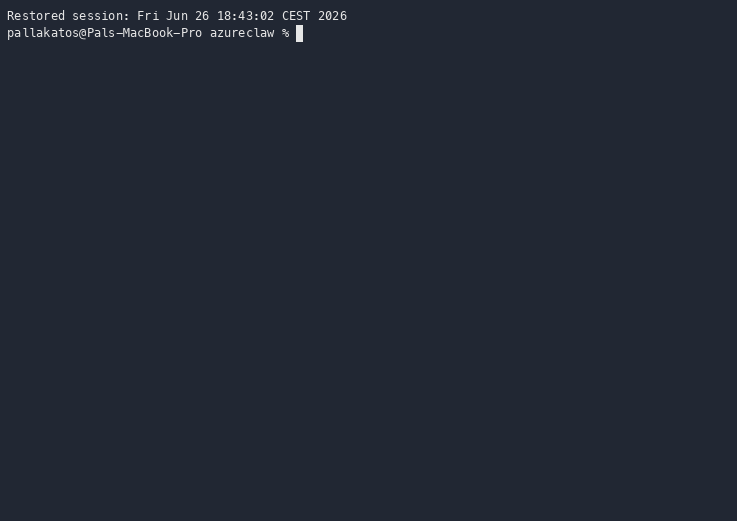

<div align="center">


# kars — Agent Reference Stack for Kubernetes

**The secure, Kubernetes-native runtime for AI agents: one hardened sandbox per agent, zero credentials in the agent, every call governed.**

[](https://www.npmjs.com/package/@kars-runtime/cli)
[](LICENSE)
[](https://github.com/Azure/kars/actions/workflows/ci.yml)
[](https://azure.microsoft.com)
[](https://scorecard.dev/viewer/?uri=github.com/Azure/kars)

Hardened sandbox per agent · zero credentials in the agent · every external call brokered by a Rust router that enforces identity, content safety, governance, and audit · end-to-end encrypted inter-agent messaging · one CLI from laptop to AKS.

[**Try it in five minutes →**](#try-it-in-five-minutes) &nbsp;·&nbsp; [**Run it on AKS →**](docs/getting-started.md#step-2--deploy-to-aks) &nbsp;·&nbsp; [**Architecture →**](docs/architecture.md) &nbsp;·&nbsp; [**Blueprints →**](docs/blueprints/00-index.md)

</div>

---

```bash
# 1. Install the CLI (Node 22+)
npm i -g @kars-runtime/cli

# 2. Bring up a governed agent on a local Kubernetes (kind) cluster that mirrors AKS
kars dev --release --target local-k8s

# 3. Chat with it
kars connect dev-agent
```

<div align="center">



<em>First run: pick a provider, and kars brings up the controller, the encrypted mesh, and a sandboxed agent on a local kind cluster. <a href="docs/quickstart.md"><strong>Full quickstart →</strong></a></em>

</div>

> 📌 **Not an officially supported Microsoft product.** `kars` is an open-source reference implementation from the Azure Cloud Native team (the team behind Azure Kubernetes Service and Azure Linux). See [Project status](#project-status) for framing and limitations.

---

## The problem

Giving an AI agent real tools means giving it real credentials and a real network. In production that is too much blast radius: a single prompt-injected agent can reach your Azure subscription, your GitHub org, and your customer data.

kars runs agents with the same operational discipline as the rest of your services:

- **Zero-trust agent process** — the agent runs under a different UID than the router and never sees an Azure key. The inference router holds the credential and brokers every call.
- **Cross-framework E2E mesh** — agents on different frameworks talk over AgentMesh using the Signal Protocol; the relay sees only ciphertext. **OpenClaw ↔ Hermes** is wired and exercised end-to-end on every push (`tests/e2e/interop/hermes_openclaw_bidi.sh`); the other adapters bundle the mesh client and are being brought to the same bar ([roadmap](docs/roadmap.md)).
- **Declarative operations** — fleet operations are GitOps-native and observable through the Headlamp plugin: a Kubernetes dashboard for agent sandboxes, policy CRDs, and trust topology.
- **Real Kubernetes dev loop** — `kars dev --target local-k8s` runs your agent in `kind` using the same Helm chart, NetworkPolicies, and sidecars as production AKS.

---


## Ecosystem Alignment

The Kubernetes agent ecosystem is evolving rapidly. Our long-term aim is to align architecturally and collaborate with upstream community efforts like `kubernetes-sigs/agent-sandbox` (for isolated pod primitives) and `agentgateway` (for edge/protocol routing). 

While no formal integrations or project discussions have taken place yet, `kars` is designed with composability in mind, so it can grow toward this broader cloud-native agentic stack as those standards mature.

## Architecture (How it works)

```text
                    ┌──────────────── Sandbox pod ────────────────┐
   User / TUI ────► │  agent container (UID 1000, no network)     │
                    │              │                              │
                    │              │  localhost only              │
                    │              ▼                              │
                    │  ┌────────────────────────────────────┐     │
                    │  │  Inference Router (Rust)           │     │
                    │  │                                    │     │
                    │  │  Identity (Entra Agent ID)         │     │
                    │  │  Content Safety (Foundry inline)   │     │
                    │  │  Token budget · rate limit         │     │
                    │  │  Tool policy · governance (AGT)    │     │
                    │  │  Audit (tamper-evident chain)      │     │
                    │  └─────────────────┬──────────────────┘     │
                    │                    │                        │
                    │            init: egress-guard               │
                    │      (iptables safety net: agent UID        │
                    │       can only reach the router locally)    │
                    └────────────────────┼────────────────────────┘
                                         │
                   ┌─────────────────────┼─────────────────────────┐
                   ▼                     ▼                         ▼
            Inference backend      AgentMesh relay            A2A peers
```

**The agent has no network of its own.** Every byte that leaves the pod leaves through the Rust inference router. The `NetworkPolicy` and `egress-guard` iptables container are **safety nets** that contain blast radius if the router is bypassed. Compromise of the agent does not compromise the cloud account, the model, the audit log, or the peer mesh.

### Spotlight: the inference router is the zero-trust core

The per-pod router is the one component every external call passes through, and it carries most of the security model. It runs as a **separate container under a different UID (1001) than the agent (1000)**, holds the credentials the agent never sees, and is the single enforcement point for:

- **Identity & token brokering** — exchanges the per-sandbox Entra Agent ID (or cluster Workload Identity) for backend tokens via federated OIDC / IMDS; refreshes them automatically. The agent process holds **no** long-lived key. *(`auth.rs`, `copilot_auth.rs`)*
- **Inline content safety** — reads Foundry's `prompt_filter_results` on every completion (jailbreak / indirect-attack / hate / violence / self-harm / sexual), enforces a configurable severity floor, and feeds detections into a per-peer trust penalty. *(`safety.rs`)*
- **Token budgets & rate limits** — per-tenant token ceilings and request rate limits, enforced before the call leaves the pod. *(`budget.rs`, `rate_limiter.rs`)*
- **L7 egress allowlist + blocklist** — every outbound `CONNECT` is checked against the per-sandbox allowlist and the OISD + URLhaus blocklist (daily refresh); `EgressApproval` CRDs add time-boxed exceptions. *(`forward_proxy.rs`, `egress_allowlist_loader.rs`, `blocklist.rs`)*
- **MCP gateway** — brokers calls to external MCP servers with OAuth and per-tool allowlists. *(`mcp/`)*
- **Governance (AGT)** — policy decisions, per-peer trust scoring, and behaviour monitoring through the consumed Agent Governance Toolkit primitives. *(`governance/`, `behavior_monitor.rs`)*
- **Tamper-evident audit** — every decision is written to an append-only, **SHA-256 hash-chained** audit log (AGT's `AuditLogger`: each entry's hash covers the prior entry's hash) in a stable JSONL format. *(consumed from `agentmesh::AuditLogger`; persisted via `audit_sink.rs` / `audit_jsonl.rs`)*
- **A2A data plane** — the cross-org A2A surface, including AP2 mandate signing and the trust store. *(`a2a/`)*
- **Sub-agent spawn & handoff** — creates/destroys `KarsSandbox` sub-agents and drains/migrates sessions, all through the pod's scoped ServiceAccount. *(`spawn/`, `handoff/`)*
- **Mesh bridge** — WebSocket-bridges **opaque** Signal-Protocol ciphertext to the relay. The router holds no session keys and cannot decrypt. *(`mesh.rs`)*

**Why this is not the same as a cluster-edge gateway (e.g. `agentgateway`).** A north-south gateway governs traffic at the cluster boundary; the kars router is an **in-pod policy enforcement point** that sits on `localhost` between the agent and everything else, so the agent has **no network path that bypasses it**. They operate at different layers and are **complementary, not interchangeable** — a cluster-edge gateway can front kars, and the per-pod router still does the per-agent identity, content-safety, budget, and audit enforcement that a shared edge cannot do per-sandbox. This is the structural core of the zero-trust model: the trust boundary is the pod, not the cluster perimeter.

---

## What makes it different

- **Security teams review YAML, not Python.** Approval gates, rate limits, tool allowlists, content-safety floors, token budgets, and trust topology are declarative Kubernetes resources — commit them to a repo, reconcile with Argo / Flux, audit with `git log`. 
- **End-to-End Encrypted Mesh.** Two agents that talk cannot be eavesdropped by you, by us, or by the relay. X3DH + Double Ratchet with KNOCK trust gating.
- **Pluggable backends.** GitHub Copilot, Azure AI Foundry, Azure OpenAI, and GitHub Models. Switch with a one-field CRD change.

[**Read the full architecture and security guarantees in the docs →**](docs/architecture.md)

---

## Three ways to run it, one mental model

You write the same `KarsSandbox` YAML for all of them. The difference is where it runs and what isolates it.

| Aspect | **Local — kind** (`kars dev --target local-k8s`) *(recommended)* | **Local — Docker** (`kars dev`) | **Prod — AKS** (`kars up`) |
|---|---|---|---|
| Where | A local [kind](https://kind.sigs.k8s.io/) Kubernetes cluster | One container on your laptop | An AKS cluster in your subscription |
| Pod shape | **Multi-container pod** — agent + router + init `egress-guard`, the real production shape | **Single container** — agent + router co-located (fastest, not the prod shape) | **Multi-container pod** — agent (UID 1000) + router (UID 1001) + init `egress-guard` |
| Network isolation | `NetworkPolicy` + `egress-guard`, same as AKS | Container network, no egress guard | Router is the policy point; `NetworkPolicy` + `egress-guard` contain blast radius |
| Identity | Static provider credential (no Workload Identity / Entra) | Static provider credential (mounted from a local secret) | **Per-sandbox Entra Agent ID** with `--mesh-trust=entra` (default `anonymous` uses cluster Workload Identity); router never sees a long-lived key |
| Optional VM isolation | n/a | n/a | Kata + AMD SEV-SNP (Confidential Containers) — requires a Kata node pool |
| Use it for | **The dev loop for anything you'll ship** — validates the K8s glue | Fastest prompt/tool inner loop, demos | Real workloads, multi-tenant, production |

The kind loop reproduces the AKS pod shape, `NetworkPolicy`, and UID split, so what you test locally is what ships — it differs from AKS only in auth source and infrastructure (no cloud node pools). The Docker target is the quickest path to a chat when you don't need the Kubernetes glue. See [Architecture → Local Kubernetes mode](docs/architecture.md#local-kubernetes-mode-kars-dev---release---target-local-k8s) and [Blueprint 02 — Local Kubernetes dev loop](docs/blueprints/02-local-k8s-dev-loop.md).

Same CRDs. Same router code path. Same audit format. Same governance profiles. The graduation from local to AKS is a one-line CLI change, not a port to a new system.

---

## Try it in five minutes

**No compile. Works for everyone — macOS & Linux, Intel & Apple Silicon.** All
the images are multi-arch (`amd64` + `arm64`, native on Apple Silicon) and
cosign-signed; `--release` pulls them, so there's no Rust, no clone, no build.

Install the CLI:

```bash
npm i -g @kars-runtime/cli
```

**Recommended — a real Kubernetes dev loop on a local [kind](https://kind.sigs.k8s.io/) cluster.**
You need **kind** + **kubectl** + any container runtime (**Docker, Podman, or nerdctl** — kind drives all three):

```bash
kars dev --release --target local-k8s
```

This runs the published images in the **real production pod shape** — separate
router container, init `egress-guard`, `NetworkPolicy`, seccomp — so it behaves
almost identically to AKS. It's the dev loop we recommend, because what you test
locally is what ships.

<details>
<summary><strong>Just want the fastest smoke test?</strong> A single container, no Kubernetes.</summary>

If you only need to kick the tyres and don't have kind installed, the default
target runs the agent + router co-located in **one container** (no
`NetworkPolicy`, no separate router container — not the production shape, but the
quickest path to a chat). This path uses the **`docker` CLI** directly, so it
needs Docker (or a Podman `docker`-compatible shim) plus Node 22+:

```bash
kars dev --release          # one container via the docker CLI
```

</details>

On first launch you pick an inference provider — **GitHub Copilot** is easiest
(one device-code login, no Azure account). The CLI on npm is **build-provenance
attested** (SLSA) — verify with `npm audit signatures` after install.

When you're ready for a managed cluster, `kars up` provisions AKS (see
[Getting started → Deploy to AKS](docs/getting-started.md#step-2--deploy-to-aks)).

<details>
<summary>Other ways to install</summary>

```bash
# One-line installer (no Node required up front — fetches the signed CLI tarball)
curl -fsSL https://raw.githubusercontent.com/Azure/kars/main/install.sh | bash

# Pin a specific release with the installer (any published tag; omit for latest)
KARS_VERSION=v0.1.20 bash -c "$(curl -fsSL https://raw.githubusercontent.com/Azure/kars/main/install.sh)"

# Or build from source — to hack on the controller / router / plugin (needs Rust 1.88+)
git clone https://github.com/Azure/kars.git && cd kars
cd cli && npm ci && npm run build && npm link && cd ..
kars dev   # builds the images locally for your architecture
```
</details>

On first run, `kars dev` shows a three-way provider picker — **GitHub Copilot** (default; one device-code login, no Azure account), **Azure AI Foundry / Azure OpenAI** (full feature set: Memory Store, agents, Content Safety), or **GitHub Models** (free, PAT-only, smaller context). Your choice is saved to `~/.kars/config.json` and reused on later runs; switch with `kars credentials`. Full walkthrough: **[Getting started → Launch a sandbox](docs/getting-started.md#12-launch-a-sandbox)**.

`kars dev` then prompts for an **agent name** (default `dev-agent`). Use that name in subsequent commands:

```bash
# Talk to the agent (TUI auto-opens; or use the CLI directly)
kars connect dev-agent
```

The TUI drops you into a chat window. Type *"list the files in my workspace"* or *"write a Python script that reverses a string and run it"* — every tool call the agent makes is governed by the same router code path that runs in production.

> **Don't have an Azure AI Foundry deployment yet?** If you picked Copilot or Models above, you don't need one. If you want the full Foundry feature set, two `az` commands get you both — see **[Getting started → Choosing an inference provider](docs/getting-started.md#choosing-an-inference-provider)**.

When you are ready for the real thing:

```bash
kars up --name prod-agent --region swedencentral --release
```

`--release` pulls the **public, cosign-signed images** from `ghcr.io/azure` into your ACR — **no local build, no Rust toolchain, no source checkout to compile.** (Drop `--release` to import from a source ACR, or pass `--build` to build from source — developer mode.)

`kars up` provisions the AKS cluster, ACR, Foundry resource, Foundry-side Content Safety, controller, A2A gateway, Microsoft AGT AgentMesh relay+registry, and your first sandbox. Identity is gated by **one operator flag**:

```bash
# Default — anonymous mesh tier, shared cluster Workload Identity for Foundry.
# Zero Entra prerequisites. Suitable for single-tenant clusters and demos.
kars up --name prod-agent --region swedencentral --release

# Verified mesh tier — per-sandbox Microsoft Entra Agent ID.
# Each KarsSandbox (incl. spawned sub-agents) gets its own typed Entra
# agentIdentity SP + Foundry RBAC scoped to that SP + federated credential.
# Requires the Agent ID Developer directory role on the signed-in user.
kars up --name prod-agent --region swedencentral --release --mesh-trust=entra
```

`--mesh-trust=entra` activates the full **per-sandbox Microsoft Entra Agent ID** chain (Phase 5b/6.c): the controller provisions a typed `microsoft.graph.agentIdentity` SP per sandbox, assigns Foundry RBAC to that SP, wires a federated credential, and configures the AGT mesh relay+registry to verify peer JWTs against Entra's JWKS. The default `anonymous` skips Entra entirely and uses the cluster's federated Workload Identity for Foundry — same security model as v0.0.x. See **[`docs/agent-identity.md`](docs/agent-identity.md)** and **[`docs/architecture/entra-agent-id/`](docs/architecture/entra-agent-id/)** for the full chain. See **[`docs/getting-started.md`](docs/getting-started.md)** for the full walkthrough including how to bring your own AKS / Foundry / ACR.

---

## What is built in

### Twelve CRDs (ten workload + two infrastructure)

`KarsSandbox` is the unit of work — one CRD per agent. The other nine **workload** CRDs bind policy, identity, peer relationships, memory, evaluation, and operations to it. Two **infrastructure** CRDs are written by the platform, not authored per agent.

**Ten workload CRDs** (you author these):

| CRD | Purpose |
|---|---|
| **`KarsSandbox`** | The agent itself: runtime kind, model, tools, mesh membership, governance profile. |
| **`A2AAgent`** | Public-ingress A2A 1.0.0 endpoint for peer-to-peer agent communication. |
| **`McpServer`** | An external MCP server the agent is allowed to call, with OAuth + allow-listed tools. |
| **`ToolPolicy`** | Per-tool gate (approval / rate-limit / commerce caps / AGT profile). |
| **`InferencePolicy`** | Per-tenant model routing, content-safety floor, and token budgets. |
| **`KarsMemory`** | Foundry Memory Store binding with project-MI auth (operator-provisioned today). |
| **`KarsEval`** | Reproducible evaluation runs against a sandbox spec. |
| **`TrustGraph`** | Cross-namespace / cross-cluster trust topology for the AgentMesh layer. *(`v1alpha1` — reconciler-only; router-side **mesh-admission gating** against the projected graph is on the [roadmap](docs/roadmap.md). KNOCK accept/deny stays agent-side — the router cannot decrypt the Signal session.)* |
| **`EgressApproval`** | Ephemeral, TTL-bounded extra egress hosts overlaid on the baseline allowlist. |
| **`KarsSREAction`** | Approval-gated, TTL-bounded write action proposed by the [autonomous SRE operator](docs/runbooks/sre.md). The controller executes it only when `spec.approval.state` is `Approved`, via a short-lived `TokenRequest` + scoped `ClusterRoleBinding` (least-privilege, auto-revoked). |

**Two infrastructure CRDs** (platform-written, not per-agent): **`KarsAuthConfig`** (cluster-scoped singleton written by `kars mesh setup-trust` — the tenant-wide Entra Agent ID trust anchor) and the controller-internal **`KarsPairing`** record (binds sandboxes to AgentMesh registry IDs).

That's **twelve CRDs in total** — ten you author, two the platform manages. Full schema in **[`docs/api/crd-reference.md`](docs/api/crd-reference.md)**.

### Eight agent runtimes (plus BYO)

You pick the runtime via `KarsSandbox.spec.runtime.kind`. The router, governance, isolation, and audit chain are identical across all of them.

| Runtime | Language | Image dir | Status |
|---|---|---|---|
| **OpenClaw** (default) | TypeScript / Node | `sandbox-images/openclaw/` | ✅ |
| **Hermes** (Nous Research) | Python | `sandbox-images/hermes/` | ✅ |
| **OpenAI Agents SDK** | Python | `sandbox-images/openai-agents/` | ✅ |
| **Microsoft Agent Framework** | Python | `sandbox-images/maf-python/` | ✅ (`.NET` deferred) |
| **LangGraph** | Python | `sandbox-images/langgraph/` | ✅ |
| **LangGraph.js** | TypeScript | `sandbox-images/langgraph-ts/` | ✅ |
| **Anthropic Claude Agent SDK** | Python | `sandbox-images/anthropic/` | ✅ |
| **Pydantic-AI** | Python | `sandbox-images/pydantic-ai/` | ✅ |
| **BYO** | any | your image, our contract | ✅ |

The BYO contract is documented in **[`docs/runtimes.md`](docs/runtimes.md)**. Semantic Kernel and MAF .NET are wired in the CRD enum but the adapter images are deferred — the controller emits a clear `ShapeInvalid` condition rather than silently mis-imaging the pod.

### One mesh, one gateway, one CLI

- **AgentMesh** — Signal Protocol (X3DH + Double Ratchet) inter-agent messaging with KNOCK trust handshake and per-message forward secrecy. No plaintext fallback. **The Signal session lives in the agent process**, not the router: **OpenClaw** bundles the AGT TypeScript SDK and **Hermes** the AGT Python mesh client, both wire-compatible (proven by `tests/e2e/interop/hermes_openclaw_bidi.sh`). The router holds **no** session keys and never does mesh crypto — it links the upstream `agentmesh` crate only for shared governance primitives and WebSocket-bridges opaque ciphertext to the relay. Every client is an upstream Microsoft AGT build — **no in-tree fork**. (Full provenance, crate pins, and the per-adapter status: **[architecture → The mesh](docs/architecture.md#the-mesh)**.)
- **A2A gateway** — public-ingress for peer-to-peer agent traffic with tenant routing, audit, and rate limiting. AgentCard signature verification (`kars_a2a_core::verify_inbound_card`) ships as a library and is unit-tested; today the gateway authorises inbound traffic via the `X-A2A-Agent-Subject` header set by the upstream mTLS layer. Wiring the verifier as an axum layer inside the gateway binary is tracked in the [roadmap](docs/roadmap.md).
- **CLI (`kars …`)** — 30+ commands covering the whole lifecycle: `dev`, `up`, `add`, `connect`, `handoff`, `mesh`, `policy`, `egress`, `eval`, `attest`, `audit`, `inspect`, `migrate`, `operator` (live TUI), `destroy`, and more. Full reference in **[`docs/cli-reference.md`](docs/cli-reference.md)**.

---

## What it is *not*

- **Not a fork of OpenClaw.** kars extends [OpenClaw](https://openclaw.ai) through its native plugin API and `tools.deny` config. No OpenClaw source is modified, patched, or vendored. Any upstream OpenClaw release is drop-in compatible. See **[`docs/upstream-alignment.md`](docs/upstream-alignment.md)**.
- **Not a managed service.** It is a runtime you operate yourself, in your subscription, in your AKS cluster.
- **Not a model provider.** Models come from Azure AI Foundry (or any compatible provider through the BYO contract). kars governs the data path; it does not host the model.

---

## Documentation

| If you want to… | Read |
|---|---|
| Understand the design in 15 minutes | [`docs/architecture.md`](docs/architecture.md) |
| See the diagrams (dev, prod, mesh, A2A) | [`docs/architecture-diagrams.md`](docs/architecture-diagrams.md) |
| Pick a deployment shape | [`docs/blueprints/00-index.md`](docs/blueprints/00-index.md) |
| Read the CRD schema | [`docs/api/crd-reference.md`](docs/api/crd-reference.md) |
| Understand security guarantees | [`docs/security.md`](docs/security.md) |
| Build your own runtime | [`docs/runtimes.md`](docs/runtimes.md) |
| Look up a CLI command | [`docs/cli-reference.md`](docs/cli-reference.md) |
| Operate a fleet | [`docs/operations/`](docs/operations/) |

The full site index is in **[`docs/README.md`](docs/README.md)**.

---

## Project status

> 📌 **NOTE: This is not an officially supported Microsoft product.** kars is an open-source reference implementation developed in the open by the **Azure Cloud Native team** — the team behind Azure Kubernetes Service and Azure Linux. No SLA, support contract, or product roadmap commitment is attached — see [SUPPORT.md](SUPPORT.md), [TRADEMARKS.md](TRADEMARKS.md), and [LICENSE](LICENSE).

> ✅ **Every published artefact is signed.** All container images on `ghcr.io/azure` are **cosign keyless-signed** (verifiable in the Sigstore Rekor transparency log), carry an **SPDX SBOM**, and a **GitHub build-provenance (SLSA) attestation** — verify with `cosign verify` / `gh attestation verify`. The CLI is published to **npmjs as [`@kars-runtime/cli`](https://www.npmjs.com/package/@kars-runtime/cli)** with an SLSA build-provenance attestation (verify with `npm audit signatures`), and the CLI tarball on each GitHub Release is attested too. Install with no compile via the [Try it in five minutes](#try-it-in-five-minutes) quick-start. *(We're additionally working on publishing to crates.io / MCR — the GHCR + npm artefacts above are signed and usable today.)*

**Status: active development; CRDs at `v1alpha1`.** The core data path (router, controller, A2A gateway, mesh) is feature-complete and exercised by CI (Kind E2E, chaos-tier fault injection, CNCF conformance self-assessment, plus a documented manual matrix on AKS — see [`tests/`](tests/)). The CRD surface is served at `v1alpha1` and may change between minor releases; the data path, security model, and audit chain are stable. See the **[latest release](https://github.com/Azure/kars/releases/latest)** and **[`CHANGELOG.md`](CHANGELOG.md)** for what shipped, and **[`docs/roadmap.md`](docs/roadmap.md)** for what's next.

## Known limitations

We would rather you find these in this list than in production. None of them block the core promise (one router, one audit chain, one CRD shape across runtimes), but they shape how you should run the rc:

- **Mesh trust tiers default to anonymous.** Sub-agents register with the AgentMesh registry as the *anonymous* tier unless the operator passes `--mesh-trust=entra` to `kars up` AND holds the `Agent ID Developer` Entra directory role. Under the default, the relay accepts every peer at trust score `0`; KNOCK gating still happens but score-based admission is moot. Verified-tier registration (per-sandbox Entra Agent ID JWTs verified by the AGT relay against tenant JWKS) is fully wired in this repo; the AGT-side relay+registry patches are tracked upstream in [microsoft/agent-governance-toolkit#2659](https://github.com/microsoft/agent-governance-toolkit/pull/2659). One CLI flag (`--mesh-trust=entra`) is the whole opt-in; see **[`docs/security.md#trust-tiers-and-the-apiagentmesh-prerequisite`](docs/security.md#trust-tiers-and-the-apiagentmesh-prerequisite)** for the failure modes when the role / upstream patches are missing.
- **Mesh/spawn/handoff is fully wired for OpenClaw and Hermes; partial for the other adapters.** The encrypted AgentMesh (and the sub-agent spawn / handoff tools that ride on it) is exercised end-to-end for **OpenClaw** and **Hermes** (`tests/e2e/interop/hermes_openclaw_bidi.sh`). The other adapter images (OpenAI Agents SDK, MAF-Python, LangGraph Py/TS, Anthropic, Pydantic-AI) are **published to `ghcr.io/azure` and imported by `--release`**, and run governed inference + the Foundry/MCP tool surface — but their `kars_mesh_*` / spawn / handoff tools are not yet exposed (pending the Python AGT mesh client reaching TS parity for those adapters). Use OpenClaw or Hermes when you need cross-agent mesh today; track the rest on the [roadmap](docs/roadmap.md).
- **Semantic Kernel and MAF .NET runtimes are CRD-wired but adapter-incomplete.** The CRD enum accepts the values, the controller emits a `ShapeInvalid` condition, the agent does not start. Treat them as future work, not silent breakage.
- **Attestation is router-and-audit only.** We sign and hash-chain audit entries; we do not yet emit cosign-signed runtime receipts (`attest sign`/`attest verify` are scaffolded — see `docs/roadmap.md`).
- **No managed-service equivalent.** This is a runtime you operate. There is no hosted control plane.

If a limitation surprised you in a way this list didn't warn about, that's a bug — please file it.

## Contributing & support

kars is built in the open and we'd love your help. Good places to start:

- 🟢 **[Good first issues](https://github.com/Azure/kars/issues?q=is%3Aissue+is%3Aopen+label%3A%22good+first+issue%22)** — small, well-scoped, beginner-friendly tasks with clear acceptance criteria.
- 🤝 **[Help wanted](https://github.com/Azure/kars/issues?q=is%3Aissue+is%3Aopen+label%3A%22help+wanted%22)** — slightly bigger tasks the maintainers would love a hand with.
- 💬 **[Discussions](https://github.com/Azure/kars/discussions)** — questions, ideas, and "is kars right for us?" — we'd genuinely rather you ask than feel stuck.

Before opening a PR, see the **[contributing guide](CONTRIBUTING.md)**. Other references:

- Security policy: **[`SECURITY.md`](SECURITY.md)**
- Support: **[`SUPPORT.md`](SUPPORT.md)**
- Code of Conduct: **[`CODE_OF_CONDUCT.md`](CODE_OF_CONDUCT.md)**

## License

MIT. See **[`LICENSE`](LICENSE)** and **[`THIRD_PARTY_NOTICES.txt`](THIRD_PARTY_NOTICES.txt)**.

## Data collection

kars does not collect telemetry, usage data, or crash reports. Nothing
in this repository — the CLI, controller, inference router, or sandbox
images — sends data to Microsoft or any third party.

Logs and traces emitted by the components stay inside your cluster. They are
visible only to whatever log/metrics pipeline you have wired up (Container
Insights, Loki, your own OTLP collector, etc.). No exporter endpoint is
configured by default.

When kars forwards a model call to Azure AI Foundry on your behalf,
that call is governed by your Azure agreement with Microsoft — not by this
project.

---

> *Trademarks: see **[`TRADEMARKS.md`](TRADEMARKS.md)** for Microsoft trademark + third-party trademark guidance.*
