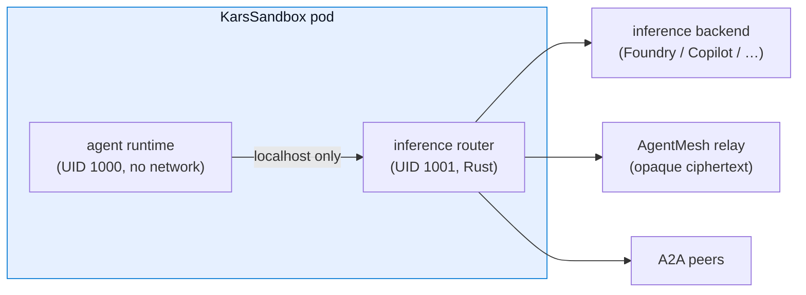

<div align="center">


# kars — Agent Reference Stack for Kubernetes

**The secure, Kubernetes-native runtime for AI agents: one hardened sandbox per agent, zero credentials in the agent, every call governed.**

[](https://www.npmjs.com/package/@kars-runtime/cli)
[](../LICENSE)
[](https://github.com/Azure/kars/actions/workflows/ci.yml)
[](https://azure.microsoft.com)

This is the documentation index. The top-level [`README`](../README.md) is a faster on-ramp; come here when you need depth.

</div>

<div class="cta-row">

<a href="quickstart.md" class="btn-primary">Quickstart — 3 commands</a>
<a href="getting-started.md#step-2--deploy-to-aks" class="btn-primary">Run it on AKS</a>
<a href="architecture.md" class="btn-primary">Architecture</a>
<a href="maturity.md" class="btn-primary">Feature status</a>

</div>

## How it works

One hardened sandbox per agent. The agent has **no network of its own** — every external call (model, tool, MCP, peer) goes through an in-pod Rust **inference router** that enforces identity, content safety, budgets, governance, and a tamper-evident audit chain. The agent never holds a credential.



## Why kars

| Running agents directly | Running agents on kars |
|---|---|
| API keys in the agent's environment | **Zero credentials** in the agent process; the router brokers every call |
| Governance bolted on per-app, in code | **Declarative CRDs** — approval gates, rate limits, tool allowlists, content-safety floors, token budgets as Kubernetes resources |
| Network egress wide open | **Default-deny egress** + L7 allowlist + blocklist; the agent has no socket of its own |
| Inter-agent traffic readable by the broker | **End-to-end encrypted mesh** (Signal Protocol); the relay sees only ciphertext |
| One framework, lock-in | **Eight runtimes** (OpenClaw, Hermes, MAF, LangGraph, …) on one wire format; switch with a one-field change |
| Trust boundary = the cluster | **Trust boundary = the pod** — optional Kata + AMD SEV-SNP per workload via one CRD field |


## Choose your path

### Read in order if you are new
1. [Quickstart](quickstart.md) — a running agent on your laptop in three commands.
2. [Getting started](getting-started.md) — the full local walkthrough, then AKS.
3. [Architecture](architecture.md) — the design and why.
4. [Architecture diagrams](architecture-diagrams.md) — every component, dev and prod side by side.
5. [Use cases](use-cases.md) — the six scenarios kars was built for.

### By audience

| You are a… | Start here |
|---|---|
| **Executive / decision-maker** | [Architecture](architecture.md) → [Blueprints](blueprints/00-index.md) → [Use cases](use-cases.md) |
| **Platform engineer** | [Getting started](getting-started.md) → [Operations](operations/README.md) → [CLI reference](cli-reference.md) |
| **Security engineer** | [Security model](security.md) → [STRIDE](security/stride.md) → [Red-team playbook](security/red-team.md) → [MCP top-10](security-mcp-top10.md) |
| **Agent builder** | [Runtimes](runtimes.md) → [CRD reference](api/crd-reference.md) → [CLI reference](cli-reference.md) |
| **Site reliability** | [Operations / GitOps](operations/gitops.md) → [Conditions](api/conditions.md) → [Egress proxy](egress-proxy.md) |

## Reference

This section mirrors the chapter groups in **[`SUMMARY.md`](SUMMARY.md)**, which is the canonical, complete table of contents. Every published page has a home below; the descriptions are the curated entry points.

### Architecture & design
- [Architecture](architecture.md) — the canonical design doc.
- [Architecture diagrams](architecture-diagrams.md) — dev, prod, mesh, A2A, MCP.
- [Runtime catalog](runtimes.md) — the first-class runtime adapters and the BYO contract.
- [A2A gateway](architecture/a2a-gateway.md) — public-ingress topology and trust model.
- [AGT boundary](architecture/agt-boundary.md) — what AGT enforces vs what kars enforces.
- [Multi-tenant model](multi-tenant.md) — per-namespace tenant isolation, no shared state.
- [Egress proxy](egress-proxy.md) — outbound network controls.

### API & policy
- [CRD reference](api/crd-reference.md) — all twelve CRDs with schema and examples.
- [KarsEval operator guide](api/karseval.md) — replaying the signed attack corpus against a sandbox.
- [Lifecycle & reconciliation](api/lifecycle.md) — what happens, end to end, when you apply each CRD.
- [Conditions reference](api/conditions.md) — every status condition the controller emits.
- [Policy canonical format](api/policy-canonical-format.md) — signing canonicalization rules.

### Agent capabilities
- [kars OpenClaw plugin](openclaw-plugin.md) — the in-sandbox plugin (24 governance-aware tools, 10 skills) every kars-managed agent loads.
- [`@kars/mesh` plugin](mesh-plugin.md) — the companion local plugin (built from source, not yet published on npm) for pairing a local OpenClaw with a remote kars cluster.
- [Channels & external plugins](channels-plugins.md) — Telegram / Slack / Discord / WhatsApp channels + 3rd-party search/scrape API integrations via CLI flags.
- [Operator TUI](operator-tui.md) — `kars operator`, the live cluster dashboard.
- [Permissions model](permissions.md) — the Azure RBAC `kars up` needs, enumerated.
- [Per-sandbox identity](agent-identity.md) — each sandbox runs under its own Entra Agent ID.
- [Examples catalogue](examples.md) — every `examples/` blueprint, each a `kubectl apply` after `kars up`.

### Blueprints
- [Index](blueprints/00-index.md)
- [01 — Developer inner loop](blueprints/01-developer-inner-loop.md)
- [02 — Local Kubernetes dev loop](blueprints/02-local-k8s-dev-loop.md)
- [03 — Enterprise self-hosted](blueprints/03-enterprise-self-hosted.md)
- [04 — Managed public offload](blueprints/04-managed-public-offload.md)
- [05 — Cross-org federation](blueprints/05-cross-org-federation.md)
- [06 — Sovereign / air-gapped](blueprints/06-sovereign-airgapped.md)

### Security
- [Security model](security.md) — the layered control plane.
- [Feature maturity & status](maturity.md) — the single ✅ / 🟡 / 🔵 / ⚪ source of truth for what is enforced today.
- [Control mapping](compliance.md) — enforced controls mapped to NIST SP 800-53 and CIS Kubernetes families.
- [STRIDE](security/stride.md) — threat model.
- [Red-team playbook](security/red-team.md) — adversarial scenarios.
- [CRD trust model](security/crd-trust-model.md) — threat model and live proof for signed CRDs.
- [Security validation](security-validation.md) — what CI verifies.
- [MCP top-10](security-mcp-top10.md) — how kars addresses each item.
- [Upstream alignment](upstream-alignment.md) — the OpenClaw extension contract.

### Operations
- [Operations index](operations/README.md) — fleet operations, GitOps, upgrades.
- [A2A gateway (operations)](operations/a2a-gateway.md) — running the public ingress.
- [GitOps](operations/gitops.md) — declarative fleet management.
- [Helm packaging](operations/helm-packaging.md) — chart layout and release.
- [Image versioning](operations/image-versioning.md) — the `:latest` convention and rollout.
- [Upgrades & rollback](operations/upgrades.md) — `kars upgrade`, atomic Helm, one-command rollback.
- [Secret rotation](operations/secret-rotation.md) — credential lifecycle.
- [Supply chain](operations/supply-chain.md) — signing, SBOM, provenance.
- [BYO strict mode](operations/byo-strict.md) — bring-your-own-model hardening.
- [Branch protection](operations/branch-protection.md) — repo guardrails.
- [Chaos tier](operations/chaos-tier.md) — resilience testing.

### CLI
- [CLI reference](cli-reference.md) — every command, every flag.

### Roadmap & ADRs
- [Roadmap](roadmap.md) — what is shipped, reconciler-only, and planned.
- [ADR index](adr/README.md) — architecture decision records.

## What is **not** here

`docs/internal/` holds historical phase audits, migration logs, and one-off proofs that exist for traceability but are not part of the public surface. They are excluded from the rendered site.

## Reading the site offline

```bash
make docs-site-serve   # serves at http://localhost:3000
make docs-site         # builds to target/book/index.html
```

The site is built with [mdBook](https://rust-lang.github.io/mdBook/). The chapter index is **[`SUMMARY.md`](SUMMARY.md)**.
