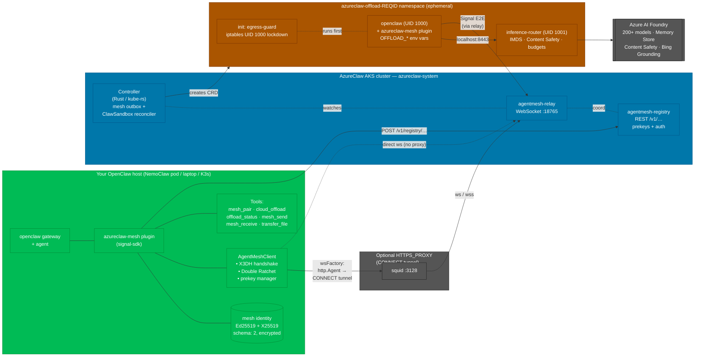
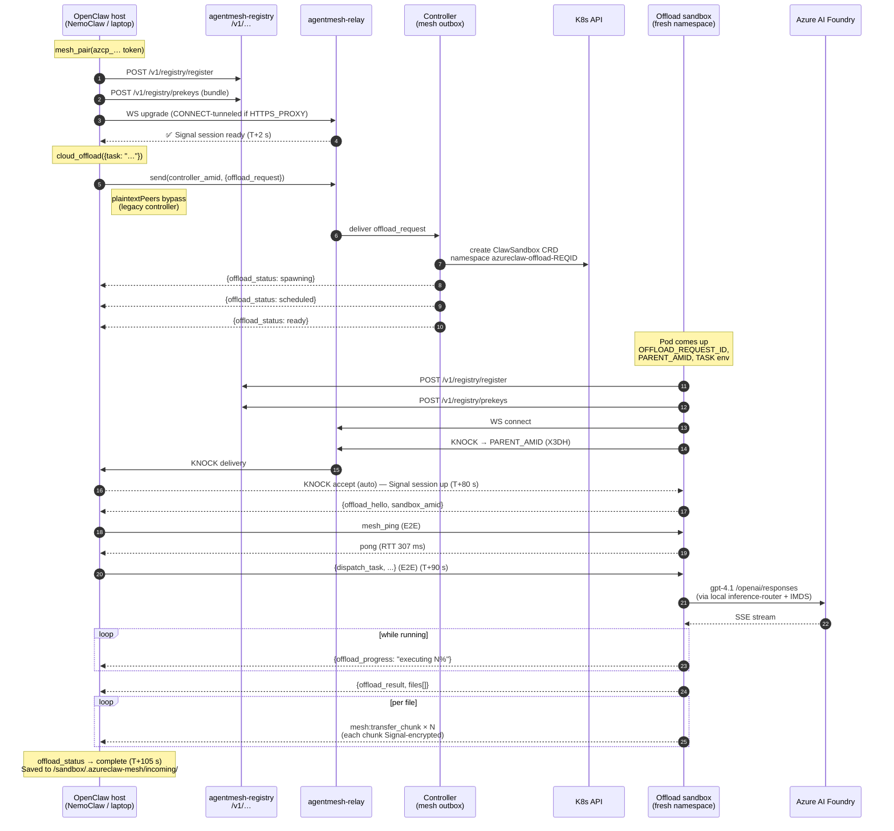

# Any-OpenClaw Architecture & Cloud Offload

AzureClaw's mesh plugin (`azureclaw-mesh`) lets **any OpenClaw agent** — running
on a laptop, inside a home-grown sandbox runtime, or inside NemoClaw/OpenShell
— talk to an AzureClaw cluster over AgentMesh and **offload work to a
governed cloud sandbox**. All inter-agent traffic is encrypted end-to-end
with the Signal Protocol (X3DH + Double Ratchet) via
[`@agentmesh/sdk`](https://github.com/amitayks/agentmesh).

> Audience: operators integrating an existing OpenClaw-based agent with an
> AzureClaw-managed AKS cluster; developers extending the mesh plugin.

---

## Why "Any-OpenClaw"?

The AzureClaw sandbox image is one particular OpenClaw host. The same plugin
binary works inside **any** OpenClaw host that can load non-bundled plugins
from `~/.openclaw-data/extensions/`. Examples today:

| Host | Where it runs | Loads `azureclaw-mesh` from |
|---|---|---|
| AzureClaw AKS sandbox | Azure AKS pod | Baked into `sandbox-images/openclaw/` |
| NemoClaw OpenShell pod | K3s in a Docker container | `scripts/azureclaw-mesh/` copied at image build |
| Local `openclaw agent` | Laptop | `~/.openclaw-data/extensions/azureclaw-mesh/` |

There is nothing AzureClaw-specific in the wire protocol: the peer on the
other side just needs to speak AgentMesh relay + X3DH prekeys. The AzureClaw
cluster exposes that via a per-cluster `agentmesh-relay` + `agentmesh-registry`
pair.

---

## Components

### 1. Mesh plugin (`mesh-plugin/`)

A thin OpenClaw plugin that registers six tools:

- `mesh_pair` — consume a pairing token, connect to the relay.
- `cloud_offload` — submit a task to be executed inside a fresh AzureClaw
  sandbox. Returns immediately; progress streams back via `offload_status`.
- `offload_status` — poll phase/progress/results of an active offload.
- `mesh_send` / `mesh_receive` — raw E2E messaging for custom flows.
- `mesh_transfer_file` — chunked file transfer (base64 → Signal frames).

Internally it is an adapter over `AgentMeshClient.fromIdentity()`. We keep
application-layer chunking, an inbox, waiters, and ping/pong; the SDK owns
WebSocket lifecycle, prekey upload, X3DH handshake, Double Ratchet state,
and reconnect.

See:
- `mesh-plugin/src/connection.ts` — SDK adapter (build tag: `signal-sdk`)
- `mesh-plugin/src/identity.ts` — persisted Ed25519/X25519 identity
  (`schema: 2` envelope, encrypted at rest)
- `mesh-plugin/src/index.ts` — tool registration + offload orchestrator

### 2. Relay & Registry (vendored)

Patched forks of the upstream `agentmesh-relay` and `agentmesh-registry`. The
AzureClaw Helm chart deploys both inside `azureclaw-system`. Vendored fixes
(8 total, documented in `vendor/*/README.md`) cover timestamp signing,
base64-prefix keys, envelope envelope bugs, and the v0.1.2 connect-reject
crash.

### 3. Controller (Rust, kube-rs)

For **cloud offload** specifically, the controller runs a small "mesh outbox":
NemoClaw sends an `offload_request` via mesh → the controller reads it out
of the relay → creates a fresh `ClawSandbox` CRD → streams lifecycle updates
(`spawning` / `scheduled` / `ready`) back to NemoClaw via the same mesh
channel. Source: `controller/src/mesh_peer.rs`.

### 4. Inference router (Rust, axum)

Every offload sandbox gets its own inference router (the standard AzureClaw
per-pod sidecar). The offloaded OpenClaw agent talks only to `localhost:8443`;
the router handles IMDS auth, Content Safety, token budgets, and Foundry
proxying.

---

## Architecture



All edges between the host and an offload sandbox flow through the relay as
Signal ciphertext — there is **no direct TCP** between the two agent pods.

---

## Cloud-offload flow

End-to-end sequence for `cloud_offload({ task: "..." })`. Times shown are
from the demo run on 2026-04-17.



Every frame between the host and the offload sandbox is a Signal Protocol
ciphertext. The relay and the AzureClaw control plane see only opaque bytes.

---

## Identity & pairing

Each OpenClaw host persists one mesh identity in
`~/.openclaw-data/.../mesh-identity.json` (encrypted envelope, `schema: 2`).
The identity is:

- `Ed25519` signing keypair — signs relay auth frames, prekey bundles.
- `X25519` static keypair — base of the X3DH handshake.
- `AMID` — the 27-char public identifier derived from the signing key.

A pairing token (`azcp_…`) issued by the AzureClaw CLI
(`azureclaw pair generate --name <deployment>`) carries:

- `controller_amid` — the cluster controller's AMID (to be added to
  `plaintextPeers` until the controller also runs Signal)
- `relay_url` / `registry_url` — cluster endpoints
- `secret` — registry auth nonce

Tokens are consumed by `mesh_pair` and stored under
`~/.openclaw-data/.../azureclaw-pairings.json` so reconnects are automatic
on plugin load.

---

## Running it

### Prerequisites

- An AzureClaw AKS deployment (`azureclaw up`) — note its registry URL.
- An OpenClaw host with `~/.openclaw-data/extensions/` read access.

### Patching a fresh NemoClaw clone

From an **Azure/azureclaw clone**:

```bash
# 1. Clone NemoClaw (or use an existing tree)
git clone https://github.com/NVIDIA/NemoClaw ~/.nemoclaw/source
cd ~/.nemoclaw/source && npm ci && npm run build

# 2. Patch it with the mesh plugin (idempotent — safe to re-run)
cd /path/to/azureclaw/mesh-plugin
npm ci && npm run build
NEMOCLAW_PATH=~/.nemoclaw/source npm run patch:nemoclaw

# 3. Rebuild the NemoClaw sandbox image
cd ~/.nemoclaw/source && docker build -t nemoclaw:mesh .
```

What the patch does (`mesh-plugin/scripts/patch-nemoclaw.sh`):

1. Copies `mesh-plugin/dist/`, `skills/`, and the vendored `@agentmesh/sdk`
   into `<NEMOCLAW>/scripts/azureclaw-mesh/`.
2. Inserts one `COPY --chown=sandbox:sandbox scripts/azureclaw-mesh/ …` line
   into NemoClaw's `Dockerfile` after the `openclaw plugins install` step.
3. Inserts a `meshPluginSrc` staging block into
   `<NEMOCLAW>/dist/lib/sandbox-build-context.js` so the NemoClaw CLI copies
   the plugin into its Docker build context at sandbox-image-build time.
4. Renders `nemoclaw/policies/presets/azureclaw-mesh.yaml` (resolving the
   host IP for your platform) and installs it into
   `<NEMOCLAW>/nemoclaw-blueprint/policies/presets/` so the
   `azureclaw-mesh` policy appears in the `nemoclaw onboard` selector.
   Override the resolved IP with `HOST_IP=x.x.x.x` if you need a
   non-default (e.g. WSL2 or remote Docker host).

All four edits grep-gate for idempotency; re-running after `git pull` on
either repo is safe.

### On the cluster side

```bash
# Issue a pairing token scoped to one remote deployment
azureclaw pair generate --name nemoclaw-laptop

# Inspect / revoke later
azureclaw pair list
azureclaw pair revoke <name>
```

### On the OpenClaw host side

From inside the agent's chat:

```
mesh_pair token=azcp_1_eyJjb250cm9sbGVyX2FtaWQ…
```

Then, for a one-shot offload:

```
cloud_offload task="research agentic AI trends in April 2026"
```

Poll with:

```
offload_status
```

### Behind a proxy (NemoClaw / OpenShell)

The sandbox pod in OpenShell can only reach the proxy (typically
`http://10.200.0.1:3128`). The mesh plugin honours `HTTPS_PROXY` /
`HTTP_PROXY` and opens a raw `CONNECT` tunnel with `net.createConnection`
(bypassing Node 22's undici, which ignores proxy env for WebSocket). The
tunnelled socket is handed to `ws` via a custom `http.Agent.createConnection`
callback — see `makeWsFactory()` in `mesh-plugin/src/connection.ts`.

No configuration needed: set `HTTPS_PROXY` on the pod and the plugin picks
it up.

---

## Offload sandbox defaults

Controller source: `controller/src/mesh_peer.rs`. When a peer sends
`offload_request`, the controller builds a `ClawSandbox` CRD with these
defaults (all overridable via `cloud_offload` preferences):

| Field | Default | Why |
|---|---|---|
| `inference.model` | `gpt-5.4` | Matches the premium tier exposed to local agents. |
| `sandbox.isolation` | `confidential` | Requesting peer may be on untrusted infra — hardened Kata VM by default. |
| `networkPolicy.learnEgress` | `true` | Observe-mode (blocklist still enforced). Review with `azureclaw policy learn <name>`. |
| `networkPolicy.defaultDeny` | `true` | Per-sandbox allowlist starts empty. |
| `governance.enabled` | `true` | AGT trust + audit always on. |
| `governance.trustThreshold` | `900` | Only the paired peer AMID is trusted. |
| Inference Content Safety | `true` | Prompt Shields + Content Safety on every model call. |

### Idle auto-termination

Offload sandboxes self-terminate when no message has arrived from the
parent AMID for **`OFFLOAD_TIMEOUT_MINUTES`** (default 30 minutes).

Mechanism:

1. Controller injects `OFFLOAD_TIMEOUT_MINUTES` and `OFFLOAD_ACTIVITY_FILE=/tmp/offload-last-activity` into the sandbox pod.
2. Sandbox entrypoint seeds the activity file at boot, then forks an idle-watcher that polls `stat -c %Y` every 60 s.
3. `azureclaw-mesh` plugin calls `fs.utimesSync(OFFLOAD_ACTIVITY_FILE, …)` on every decrypted inbound message whose `from` equals `OFFLOAD_PARENT_AMID`.
4. When `now - mtime ≥ OFFLOAD_TIMEOUT_MINUTES * 60`, the watcher SIGTERMs the foreground `tail -f` (unblocking bash PID 1), the script's `TERM` trap exits, container shuts down, K8s deletes the pod.

The watcher also force-kills PID 1 after a 5 s grace if the clean shutdown
stalls. A SIGTERM trap is always installed (offload or not) so `kubectl delete`
and `docker stop` terminate immediately on any sandbox.

---

## Security properties

- **E2E:** All mesh traffic is Signal-encrypted between the two agent
  AMIDs. The AzureClaw control plane, the relay, and any intermediate
  proxy see only ciphertext. See
  [E2E Encryption Proof](e2e-encryption-proof.md) for packet captures.
- **Forward secrecy:** Double Ratchet rotates keys per message; stolen
  state cannot decrypt past traffic.
- **Isolation of offloads:** each offload gets its own K8s namespace,
  NetworkPolicy, seccomp profile, and inference-router. Secrets stay on
  the cluster; the requesting host never sees Foundry credentials.
- **Bounded trust on the controller:** the Rust controller currently
  speaks legacy base64(JSON) instead of Signal. The plugin adds the
  controller's AMID to `plaintextPeers` so only that one peer is allowed
  to bypass Signal; all agent-to-agent traffic remains E2E. Upgrading the
  controller to Signal is tracked in the backlog.
- **Revocation:** `azureclaw pair revoke <name>` removes the pairing
  from the registry; the remote host can no longer connect even if it
  retains its token.

---

## Vendored SDK patches (summary)

Our `vendor/agentmesh-sdk/` is `@agentmesh/sdk@0.1.2` with 11 patches. The
most important for this flow:

- **#9 bytesToBase64 stack overflow** — fixed spread of 100KB+ payloads.
- **#11 `wsFactory` + `plaintextPeers`** — lets the plugin inject a
  CONNECT-tunneled WebSocket and bypass Signal for specific peers (the
  legacy controller). Adds runtime `addPlaintextPeer` / `removePlaintextPeer`
  APIs for dynamic pairings.
- Base64 prefix decoder fix (`x25519:`, `ed25519:` prefixes).
- Timestamp signing normalisation (`Z` vs `+00:00`).

Full catalogue: `vendor/agentmesh-sdk/README.md`.

---

## Troubleshooting

| Symptom | Likely cause | Fix |
|---|---|---|
| `Registry connection error: Unexpected token 'R'` | Pair token has no `/v1` prefix and the SDK calls `POST /registry/register` directly (only `/v1/registry/register` exists). | Plugin already normalizes this; make sure you are running build ≥ `3da12f88718d`. |
| `this.ws?.close is not a function` | `wsFactory` returned a Promise instead of a WebSocket. | Must return synchronously — do async tunnel setup in `http.Agent.createConnection`. Fixed in current build. |
| `Connection reported success but isConnected=false` | SDK `connect()` resolved but WebSocket never opened. | Current plugin asserts `client.isConnected` after `connect()` and throws with the underlying error. |
| Offload stuck at `connecting: Discovering sandbox` | Offload sandbox pod `CrashLoopBackOff` or slow cold start. | `kubectl -n azureclaw-offload-<id> describe pod`. |
| `Active session already exists` on re-pair after crash | Vendor patch #10: crypto-layer has a KNOCK session but `client.activeSessions` lost sync. | Already patched — `initiateSession` returns `{reused:true}` instead of throwing. |

---

## See also

- [Architecture](architecture.md) — full AKS-side component reference
- [E2E Encryption Proof](e2e-encryption-proof.md) — Signal captures on the wire
- [Security](security.md) — 9-layer defense in depth
- [Migration from NemoClaw](migration-from-nemoclaw.md) — concept mapping
