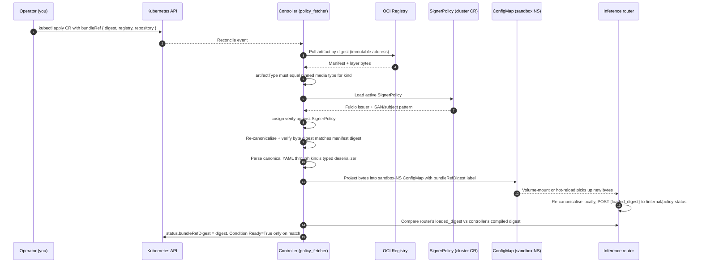

# CRD reference

AzureClaw exposes its API through **nine** first-class CustomResourceDefinitions in the `azureclaw.azure.com` group, all at version `v1alpha1`. This page is the canonical schema reference. For the prose explanation of how these fit together, see **[Architecture — CRDs as the API](../architecture.md#crds-as-the-api)**.

> **Stability.** v1alpha1 is the v1.0 contract. We will not remove fields. Optional fields may be added. Behaviour may be tightened (denying things that previously slipped through) but never loosened. The full contract is in **[Backwards compatibility](backwards-compatibility.md)** and **[CRD versioning](../architecture/crd-versioning.md)**.

## At a glance

| CRD | Kind | Short names | Scope | Signing surface | What it represents |
|---|---|---|---|---|---|
| `clawsandboxes.azureclaw.azure.com` | `ClawSandbox` | `cs`, `claw` | Namespaced | `spec.networkPolicy.allowlistRef` (signed OCI egress bundle, optional) | One agent. The unit of work. |
| `a2aagents.azureclaw.azure.com` | `A2AAgent` | `a2a` | Namespaced | Inline `spec.signingKeys[]` (Ed25519, peer-callable JWS verification) | A public-ingress endpoint a peer can call. |
| `mcpservers.azureclaw.azure.com` | `McpServer` | `mcp` | Namespaced | `spec.bundleRef` (signed OCI tool-allow-list bundle, optional) | An external MCP server the sandbox may call. |
| `toolpolicies.azureclaw.azure.com` | `ToolPolicy` | `tp` | Namespaced | `spec.bundleRef` (signed OCI tool-policy bundle, optional) | Per-tool allow/approval/rate-limit/commerce gate. |
| `inferencepolicies.azureclaw.azure.com` | `InferencePolicy` | `ip` | Namespaced | `spec.bundleRef` (signed OCI inference-policy bundle, optional) | Model preference, content-safety floor, token budgets. |
| `clawmemories.azureclaw.azure.com` | `ClawMemory` | `cmem` | Namespaced | `spec.bundleRef` (signed OCI memory-binding bundle, optional) | Memory-store binding (Foundry Memory Store). |
| `clawevals.azureclaw.azure.com` | `ClawEval` | `ceval` | Namespaced | `spec.corpus.bundleRef` (signed OCI eval-corpus bundle, mutex with `corpus.builtin`) | Reproducible evaluation run. |
| `trustgraphs.azureclaw.azure.com` | `TrustGraph` | `tg` | Cluster | Inline `spec.edges[].signature` (Ed25519 per edge, domain-separated payload) | Cross-namespace / cross-cluster mesh trust topology. |
| `egressapprovals.azureclaw.azure.com` | `EgressApproval` | `eappr` | Namespaced | None on the CR itself (it's a sibling overlay); the sandbox's signed `allowlistRef` is the cryptographic baseline | Ephemeral, TTL-bounded extra egress hosts (overlay on baseline allowlist). |

A tenth CRD, `clawpairings.azureclaw.azure.com` (`ClawPairing`, `cp`), is a controller-internal record used to bind sandboxes to AgentMesh registry IDs. It is created by the controller; you generally do not write it directly.

The full Kubernetes schema lives in `deploy/helm/azureclaw/templates/crd*.yaml`. Below we summarise what each CRD does, the spec fields you write, and the status fields the controller reports back.

---

## Signing and verification

Five of these CRDs accept their *content* (the allow-list, the policy, the memory-store binding, the eval corpus, the MCP tool allow-list) by **OCI digest reference** instead of inline YAML. Two more carry Ed25519 signatures inline (the per-edge attestations in `TrustGraph`, the per-key peer JWS verification material in `A2AAgent`). Everywhere a payload is "signed" in this API surface, the controller verifies it before the router ever loads it, and the router echoes the loaded digest back so the controller can flip the CR to a `Ready` phase only when the wire matches the spec.

This section explains the shape that applies to all six policy kinds. The per-CRD sections below add only the kind-specific schema details (which field names, which media type, which mutex rules).

### Authoring path

```bash
azureclaw policy sign --kind {egress|tools|inference|memory|mcp-tools|eval-corpus} \
  --file my-policy.yaml \
  --registry <oci-registry> \
  --repository <repo-path>
# → emits sha256:<digest>
```

The CLI does six things in order: validate against the kind's JSON Schema → canonicalise to deterministic bytes (per-kind rules; see [`docs/internal/policy-canonical-format.md`](../internal/policy-canonical-format.md)) → `oras push` to the registry with the kind's pinned `artifactType` media type → `cosign sign --registry-referrers-mode=legacy` → emit the resulting manifest digest for the human to paste into the CR's `bundleRef`/`allowlistRef`/`corpus.bundleRef` field.

The digest the CLI prints is the OCI **manifest** digest, not a layer hash. The controller pulls by that digest, so a tampered registry cannot serve different bytes than what the signer signed.

### Verification path (every reconcile)



Two crypto checks always fire, and both must pass:

1. **Signature check** — cosign verifies the artifact's signature was produced by an identity matching the active `SignerPolicy` (Fulcio issuer + SAN/subject pattern). A valid signature alone is not authority; the identity must match.
2. **Canonical-format check** — the controller re-canonicalises the bytes it pulled and confirms the resulting digest equals the manifest digest the registry served. This makes registry-side tampering structurally impossible: the bytes that pass canonicalisation are byte-identical to the bytes that were signed.

If either check fails, the CR is stamped `Degraded` with a specific reason (`SignerPolicyMismatch`, `CanonicalFormatViolation`, `ArtifactTypeMismatch`, `OciPullError`, …) and the controller does **not** project the bytes. The previously-projected (verified) bundle stays in place; the router keeps enforcing whatever it last verified.

### Ready ⇔ router echo

For every kind in this signing surface, the controller flips the CR's `Ready` condition to `True` only when the router has POSTed back the **same digest** the controller compiled. The router's POST to `/internal/policy-status` is bearer-token gated (per-sandbox secret, constant-time comparison, optional source-IP pin). This closes the loop end-to-end: "what's in the YAML" → "what the controller verified and projected" → "what the runtime is actually enforcing" must agree, or the CR is not `Ready`.

You can verify the loop on any deployed CR:

```bash
# Controller's compiled digest (what was verified)
kubectl get inferencepolicy <name> -n <ns> -o jsonpath='{.status.bundleRefDigest}'

# Router's loaded digest (what's enforcing)
kubectl exec deploy/<sandbox> -c inference-router -n azureclaw-<sandbox> -- \
  curl -sf -H "Authorization: Bearer $TOKEN" http://localhost:8443/internal/policy-status \
  | jq '.policies.inference.loaded_digest'
```

If those two values disagree, the CR will not be `Ready` — by construction.

### Inline-signed CRDs (A2AAgent, TrustGraph)

Two CRDs carry their cryptographic material inline rather than via OCI:

* **`A2AAgent.spec.signingKeys[]`** — Ed25519 public keys (`alg: EdDSA`, base64url-encoded, 32 bytes after decode, unique `kid` per CR). The router builds an in-memory verifier keyed by `kid` and rejects inbound A2A 1.0.0 requests whose JWS detached signature doesn't verify against one of these keys.
* **`TrustGraph.spec.edges[].signature`** — Ed25519 signature per edge, computed over canonical bytes prefixed by the domain separator `trustgraph.v1\n`. Each edge's signature is checked against the source vertex's `publicKeyB64u`; invalid edges are dropped silently from the projected graph.

Both inline paths avoid OCI for the same operational reason: the material is small, sandbox-scoped, and benefits from being editable in the YAML you already have under review. The OCI/cosign path exists for bundles where the *content* is large, evolves on its own schedule, and is worth pinning by immutable digest (the policy kinds above).

### Hot-reload, never-trust-bytes-twice

The router watches its mounted ConfigMaps. When the controller updates the projection (because you bumped a `bundleRef` to a new digest, or because the cluster's `SignerPolicy` changed and an old bundle stopped passing verification), the router re-canonicalises the new bytes locally and POSTs the freshly-loaded digest back to the controller. The controller flips `Ready` only on a match. There is no "trust on first load" — the router re-validates on every reload.

---

## `ClawSandbox` — the agent

The unit of work. One `ClawSandbox` per agent.

```yaml
apiVersion: azureclaw.azure.com/v1alpha1
kind: ClawSandbox
metadata:
  name: my-agent
  namespace: azureclaw-my-agent
spec:
  runtime:
    kind: OpenClaw                  # or OpenAIAgents | MicrosoftAgentFramework |
                                    #    LangGraph | Anthropic | PydanticAi | BYO
    openclaw:                       # block name matches `kind` (CEL-validated)
      image: azureclawacr.azurecr.io/azureclaw-runtime-openclaw:latest
  inferenceRef:
    name: shared-inference          # required: sibling InferencePolicy
  memoryRef:                        # optional: sibling ClawMemory
    name: my-agent-memory
  governance:
    enabled: true
    toolPolicyRef:
      name: web-fetch-policy        # required when governance.enabled
    trustThreshold: 500             # 0..1000; default 500
    mcpServerRefs:
      - name: github-mcp
      - name: confluence-mcp
  sandbox:
    isolation: enhanced             # standard | enhanced (default enhanced)
status:
  phase: Running
  observedGeneration: 1
  sandboxPod: my-agent-7d9-abc
  namespace: azureclaw-my-agent
  inferenceEndpoint: http://my-agent.azureclaw-my-agent.svc.cluster.local:8443
  runtimeKind: OpenClaw
  conditions:
    - type: Ready
      status: "True"
      reason: Active
```

**Required**

| Field | Type | Notes |
|---|---|---|
| `spec.runtime.kind` | enum | `OpenClaw`, `OpenAIAgents`, `MicrosoftAgentFramework`, `SemanticKernel` *(deferred)*, `LangGraph`, `Anthropic`, `PydanticAi`, `BYO`. |
| `spec.runtime.<kind>` | object | The kind-specific configuration block. CEL validation enforces that exactly one of these is set and that it matches `kind`. See [Runtime catalog](../runtimes.md). |
| `spec.inferenceRef.name` | LocalObjectRef | Required reference to a sibling `InferencePolicy` (same namespace). Missing target → `Degraded` with `InferencePolicyNotFound`. There is no inline fallback. |

**Common optional**

| Field | Type | Purpose |
|---|---|---|
| `spec.memoryRef.name` | LocalObjectRef | Bind to a sibling `ClawMemory` (same namespace). |
| `spec.sandbox` | object | Isolation primitives — `isolation` (`standard` \| `enhanced`, default `enhanced`), `seccompProfile` (default `azureclaw-strict`), `writablePaths` (default `[/sandbox, /tmp]`). |
| `spec.networkPolicy` | object | Baseline egress allowlist. Defaults `defaultDeny: true`, `egressMode: Learn`. |
| `spec.governance.enabled` | bool | Turn on AGT governance — router guardrails are always on regardless; this gates AGT trust/audit. |
| `spec.governance.toolPolicyRef.name` | LocalObjectRef | Required when `governance.enabled`. Resolves to a sibling `ToolPolicy`. |
| `spec.governance.trustThreshold` | int | Minimum trust score `0..1000` for KNOCK accept. Default `500`. |
| `spec.governance.mcpServerRefs` | `[]LocalObjectRef` | Up to 8 sibling `McpServer` refs; controller mirrors per-server JWKS + signing keys into `/etc/azureclaw/mcp/<name>/`; router builds a multi-issuer OAuth verifier and exposes tools under `{server}.{tool}`. Deprecated singular `governance.mcpServerRef` is still honoured (emits `McpSingularDeprecated` warning). |
| `spec.governance.registryMode` | string | `local` (default) or `global`. Global enables cross-cluster mesh + handoff tools. |
| `spec.governance.trustedPeers` | string | Pre-seeded `"name:AMID,..."` peers — used by sub-agents to auto-trust the spawning parent. |
| `spec.a2a` | object | Inbound A2A 1.0.0 ingress configuration. Default off; see [A2A gateway](../architecture/a2a-gateway.md). |
| `spec.suspended` | bool | Operator-driven graceful pause. When `true`, the controller scales the Deployment to `replicas: 0` and stamps `Suspended=True / SuspendedBySpec` without tearing down namespace, NetworkPolicy, or federated credentials. |

**Status**

| Field | Notes |
|---|---|
| `status.phase` | `Pending` \| `Creating` \| `Running` \| `Failed` \| `Terminating`. |
| `status.sandboxPod` | Resolved Pod name. |
| `status.namespace` | Sandbox namespace (`azureclaw-<name>`). |
| `status.inferenceEndpoint` | Cluster-internal Service URL of the inference-router. |
| `status.runtimeKind` | Runtime kind observed for the current `observedGeneration`. |
| `status.observedGeneration` | `metadata.generation` that produced this status. Compare against `metadata.generation` to detect stale observations. |
| `status.conditions[]` | The full condition chain — every reason emitted by the controller is enumerated in [`docs/api/conditions.md`](conditions.md). |

---

## `A2AAgent` — public-ingress peer endpoint

Binds an HTTPS endpoint as an A2A 1.0.0 peer-callable agent. The controller compiles signed AgentCards from `signingKeys[]`, projects them into a `ConfigMap` consumed by the inference-router, and tracks compile state in `status.versionHash`.

```yaml
apiVersion: azureclaw.azure.com/v1alpha1
kind: A2AAgent
metadata:
  name: weather-agent
  namespace: azureclaw-weather-agent
spec:
  endpointUrl: https://weather-agent.example.com   # required; https:// when productionMode
  productionMode: true                              # required-https + non-empty signingKeys
  signingKeys:                                      # required; ≥1 entry
    - kid: weather-2026q2
      alg: EdDSA
      publicKeyB64u: m3oUe9...                      # base64url, no padding, 32 bytes
  capabilities: [tasks, streaming, cancel]
  trust:
    requireSignedRequests: true
    minSignaturesRequired: 1
    maxClockSkewSeconds: 60
  federation:
    - label: partner-summarizer
      kind: in-cluster
      agentRef: summarizer
  policyRefs:
    toolPolicy: a2a-inbound-policy                  # sibling ToolPolicy
status:
  phase: Ready
  observedGeneration: 1
  agentCardConfigMapRef: { name: a2aagent-weather-agent-card }
  versionHash: "sha256:5a1c…"
  lastCompiledAt: "2026-05-14T13:42:11Z"
```

| Field | Notes |
|---|---|
| `spec.endpointUrl` | Required. HTTPS URL where the agent serves `/.well-known/agent.json` and JSON-RPC `message/send` / `tasks/get` / `tasks/cancel`. Admission CEL enforces `https://` when `productionMode: true`. |
| `spec.signingKeys[]` | Required, ≥1 entry. Each entry has `kid` (unique within CR), `alg` (`EdDSA` only today), `publicKeyB64u` (base64url, no padding, 32 bytes after decode), and optional `notAfter` (Unix seconds). |
| `spec.productionMode` | When `true`, the router rejects unauthenticated traffic and admission CEL enforces `endpointUrl.startsWith("https://")` + non-empty `signingKeys`. |
| `spec.capabilities[]` | A2A protocol capabilities to advertise in the AgentCard (`tasks`, `streaming`, `cancel`, `mandates`, …). |
| `spec.trust` | `requireSignedRequests`, `minSignaturesRequired`, `maxClockSkewSeconds`. |
| `spec.federation[]` | Peer A2A agents acknowledged as part of the trust circle. Each is either `kind: in-cluster` + `agentRef: <A2AAgent.name>` (same namespace) or `kind: external` + `endpointUrl` + `pinnedKid`. |
| `spec.policyRefs.toolPolicy` | Name of a sibling `ToolPolicy` whose `commerce` / `approval` / `rateLimit` apply to inbound `message/send`. |

> **AgentCard verifier wiring is library-only today.** `azureclaw_a2a_core::verify_inbound_card` exists and is unit-tested; today the gateway authorises inbound traffic via the `X-A2A-Agent-Subject` header set by the upstream Gateway-API mTLS layer. Wiring the verifier as an axum layer in the gateway is on the v1.1 roadmap — see [A2A gateway](../architecture/a2a-gateway.md).

---

## `McpServer` — declared MCP backend

Declares an MCP server the sandbox may call. The router enforces — calls to an MCP host that is not declared are denied. A `ClawSandbox` may bind up to 8 `McpServer`s via `governance.mcpServerRefs`; the controller mirrors per-server JWKS into `/etc/azureclaw/mcp/<name>/jwks.json` and signing keys into `/etc/azureclaw/mcp-signing/<name>/`. The router exposes tools under namespaced names `{server}.{tool}` (e.g. `github_mcp.repo_search`) and verifies inbound MCP host bearer tokens against a multi-issuer `OAuthVerifier` keyed by `oauth.issuer`.

```yaml
apiVersion: azureclaw.azure.com/v1alpha1
kind: McpServer
metadata:
  name: github-mcp
  namespace: azureclaw-my-agent
spec:
  url: https://api.githubcopilot.com/mcp                  # required (or supplied by bundleRef)
  productionMode: true
  oauth:
    issuer: https://github.com/login/oauth                # required when productionMode
    audience: azureclaw-mcp                               # optional
    resource: https://api.githubcopilot.com/mcp           # optional resource indicator
    pkce: S256                                            # only S256 today
  scopes: ["read:repo"]
  allowedTools: ["*"]                                     # or explicit list; empty fails closed
  allowedSandboxes:
    matchLabels:
      app.kubernetes.io/component: research
```

| Field | Purpose |
|---|---|
| `spec.url` | Upstream MCP endpoint. Required when `bundleRef` is absent. `https://` is enforced by admission CEL when `productionMode: true`. |
| `spec.productionMode` | When `true`, the router rejects calls that are not bearer-authenticated against `oauth.issuer` with a verified PKCE flow. Default `false` (dev-only). |
| `spec.oauth.issuer` | OAuth 2.1 issuer URL. Required when `productionMode: true`. The controller fetches the JWKS via discovery and mirrors it to the sandbox. |
| `spec.oauth.audience` | Optional `aud` claim enforcement. |
| `spec.oauth.resource` | Optional RFC 8707 resource indicator. |
| `spec.scopes[]` | OAuth scopes the router will request when fronting calls. |
| `spec.allowedTools[]` | Allow-list of tool names. `["*"]` exposes everything; an explicit list selects a subset; an **empty** list fails closed and the server is skipped on the registry. |
| `spec.allowedSandboxes.matchLabels` | Selector restricting which sandboxes can reach this server. Empty = same-namespace only. |
| `spec.bundleRef` | Signed OCI artifact alternative to inline content fields (see [Signed CRD bundles](../architecture/crd-versioning.md)). |

> Content-safety floors are not configured on `McpServer` — they live on [`InferencePolicy.spec.contentSafety`](#inferencepolicy--model-routing-and-budgets).

---

## `ToolPolicy` — per-tool gate

One `ToolPolicy` = one tool gate (combined approval / rate-limit / commerce / AGT-profile). `appliesTo` is a single selector, not an array of rules.

```yaml
apiVersion: azureclaw.azure.com/v1alpha1
kind: ToolPolicy
metadata:
  name: web-fetch-policy
  namespace: azureclaw-my-agent
spec:
  appliesTo:
    tool: web.fetch                                       # `"*"` matches all
    mcpServer: ""                                         # any MCP server
    sandboxMatchLabels: {}
  approval:
    mode: always                                          # never | always | aboveThreshold
    channel: telegram                                     # bot/email channel
  rateLimit:
    rps: 2
    burst: 5
    window: 1m
  agtProfile:
    inline: |                                             # raw AGT YAML; mutex with bundleRef
      version: 1
      rules:
        - effect: allow
          if: { hostname: { ends_with: ".example.com" } }
```

For commerce-controlled tools (AP2):

```yaml
spec:
  appliesTo:
    tool: payment.transfer
  commerce:
    dailyCap: "USD 100.00"                                # ISO-4217 with 2-decimal minor units
    monthlyCap: "USD 2000.00"
    perTransferCap: "USD 25.00"
    counterpartyAllowlist:                                # empty = deny-all (fail-closed)
      - did:web:partner.example.com
  approval:
    mode: aboveThreshold
    threshold: "USD 10.00"
    channel: telegram
```

| Field | Notes |
|---|---|
| `spec.appliesTo.tool` | Tool name as advertised by the MCP server. `"*"` matches all. |
| `spec.appliesTo.mcpServer` | `McpServer.metadata.name` the tool must originate from. Empty = any. |
| `spec.appliesTo.sandboxMatchLabels` | Sandbox label selector — AND with the other fields. |
| `spec.approval.mode` | `never` \| `always` \| `aboveThreshold`. |
| `spec.approval.threshold` | Currency string above which approval is required (only meaningful when `mode: aboveThreshold`). |
| `spec.approval.channel` | Channel identifier (e.g. `telegram`, `email`). |
| `spec.rateLimit` | `rps` (requests/sec), `burst` (token-bucket size), `window` (counter window, e.g. `1m`/`1h`/`24h`). |
| `spec.commerce.dailyCap` / `monthlyCap` / `perTransferCap` | ISO-4217 currency strings, strict parse. CEL enforces `monthlyCap ≥ dailyCap`. |
| `spec.commerce.counterpartyAllowlist[]` | AP2 counterparty identifiers (DID or domain). Empty = deny-all. |
| `spec.agtProfile.inline` / `bundleRef` | Optional customer-supplied AGT profile. Mutually exclusive — admission CEL enforces. |

---

## `InferencePolicy` — model routing and budgets

Per-tenant control of *which* model, *how much* of it, and the content-safety floor. Referenced by sibling `ClawSandbox.spec.inferenceRef`.

```yaml
apiVersion: azureclaw.azure.com/v1alpha1
kind: InferencePolicy
metadata:
  name: shared-inference
  namespace: azureclaw-my-agent
spec:
  appliesTo:
    sandboxName: my-agent                                 # exact match; empty = any in ns
    sandboxMatchLabels: {}                                # AND with sandboxName
    action: "*"                                           # chat | responses | image | embeddings | *
  modelPreference:
    primary:
      provider: azure-openai                              # azure-openai | anthropic | gemini | bedrock | ollama
      deployment: gpt-4.1
    fallback:
      - provider: azure-openai
        deployment: gpt-4.1-mini
  tokenBudget:
    perRequestTokens: 8000                                # enforced per call (today)
    dailyTokens: 200000                                   # accepted; aggregate enforcement v1.1
    monthlyTokens: 5000000
  contentSafety:
    hate: Medium
    selfHarm: Low
    sexual: Medium
    violence: Medium
    requirePromptShields: true
```

| Field | Notes |
|---|---|
| `spec.appliesTo` | Required selector — AND of `sandboxName`, `sandboxMatchLabels`, `action`. |
| `spec.modelPreference.primary` | `{provider, deployment}`. `provider` is one of `azure-openai`, `anthropic`, `gemini`, `bedrock`, `ollama`. |
| `spec.modelPreference.fallback[]` | Ordered fallback routes — first healthy wins, deterministically. No load-balancing. |
| `spec.tokenBudget.perRequestTokens` | Per-call hard cap. Inference calls exceeding this are refused **before** the upstream forward. |
| `spec.tokenBudget.dailyTokens` / `monthlyTokens` | Accepted and surfaced in status; **aggregate enforcement is not yet wired** — see roadmap below. CEL enforces `monthlyTokens ≥ dailyTokens`. |
| `spec.contentSafety` | Per-category severity floors (`Safe` \| `Low` \| `Medium` \| `High`). The router parses Foundry `prompt_filter_results` inline; there is **no** separate Content Safety call. |
| `spec.contentSafety.requirePromptShields` | Fail-closed if Prompt Shields are advertised by the deployment but the response lacks the corresponding annotations. |
| `spec.bundleRef` | Signed OCI artifact alternative to inline `tokenBudget` / `contentSafety` / `modelPreference` / `displayName`. `appliesTo` always comes from the CR. |

> **Budget enforcement scope today.** The router enforces `tokenBudget.perRequestTokens` on every model call. Aggregate counters across requests (`dailyTokens`, `monthlyTokens`) are **not yet persisted**; the fields are accepted and surfaced for forward compatibility but only the per-request limit fires denials today. Aggregate enforcement is on the roadmap — see [`docs/roadmap.md`](../roadmap.md#v11--topology--signed-crd-upgrades).

---

## `ClawMemory` — memory store binding

Binds a sandbox to a Foundry Memory Store. The reconciler compiles the binding into `/etc/azureclaw/memory/binding.json`, the router loads it and echoes its digest back, and the controller marks the CR `Ready` only when those digests match — the same `Ready ⇔ router echo` invariant used by every other policy CRD.

```yaml
apiVersion: azureclaw.azure.com/v1alpha1
kind: ClawMemory
metadata:
  name: my-agent-memory
  namespace: azureclaw-my-agent
spec:
  sandboxRef:
    name: my-agent                                        # required: sibling ClawSandbox
  storeName: episodic                                     # required (unless bundleRef)
  scope: "agent:my-agent"                                 # optional; default `agent:<sandboxName>`
  retentionDays: 30                                       # optional; > 0 when set
  deleteOnSandboxDelete: true                             # default true
```

| Field | Notes |
|---|---|
| `spec.sandboxRef.name` | Required. Sibling `ClawSandbox` name; same namespace. |
| `spec.storeName` | Required when `bundleRef` is absent. DNS-label-style. |
| `spec.scope` | Foundry Memory Store partition key. Defaults to `agent:<sandboxName>` if absent. |
| `spec.retentionDays` | Optional retention floor; runtime applies a `delete_scope` sweep past this age. |
| `spec.deleteOnSandboxDelete` | When `true` (default), runtime calls `delete_scope` on this scope when the sandbox or CR is deleted. |
| `spec.bundleRef` | Signed OCI artifact alternative to inline content (mutex with `storeName` / `scope` / `retentionDays` / `deleteOnSandboxDelete` / `displayName`). `sandboxRef` is always CR-owned. |

> **Provisioning split.** The CRD reconciler compiles the binding into
> `/etc/azureclaw/memory/binding.json` and confirms the router loaded it
> (`Ready ⇔ router echo`). It does **not** create the upstream **Foundry
> AI Services account / Project** — that is operator-driven (Portal or
> `azure-prepare`). The Memory **Store** *inside* a provisioned project,
> however, is **router-auto-provisioned**: on the first `404` from
> `/memory_stores/{id}` the inference router POSTs to `/memory_stores` to
> create it and retries (`inference-router/src/mcp/platform.rs` ::
> `ensure_memory_store`).
>
> Pre-flight checklist for the human operator:
> 1. AI Services account + Project exist (`azure-prepare`).
> 2. System-assigned MI enabled on the **project** (not the AI Services account).
> 3. `Azure AI User` granted to the project MI on the **resource group**.
>
> Token audience must be `https://ai.azure.com/` (not
> `cognitiveservices.azure.com`). The reconciler surfaces three distinct
> Degraded reasons when echoes come back unhealthy:
> `AwaitingFoundryProvisioning` (no project), `MemoryStoreMissing` (project
> exists but auto-provision failed / disabled), `AuthMisconfigured` (403 on
> the memory tool call — usually missing project-MI RBAC).

---

## `ClawEval` — reproducible evaluation run

Replays a corpus of jailbreak / prompt-injection / banned-tool / egress / memory-isolation prompts against a sandbox. Builtin corpora ship in the controller binary (`azureclaw_eval_corpus::BUILTIN_NAMES`): `jailbreak-baseline`, `prompt-injection-2026q1`, `banned-tools`, `egress-known-bad`, `memory-isolation`. For an operator-focused walkthrough see [`docs/api/claweval.md`](claweval.md).

```yaml
apiVersion: azureclaw.azure.com/v1alpha1
kind: ClawEval
metadata:
  name: nightly-regression
  namespace: azureclaw-my-agent
spec:
  targetSandboxRef:
    name: my-agent                                        # required: sibling ClawSandbox
  corpus:
    builtin: jailbreak-baseline                           # mutex with bundleRef; default `jailbreak-baseline`
  schedule: "0 3 * * *"                                   # optional cron; absent = run-now annotation only
  failSandboxOnDrift: false                               # when true, drift patches sandbox Degraded
status:
  phase: Ready
  observedGeneration: 1
  lastRunAt: "2026-05-14T03:00:00Z"
  cronJobName: claweval-nightly-regression
  corpusConfigMapRef: { name: claweval-nightly-regression-corpus }
  corpusDigest: "sha256:1f3a…"
  lastResult:
    schemaVersion: 1
    corpusLabel: jailbreak-baseline
    corpusDigest: "sha256:1f3a…"
    jobName: claweval-nightly-regression-20260514030000
    total: 42
    passed: 41
    failed: 1
    errored: 0
  conditions:
    - type: Scheduled
      status: "True"
```

To trigger a one-shot run without a schedule, add the `azureclaw.azure.com/run-now=true` annotation (or use `azureclaw eval run <name>`). To run from a signed corpus instead of a builtin, replace `corpus.builtin` with `corpus.bundleRef: { registry, repository, digest }` (mutex enforced by CEL).

---

## `TrustGraph` — mesh trust topology

Cluster-scoped. Declares vertices (agent identities + Ed25519 public keys) and **signed** edges (`from → to` attestations carrying a trust score). The reconciler verifies each edge's signature against the source vertex's public key, drops invalid edges, and projects the verified subset into a per-sandbox ConfigMap at `/etc/azureclaw/trustgraph/graph.json`.

> **Status — v1alpha1 (reconciler-only).** The controller validates the graph and projects it into every sandbox that references it. The **router does not yet read the projected graph**. The router keeps a post-decision trust-score map at `/tmp/agt/trust_scores.json`, populated from KNOCK outcomes the agent SDK reports out-of-band — this is for audit and rate-limit only; the actual KNOCK accept/deny decision lives inside the Signal session the agent owns (the router cannot decrypt it). Live edge updates require a sandbox roll. Closing this loop in **v1.1** adds router-side **mesh-admission gating** against the projected graph (refuse to WS-bridge an edge not in the graph — a separate, coarser layer that complements agent-side KNOCK, never replaces it) — see [`docs/roadmap.md`](../roadmap.md#v11--topology--signed-crd-upgrades). Today this CRD is useful as a declarative source-of-record for trust intent and as a static projection at sandbox creation time; **it is not yet a runtime enforcement surface**.

```yaml
apiVersion: azureclaw.azure.com/v1alpha1
kind: TrustGraph
metadata:
  name: my-org-trust
spec:
  vertices:
    - id: a2a-agent/azureclaw-my-agent/weather-agent
      alg: EdDSA
      publicKeyB64u: m3oUe9...                            # 32-byte Ed25519 public key
      label: weather-agent
    - id: a2a-agent/azureclaw-summarizer/summarizer
      alg: EdDSA
      publicKeyB64u: 7Xb12r...
  edges:
    - from: a2a-agent/azureclaw-my-agent/weather-agent
      to:   a2a-agent/azureclaw-summarizer/summarizer
      score: 750                                          # 0..1000
      issuedAt: 1715698800                                # Unix seconds
      notAfter: 1747234800                                # optional Unix seconds
      signature: 7n0Yc1...                                # Ed25519 over canonical bytes
      reason: auditor-attested
status:
  phase: Ready
  validVertices: 2
  validEdges: 1
  invalidEdges: 0
  projectionConfigMapRef: { name: trustgraph-my-org-trust-projection }
  observedGeneration: 1
```

| Field | Notes |
|---|---|
| `spec.vertices[]` | Required, ≥1 entry. Each vertex: `id` (unique within CR; conventionally `a2a-agent/<ns>/<name>` or an AGT AMID), `alg` (`EdDSA` only), `publicKeyB64u` (base64url, no padding, 32 bytes). |
| `spec.edges[]` | Each edge is a signed attestation: `from`, `to`, `score` (`0..1000`), `issuedAt` (Unix seconds), optional `notAfter`, `signature` (base64url Ed25519, no padding, 64 bytes), optional `reason`. The signature payload is domain-separated by the prefix `trustgraph.v1\n` — see source. |
| `status.validEdges` / `invalidEdges` | Operators inspect controller logs for which edges fail; the count is surfaced but not the failing IDs. |
| `status.projectionConfigMapRef` | Always `azureclaw-system/trustgraph-<name>-projection`. |

Per-sandbox trust threshold remains on `ClawSandbox.spec.governance.trustThreshold` (default 500). The TrustGraph carries the topology and signed scores; the threshold lives on the consumer.

---

## `EgressApproval` — ephemeral egress grant

Namespaced overlay on a `ClawSandbox`'s baseline `networkPolicy.allowedEndpoints`. The controller unions the approval's hosts into a sibling ConfigMap mounted by the inference-router; the router rebuilds its allowlist on every change, POSTs the loaded digest back, and the controller promotes `phase=Pending → Active` only when the loaded digest matches the compiled merged digest (the same `Ready ⇔ router echo` invariant used by every other policy CRD). On TTL expiry the file is removed, the merged digest is recomputed, and `phase=Expired` is stamped (terminal).

```yaml
apiVersion: azureclaw.azure.com/v1alpha1
kind: EgressApproval
metadata:
  name: debug-stripe-2026-05-14
  namespace: azureclaw-system        # same namespace as the sandbox
spec:
  sandbox: my-agent                  # sibling ClawSandbox name
  hosts:                             # 1..16 entries; small scoped grants only
    - host: api.stripe.com
      port: 443
    - host: hooks.stripe.com         # port optional (defaults all)
  reason: "INC-4421 debug pipe"      # 1..512 chars, no ASCII control bytes
  ticket: "INC-4421"                 # optional, 1..128 chars
  ttl: PT2H                          # ISO 8601; helm-tunable ceiling, 7d hard cap
```

| `spec` field | Required | Validation |
|---|---|---|
| `sandbox` | ✅ | 1..253 chars; must be a sibling `ClawSandbox` in the same namespace. |
| `hosts` | ✅ | 1..16 entries; each `host` is 1..253 chars; `port`, when set, is 1..65535. |
| `reason` | ✅ | 1..512 chars; ASCII control bytes (`\x00-\x08\x0B\x0C\x0E-\x1F\x7F`) rejected. |
| `ticket` | optional | 1..128 chars (free-form linkage to ITSM / incident system). |
| `ttl` | ✅ | ISO 8601 duration (`PT15M`, `PT4H`, `P1D`, `PT1H30M`); zero-valued (`PT0S`) rejected; reconciler also rejects W/Y units and clamps to `min(env_ceiling, 604800s)`. |

`status`:

```yaml
status:
  phase: Active                      # Pending | Active | Expired (terminal)
  observedGeneration: 1
  effectiveAt: "2026-05-14T13:42:11Z"
  expiresAt:   "2026-05-14T15:42:11Z"
  mergedDigest: "sha256:9af1…"       # = controller's merged-allowlist digest
  hostCount: 2
  usageCount: 17                     # informational, router-reported
  conditions:
    - type: Ready
      status: "True"
      reason: RouterConfirmed        # | BlockedOnSandbox | AwaitingRouterEcho | Expired | ReasonInvalid
      message: "Grant is live on data plane."
    - type: Progressing
      status: "False"
      reason: Active
```

CLI: `azureclaw egress allow-extra <sandbox> --host … --reason … --ttl PT4H` to grant, `azureclaw egress approvals <sandbox>` to list, `azureclaw egress revoke <name>` to revoke. See **[Network egress & proxy](../egress-proxy.md)** for the full lifecycle, status semantics, and FAQ.

---

## Lifecycle of a `ClawSandbox`

1. You `kubectl apply` (or `azureclaw add`).
2. Controller creates: namespace → RBAC → ServiceAccount → federated credential → ConfigMap (governance profile) → NetworkPolicy → Deployment → Service.
3. Pod schedules, init `egress-guard` runs iptables rules, agent + router start.
4. Router registers with AgentMesh (when `governance.registryMode` is `global`).
5. Controller updates `status.phase = Ready` and writes the condition chain.

If anything fails, the failing phase is reflected as a condition with a `Reason` documented in **[Conditions reference](conditions.md)**. The controller is idempotent — re-running `kubectl apply` after fixing the cause re-converges.

---

## See also

- **[Architecture](../architecture.md)** — the prose explanation.
- **[CRD trust model](../security/crd-trust-model.md)** — the threat model and verification proof behind the [Signing and verification](#signing-and-verification) section above.
- **[Runtimes](../runtimes.md)** — the runtime catalog and BYO contract.
- **[Conditions reference](conditions.md)** — every status condition.
- **[Backwards compatibility](backwards-compatibility.md)** — what we promise to keep.
