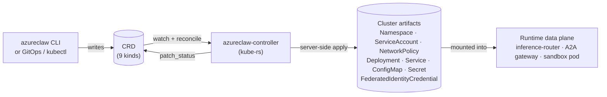
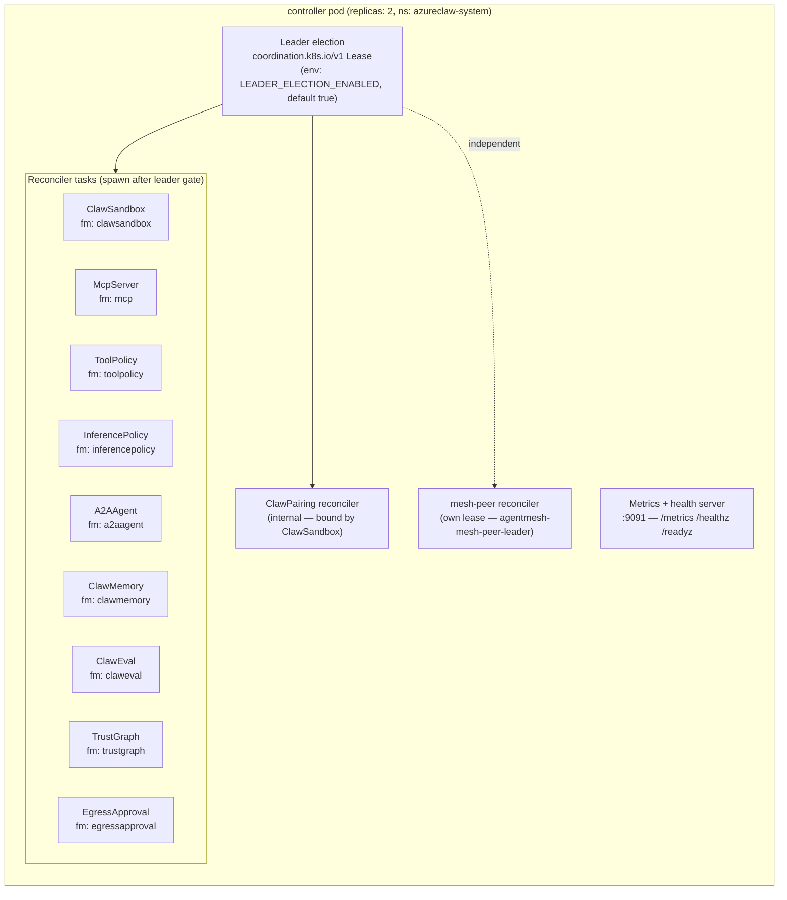
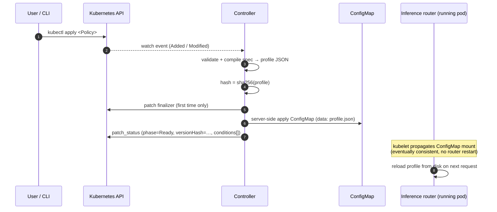
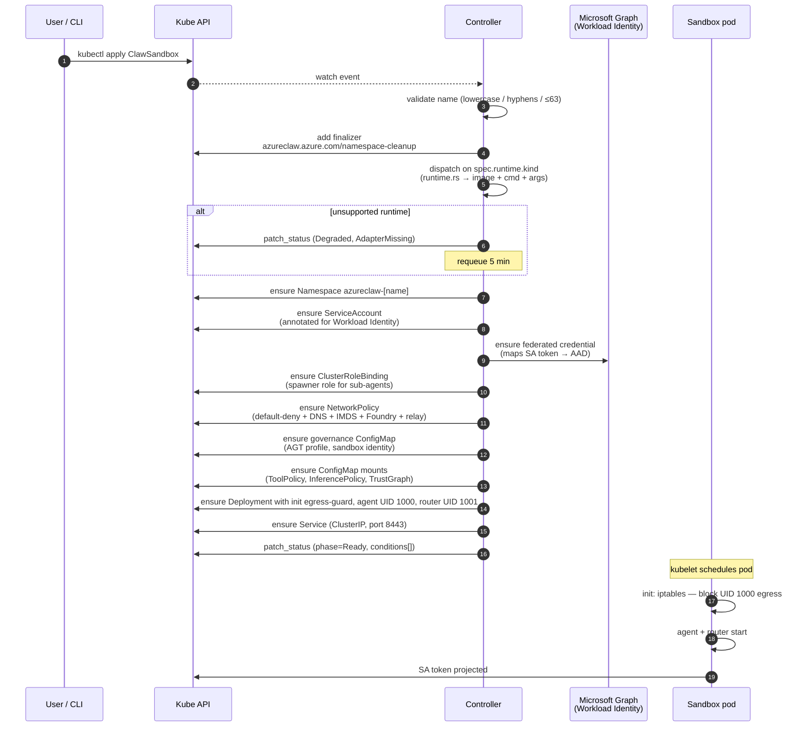
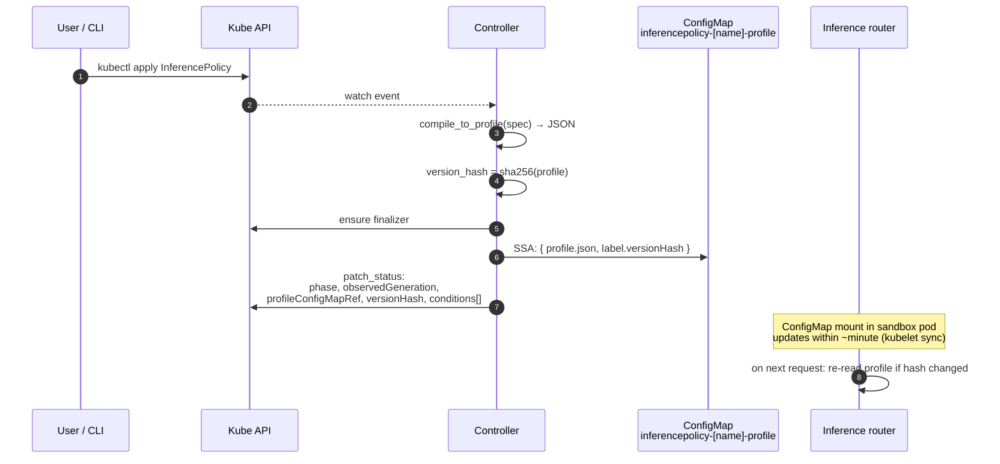
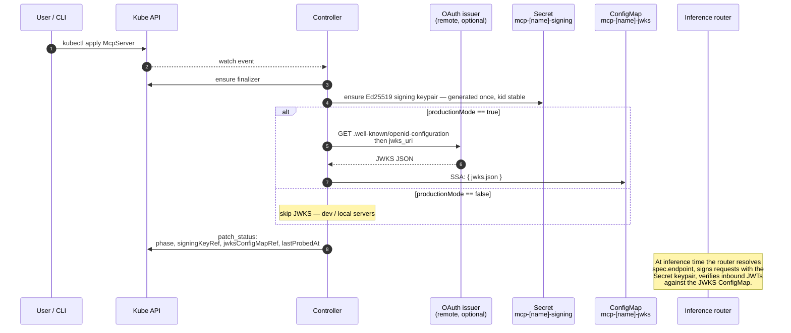
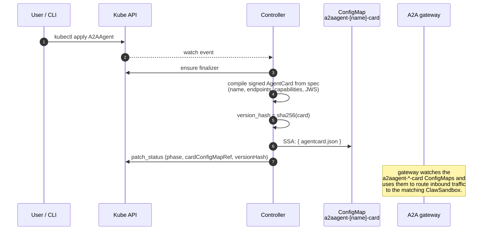

# Lifecycle — what happens when you apply a CRD

This page is the end-to-end story for every AzureClaw CRD: which CLI command writes it, what the controller does when it lands, what cluster artifacts get produced, and which component consumes those artifacts at runtime.

If you only read one document about how AzureClaw fits together, read this one.

> Source of truth: `controller/src/*_reconciler.rs` and `inference-router/src/routes/*.rs`. Every diagram and table here is grounded in those files.

## Table of contents

- [The big picture](#the-big-picture)
- [Two reconcile patterns](#two-reconcile-patterns)
- [CLI ↔ CRD ↔ artifact map](#cli--crd--artifact-map)
- [`ClawSandbox` — the heavyweight reconcile](#clawsandbox--the-heavyweight-reconcile)
- [`InferencePolicy` — the policy compile pattern](#inferencepolicy--the-policy-compile-pattern)
- [`McpServer` — declared MCP backend](#mcpserver--declared-mcp-backend)
- [`A2AAgent` — public-ingress endpoint](#a2aagent--public-ingress-endpoint)
- [`ToolPolicy` / `ClawMemory` / `ClawEval` / `TrustGraph`](#toolpolicy--clawmemory--clawevaluation--trustgraph)
- [Status, conditions, requeue](#status-conditions-requeue)
- [Deletion & finalizers](#deletion--finalizers)

---

## The big picture



Three things happen in order:

1. **A CRD lands in etcd.** Either you ran an `azureclaw <verb>` command (which is just sugar over `kubectl apply`), or your GitOps tool synced one, or you ran `kubectl apply -f` directly. They are all equivalent.
2. **The controller reconciles it.** It reads the spec, compiles it into Kubernetes-native objects, and server-side-applies them. Then it patches `status.conditions` so observers can see what happened.
3. **The data plane consumes the artifacts.** The inference router reads governance / inference / tool / trust profiles from mounted `ConfigMap`s. The A2A gateway reads `AgentCard`s from a `ConfigMap`. The sandbox pod runs the runtime image the controller chose for `spec.runtime.kind`.

This is the whole loop. Everything else on this page is detail.

---

## Two reconcile patterns

AzureClaw's nine user-facing CRDs split into two operational shapes:

| Pattern | CRDs | What gets produced |
|---|---|---|
| **Compile-to-artifact** | `InferencePolicy`, `ToolPolicy`, `A2AAgent`, `McpServer`, `ClawMemory`, `ClawEval`, `TrustGraph`, `EgressApproval` | A deterministic `ConfigMap` (and sometimes a `Secret`) that the router or gateway mounts. The CRD spec is hashed; the hash is stored in `status.versionHash` or equivalent. |
| **Heavyweight namespace** | `ClawSandbox` | A whole tenant namespace: `Namespace` + `ServiceAccount` + Workload-Identity federated credential + `NetworkPolicy` + governance `ConfigMap` + `Deployment` + `Service`. |

### The reconciler map

All reconcilers run in the same controller pod under one leader-election lease, with a separate lease for the mesh-peer reconciler so it can fail independently.



The `fm:` labels are the SSA field manager suffixes — every reconciler owns its own subtree of the CR via server-side apply. Out-of-band edits (e.g., a manual `kubectl edit`) show up as field-manager conflicts in controller logs and trigger a re-reconcile.

### The compile pattern



The heavyweight pattern adds many more steps and a finalizer that owns the whole tenant namespace — see the dedicated section below.

---

## CLI ↔ CRD ↔ artifact map

Every CLI command is a thin wrapper around `kubectl apply`. The CLI does no orchestration the controller wouldn't do — it just produces well-formed CR YAML and submits it.

| CLI command | CRD written | Cluster artifact produced | Consumed by |
|---|---|---|---|
| `azureclaw up` | `ClawSandbox` (one or more) | Tenant namespace + everything inside it | The agent pod itself |
| `azureclaw add <name>` | `ClawSandbox` | Same as above | Same |
| `azureclaw destroy <name>` | Deletes `ClawSandbox` | Cascades via finalizer to delete the namespace + federated credential | — |
| `azureclaw inferencepolicy apply` | `InferencePolicy` | `ConfigMap` `inferencepolicy-<name>-profile` | Inference router (`/v1/chat`, `/v1/responses`) |
| `azureclaw toolpolicy apply` | `ToolPolicy` | `ConfigMap` `toolpolicy-<name>-profile` | Inference router (every tool dispatch) |
| `azureclaw mcp add` | `McpServer` | `Secret` `mcp-<name>-signing` (Ed25519 keypair) <br/> `ConfigMap` `mcp-<name>-jwks` (when `productionMode=true`) | Inference router (`/mcp` proxy — multi-issuer OAuth verifier + namespaced `{server}.{tool}` dispatch) |
| `azureclaw a2a-agent apply` | `A2AAgent` | `ConfigMap` `a2aagent-<name>-card` (signed AgentCard) | A2A gateway (inbound JWS verification) |
| `azureclaw eval` | `ClawEval` | `ConfigMap` `claweval-<name>-spec` <br/> `Job` (when run-now) | Eval harness |
| `azureclaw mesh ...` | `TrustGraph` | `ConfigMap` `trustgraph-<name>-graph` | Sandbox agent SDK (KNOCK accept/deny via `@microsoft/agent-governance-sdk`); inference router tracks the post-decision trust-score map for audit/governance |

> The CLI's `apply` and `get` verbs round-trip through `kubectl` for parity with GitOps. There is no hidden CLI-only state.

---

## `ClawSandbox` — the heavyweight reconcile



**What happens for each step in code** (file references):

| Step | Code |
|---|---|
| Name validation | `controller/src/reconciler/mod.rs:138-151` |
| Finalizer add / cascade delete | `controller/src/reconciler/mod.rs:159-264` |
| Runtime dispatch | `controller/src/reconciler/runtime.rs` (8 match arms) |
| Federated credential | `controller/src/fedcred.rs` |
| NetworkPolicy template | `controller/src/reconciler/mod.rs:807-890` |
| Governance mount | `controller/src/reconciler/governance_mounts.rs` |
| TrustGraph mount | `controller/src/reconciler/trustgraph_mount.rs` |
| BYO contract validation | `controller/src/reconciler/byo_contract.rs` |
| Status patching | `controller/src/status/` |

---

## `InferencePolicy` — the policy compile pattern



**Verified against**: `controller/src/inference_policy_reconciler.rs:100-200` (entry point), `inference_policy_compile.rs` (deterministic compile).

The router reads `model_preference`, `token_budget`, and `content_safety` blocks from the profile. Token-budget enforcement happens **before** the Foundry call (`inference-router/src/routes/chat_completions.rs:75-89`).

---

## `McpServer` — declared MCP backend



**Verified against**: `controller/src/mcp_server_reconciler.rs:246-377`.

Two artifacts, two purposes:

- **The `Secret`** (`mcp-<name>-signing`) is the local Ed25519 keypair used by the router to sign outbound MCP requests. The `kid` is stable across reconciles; the keypair is created once and persists.
- **The `ConfigMap`** (`mcp-<name>-jwks`) contains the remote OAuth issuer's JWKS, fetched by the controller and refreshed on each reconcile. Only present when `productionMode=true` and `spec.oauth.issuer` is set. Used by the router to verify JWTs the MCP server returns.

If JWKS fetch fails the CR is stamped `Degraded / JwksFetchFailed` and the controller requeues with backoff. The router's tool dispatch path treats this as fail-closed for that MCP server.

### Plural binding (`mcpServerRefs`)

A `ClawSandbox` may bind up to **8** `McpServer`s via `spec.mcpServerRefs: []LocalObjectReference`. The legacy singular form `spec.mcpServerRef` is accepted on input and folded into the plural list on reconcile (a `Warning` event is emitted to nudge migration). For every referenced server the controller mirrors a per-server volume into the sandbox pod:

```
/etc/azureclaw/mcp/
  ├── <name-a>/
  │   ├── jwks.json   ← mirrored issuer JWKS
  │   └── meta.json   ← { url, issuer, audience, allowed_tools }
  └── <name-b>/
      ├── jwks.json
      └── meta.json
```

The inference router walks `MCP_JWKS_DIR` at startup, builds an `McpServerRegistry` keyed by name, and:

1. **OAuth:** registers each `meta.issuer` as a trusted issuer in the multi-issuer `OAuthVerifier`. Inbound MCP-host requests are routed to the matching JWKS by `iss` claim.
2. **Tool dispatch:** for each unauthenticated server (servers requiring outbound OAuth-on-behalf-of are skipped — that path is still being wired), the router calls `tools/list` upstream and registers each tool under the namespaced name `{server_snake_case}.{tool}`. `allowed_tools` filters the catalog (`["*"]` = full passthrough; explicit list = subset; empty = fail-closed with reason recorded).

Stale-file sweep (DoD #6) is producer-side: each reconcile rewrites the full current ref set, so removed servers' volumes disappear naturally on the next kubelet pod sync.

---

## `A2AAgent` — public-ingress endpoint



**Verified against**: `controller/src/a2a_agent_reconciler.rs:96-200` and `controller/src/a2a_agent_compile.rs`.

When an external peer hits the A2A gateway with a JWS-signed envelope, the gateway looks up the target agent in this `ConfigMap` set, verifies the signature against the trust anchor, and forwards over mTLS to the router on port 8445. See [A2A gateway architecture](../architecture/a2a-gateway.md) for the full data flow.

---

## `ToolPolicy` / `ClawMemory` / `ClawEval` / `TrustGraph`

Each follows the compile-to-ConfigMap pattern with one added wrinkle:

| CRD | Adds | Where the artifact is consumed |
|---|---|---|
| `ToolPolicy` | Compiles allow / deny / approval rules into a flat decision profile | Inference router on every tool dispatch (`/v1/mcp/*`, `/v1/spawn`, `/v1/handoff`) |
| `ClawMemory` | Resolves storage backend (Cosmos / blob / in-memory) and stamps a binding token | Inference router on `/v1/memory/*` proxy |
| `ClawEval` | Compiles spec into a `Job` template; spawns one `Job` per `run-now` request | Eval harness pod; results PVC-mounted |
| `TrustGraph` | Snapshots peer identities + trust scores into a ConfigMap | Sandbox agent SDK on the KNOCK accept/deny path (mesh ingress); inference router only mirrors the post-decision trust-score map |

**Code references**:

- `controller/src/tool_policy_reconciler.rs` + `tool_policy_compile.rs`
- `controller/src/claw_memory_reconciler.rs` + `claw_memory_compile.rs`
- `controller/src/claw_eval_reconciler.rs` + `claw_eval_compile.rs`
- `controller/src/trust_graph_reconciler.rs` + `trust_graph_compile.rs`

All four follow the same `compile → version_hash → SSA ConfigMap → patch_status` shape as `InferencePolicy`. The reconcile loops are intentionally near-identical so the failure modes and observability are uniform.

---

## Status, conditions, requeue

Every reconcile ends with a `patch_status` call. The status block always carries:

- `phase` — see vocabulary table below.
- `observedGeneration` — `metadata.generation` of the spec the reconciler saw.
- `conditions[]` — at least `Ready`, `Progressing`, `Degraded`. Reasons are taxonomy-controlled — see [Conditions reference](conditions.md).
- For compile pattern: `versionHash`, the `*-Ref` pointing at the produced `ConfigMap`/`Secret`, and `lastCompiledAt` / `lastProbedAt`.

### Phase vocabulary

The `status.phase` string is part of the public contract: `azureclaw connect`, `kubectl wait`, GitOps tooling and the Headlamp plugin all branch on it. The taxonomy is closed — reconcilers must use one of these values (constants live in `controller/src/status/phase.rs`):

| Phase | Meaning | `Ready` condition | When the controller stamps it |
|---|---|---|---|
| `Pending` | Controller accepted the CR but has not yet produced a compiled artifact (waiting on an admit step or finalizer cleanup). | `False` | Reserved for async admission flows; not stamped by today's reconcilers. |
| `Compiled` | Spec parsed, `ConfigMap` written, but the **router has not yet echoed back the loaded digest**. The artifact exists; the data plane is not yet enforcing it. | `False` (reason `AwaitingRouterEnforcement` or `NoSandboxesReferencing`) | Any policy CRD whose enforcement loop is router-side: `ClawMemory`, `ToolPolicy` with `spec.agtProfile.inline`, `InferencePolicy`. The controller polls each referencing `ClawSandbox`'s `inference-router /internal/policy-status` endpoint and stays in `Compiled` while any of the relevant digests (token budget, content safety floors, prompt-shields flag, model-preference override) are unconfirmed, or while no `ClawSandbox` references the policy yet. The `modelPreference.fallback` health-aware failover path is the last piece still being wired — a policy that relies on it stays `Compiled` until that consumer echoes back. A `Warning` Event with reason `PolicyNotEnforced` is emitted on every reconcile in this state so operators see the gap in `kubectl describe`. |
| `Ready` | Spec compiled **and** the consuming component (router, runtime, etc.) has confirmed it is enforcing the artifact. `kubectl wait --for=condition=Ready` must only return at this point. | `True` | `ToolPolicy` **without** `spec.agtProfile` (runtime-side enforcement of commerce / rate-limit / approval is co-located in the in-process AGT plugin); `ToolPolicy` with `spec.agtProfile.inline` after every referencing `ClawSandbox`'s router echoes the published digest on `/internal/policy-status` (reason `RouterEnforcing`); `InferencePolicy` after every referencing `ClawSandbox`'s router echoes the inference-policy digest on the same endpoint (reason `RouterEnforcing`); `ClawMemory` after the binding digest is echoed (reason `RouterEnforcing`); `McpServer` (`ClawSandbox.spec.mcpServerRefs` mirrors up to 8 servers; the singular `spec.mcpServerRef` remains an accepted alias with a deprecation warning); `A2AAgent`, `ClawSandbox`, `TrustGraph`. |
| `Degraded` | Spec is valid but a dependency is failing (Foundry 5xx, JWKS fetch timeout, etc.). Retry will help — the reconciler requeues at `REQUEUE_FAIL`. | `False` (reason describes the dependency) | Any reconciler on transient failure. |
| `Failed` | Spec is invalid and will not converge without user editing the CR (validation, signature mismatch, malformed reference). | `False` | Any reconciler on permanent failure. |

The `Compiled` state is a load-bearing honesty value: it signals "spec is valid and the controller has done all it can; we are now waiting for the consuming component (router informer, runtime echo, etc.) to confirm enforcement". As each downstream consumer's confirmation loop lands, the corresponding reconciler deletes its `Compiled`/`AwaitingRouterEnforcement` call site, flipping the success path back to `Ready=True`.

Requeue cadence is per-reconciler:

| Outcome | Requeue interval (default) |
|---|---|
| Reconcile success | `REQUEUE_OK` (typically 5 min) |
| Reconcile failure (`Degraded`) | `REQUEUE_FAIL` (typically 30 s with jitter) |
| Spec validation rejection | 5 min (waits for user to edit the CR) |
| Federated-credential transient error | 30 s with jitter (`controller/src/backoff.rs`) |

`status.conditions[].lastTransitionTime` is preserved when the status doesn't flip — this matters for downstream automation that triggers on transitions.

---

## Deletion & finalizers

Every reconciler installs a finalizer on first reconcile. This blocks Kubernetes from completing the `DELETE` until the controller has run cleanup. Cleanup is **synchronous**: a transient failure (e.g., AAD Graph 5xx during federated credential delete) requeues the finalizer rather than removing it.

| CRD | Finalizer | Cleanup work |
|---|---|---|
| `ClawSandbox` | `azureclaw.azure.com/namespace-cleanup` | Delete the tenant namespace (cascades to all resources), delete spawner ClusterRoleBinding, **delete federated credential**, release pairing slot, then remove finalizer. |
| Compile-pattern CRDs | `azureclaw.azure.com/<kind>-cleanup` | Delete the produced `ConfigMap` (and `Secret`, where present), then remove finalizer. |

The federated-credential delete is the one cleanup that crosses the cluster boundary into Microsoft Graph. See `controller/src/fedcred_reaper.rs` for the orphan-collector that backstops force-delete and pre-finalizer CRs.

---

## See also

- [CRD reference](crd-reference.md) — exhaustive field-by-field schema.
- [Conditions reference](conditions.md) — every status condition the controller emits and why.
- [Architecture](../architecture.md) — the prose walkthrough of one model call.
- [Architecture diagrams](../architecture-diagrams.md) — high-level visual index.
- [Runtimes](../runtimes.md) — how `spec.runtime.kind` maps to images.
- [BYO contract](../blueprints/01-developer-inner-loop.md) — for `spec.runtime.kind: BYO`.
