# AzureClaw — Architecture & Flow Diagrams

Visual reference for AzureClaw's core flows: sandbox architecture, agent lifecycle, inter-agent communication, inference routing, and egress control.

---

## 1. Sandbox Pod Architecture

The fundamental building block — every agent runs in this pod structure.

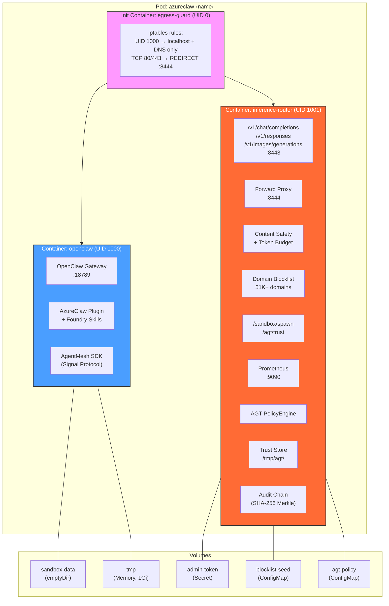

### Network Access Matrix

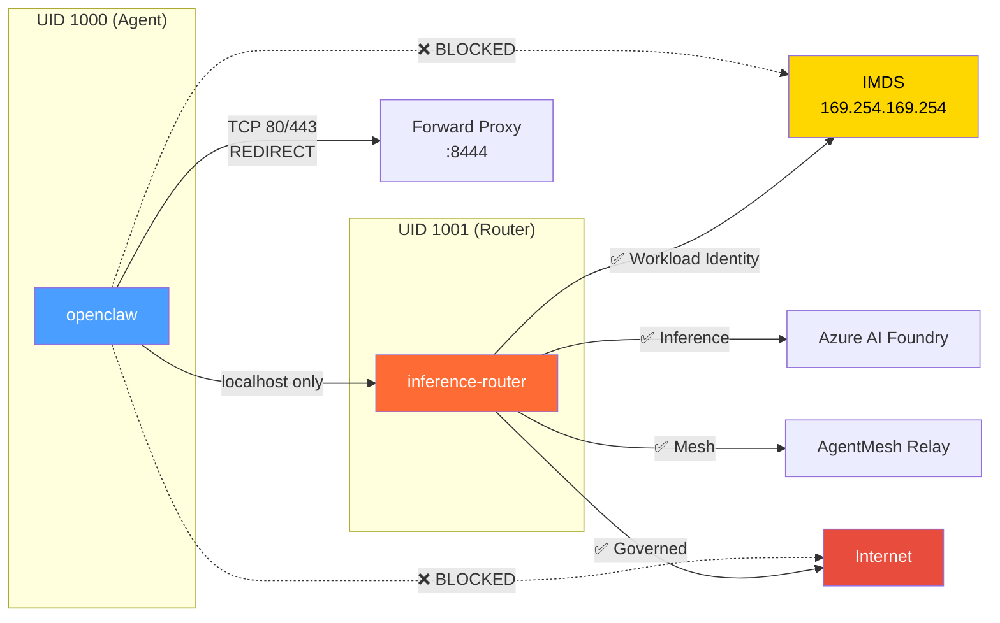

---

## 2. Agent Creation Flow (`azureclaw add`)

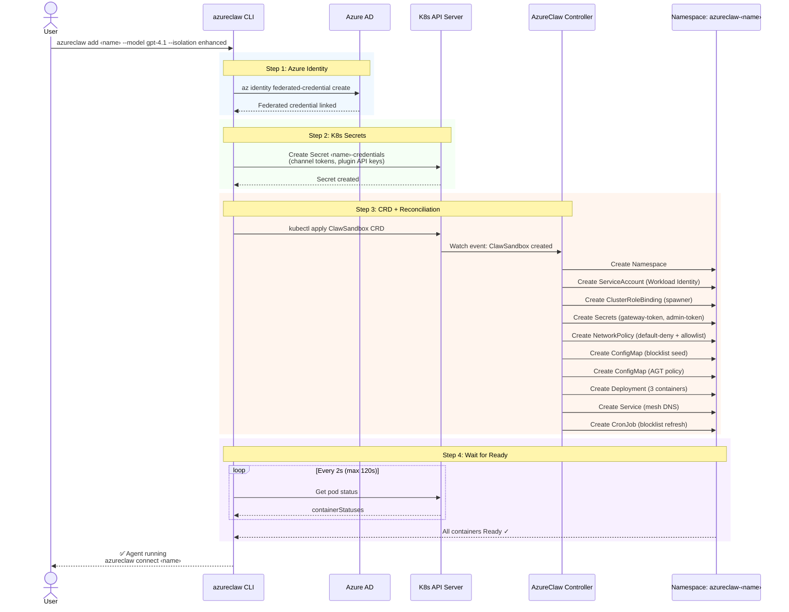

---

## 3. Controller Reconciliation — Resources Created

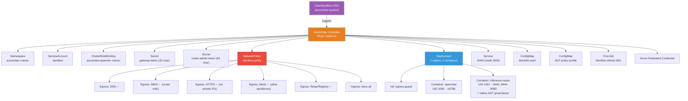

---

## 4. Sub-Agent Spawn Flow

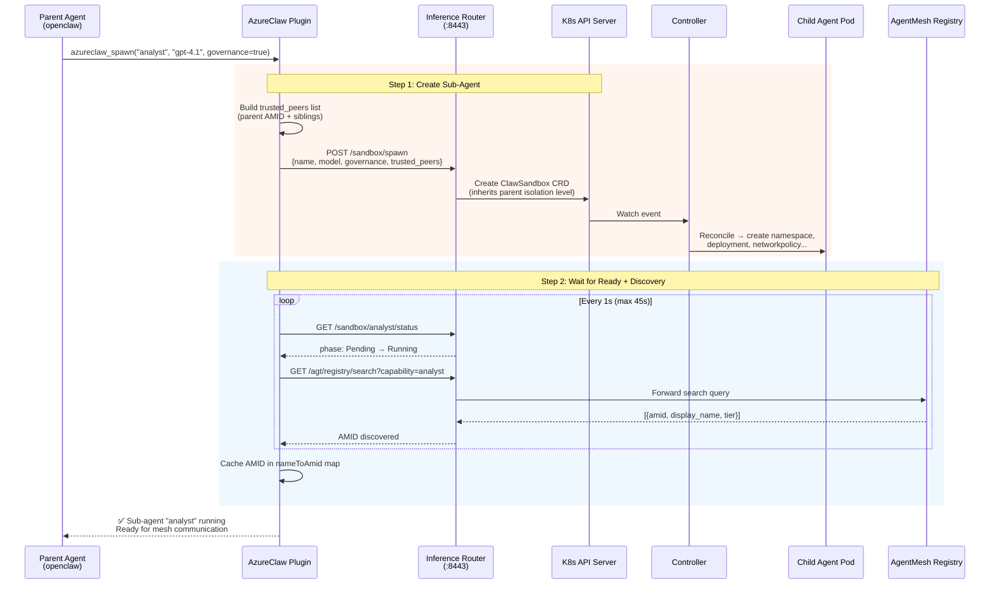

---

## 5. E2E Encrypted Agent-to-Agent Communication

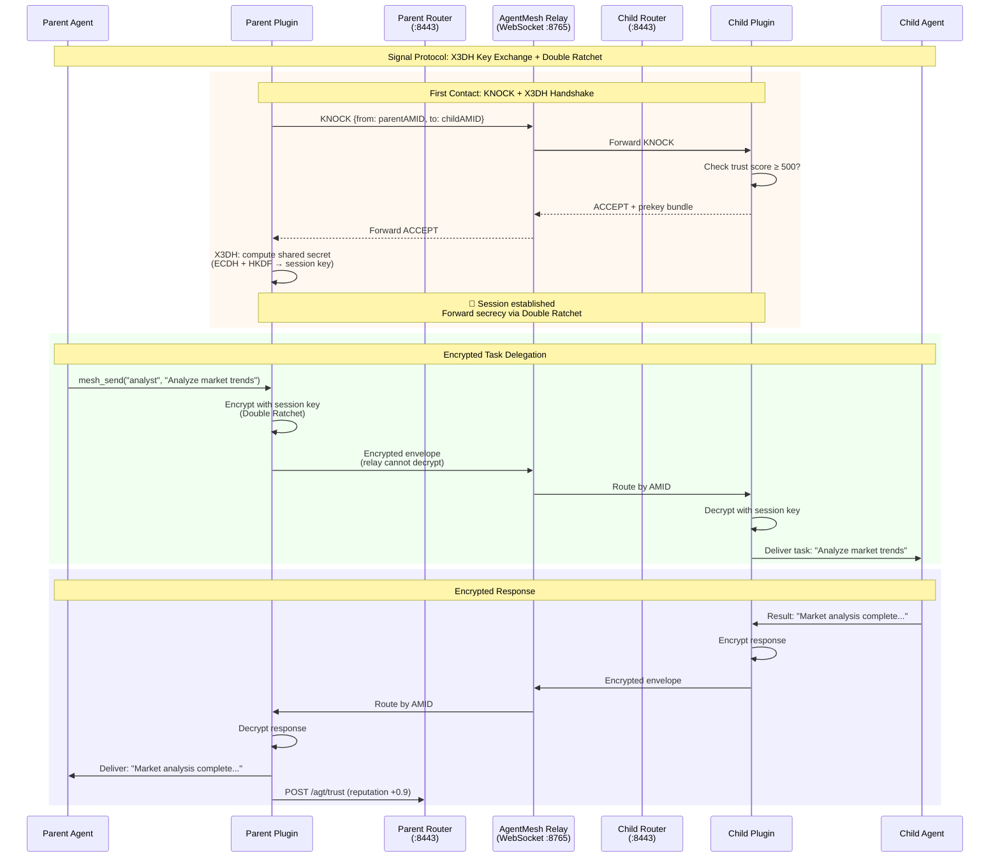

### Trust Gate Decision Flow

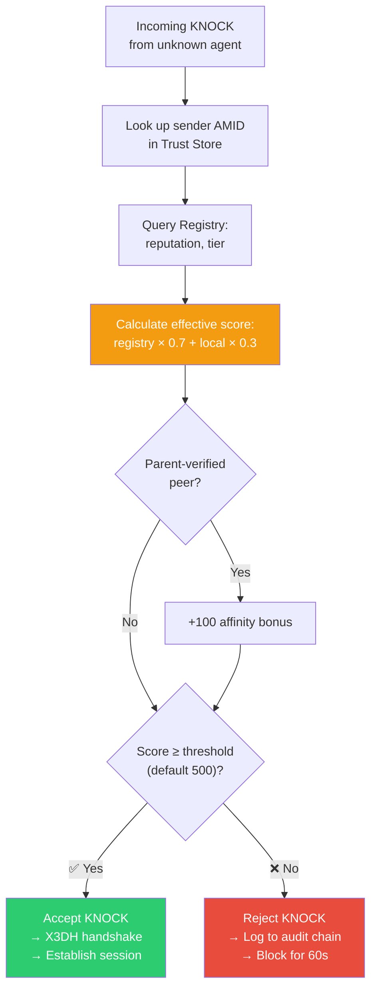

---

## 6. Inference Request Flow

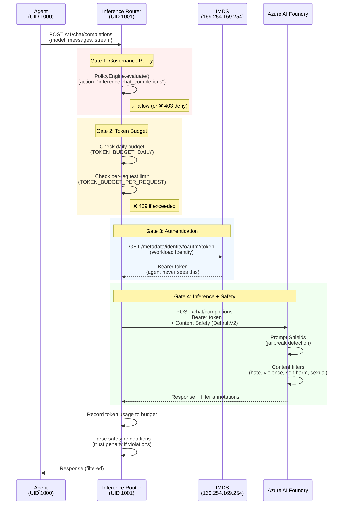

---

## 7. Egress Control Flow

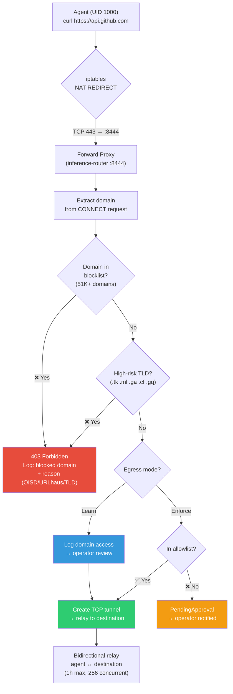

### Learn → Enforce Lifecycle

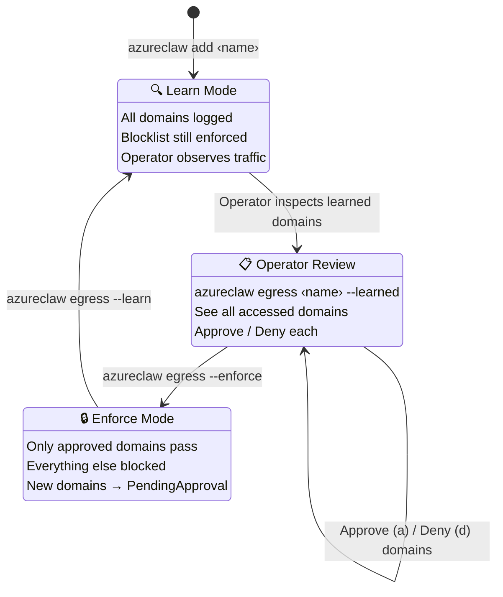

---

## 8. Full Deployment Flow (`azureclaw up`)

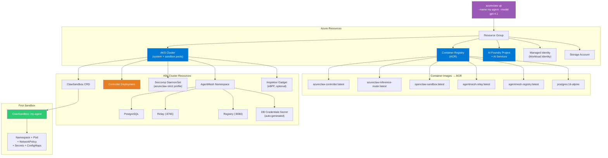

---

## 9. Multi-Agent Topology

What a production mesh looks like with parent + sub-agents.

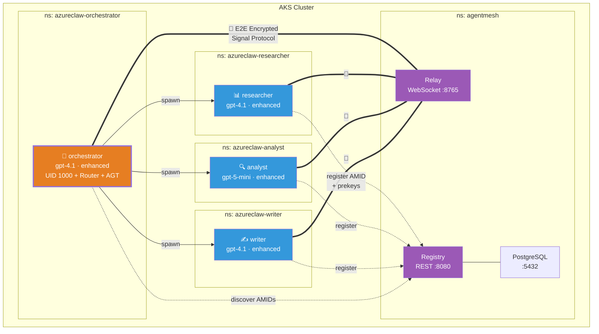

---

## 10. Defense-in-Depth Layers


---

## 11. Cloud Handoff Flow (Dev → AKS)

LLM-driven agent migration from local Docker to AKS cloud. The LLM requests the handoff, the user confirms with a code, and the plugin orchestrates the transfer asynchronously — reporting live progress via emoji status updates.

### 11.1 End-to-End Sequence

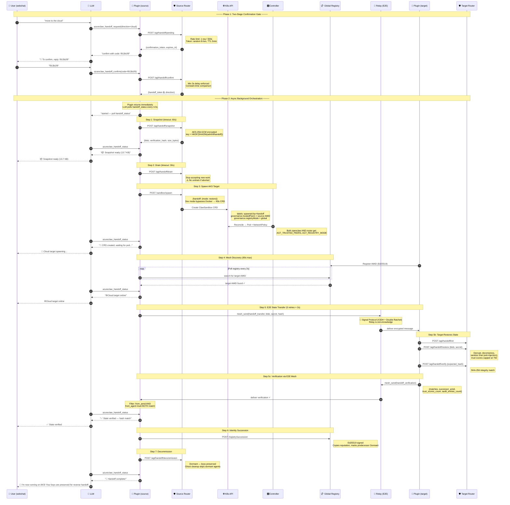

### 11.2 Handoff State Machine

The router tracks handoff phases. **Note:** phase ordering is enforced by convention in the plugin, not by the router — endpoints are currently callable in any order (documented improvement area).

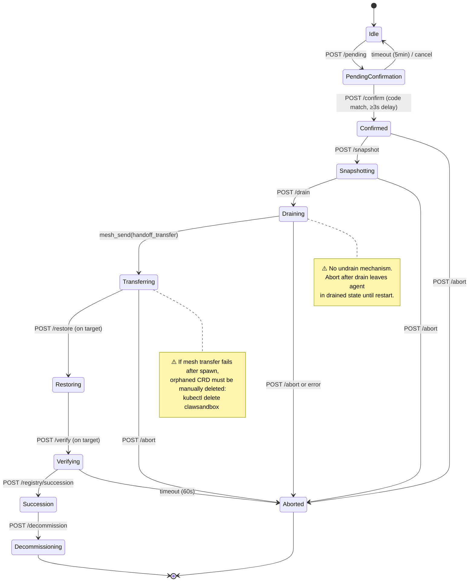

### 11.3 Security Model

```mermaid
%%{init: {'theme': 'default'}}%%
graph TB
    subgraph gate["Layer 1: Human-in-the-Loop Gate"]
        direction LR
        pending["POST /pending<br/>Rate limit: 1 req / 300s"]
        confirm["POST /confirm<br/>Min 3s delay, constant-time compare"]
        pending --> confirm
    end

    subgraph isolation["Layer 2: LLM Isolation"]
        direction LR
        token_iso["Handoff token stays in<br/>plugin memory — LLM never sees it"]
        admin_iso["Admin token read from<br/>/run/secrets/ (K8s mount)"]
        execute["LLM can REQUEST<br/>but never EXECUTE"]
    end

    subgraph auth["Layer 3: Three-Layer Endpoint Auth"]
        direction LR
        l1["Init: admin token<br/>(no localhost bypass)"]
        l2["Mutations: admin + handoff token<br/>(no localhost bypass)"]
        l3["Status: admin token<br/>(localhost bypass OK — read-only)"]
    end

    subgraph encryption["Layer 4: Double Encryption"]
        direction LR
        aes["Snapshot: AES-256-GCM<br/>key = HKDF-SHA256(admin‖handoff)"]
        signal["Transport: Signal Protocol<br/>X3DH + Double Ratchet per session"]
        relay_zk["Relay is zero-knowledge<br/>cannot decrypt payloads"]
    end

    subgraph injection["Layer 5: State Blob Hardening"]
        direction LR
        sanitize["Chat history sanitized<br/>(strip system prompts, JSON injection)"]
        trust_cap["Trust scores capped at 750<br/>(prevent score inflation)"]
        size_limit["50MB blob limit<br/>100 files max, 10MB/file"]
    end

    subgraph identity["Layer 6: Identity & Trust"]
        direction LR
        ed25519["Ed25519 keypairs<br/>AMIDs = public keys"]
        trusted["AGT_TRUSTED_PEERS<br/>K8s-injected to BOTH containers"]
        knock["KNOCK enforcement<br/>+500 bonus for trusted peers"]
        verify_both["Verification filter:<br/>from_amid OR from_agent mismatch → reject"]
    end

    subgraph infra["Layer 7: Infrastructure"]
        direction LR
        netpol["NetworkPolicy: default-deny<br/>mesh egress only"]
        readonly["Read-only rootfs<br/>seccomp + non-root"]
        kube["Kubeconfig: read-only mount<br/>dev mode only"]
        validated["registry_mode validated: local|global<br/>trusted_peers: control chars rejected"]
    end

    gate --> isolation --> auth --> encryption --> injection --> identity --> infra
```

### 11.4 Env Var Propagation (Controller → Containers)

Both containers in the sandbox pod receive governance env vars. This is critical for handoff — the router needs `AGT_REGISTRY_MODE` to gate handoff endpoints, and `AGT_TRUSTED_PEERS` for KNOCK authentication.

```mermaid
%%{init: {'theme': 'default'}}%%
graph LR
    CRD["ClawSandbox CRD<br/>governance spec"] --> Ctrl["Controller<br/>reconciler.rs"]

    Ctrl --> OC["OpenClaw Container"]
    Ctrl --> IR["Inference Router"]

    subgraph OC_env["OpenClaw Env Vars"]
        direction TB
        oc1["AGT_GOVERNANCE_ENABLED"]
        oc2["AGT_POLICY_PROFILE"]
        oc3["AGT_TRUST_THRESHOLD"]
        oc4["AGT_TRUSTED_PEERS ✅"]
        oc5["AGT_REGISTRY_MODE ✅"]
    end

    subgraph IR_env["Router Env Vars"]
        direction TB
        ir1["AGT_GOVERNANCE_ENABLED"]
        ir2["AGT_POLICY_PROFILE"]
        ir3["AGT_TRUST_THRESHOLD"]
        ir4["AGT_TRUSTED_PEERS ✅"]
        ir5["AGT_REGISTRY_MODE ✅"]
        ir6["AGT_MESH_NAMESPACE"]
        ir7["AGT_RELAY_URL"]
        ir8["AGT_REGISTRY_URL"]
    end

    OC --> OC_env
    IR --> IR_env

    subgraph validation["CRD Validation"]
        direction TB
        v1["trusted_peers: reject \\n \\r \\0"]
        v2["registry_mode: only local|global"]
    end

    CRD --> validation
    validation --> Ctrl
```

### 11.5 Two Orchestration Paths

There are two independent orchestration paths for handoff — both valid, serving different use cases:

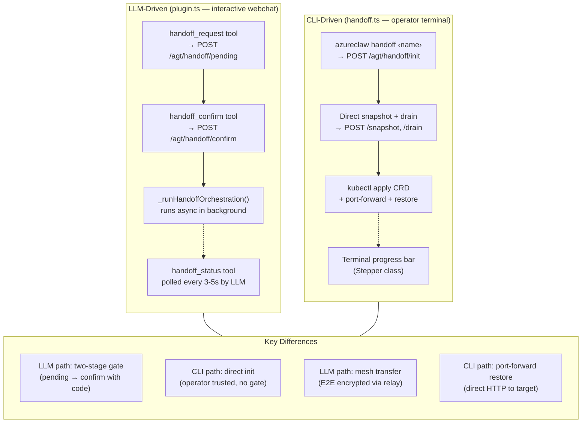

### 11.6 Trust Flow — Current vs Future

Currently agents register anonymously (trust score = 0), so `AGT_TRUSTED_PEERS` provides the +500 KNOCK bonus. With Entra OAuth deployed, agents get verified identities and real reputation.

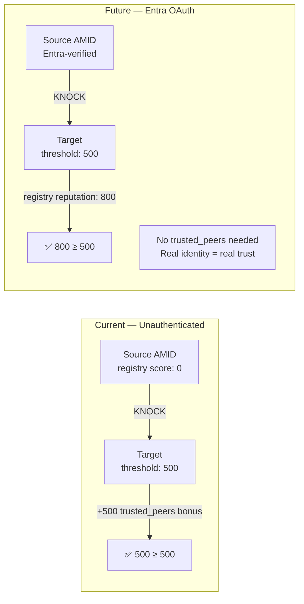

### 11.7 Error Recovery & Known Limitations

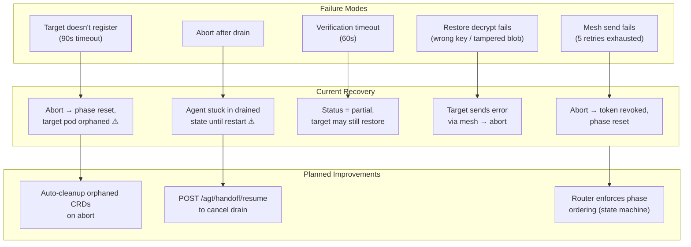

---

## 12. Bidirectional Handoff with Sub-Agents

Full roundtrip handoff: local Docker ↔ AKS cloud, including sub-agent lifecycle (snapshot, destroy, re-spawn, workspace inject, task resume). The local Docker parent is the permanent "home base" — everything else is ephemeral.

### 12.1 Agent Lifecycle Across Handoff

```mermaid
%%{init: {'theme': 'default'}}%%
graph LR
    subgraph local["🐳 Local Docker — Home Base"]
        LP["🏠 Parent Agent<br/>permanent — goes dormant,<br/>never deleted"]
        LS1["Sub-Agent 1<br/>ephemeral"]
        LS2["Sub-Agent 2<br/>ephemeral"]
    end

    subgraph cloud["☁️ AKS Cloud — Ephemeral"]
        CP["Parent Agent<br/>created by forward handoff,<br/>CRD deleted on reverse"]
        CS1["Sub-Agent 1<br/>re-spawned from snapshot"]
        CS2["Sub-Agent 2<br/>re-spawned from snapshot"]
    end

    LP -->|"forward: snapshot + spawn"| CP
    LS1 -.->|"destroyed"| CS1
    LS2 -.->|"destroyed"| CS2
    CP -->|"reverse: snapshot + wake"| LP
    CS1 -.->|"CRD deleted"| LS1
    CS2 -.->|"CRD deleted"| LS2
```

**Key principle:** Sub-agents are never migrated — they are destroyed and re-spawned. Only the parent's snapshot (which includes sub-agent definitions and workspace tars) crosses the boundary.

### 12.2 Forward Handoff: Local → Cloud (with Sub-Agents)

CLI-driven path (`azureclaw handoff <name> --to cloud`). 7 stepper steps.

```mermaid
sequenceDiagram
    autonumber
    participant CLI as 🖥️ CLI (handoff.ts)
    participant SrcR as 🛡️ Source Router<br/>(Docker)
    participant Sub as 🐳 Docker Sub-Agents
    participant K8s as ☸️ K8s API
    participant Ctrl as 🎛️ Controller
    participant TgtR as 🛡️ Target Router<br/>(AKS)
    participant Plugin as 🔌 Target Plugin<br/>(AKS)
    participant Reg as 📋 Registry
    participant Relay as 📡 Relay

    Note over CLI,Relay: Step 1: Verify source agent

    CLI->>SrcR: GET /agt/handoff/status
    SrcR-->>CLI: handoff_available=true, registry_mode=global

    Note over CLI,Relay: Step 2: Initialize handoff session

    CLI->>SrcR: POST /agt/handoff/init {direction: local_to_aks}
    SrcR-->>CLI: {handoff_token, token_hash}

    Note over CLI,Relay: Step 3: Create state snapshot

    CLI->>SrcR: GET /agt/handoff/sub-agents
    SrcR-->>CLI: [{name, capabilities, amid}]
    CLI->>Sub: write .handoff-interrupt to each workspace
    Note right of Sub: 3s pause for agents<br/>to save checkpoints
    CLI->>Sub: docker exec tar workspace (each sub-agent)
    CLI->>SrcR: docker exec tar workspace (parent)
    CLI->>SrcR: POST /memory_stores/{store}:search_memories
    CLI->>SrcR: docker exec env (credential refs)
    CLI->>SrcR: POST /agt/handoff/snapshot {workspace_tar, sub_agent_snapshots[], credentials}
    SrcR-->>CLI: {blob, snapshot_size_bytes} (AES-256-GCM encrypted)

    Note over CLI,Relay: Step 4: Drain active work

    CLI->>SrcR: POST /agt/handoff/drain
    SrcR-->>CLI: drained ✓

    Note over CLI,Relay: Step 5: Provision target + restore

    CLI->>K8s: kubectl apply ClawSandbox CRD<br/>(handoff.mode=restore, predecessor AMID)
    Ctrl->>K8s: Reconcile → namespace, deployment, service, NetworkPolicy
    CLI->>K8s: kubectl create secret (credentials)
    CLI->>K8s: Wait for pod Ready (up to 120s)
    CLI->>TgtR: kubectl port-forward → POST /agt/handoff/restore {blob, shared_secret}
    Note right of TgtR: Decrypt blob → restore trust scores,<br/>audit entries, re-spawn sub-agents<br/>via POST /sandbox/spawn per snapshot

    TgtR-->>CLI: {trust_scores_count, sub_agent_results[]}
    TgtR->>K8s: Create sub-agent ClawSandbox CRDs
    Ctrl->>K8s: Reconcile → sub-agent pods

    Note over CLI,Relay: Plugin IIFE: async post-restore hydration

    Plugin->>Plugin: Parse chat_snapshot → replay to Foundry Conversation
    Plugin->>Plugin: Store handoff event in Foundry Memory
    Plugin->>Plugin: Extract workspace tar to /sandbox/
    Plugin->>Plugin: Write MEMORY.md + .handoff-state.json

    Note over CLI,Relay: Plugin: Sub-agent trust + resume loop

    Plugin->>Plugin: Collect original_amid from snapshots → staleAmids Set
    Plugin->>Plugin: Clear stale entries from nameToAmid cache

    loop For each sub-agent (reject stale AMIDs, 90s timeout)
        Plugin->>Reg: GET /registry/search?capability={name}
        Reg-->>Plugin: candidates (filter out staleAmids)
    end
    Note right of Plugin: Cache NEW AMIDs in nameToAmid

    loop Prekey gate (20 attempts × 3s)
        Plugin->>Relay: ping sub-agent (verify E2E session)
    end

    loop Workspace inject (3 attempts × 20s ack wait)
        Plugin->>Relay: mesh_send(workspace_inject, tar)
        Relay->>Sub: deliver workspace tar (E2E encrypted)
        Sub->>Sub: Extract tar + promote incoming/ + write HANDOFF_FILES.md
        Sub->>Relay: mesh_send(workspace_inject_ack, {file_count})
        Relay->>Plugin: deliver ack ✓
    end

    Plugin->>Relay: mesh_send(handoff:resume, {task_context, checkpoint})
    Relay->>Sub: deliver resume signal
    Sub->>Sub: Resume interrupted task (processTaskWithTools)

    Note over CLI,Relay: Step 6: Identity succession

    CLI->>Reg: POST /registry/succession (Ed25519 signed)
    Note right of Reg: Copy reputation, mark predecessor dormant

    Note over CLI,Relay: Step 7: Summary + local cleanup

    CLI->>SrcR: POST /agt/handoff/decommission
    Note right of SrcR: Parent goes dormant<br/>(Docker container preserved for reverse)
    CLI->>Sub: docker stop + rm sub-agent containers
```

### 12.3 Reverse Handoff: Cloud → Local (with Sub-Agents)

CLI-driven path (`azureclaw handoff <name> --to local`). 13 stepper steps.

```mermaid
sequenceDiagram
    autonumber
    participant CLI as 🖥️ CLI (handoff.ts)
    participant SrcR as 🛡️ Source Router<br/>(AKS)
    participant Sub as ☁️ AKS Sub-Agents
    participant K8s as ☸️ K8s API
    participant Docker as 🐳 Docker
    participant TgtR as 🛡️ Target Router<br/>(Docker)
    participant Plugin as 🔌 Target Plugin<br/>(Docker)
    participant Reg as 📋 Registry
    participant Relay as 📡 Relay

    Note over CLI,Relay: Step 1: Connect to AKS

    CLI->>K8s: kubectl port-forward svc/{name} 18445:8443
    CLI->>SrcR: GET /readyz (poll until healthy)

    Note over CLI,Relay: Step 2: Verify source agent

    CLI->>SrcR: GET /agt/handoff/status (via port-forward)
    SrcR-->>CLI: handoff_available=true

    Note over CLI,Relay: Step 3: Initialize handoff

    CLI->>SrcR: POST /agt/handoff/init {direction: aks_to_local}
    SrcR-->>CLI: {handoff_token, token_hash}

    Note over CLI,Relay: Step 4: Create state snapshot

    CLI->>SrcR: GET /agt/handoff/sub-agents
    SrcR-->>CLI: [{name, capabilities, amid}]
    CLI->>Sub: kubectl exec: write .handoff-interrupt
    Note right of Sub: 3s pause
    CLI->>Sub: kubectl exec: tar workspace (each sub-agent)
    CLI->>SrcR: kubectl exec: tar workspace (parent)
    CLI->>SrcR: POST /memory_stores/{store}:search_memories
    CLI->>SrcR: POST /agt/handoff/snapshot {workspace_tar, sub_agent_snapshots[]}
    SrcR-->>CLI: {blob, snapshot_size_bytes}

    Note over CLI,Relay: Step 5: Drain

    CLI->>SrcR: POST /agt/handoff/drain

    Note over CLI,Relay: Steps 6-9: Wake local + restore

    CLI->>Docker: docker start (wake dormant parent)
    CLI->>K8s: kubectl get secret → decode credentials
    CLI->>Docker: docker exec: write credentials to env file
    CLI->>TgtR: POST /agt/handoff/init {direction: aks_to_local}
    TgtR-->>CLI: {localHandoffToken}
    CLI->>TgtR: docker exec curl POST /agt/handoff/restore {blob, shared_secret}
    Note right of TgtR: Decrypt blob → restore state,<br/>re-spawn sub-agents as Docker containers
    TgtR-->>CLI: {trust_scores_count, sub_agent_results[]}

    Note over CLI,Relay: Plugin IIFE: async post-restore (same as §12.2)

    Plugin->>Plugin: Chat replay + memory + workspace extraction
    Plugin->>Plugin: Sub-agent trust+resume loop<br/>(stale AMID filter → prekey gate →<br/>workspace inject → resume)

    Note over CLI,Relay: Step 10: Identity succession

    CLI->>Reg: POST /registry/succession (Ed25519 signed)

    Note over CLI,Relay: Steps 11-13: Cloud teardown

    CLI->>SrcR: POST /agt/handoff/decommission
    CLI->>K8s: kubectl delete clawsandbox {parent}
    CLI->>K8s: kubectl delete clawsandbox {sub-agent-1}
    CLI->>K8s: kubectl delete clawsandbox {sub-agent-2}
    Note right of K8s: Controller cascades: delete<br/>namespace, deploy, svc, NetworkPolicy
    CLI->>CLI: aksPortForwardStop()
```

### 12.4 Stale AMID Cache Poisoning — Problem & Fix

After handoff, the predecessor's sub-agents leave stale AMIDs in the registry (5-minute heartbeat timeout). The successor's trust+resume loop could cache these dead AMIDs, causing all mesh messages to silently drop.

```mermaid
sequenceDiagram
    participant Old as Old Sub-Agent<br/>(AMID: 3FFu...)
    participant Reg as 📋 Registry
    participant New as New Sub-Agent<br/>(AMID: 4SKY...)
    participant Parent as Successor Parent

    Note over Old,Parent: T+0: Docker containers destroyed

    Old->>Reg: Last heartbeat at T-30s
    Note right of Reg: AMID 3FFu... still "online"<br/>(heartbeat timeout = 5 min)

    Parent->>Reg: search("researcher")
    Reg-->>Parent: 3FFu... (STALE ❌)
    Note right of Parent: original_amid filter rejects!<br/>Keeps searching...

    Note over Old,Parent: T+27s: New AKS sub-agent registers

    New->>Reg: Register AMID 4SKY...
    Note right of Reg: Ghost cleanup deletes 3FFu...<br/>4SKY... is now "online"

    Parent->>Reg: search("researcher")
    Reg-->>Parent: 4SKY... (NEW ✅)
    Parent->>Parent: Cache 4SKY... in nameToAmid
```

**Three-layer fix:**
1. **Stale AMID rejection** — `original_amid` from snapshots used to filter registry results by identity, not time
2. **Prekey readiness gate** — 20 attempts × 3s to verify E2E session before workspace_inject
3. **Workspace inject retry** — 3 attempts with 20s ack wait, catches send errors

### 12.5 Workspace Injection Detail

```mermaid
%%{init: {'theme': 'default'}}%%
graph TB
    subgraph sender["Parent — sender side"]
        S1["Collect workspace tar<br/>from snapshot"] --> S2["mesh_send(workspace_inject,<br/>base64 tar)"]
        S2 --> S3{"Ack received<br/>within 20s?"}
        S3 -->|No| S4["Retry (max 3)"]
        S4 --> S2
        S3 -->|Yes| S5["Send handoff:resume<br/>with task_context"]
    end

    subgraph receiver["Sub-Agent — receiver side"]
        R1["Receive workspace_inject"] --> R2["Validate tar entries<br/>(no path traversal)"]
        R2 --> R3["Extract to /sandbox/<br/>(--no-overwrite-dir)"]
        R3 --> R4["Promote incoming/ files<br/>to workspace root"]
        R4 --> R5["Write HANDOFF_FILES.md<br/>(file manifest)"]
        R5 --> R6["Send workspace_inject_ack<br/>{success, file_count}"]
    end

    S2 -.->|E2E encrypted<br/>via relay| R1
    R6 -.->|E2E encrypted<br/>via relay| S3
```
