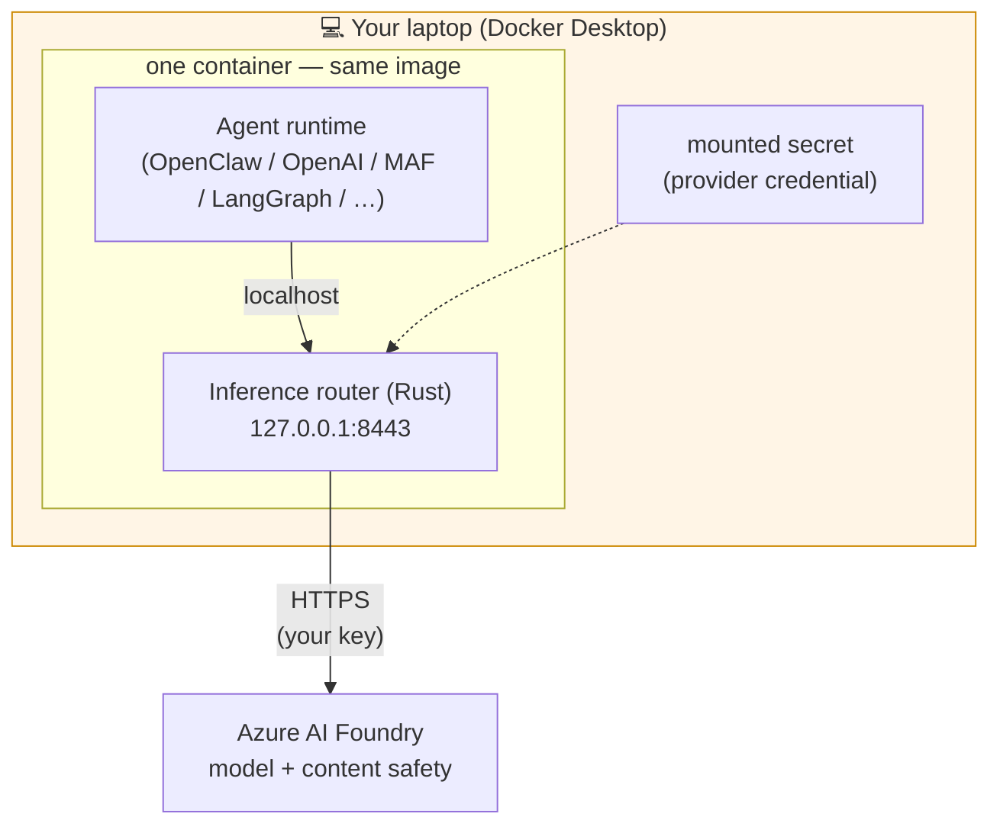
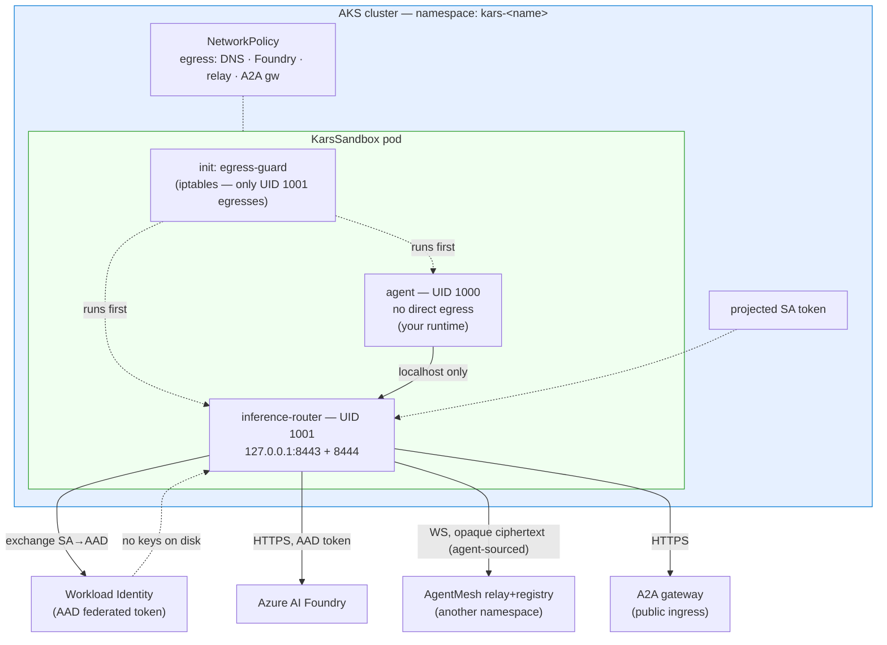
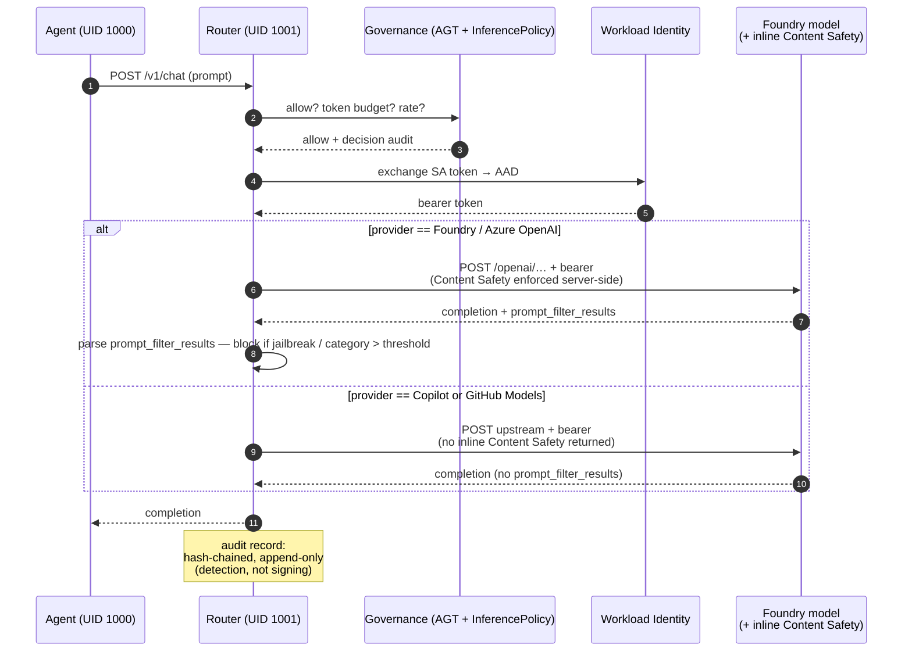
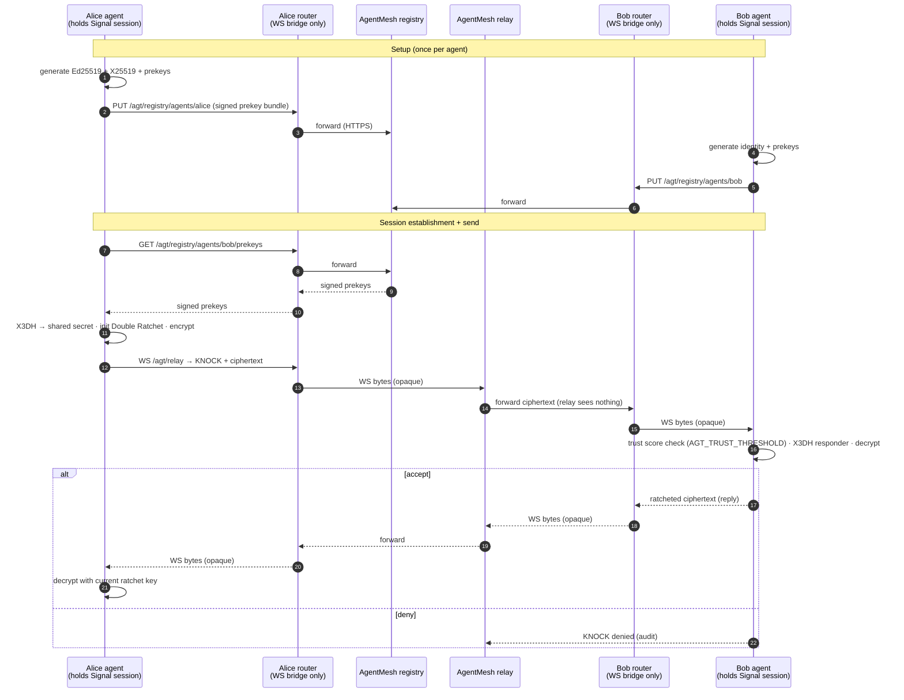
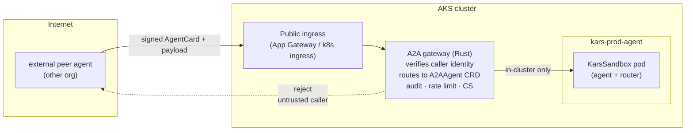
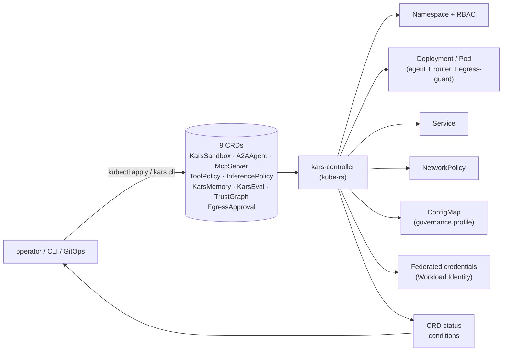
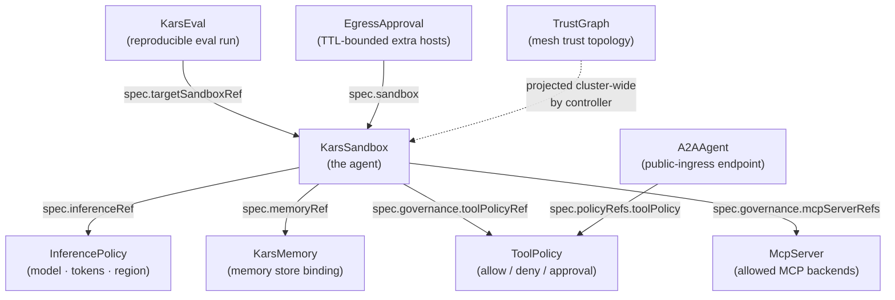
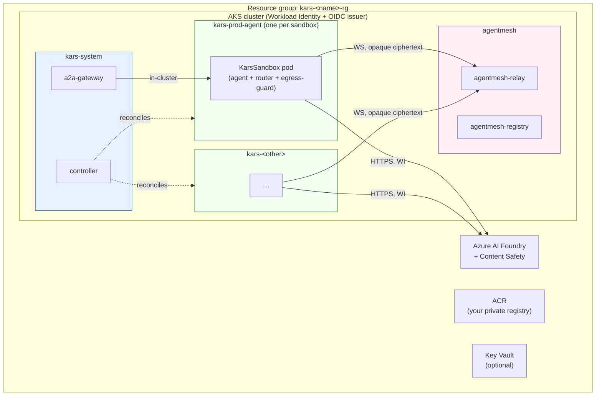
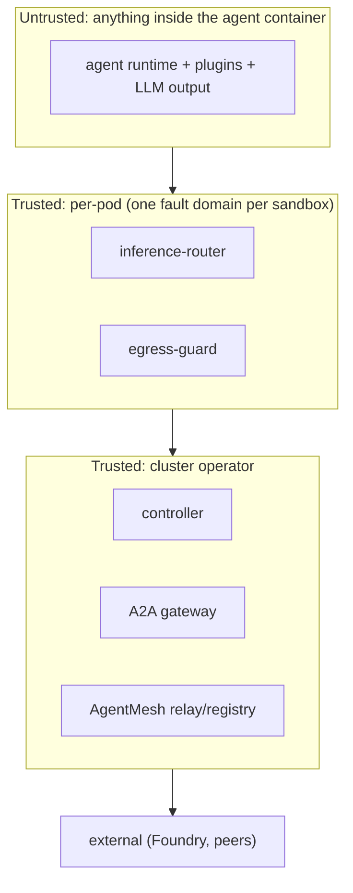

# Architecture diagrams

Every diagram on this page is rendered from Mermaid in the source markdown. The rendered site (mdBook) shows them as SVG; on GitHub they render natively. If you are reading the source, paste any code block into [mermaid.live](https://mermaid.live) for a rendered preview.

For the prose explanation, see **[Architecture](architecture.md)**.

---

## 1. Sandbox pod — dev mode

One container, no network isolation, runs on Docker Desktop.

**What is real:** the router code path, every policy decision, the audit format, the governance profile. **What is not real:** the network isolation — there is no separate process to break out *to*. Treat dev mode as a development surface, not a security surface.

---

## 2. Sandbox pod — prod mode

Multi-container Kubernetes pod, hard egress isolation, Workload Identity.

**Three containers, one rule:** the agent container has no path to the network. Anything labelled `Foundry` / `Mesh` / `A2A` above leaves through the router. iptables (egress-guard) and NetworkPolicy enforce this in two independent layers.

---

## 3. The data path of one model call

What happens when the agent calls the model. Every other external call (web fetch, MCP tool, sub-agent spawn, A2A peer message) follows the same shape with a different policy module.

The agent has no direct path to **Foundry**, **WI**, or the audit
chain. The router brokers all of them. **Content Safety** is enforced
*inside* the Foundry call — the router does **not** make a separate
roundtrip; it parses the `prompt_filter_results` field that Foundry
returns inline and blocks/audits accordingly. On GitHub Copilot and
GitHub Models providers, inline filters are not returned, so this
step is a no-op (documented in `cli-reference.md` under `kars dev`).
The audit record is hash-chained for tamper-*detection*; cryptographic
signing of the chain head is on the roadmap (see [security.md](security.md#the-headline-guarantees)).

---

## 4. The mesh — encrypted inter-agent messaging

Two Kars agents in (possibly) different clusters that need to talk. The Signal-Protocol session (X3DH key agreement, Double Ratchet, KNOCK trust evaluation) lives **entirely inside the agent process** via `@microsoft/agent-governance-sdk`. The router is a transparent WebSocket bridge to the AgentMesh relay — it forwards opaque ciphertext, never holds a session key, and cannot decrypt. The relay is the same: ciphertext in, ciphertext out.

**Session ownership:** the SDK is loaded by the agent's runtime (e.g., `runtimes/openai-agents/.../mesh.py::MeshClient`, the OpenClaw plugin), under UID 1000 in its own container. The router (UID 1001) runs `inference-router/src/routes/mesh.rs::relay_websocket_bridge` — pure byte-shuffling, no crypto. A compromise of the router (or the relay) leaks routing metadata only.

**Forward secrecy:** every message after the first uses a fresh key derived by the Double Ratchet. **Authenticated:** every message carries a libsodium MAC. **Relay-blind:** the relay can route, count, and rate-limit, but cannot read. **Trust-gated:** AGT decides per-peer whether the KNOCK is accepted.

---

## 5. A2A gateway — public-ingress peer traffic

For cross-organisation peers that are not in your AgentMesh.

The A2A gateway is the only inbound public surface. Every request gets the same content-safety, rate-limit, and audit treatment as outbound traffic.

> **Verifier status.** Today caller identity is established via the `X-A2A-Agent-Subject` header set by the upstream mTLS layer; AgentCard signature verification (`kars_a2a_core::verify_inbound_card`) ships as a library and is unit-tested, but wiring it as an axum layer inside the gateway is tracked in the [roadmap](roadmap.md). See [A2A gateway](architecture/a2a-gateway.md).

---

## 6. Control plane — what the controller does

The controller is a vanilla kube-rs reconciler. It owns the nine user-facing CRDs (plus the controller-internal `KarsPairing`), watches them, and produces the boring Kubernetes objects that make a sandbox real. The CRD `status.conditions` chain is the operator-facing source of truth; every condition is documented in **[`docs/api/conditions.md`](api/conditions.md)**.

---

## 7. CRD relationships

How the nine CRDs reference each other. Arrow labels show the **actual** field path on the spec (camelCase as serialized).

`KarsSandbox` is the unit of work; the other CRDs bind policy, identity, peers, evaluation, or break-glass egress to it. You can build a complete deployment with just `KarsSandbox` + `ToolPolicy` + `InferencePolicy`; the rest are opt-in for richer scenarios.

`TrustGraph` is the one cluster-scoped CRD: the controller projects its edges into every sandbox namespace as a ConfigMap (`/etc/kars/trustgraph/graph.json`). It is not referenced by name from a `KarsSandbox` spec — it applies cluster-wide. **Router-side mesh-admission gating** against the projected graph (refuse to bridge a WS for an edge not in the graph) is tracked in the [roadmap](roadmap.md). This is not KNOCK gating — KNOCK lives inside the Signal session the agent owns end-to-end and the router never sees it. Today the router keeps a post-decision trust-score map populated from KNOCK outcomes the agent reports out-of-band, for audit and rate-limit purposes only (see CRD reference §TrustGraph).

Schema details in **[`docs/api/crd-reference.md`](api/crd-reference.md)**.

---

## 8. Cluster topology — what `kars up` produces

**Three classes of namespace:** `kars-system` (the control plane, one per cluster), `agentmesh` (the relay/registry, one per cluster), and one tenant namespace per `KarsSandbox`. NetworkPolicy isolates them; the controller has Cluster-scoped RBAC; everything else is namespace-scoped.

---

## 9. Trust boundaries

Where each layer's authority ends.

We treat the agent as **adversarial** — anything that comes out of the model could be a prompt-injection payload, a plugin could be malicious, a sub-agent spawn could be hostile. The router is the trust boundary: it does not run model output; it enforces policy *on* model output. Every class of bug above the line is a security bug; bugs in the agent runtime are availability bugs.

---

## See also

- **[Architecture](architecture.md)** — the prose explanation.
- **[Security model](security.md)** — per-layer guarantees.
- **[STRIDE threat model](security/stride.md)**.
- **[Blueprints](blueprints/00-index.md)** — five reference deployment shapes built from these primitives.
