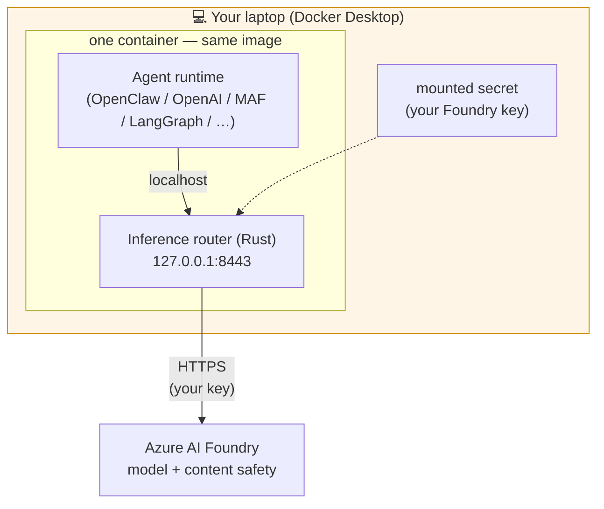
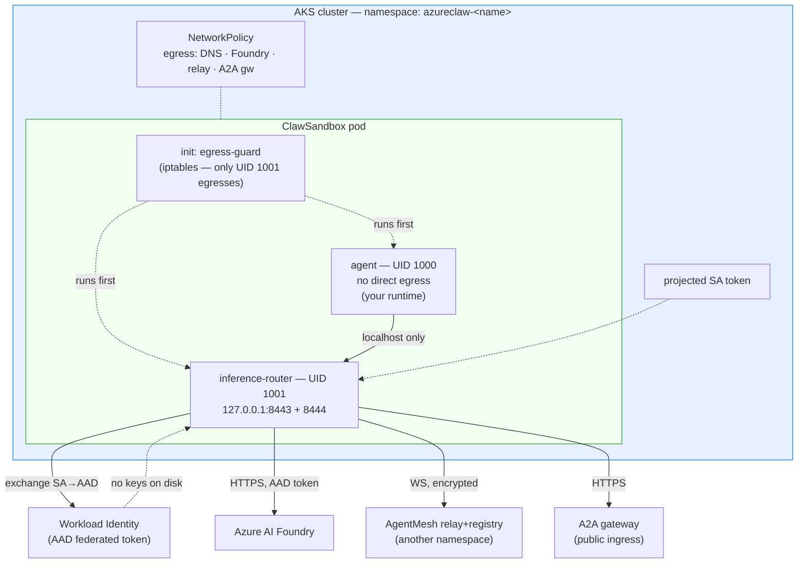
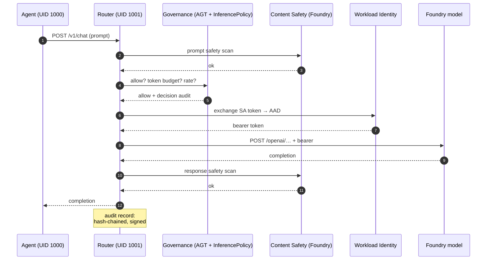
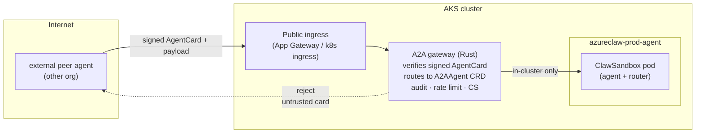
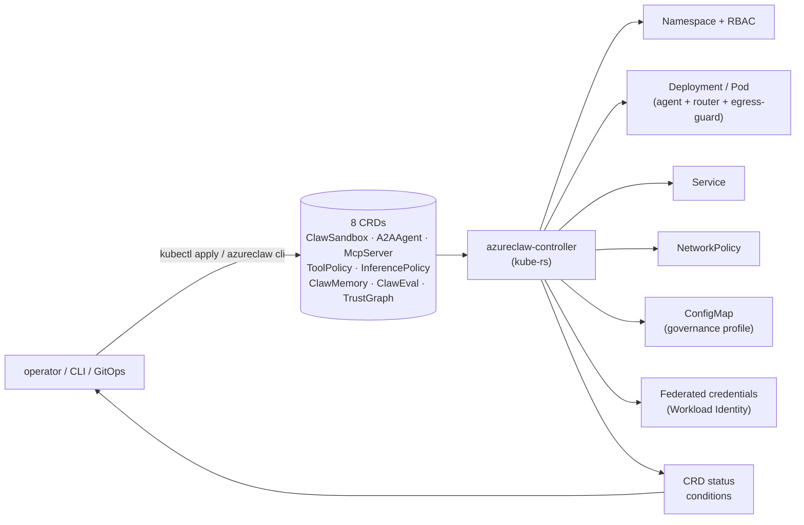
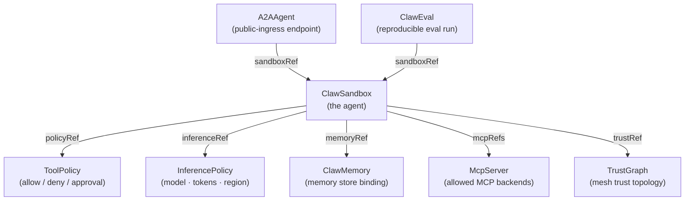
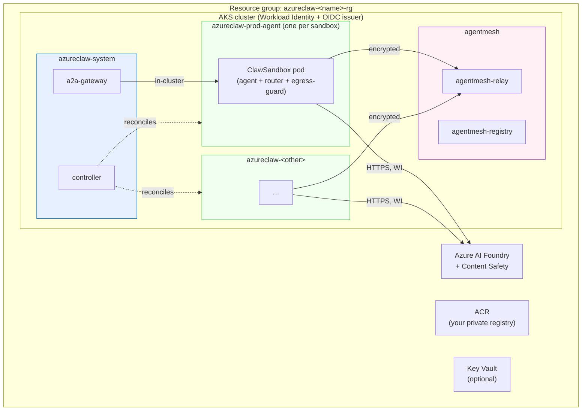
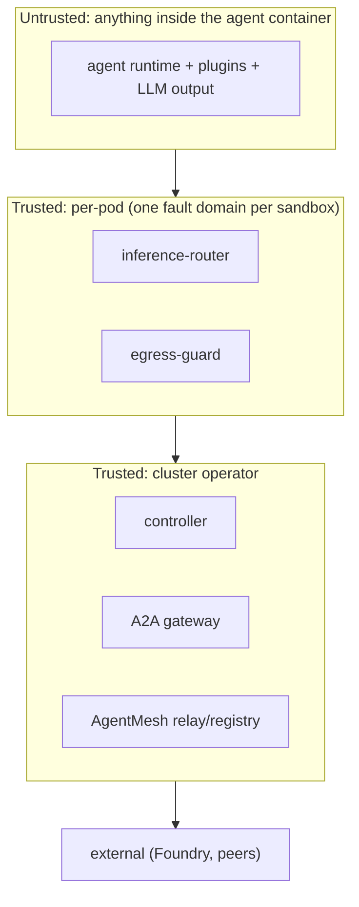

# Architecture diagrams

Every diagram on this page is rendered from Mermaid in the source markdown. The rendered site (mdBook) shows them as SVG; on GitHub they render natively. If you are reading the source, paste any code block into [mermaid.live](https://mermaid.live) for a rendered preview.

For the prose explanation, see **[Architecture](architecture.md)**.

---

## 1. Sandbox pod — dev mode

One container, no network isolation, runs on Docker Desktop.

**What is real:** the router code path, every policy decision, the audit format, the governance profile. **What is not real:** the network isolation — there is no separate process to break out *to*. Treat dev mode as a development surface, not a security surface.

---

## 2. Sandbox pod — prod mode

Multi-container Kubernetes pod, hard egress isolation, Workload Identity.

**Three containers, one rule:** the agent container has no path to the network. Anything labelled `Foundry` / `Mesh` / `A2A` above leaves through the router. iptables (egress-guard) and NetworkPolicy enforce this in two independent layers.

---

## 3. The data path of one model call

What happens when the agent calls the model. Every other external call (web fetch, MCP tool, sub-agent spawn, A2A peer message) follows the same shape with a different policy module.

The agent has no direct path to **Foundry**, **WI**, **CS**, or the audit chain. The router brokers all of them.

---

## 4. The mesh — encrypted inter-agent messaging

Two AzureClaw agents in (possibly) different clusters that need to talk.

```mermaid
sequenceDiagram
  autonumber
  participant A as Alice agent
  participant Ar as Alice router
  participant Reg as AgentMesh registry
  participant Rel as AgentMesh relay
  participant Br as Bob router
  participant B as Bob agent

  Note over A,B: Setup (once per agent)
  A->>Ar: register identity + prekeys
  Ar->>Reg: PUT /agents/alice (Ed25519 sig)
  B->>Br: register identity + prekeys
  Br->>Reg: PUT /agents/bob

  Note over A,B: Session
  A->>Ar: send msg → bob
  Ar->>Reg: GET /agents/bob/prekeys
  Reg-->>Ar: signed prekeys
  Ar->>Ar: X3DH → shared secret
  Ar->>Rel: KNOCK + ciphertext (E2E)
  Rel->>Br: forward ciphertext (relay sees nothing)
  Br->>Br: trust score check (AGT_TRUST_THRESHOLD)
  alt accept
    Br->>B: deliver plaintext
    B-->>Br: reply
    Br->>Rel: ratcheted ciphertext
    Rel->>Ar: forward
    Ar-->>A: plaintext reply
  else deny
    Br-->>Rel: KNOCK denied (audit)
  end
```

**Forward secrecy:** every message after the first uses a fresh key derived by the Double Ratchet. **Authenticated:** every message carries a libsodium MAC. **Relay-blind:** the relay can route, count, and rate-limit, but cannot read. **Trust-gated:** AGT decides per-peer whether the KNOCK is accepted.

---

## 5. A2A gateway — public-ingress peer traffic

For cross-organisation peers that are not in your AgentMesh.

The A2A gateway is the only inbound public surface. Every request must carry a signed `AgentCard` that the gateway verifies against a configured trust anchor; every request gets the same content-safety / rate-limit treatment as outbound traffic.

---

## 6. Control plane — what the controller does

The controller is a vanilla kube-rs reconciler. It owns the eight CRDs, watches them, and produces the boring Kubernetes objects that make a sandbox real. The CRD `status.conditions` chain is the operator-facing source of truth; every condition is documented in **[`docs/api/conditions.md`](api/conditions.md)**.

---

## 7. CRD relationships

How the eight CRDs reference each other.

`ClawSandbox` is the unit of work; the other seven CRDs bind policy, identity, peers, or evaluation to it. You can build a complete deployment with just `ClawSandbox` + `ToolPolicy` + `InferencePolicy`; the rest are opt-in for richer scenarios.

Schema details in **[`docs/api/crd-reference.md`](api/crd-reference.md)**.

---

## 8. Cluster topology — what `azureclaw up` produces

**Three classes of namespace:** `azureclaw-system` (the control plane, one per cluster), `agentmesh` (the relay/registry, one per cluster), and one tenant namespace per `ClawSandbox`. NetworkPolicy isolates them; the controller has Cluster-scoped RBAC; everything else is namespace-scoped.

---

## 9. Trust boundaries

Where each layer's authority ends.

We treat the agent as **adversarial** — anything that comes out of the model could be a prompt-injection payload, a plugin could be malicious, a sub-agent spawn could be hostile. The router is the trust boundary: it does not run model output; it enforces policy *on* model output. Every class of bug above the line is a security bug; bugs in the agent runtime are availability bugs.

---

## See also

- **[Architecture](architecture.md)** — the prose explanation.
- **[Security model](security.md)** — per-layer guarantees.
- **[STRIDE threat model](security/stride.md)**.
- **[Blueprints](blueprints/00-index.md)** — five reference deployment shapes built from these primitives.
