# AzureClaw — Architecture & Flow Diagrams

Visual reference for AzureClaw's core flows: sandbox architecture, agent lifecycle, inter-agent communication, inference routing, and egress control.

---

## 1. Sandbox Pod Architecture

The fundamental building block — every agent runs in this pod structure.

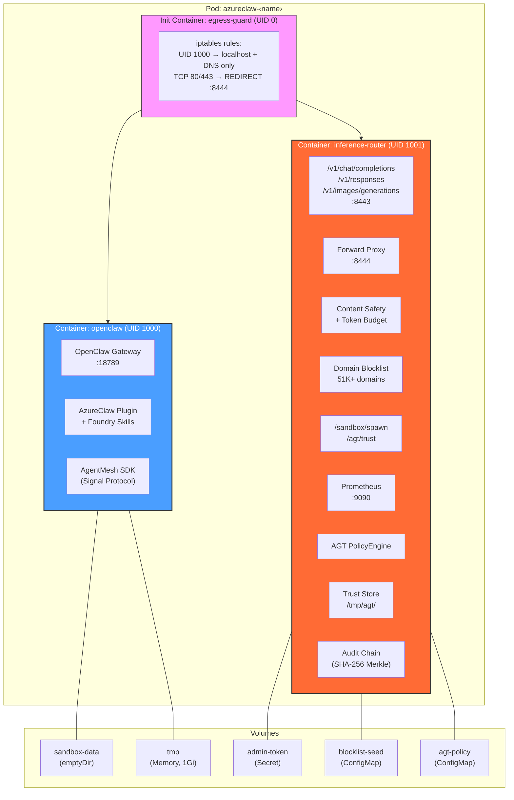

### Network Access Matrix

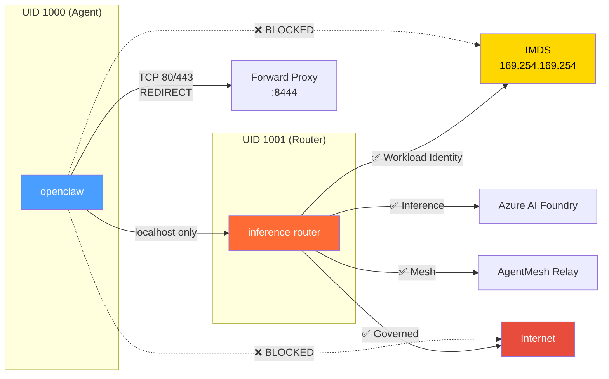

---

## 2. Agent Creation Flow (`azureclaw add`)

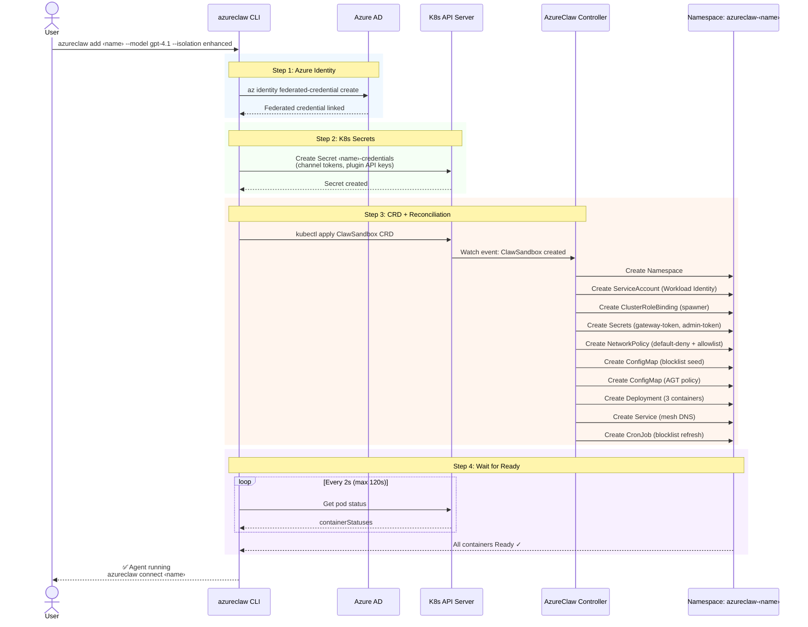

---

## 3. Controller Reconciliation — Resources Created

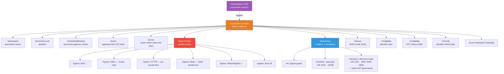

---

## 4. Sub-Agent Spawn Flow

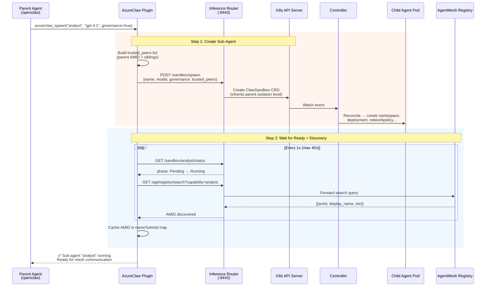

---

## 5. E2E Encrypted Agent-to-Agent Communication

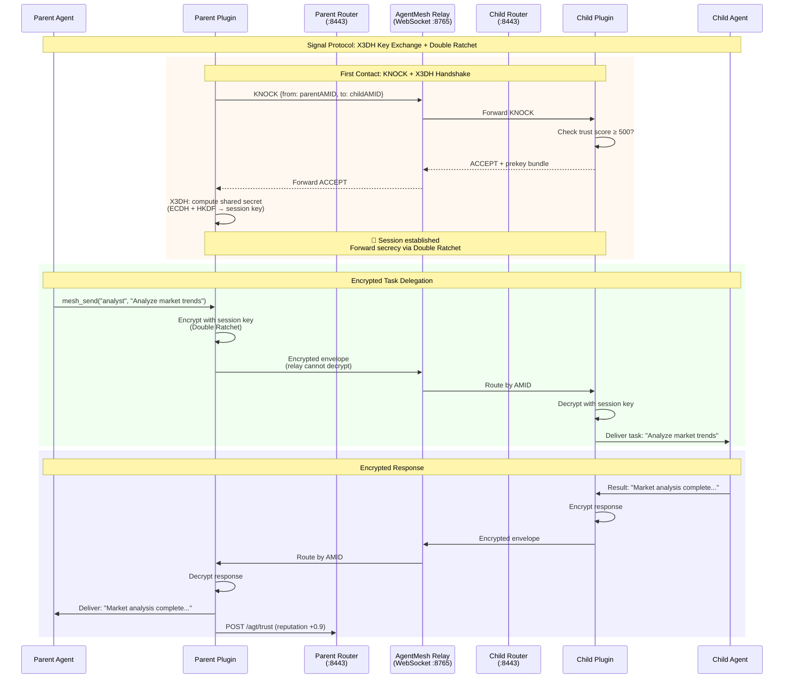

### Trust Gate Decision Flow

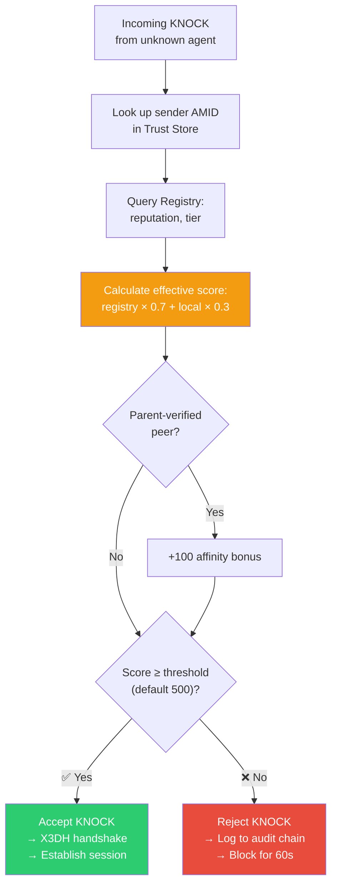

---

## 6. Inference Request Flow

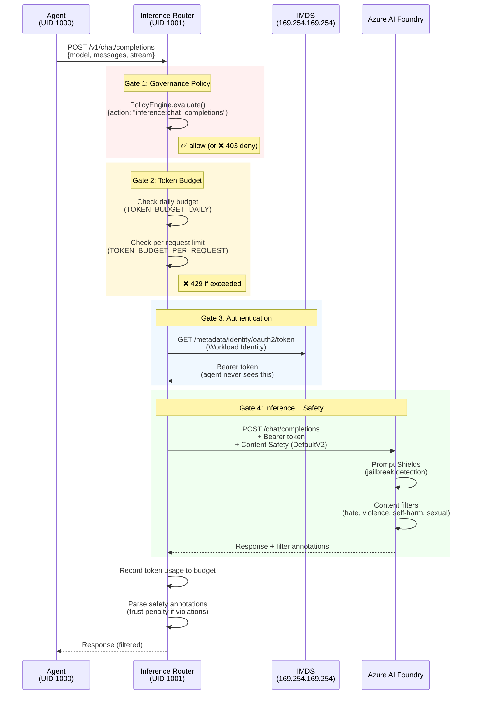

---

## 7. Egress Control Flow

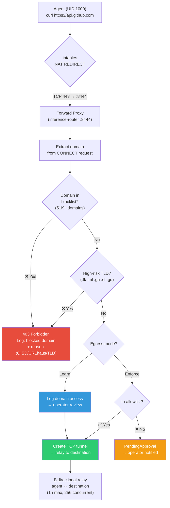

### Learn → Enforce Lifecycle

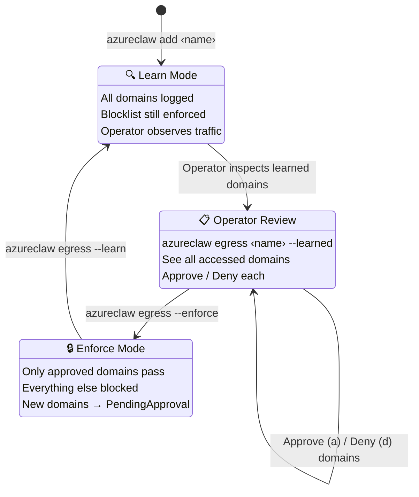

---

## 8. Full Deployment Flow (`azureclaw up`)

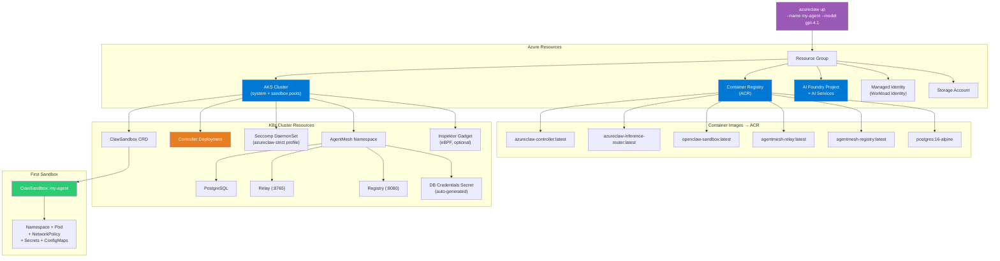

---

## 9. Multi-Agent Topology

What a production mesh looks like with parent + sub-agents.

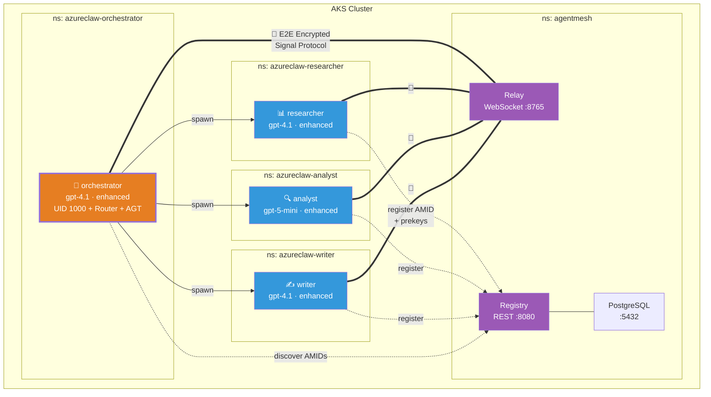

---

## 10. Defense-in-Depth Layers

```mermaid
graph TB
    subgraph L0["Layer 0: Azure Infrastructure"]
        AKS_SEC["AKS API IP restriction<br/>NSG · DDoS Protection"]
    end

    subgraph L1["Layer 1: Node OS"]
        OS["Azure Linux<br/>SELinux enforcing"]
    end

    subgraph L2["Layer 2: VM Isolation (optional)"]
        KATA["Kata Containers<br/>Cloud Hypervisor<br/>AMD SEV-SNP"]
    end

    subgraph L3["Layer 3: Container Hardening"]
        CH["Read-only rootfs<br/>Non-root (UID 1000)<br/>Drop ALL capabilities"]
    end

    subgraph L4["Layer 4: Kernel Confinement"]
        SECC["Seccomp: 175 allowed syscalls<br/>Blocks: ptrace, mount, bpf,<br/>unshare, kexec, chroot"]
    end

    subgraph L5["Layer 5: Network Segmentation"]
        NET["iptables UID guard<br/>NetworkPolicy per-namespace<br/>Forward proxy + blocklist"]
    end

    subgraph L6["Layer 6: Inference Safety"]
        INF["Content Safety (every call)<br/>Prompt Shields (jailbreak)<br/>Token budgets (daily + per-req)"]
    end

    subgraph L7["Layer 7: Zero Credentials"]
        CRED["Workload Identity via router<br/>Agent never sees tokens<br/>IMDS blocked for agent"]
    end

    subgraph L8["Layer 8: E2E Encryption"]
        E2E["Signal Protocol (X3DH + Ratchet)<br/>Trust-gated messaging<br/>Untrusted relay"]
    end

    subgraph L9["Layer 9: Behavioral Governance"]
        GOV["AGT policy evaluation<br/>Dynamic trust scoring<br/>Tamper-evident audit chain"]
    end

    L0 --> L1 --> L2 --> L3 --> L4 --> L5 --> L6 --> L7 --> L8 --> L9

    style L0 fill:#ecf0f1,stroke:#bdc3c7
    style L1 fill:#dfe6e9,stroke:#b2bec3
    style L2 fill:#ffeaa7,stroke:#fdcb6e
    style L3 fill:#fab1a0,stroke:#e17055
    style L4 fill:#ff7675,stroke:#d63031
    style L5 fill:#fd79a8,stroke:#e84393
    style L6 fill:#a29bfe,stroke:#6c5ce7
    style L7 fill:#74b9ff,stroke:#0984e3
    style L8 fill:#55efc4,stroke:#00b894
    style L9 fill:#81ecec,stroke:#00cec9
```
