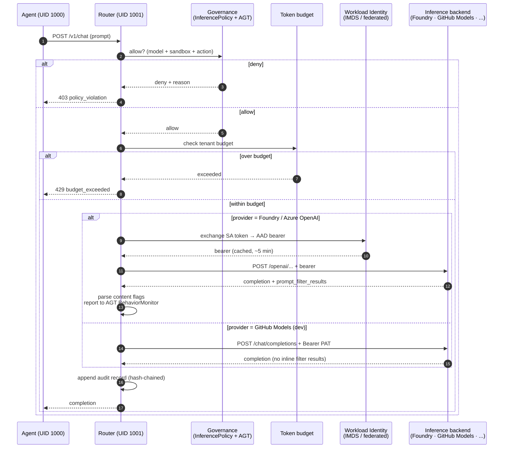

# Architecture

This document explains *what AzureClaw is made of* and *why each part exists*. For diagrams, see **[Architecture diagrams](architecture-diagrams.md)**. For a faster on-ramp, see **[Getting started](getting-started.md)**.

## Design goals (in priority order)

1. **The agent must not see Azure credentials.** Compromise of any agent must not grant access to the Azure subscription.
2. **Every external call must pass a policy decision point.** No invisible side effects, no silent network egress.
3. **Inter-agent communication must be confidential, authenticated, and forward-secret.** No plaintext fallback.
4. **The same code path runs in dev and in prod.** Local mode is *easier*, not *different*.
5. **Operability over cleverness.** Standard Kubernetes primitives (CRDs, NetworkPolicies, RBAC, Helm) so platform teams can operate AzureClaw the way they operate the rest of the cluster.

Everything below follows from those five.

---

## Components

AzureClaw has four code components, two languages, and one rule that ties them together.

| Component | Language | Crate / package | Responsibility |
|---|---|---|---|
| **Controller** | Rust (kube-rs) | `azureclaw-controller` | Watches `ClawSandbox` and the seven peer CRDs; reconciles them into namespaces, pods, services, NetworkPolicies, ConfigMaps, federated identities. |
| **Inference router** | Rust (axum) | `azureclaw-inference-router` | Sits in the data path of every external call. Identity, content safety, governance, audit, mesh, A2A — all of it. |
| **A2A gateway** | Rust (axum) | `azureclaw-a2a-gateway` + `azureclaw-a2a-core` | Public-ingress entry point for A2A 1.2 peer traffic. Verifies signed `AgentCard`s, routes to the correct sandbox, emits audit. |
| **CLI** | TypeScript | `@azureclaw/cli` | Lifecycle of clusters, sandboxes, policies. 26 commands. The CLI is convenience; everything it does is achievable with `az` + `helm` + `kubectl`. |

The rule that ties them together: **the agent has no network of its own**. The router is the only process in the sandbox pod that can talk to the outside. Every other property of AzureClaw is a downstream consequence of holding that line.

---

## Two modes

`azureclaw dev` and `azureclaw up` produce sandboxes that are observably the same to the agent code, but architecturally very different to a security reviewer.

### Dev mode (`azureclaw dev`)

- **Pod shape:** one Docker container.
- **Inside:** the agent runtime and the inference router are co-located in the same image. They communicate over `127.0.0.1`.
- **Isolation:** Docker network. Mounted secret file holds the resource-level Azure OpenAI key. No iptables, no NetworkPolicy, no UID separation.
- **Identity:** key-based (the key you provided on first run).
- **What it is for:** plugin authoring, policy iteration, smoke tests, demos. Inner loop only.

The router still runs the same code path it does in prod. So the policies, the content-safety rejections, the audit format, the governance decisions are all real. What is not real is the network and identity isolation — there is no separate router process to break out *to*. Treat dev mode as a development surface, not a security surface.

### Prod mode (`azureclaw up` / Helm install)

- **Pod shape:** multi-container Kubernetes pod.
  - `init: egress-guard` — installs iptables rules so only the router's UID can reach the outside.
  - `agent` — the runtime, **UID 1000**, no direct egress.
  - `inference-router` — the Rust router, **UID 1001**, listens on `127.0.0.1:8443` (HTTP) and `127.0.0.1:8444` (forward proxy).
- **Isolation:** Kubernetes NetworkPolicy on the namespace pins egress to exactly DNS, Foundry, the AgentMesh relay, and the A2A gateway. Optionally Kata + AMD SEV-SNP for hardware-enforced isolation.
- **Identity:** Workload Identity. The router exchanges the projected service-account token for a federated AAD token. No keys on disk.
- **What it is for:** real workloads, multi-tenant fleets, anything that touches customer data.

Whichever mode you run in, the CRDs are the same, the audit chain is the same, and the policy profiles are the same. The dev → prod jump is one CLI command, not a re-architecture.

---

## The data path of one external call

Walk through what happens when an agent in prod mode says *"call the model"*:

In prose:

1. The agent SDK is configured (by the runtime adapter) to point at `http://127.0.0.1:8443`. There is no way for it to reach the model directly — `egress-guard` would drop the packet.
2. The router receives the request. It asks the **governance** layer (`InferencePolicy` + AGT `PolicyDecisionProvider`) whether this call is allowed. Deny → 403.
3. It checks the **token budget** for the tenant. Over → 429.
4. It branches by provider (read from `~/.azureclaw/config.json` → `provider`):
   - **Foundry / Azure OpenAI** (default, full feature set): mints a **Workload Identity** AAD token (or uses a resource-level API key in dev), forwards to Foundry. **Content Safety is enforced by Foundry's DefaultV2 guardrails inline** — the router does not make a separate Content Safety call. The Foundry response carries `prompt_filter_results` annotations; the router parses them and reports flags to AGT's `BehaviorMonitor`.
   - **GitHub Models** (dev mode, free tier): forwards `Authorization: Bearer <PAT>` directly to `https://models.github.ai/inference`. GitHub Models doesn't return `prompt_filter_results`, so inline Content Safety isn't enforced — see [security.md → What we do *not* defend against](security.md#what-we-do-not-defend-against). Foundry-only routes (Memory Store, agents, evaluations, indexes) return clean 501.
5. The router appends an **audit record** — prompt-fingerprint, model, tokens-in / tokens-out, decision, latency — hash-chained to the previous record so tampering is detectable.
6. The router returns to the agent.

> **More providers later.** GitHub Models is the second backend wired in. Adding more (Anthropic, Bedrock, AWS Q, third-party OpenAI-compatible gateways) is mostly a matter of an endpoint+auth recipe in `inference-router/src/proxy.rs::build_upstream_url` plus a CLI prompt branch. We're tracking provider-expansion through GitHub issues — please open a feature request describing the provider, auth model, and which Foundry-only features (if any) you'd want preserved.

Every other external call (web fetch, MCP tool, sub-agent spawn, A2A peer message) goes through the same shape with a different policy module. Code: `inference-router/src/routes/chat_completions.rs:27-100`.

---

## The mesh

Inter-agent communication is **end-to-end encrypted**. Two agents that want to talk:

1. Each agent registers identity (Ed25519 sign, X25519 KEX) and uploads signed prekeys to the AgentMesh registry.
2. The initiator looks up the peer in the registry, fetches its prekeys, runs **X3DH** to derive a shared secret.
3. The initiator sends a **KNOCK** to the peer. The peer's router evaluates trust score against `AGT_TRUST_THRESHOLD`. If the peer is below threshold, the KNOCK is denied (audited).
4. On accept, both sides advance the **Double Ratchet**. Every subsequent message is encrypted with a fresh key (forward secrecy) and authenticated.
5. The relay sees only opaque ciphertext blobs and addressing metadata. It cannot read messages and cannot impersonate either party.

The relay and registry are operated by AzureClaw (`agentmesh` namespace, two small services). They are not trusted with content. The cryptographic primitives are libsodium / Signal Protocol; we vendor a small forked SDK with eight bug-fix patches documented in `vendor/`.

See **[`docs/architecture/agt-boundary.md`](architecture/agt-boundary.md)** for what AGT enforces vs what AzureClaw enforces.

---

## The A2A gateway

A2A (Agent-to-Agent, 1.2) is the public-ingress sibling of the mesh. Where the mesh handles intra-fleet traffic with strong cryptographic guarantees, the A2A gateway handles **cross-organisation** traffic where the peer is not part of your AgentMesh.

- **Public ingress** (Azure-managed Kubernetes ingress / Application Gateway).
- Every inbound request must carry a signed **`AgentCard`** that the gateway verifies against a configured trust anchor.
- The gateway routes to the right `A2AAgent` CRD (which binds the public name to a sandbox + policy).
- Audit, rate limiting, content safety run on the gateway.

Two separate channels for two separate trust models. See **[`docs/architecture/a2a-gateway.md`](architecture/a2a-gateway.md)**.

---

## CRDs as the API

You operate AzureClaw by writing eight CRDs, not by clicking through a dashboard. The full schema is in **[`docs/api/crd-reference.md`](api/crd-reference.md)**; the role of each is summarised in the README. The important property: every component (controller, router, gateway, CLI, operator TUI) reads the same source of truth. There is no separate config store.

The CRDs are at `v1alpha1` for `v1.0.0`. The stability contract — what we promise to keep working, what we may change, and how we will migrate — is in **[`docs/api/backwards-compatibility.md`](api/backwards-compatibility.md)** and **[`docs/architecture/crd-versioning.md`](architecture/crd-versioning.md)**.

---

## The boring parts that matter

- **Image tags are always `:latest` in source.** Pinning happens at install time via Helm values or env vars (e.g. `MAF_RUNTIME_IMAGE`). Earlier versions of the project drifted across version tags `v11`–`v25`; we chose convention over per-tag pins to make the tag mismatch class of bug impossible.
- **The controller default-image lookup is centralised** in `controller/src/reconciler/runtime.rs`. Adding a new runtime is one match arm and one default-image function. The CRD enum is the source of truth for which runtimes exist.
- **The router does not depend on the Azure SDK.** All Azure calls (IMDS, Workload Identity exchange, Foundry, Content Safety) are direct REST. This keeps the router's dependency surface small and its build deterministic.
- **No OpenClaw source is patched.** The OpenClaw integration uses the public plugin API and `tools.deny` config only. Any upstream OpenClaw release is drop-in compatible. See **[Upstream alignment](upstream-alignment.md)**.

---

## Where to go next

- **[Architecture diagrams](architecture-diagrams.md)** — the same content, rendered.
- **[Security model](security.md)** — what each layer enforces.
- **[Blueprints](blueprints/00-index.md)** — five reference deployment shapes.
- **[CRD reference](api/crd-reference.md)** — the operator's API.
