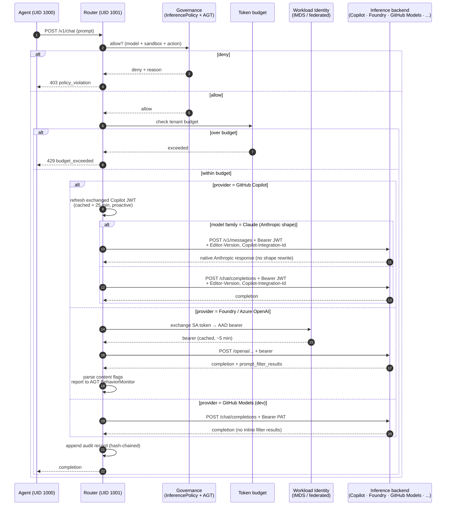

# Architecture

This document explains *what AzureClaw is made of* and *why each part exists*. For diagrams, see **[Architecture diagrams](architecture-diagrams.md)**. For a faster on-ramp, see **[Getting started](getting-started.md)**.

## Design goals (in priority order)

1. **The agent must not see Azure credentials in production.** In AKS mode the agent runs under a different UID than the router; only the router holds the Foundry credential. Compromise of any agent must not grant access to the Azure subscription. (`azureclaw dev` co-locates agent + router in one container for inner-loop work — see [Two modes](#two-modes) for the dev-vs-prod boundary.)
2. **Every external call must pass a policy decision point.** No invisible side effects, no silent network egress.
3. **Inter-agent communication must be confidential, authenticated, and forward-secret.** No plaintext fallback.
4. **The same data-path code runs in dev and in prod.** A small number of code paths branch on `AZURECLAW_DEV_MODE` to swap auth source (static key vs. Workload Identity) and spawn driver (Docker vs. Kubernetes). The router's policy decision points, content-safety parsing, audit format, and governance hooks do not change between modes — local mode is *easier*, not *different*.
5. **Operability over cleverness.** Standard Kubernetes primitives (CRDs, NetworkPolicies, RBAC, Helm) so platform teams can operate AzureClaw the way they operate the rest of the cluster.

Everything below follows from those five.

---

## Components

AzureClaw has four code components, two languages, and one rule that ties them together.

| Component | Language | Crate / package | Responsibility |
|---|---|---|---|
| **Controller** | Rust (kube-rs) | `azureclaw-controller` | Watches `ClawSandbox` and the nine peer CRDs (plus controller-internal `ClawPairing`); reconciles them into namespaces, pods, services, NetworkPolicies, ConfigMaps, federated identities. |
| **Inference router** | Rust (axum) | `azureclaw-inference-router` | Sits in the data path of every external call. Identity, content safety, governance, audit, mesh, A2A — all of it. |
| **A2A gateway** | Rust (axum) | `azureclaw-a2a-gateway` + `azureclaw-a2a-core` | Public-ingress entry point for A2A 1.0.0 peer traffic. Verifies signed `AgentCard`s, routes to the correct sandbox, emits audit. |
| **CLI** | TypeScript | `@azureclaw/cli` | Lifecycle of clusters, sandboxes, policies. 30+ commands. The CLI is convenience; everything it does is achievable with `az` + `helm` + `kubectl`. |

The rule that ties them together: **the agent has no network of its own**. The router is the only process in the sandbox pod that can talk to the outside. Every other property of AzureClaw is a downstream consequence of holding that line.

---

## Two modes

`azureclaw dev` and `azureclaw up` produce sandboxes that are observably the same to the agent code, but architecturally very different to a security reviewer.

### Dev mode (`azureclaw dev`)

- **Pod shape:** one Docker container.
- **Inside:** the agent runtime and the inference router are co-located in the same image. They communicate over `127.0.0.1`.
- **Isolation:** Docker network. Mounted secret file holds the resource-level Azure OpenAI key. No iptables, no NetworkPolicy, no UID separation.
- **Identity:** key-based (the key you provided on first run).
- **What it is for:** plugin authoring, policy iteration, smoke tests, demos. Inner loop only.

The router still runs the same data-path code it does in prod — the request handlers, policy decision points, content-safety parsing, audit format, and governance hooks are all real. What is *different* is the auth source (a static API key or PAT instead of an exchanged Workload-Identity token) and the spawn driver (Docker instead of Kubernetes). A small number of code paths branch on `AZURECLAW_DEV_MODE` to enable those substitutions. What is *not* real is the network and identity isolation — there is no separate router process to break out *to*. Treat dev mode as a development surface, not a security surface.

### Prod mode (`azureclaw up` / Helm install)

- **Pod shape:** multi-container Kubernetes pod.
  - `init: egress-guard` — installs iptables rules so the agent UID can only reach the router on localhost. **Safety net**, not the policy point — the router is.
  - `agent` — the runtime, **UID 1000**, no direct egress.
  - `inference-router` — the Rust router, **UID 1001**. The HTTP listener binds `0.0.0.0:8443` and the forward proxy binds `0.0.0.0:8444`; the egress-guard iptables rules + the NetworkPolicy together pin the only reachable peer for UID 1000 to those two ports on loopback. This is where egress, governance, content-safety, token-budget, and audit are actually enforced.
- **Isolation:** The router enforces the egress allowlist on every outbound request. A Kubernetes NetworkPolicy on the namespace is generated as a **safety net** that limits blast radius if the router process is bypassed or compromised; it pins egress to DNS, Foundry, the AgentMesh relay, and the A2A gateway. Optionally Kata + AMD SEV-SNP for hardware-enforced isolation.
- **Identity:** Workload Identity. The router exchanges the projected service-account token for a federated AAD token. No keys on disk.
- **What it is for:** real workloads, multi-tenant fleets, anything that touches customer data.

Whichever mode you run in, the CRDs are the same, the audit chain is the same, and the policy profiles are the same. The dev → prod jump is one CLI command, not a re-architecture.

---

## The data path of one external call

Walk through what happens when an agent in prod mode says *"call the model"*:

In prose:

1. The agent SDK is configured (by the runtime adapter) to point at `http://127.0.0.1:8443`. The router is the policy point — it decides whether an outbound call is allowed; `egress-guard` iptables and the K8s NetworkPolicy are safety nets that drop the packet only if the router is bypassed.
2. The router receives the request. It asks the **governance** layer (`InferencePolicy` + AGT `PolicyDecisionProvider`) whether this call is allowed. Deny → 403.
3. It checks the **token budget** for the tenant. Over → 429.
4. It branches by provider (read from `~/.azureclaw/config.json` → `provider`):
   - **GitHub Copilot** (default for `azureclaw dev`, full Copilot model catalogue: Claude Opus / Sonnet, GPT-5 / 4.1, Gemini, o-series): the router exchanges the GitHub OAuth token for a short-lived **Copilot JWT** at `https://api.github.com/copilot_internal/v2/token` and proactively refreshes it. Outbound requests carry the static headers Copilot's ingress requires (`Editor-Version`, `Editor-Plugin-Version`, `Copilot-Integration-Id`). For Claude models the router routes natively to `/v1/messages` (Anthropic shape passthrough — no lossy OpenAI-to-Anthropic rewrite, full tool-calling fidelity). For all other models the standard `/chat/completions` path is used. Copilot doesn't return `prompt_filter_results` either, so inline Content Safety isn't enforced — same caveat as GitHub Models.
   - **Foundry / Azure OpenAI** (full feature set, default for AKS): mints a **Workload Identity** AAD token (or uses a resource-level API key in dev), forwards to Foundry. **Content Safety is enforced by Foundry's DefaultV2 guardrails inline** — the router does not make a separate Content Safety call. The Foundry response carries `prompt_filter_results` annotations; the router parses them and reports flags to AGT's `BehaviorMonitor`.
   - **GitHub Models** (dev mode, free tier): forwards `Authorization: Bearer <PAT>` directly to `https://models.github.ai/inference`. GitHub Models doesn't return `prompt_filter_results`, so inline Content Safety isn't enforced — see [security.md → What we do *not* defend against](security.md#what-we-do-not-defend-against). Foundry-only routes (Memory Store, agents, evaluations, indexes) return clean 501.
5. The router appends an **audit record** — prompt-fingerprint, model, tokens-in / tokens-out, decision, latency — hash-chained to the previous record so tampering is detectable.
6. The router returns to the agent.

> **Sub-agent inheritance.** When a parent spawns a sub-agent (`/sandbox/spawn`), the router propagates `OPENCLAW_MODEL`, `AZURECLAW_PROVIDER`, the upstream endpoint, and the auth credential (Copilot OAuth token or PAT) into the new container's environment. The child uses the same provider + model + credentials as its parent without per-spawn wiring.

> **More providers later.** Copilot, Foundry, and GitHub Models are the three backends wired in today. Adding more (direct Anthropic, Bedrock, AWS Q, third-party OpenAI-compatible gateways) is mostly a matter of an endpoint+auth recipe in `inference-router/src/proxy.rs::build_upstream_url` plus a CLI prompt branch. We're tracking provider-expansion through GitHub issues — please open a feature request describing the provider, auth model, and which Foundry-only features (if any) you'd want preserved.

Every other external call (web fetch, MCP tool, sub-agent spawn, A2A peer message) goes through the same shape with a different policy module. Code: `inference-router/src/routes/chat_completions.rs:27-100`.

---

## The mesh

Inter-agent communication is **end-to-end encrypted**. Two agents that want to talk:

1. Each agent registers identity (Ed25519 sign, X25519 KEX) and uploads signed prekeys to the AgentMesh registry.
2. The initiator looks up the peer in the registry, fetches its prekeys, runs **X3DH** to derive a shared secret.
3. The initiator sends a **KNOCK** to the peer. The peer's **agent** (via `@microsoft/agent-governance-sdk` running plugin-side, *not* the router) evaluates trust score against `AGT_TRUST_THRESHOLD`. If the peer is below threshold, the KNOCK is denied (audited).
4. On accept, both sides advance the **Double Ratchet**. Every subsequent message is encrypted with a fresh key (forward secrecy) and authenticated.
5. The relay sees only opaque ciphertext blobs and addressing metadata. It cannot read messages and cannot impersonate either party.

The relay and registry are operated by AzureClaw (`agentmesh` namespace, two small services). They are not trusted with content. The cryptographic primitives are libsodium / Signal Protocol. **The Signal session is owned by the agent process** — the OpenClaw plugin layer (and every other supported runtime) installs `@microsoft/agent-governance-sdk` from npm at sandbox-image build time and runs X3DH / Double Ratchet / KNOCK inside the sandbox container (UID 1000). The inference router links the [`agentmesh`](https://crates.io/crates/agentmesh) crate from crates.io only for shared governance primitives (`AuditLogger`, `PolicyEngine`, `TrustManager`, MCP rate-limit / redactor) — it holds **no** Signal session keys, performs **no** encryption or decryption, and merely WebSocket-bridges opaque ciphertext between the agent and the relay. There is no in-tree fork of either SDK.

> **Multi-agent peer roster.** When an agent spawns more than one sub-agent (each with a `role` — e.g. `data analyst`, `visualization engineer`, `technical writer`), the OpenClaw runtime maintains a **peer roster** of canonical names + roles and **automatically prepends a `Peer roster:` block** to every outbound `mesh_send` / `mesh_transfer_file` once two or more siblings exist. Sub-agents that need to hand work to each other ("send the chart to viz", "deliver the brief to the writer") resolve role references against this roster instead of guessing names — eliminating misroute bugs in pipelines like `analyst → viz → writer`. The roster is built deterministically from spawn metadata; `azureclaw_spawn` rejects sub-agents without a `role` parameter when more than one sibling will exist. Implementation: `runtimes/openclaw/src/core/agt-tools/agt.ts` (roster maintenance + auto-prepend), `runtimes/openclaw/skills/azureclaw-spawn/SKILL.md` (agent-facing contract).

See **[`docs/architecture/agt-boundary.md`](architecture/agt-boundary.md)** for what AGT enforces vs what AzureClaw enforces.

---

## The A2A gateway

A2A (Agent-to-Agent, 1.0.0) is the public-ingress sibling of the mesh. Where the mesh handles intra-fleet traffic with strong cryptographic guarantees, the A2A gateway handles **cross-organisation** traffic where the peer is not part of your AgentMesh.

- **Public ingress** (Azure-managed Kubernetes ingress / Application Gateway).
- Every inbound request carries a signed **`AgentCard`** and is rejected if the caller's identity is not trusted. Today identity is established via the `X-A2A-Agent-Subject` header set by the upstream mTLS layer; the in-axum `AgentCard` signature verifier ships as a library (`azureclaw_a2a_core::verify_inbound_card`, unit-tested) and is tracked in the [roadmap](roadmap.md) to be wired into the gateway request path.
- The gateway routes to the right `A2AAgent` CRD (which binds the public name to a sandbox + policy).
- Audit, rate limiting, content safety run on the gateway.

Two separate channels for two separate trust models. See **[`docs/architecture/a2a-gateway.md`](architecture/a2a-gateway.md)**.

---

## CRDs as the API

You operate AzureClaw by writing CRDs, not by clicking through a dashboard or
editing a private config store. The full schema lives in
**[`docs/api/crd-reference.md`](api/crd-reference.md)**. This section answers
the question we get every time: *why nine CRDs and not one?*

### The principle: separate concerns that change at different rates

A CRD makes sense when it represents a thing that

1. has its own lifecycle (created / updated / deleted at different times than
   the agent),
2. is **referenced by name** from somewhere else (so giving it an identity is
   cheaper than copy-pasting its body), or
3. is **owned by a different team** than the agent author (platform team,
   security team, ops team).

Anything that fails all three tests is a `ClawSandbox` field, not its own CRD.

### The nine CRDs and what each one buys you

| CRD | Owner / changes-with | What you'd give up if it were a `ClawSandbox` field |
|---|---|---|
| **`ClawSandbox`** | Agent author. Changes per agent. | (this *is* the agent — every other CRD is a reference into it) |
| **`InferencePolicy`** | Platform / FinOps. Changes per quarter. | Every team would copy model / region / budget into every agent; rotating an OpenAI deployment or shifting traffic to a cheaper model would mean editing every `ClawSandbox`. |
| **`ToolPolicy`** | Security team. Changes per audit. | A central "tool X is approval-only" rule could not exist. Each agent would carry its own copy and security would have no enforcement seam. |
| **`McpServer`** | Plugin owner. One per backend. | An MCP server URL + auth would be inlined into every agent that uses it. Rotating the URL means editing N sandboxes and racing the rollouts. |
| **`A2AAgent`** | The agent itself, but the **public-ingress identity** has its own lifecycle (TLS cert, public route, rate-limit, agent-card). | The Kubernetes `Service` / cert / ingress wiring would be tangled into the agent CRD. With `A2AAgent` separate, the agent can come and go while the public endpoint and its trust anchors stay stable. |
| **`ClawMemory`** | Whoever owns the memory store. Outlives the agent. | Memory bindings would die with each agent restart; cross-agent memory sharing would require duplicating store IDs in every sandbox. |
| **`ClawEval`** | Eval / QA. Run on demand. | Eval runs would be pods or jobs without a reproducible record; you'd lose the `status` history that lets `azureclaw eval` show "this prompt regressed at commit X". |
| **`TrustGraph`** | Cluster admin. Cross-namespace, cross-cluster. | Sibling-trust at scale collapses: every sandbox would need a list of every peer's AMID. `TrustGraph` is the *only* cluster-scoped CRD precisely because trust topology is a cluster concern.    **Status — reconciler-only.** The graph is projected to `/etc/azureclaw/trustgraph/graph.json` in each sandbox; the router does not yet consume it for mesh-admission gating. KNOCK accept/deny is — and stays — agent-side (the router cannot decrypt the Signal session). The router-side post-decision trust-score map exists for audit/governance only. **Tracked in the [roadmap](roadmap.md):** router-side **mesh-admission gating** against the projected graph (pre-handshake, refuse to bridge a WS for an edge not in the graph) — a separate, coarser layer that complements agent-side KNOCK rather than replacing it. See [`api/crd-reference.md` §TrustGraph](api/crd-reference.md#trustgraph--mesh-trust-topology). |
| **`EgressApproval`** | On-call / SRE. Ephemeral, TTL-bounded. | A single inline overlay would mix permanent allowlist drift with short-lived break-glass grants. As a separate CRD, the grant carries its own audit record, TTL, and revocation path. |

A tenth resource, `ClawPairing`, is **controller-internal** — it records the
binding between a `ClawSandbox` and its AgentMesh registry identity. We
expose it as a CRD so the controller can use the same reconciliation
machinery as everything else, but you never write one by hand.

### What you actually get from this design

Three properties fall out of treating these as separate CRDs:

- **One source of truth.** Every component — controller, router, gateway,
  CLI, operator TUI — reads the same etcd objects. There is no shadow config
  store, no in-memory state, and no "which file did the operator edit on
  which node?" When the router sees a request, it resolves
  `InferencePolicy` from the cluster and trusts that to be the policy in
  force. The same is true for tool denials, MCP backends, and trust edges.
- **RBAC scopes follow concerns.** A platform team can grant
  `inferencepolicies.azureclaw.azure.com/edit` to FinOps without giving them
  any control over agents. Security can own `toolpolicies` without being
  able to stop a workload. These splits are not theoretical — they are the
  reason the CRDs exist.
- **GitOps works without translation.** Each CRD is independently committed
  to a repo and reconciled by Argo / Flux. There is no "render these nine
  things from one mega-template" step, because the nine things are already
  the API.

### When this design would be wrong

If AzureClaw only ever ran one agent per cluster, with one model, no policy,
no peers, no memory, and no eval — nine CRDs would be cargo-culting. We
believe a single CRD with nine optional sub-objects would be worse for
real-world deployments because you'd lose the rate-of-change separation
above. But this is a judgement call, and we re-evaluate it every minor
release. If your deployment never references a CRD other than `ClawSandbox`,
the others cost you nothing — they only exist as registered types, not
running workloads.

### Version

The CRDs are served at `azureclaw.azure.com/v1alpha1`. The project is at `v0.1.0`; see [`CHANGELOG.md`](../CHANGELOG.md) for what's shipped and [`docs/roadmap.md`](roadmap.md) for what's next.

---

## The boring parts that matter

- **Image tags are always `:latest` in source.** Pinning happens at install time via Helm values or env vars (e.g. `MAF_RUNTIME_IMAGE`). Earlier versions of the project drifted across version tags `v11`–`v25`; we chose convention over per-tag pins to make the tag mismatch class of bug impossible.
- **The controller default-image lookup is centralised** in `controller/src/reconciler/runtime.rs`. Adding a new runtime is one match arm and one default-image function. The CRD enum is the source of truth for which runtimes exist.
- **The router does not depend on the Azure SDK.** All Azure calls (IMDS, Workload Identity exchange, Foundry, Content Safety) are direct REST. This keeps the router's dependency surface small and its build deterministic.
- **No OpenClaw source is patched.** The OpenClaw integration uses the public plugin API and `tools.deny` config only. Any upstream OpenClaw release is drop-in compatible. See **[Upstream alignment](upstream-alignment.md)**.

---

## Where to go next

- **[Architecture diagrams](architecture-diagrams.md)** — the same content, rendered.
- **[Security model](security.md)** — what each layer enforces.
- **[Blueprints](blueprints/00-index.md)** — five reference deployment shapes.
- **[CRD reference](api/crd-reference.md)** — the operator's API.
