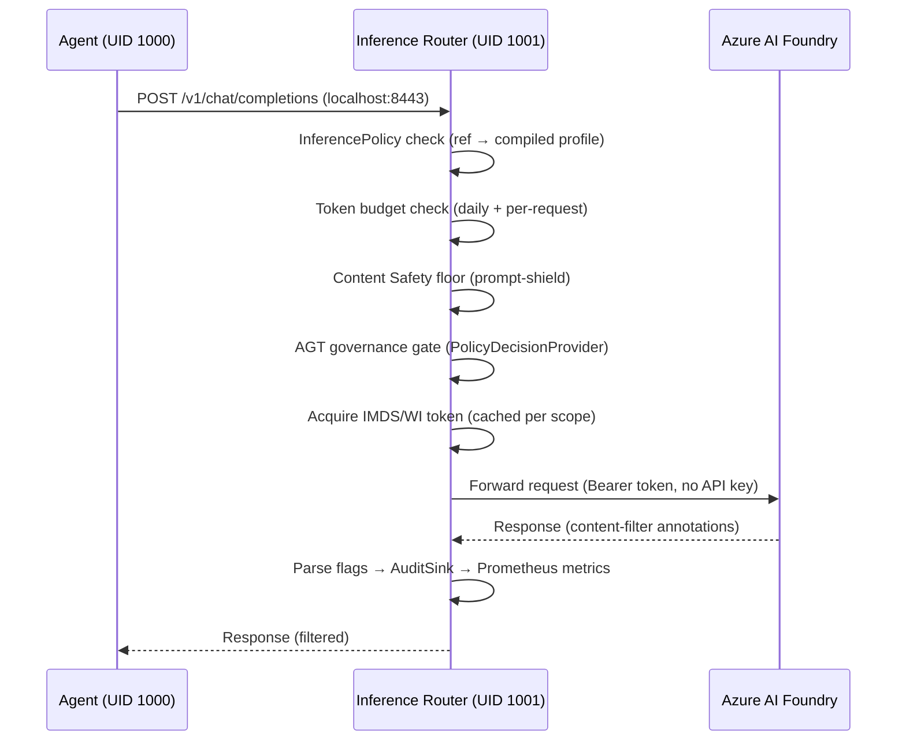

# Architecture

> **Cross-links:** [README](../README.md) · [CRD Reference](api/crd-reference.md) · [CLI Reference](cli-reference.md) · [Security](security.md) · [Threat Model](threat-model.md) · [Architecture Diagrams](architecture-diagrams.md) · [SIGS Agent Sandbox Compat](sigs-agent-sandbox-compat.md) · [ADR-0001](adr/0001-a2a-ingress-front-edge.md) · [Runtime Contract](runtime-contract.md) · [MCP Top 10](security-mcp-top10.md)

---

## 1. System Overview

AzureClaw is a Kubernetes operator that runs sandboxed AI agents with defence-in-depth isolation, a per-sandbox inference/governance proxy, and native Azure AI Foundry integration. It ships as four deployable components across two languages, plus a test infrastructure.

### Component map

| Component | Language | Binary / Package | Runs on | Role |
|-----------|----------|-----------------|---------|------|
| **Controller** | Rust (kube-rs, edition 2024) | `azureclaw-controller` | `azureclaw-system` namespace | K8s operator — reconciles 8 CRDs; two replicas with leader election |
| **Inference Router** | Rust (axum) | `azureclaw-inference-router` | sidecar in every sandbox pod | Per-sandbox proxy and policy choke-point |
| **A2A Gateway** | Rust (axum + rustls) | `azureclaw-a2a-gateway` | `azureclaw-system` (shared) | Public TLS ingress for inbound A2A 1.0 federation |
| **CLI** | TypeScript (Node.js 22+) | `@azureclaw/cli` | operator's laptop | 23 CLI commands; deploys and manages AzureClaw clusters |
| **OpenClaw Adapter** | TypeScript | `runtimes/openclaw/` | inside sandbox container | OpenClaw plugin — tools, provider, mesh wiring |
| **Additional Runtime Adapters** | TypeScript | `runtimes/{openai-agents,maf}/` | inside sandbox container | Native Phase 2 adapters for OpenAI Agents SDK and Microsoft Agent Framework |

The `cli/` package is the operator CLI only (`@azureclaw/cli`). All runtime
adapters live under `runtimes/` and are independently versioned. See
[`docs/runtime-contract.md`](runtime-contract.md) for the BYO adapter contract.

### Cluster topology

```
┌─ AKS Cluster (Azure Linux, Cilium CNI) ──────────────────────────────────┐
│                                                                           │
│  azureclaw-system namespace                                               │
│  ┌─────────────────────────────────────────────────────┐                  │
│  │ Controller × 2 replicas (leader-elected)            │                  │
│  │  • Watches 8 CRDs (ClawSandbox, ClawPairing,        │                  │
│  │    McpServer, ToolPolicy, A2AAgent, InferencePolicy, │                  │
│  │    ClawMemory, ClawEval)                             │                  │
│  │  • Metrics: :9091/metrics                           │                  │
│  └─────────────────────────────────────────────────────┘                  │
│  ┌─────────────────────────────────────────────────────┐                  │
│  │ A2A Gateway (opt-in, --enable-a2a-ingress)          │                  │
│  │  • Public TLS :8443, mTLS → router :8444            │                  │
│  │  • JWS AgentCard verifier + replay cache            │                  │
│  │  • Prometheus: :9090                                │                  │
│  └─────────────────────────────────────────────────────┘                  │
│  seccomp DaemonSet → azureclaw-strict.json on every node                 │
│                                                                           │
│  azureclaw-<name> namespace (one per sandbox)                             │
│  ┌──────────────────────────────────────────────────────────────────┐     │
│  │ Pod (2 containers + 1 init)                                      │     │
│  │                                                                  │     │
│  │  init: egress-guard (runs as root, then exits)                   │     │
│  │   └─ iptables: UID 1000 → localhost + DNS + ESTABLISHED only     │     │
│  │                                                                  │     │
│  │  container: agent (UID 1000, network-restricted)                 │     │
│  │   ├─ Runtime selected by ClawSandbox.spec.runtime.kind           │     │
│  │   │    OpenClaw | OpenAIAgents | MicrosoftAgentFramework | BYO   │     │
│  │   ├─ Gateway :18789 (WebSocket + Control UI)  [OpenClaw only]    │     │
│  │   ├─ Python 3 (43 packages pre-installed)                        │     │
│  │   └─ All external access → localhost:8443 only                   │     │
│  │                                                                  │     │
│  │  container: inference-router (UID 1001, unrestricted network)    │     │
│  │   ├─ Inference proxy (/v1/*)              ───────────────────────┼──► Foundry
│  │   ├─ Egress proxy (/egress/fetch)         ───────────────────────┼──► External HTTP (audited)
│  │   ├─ AGT relay (/agt/relay)               ───────────────────────┼──► agentmesh-relay (WS)
│  │   ├─ Content Safety floor + Prompt Shields ──────────────────────┼──► Azure AI Content Safety
│  │   ├─ Token budgets, audit logging, Prometheus metrics            │     │
│  │   ├─ Signed OCI egress-allowlist verifier                        │     │
│  │   └─ Sub-agent spawn (/sandbox/spawn)     ───────────────────────┼──► K8s API (CRD create)
│  └──────────────────────────────────────────────────────────────────┘     │
│  NetworkPolicy: default-deny egress + allowlist                           │
│  ServiceAccount: Workload Identity (azure.workload.identity/client-id)    │
│  Blocklist ConfigMap + CronJob (6h refresh from OISD + URLhaus)           │
│                                                                           │
└───────────────────────────────────────────────────────────────────────────┘
```

---

## 2. The Inference Data Path

Every external call an agent makes flows through a single choke-point: the
inference router running in the same pod as UID 1001. The agent (UID 1000)
is iptables-walled to `localhost:8443` — it can reach nothing else.



**Why the router is the sole choke-point:**
- Agent (UID 1000) has no API keys, no credentials, no direct network path
  (iptables DROP on all non-loopback, non-DNS egress).
- The router holds ephemeral IMDS tokens via Workload Identity — they are
  never visible to UID 1000.
- All policy decisions, content safety screening, token accounting, and audit
  logging happen in the router before any byte reaches Foundry.
- Sub-agent spawning (`/sandbox/spawn`) also runs through the router, so
  the spawner policy can be enforced at the same gate.

---

## 3. CRD Overview

Eight CRDs are registered under `azureclaw.azure.com/v1alpha1`. Full schemas
live in [`docs/api/crd-reference.md`](api/crd-reference.md).

| CRD | Short Name | Purpose | Key Relationship |
|-----|-----------|---------|-----------------|
| `ClawSandbox` | `cs`, `claw` | Declares a sandboxed agent instance | References `InferencePolicy` via `spec.inferenceRef`; optionally references `ToolPolicy` via `spec.governance.toolPolicy` |
| `ClawPairing` | — | Operator-assisted cross-sandbox pairing as a K8s operation | Owned by a `ClawSandbox` pair |
| `McpServer` | — | Configures an MCP 2026 endpoint with OAuth 2.1; the reconciler generates an Ed25519 signing key and optional JWKS cache | Referenced from `ClawSandbox.spec.governance` |
| `ToolPolicy` | — | Carries AGT policy profile (allow/deny/rate-limit/approval rules) + AP2 commerce fields (`dailyCap`, `monthlyCap`, `counterpartyAllowlist`) | Referenced by `ClawSandbox` and `McpServer` |
| `InferencePolicy` | — | Compiled guardrail bundle: model, content-safety floor, prompt-shield requirement, token budgets | Referenced by `ClawSandbox.spec.inferenceRef` (mandatory post-S13 inline→ref migration) |
| `A2AAgent` | — | Declares an A2A 1.0 AgentCard (skills, interfaces, trust score) for inbound federation | The reconciler compiles and publishes the card as a ConfigMap |
| `ClawMemory` | — | Binds a Foundry Memory Store to a sandbox | Owned by a `ClawSandbox` |
| `ClawEval` | — | Declares an evaluation job (dataset + evaluators + pass criteria) | Owned by a `ClawSandbox`; runtime slice writes `lastScore`, `lastPass` |

**Inline → ref migration (S13).** `ClawSandbox.spec.inference` (inline
inference config) has been superseded by `spec.inferenceRef` (reference to an
`InferencePolicy` CR in the same namespace). Inline fallback was removed in
S13; sandboxes without an `inferenceRef` enter `Degraded` with reason
`InferencePolicyNotFound`. Cross-namespace refs are disallowed (privilege
escalation vector).

**CRD CEL validation.** kube-rs `CustomResource` derive does not emit
`x-kubernetes-validations` (upstream kube-rs#1557); CEL rules are
post-processed by `controller/src/crd_validations.rs` after schema generation.

---

## 4. Reconciler Architecture

### kube-rs controller loop

Every CRD has a dedicated reconciler wired as an independent `kube::runtime::Controller`
task. The main `tokio::select!` loop in `controller/src/main.rs` drives all
eight reconcilers in parallel under a single leader election gate.

**Leader election (S7.C).** Two controller replicas run for HA. Only the
holder of the `azureclaw-controller-leader` Kubernetes `coordination.k8s.io/v1`
Lease reconciles. The pure decision function `evaluate_lease(spec, identity, now) →
LeaseAction::{Acquire,Renew,Yield}` is unit-tested independently of I/O
(`controller/src/leader_election.rs`). On renewal failure the holder exits —
fail-stop, no split-brain reconciliation. Disable with
`LEADER_ELECTION_ENABLED=false`.

**Reconciler table:**

| Reconciler | File | CRD | What it creates |
|-----------|------|-----|----------------|
| ClawSandbox | `reconciler/mod.rs` | `ClawSandbox` | Namespace, SA, Deployment, Service, NetworkPolicy, ConfigMap, CronJob |
| ClawPairing | `pairing_reconciler.rs` | `ClawPairing` | Pairing lifecycle status |
| McpServer | `mcp_server_reconciler.rs` | `McpServer` | Ed25519 Secret, JWKS ConfigMap |
| ToolPolicy | `tool_policy_reconciler.rs` | `ToolPolicy` | Compiled-profile ConfigMap |
| A2AAgent | `a2a_agent_reconciler.rs` | `A2AAgent` | AgentCard ConfigMap |
| InferencePolicy | `inference_policy_reconciler.rs` | `InferencePolicy` | Compiled-profile ConfigMap |
| ClawMemory | `claw_memory_reconciler.rs` | `ClawMemory` | Memory-binding ConfigMap |
| ClawEval | `claw_eval_reconciler.rs` | `ClawEval` | Eval-binding ConfigMap |

### SSA field managers (S7.A)

Every SSA patch carries a stable `fieldManager` string from
`controller/src/field_managers.rs`. Convention: `azureclaw-controller/<subsystem>`.
A uniqueness invariant is asserted in `tests::all_field_managers_are_unique`.
The legacy `azureclaw-mesh-peer` string is preserved verbatim to avoid an SSA
ownership transition on existing clusters.

### Conditions matrix (S7.B + S7.B.2)

All CRDs carry `status.conditions[]` (KEP-1623) and `status.observedGeneration`.
Vocabulary from `controller/src/status/conditions.rs`:

| Type | Meaning |
|------|---------|
| `Ready` | CR has reached desired state |
| `Progressing` | Controller is actively working toward desired state |
| `Degraded` | Something prevents reconciliation (missing dep, bad spec, quota, …) |
| `Suspended` | Controller has intentionally stopped driving a sub-resource (e.g. OverlayMode) |

`lastTransitionTime` only advances when `status` changes — not on every
reconcile. This keeps watch churn low and makes `kubectl wait --for=condition=Ready`
reliable.

### Jittered requeue (S7.D)

All nine reconcilers call `requeue_secs_with_jitter(N)` instead of
`Duration::from_secs(N)`. The helper applies ±20% multiplicative jitter
(matching `k8s.io/apimachinery/pkg/util/wait` defaults) to prevent thundering
herds on resync. Pure math exposed in `apply_jitter_factor(base, factor, sample)`
and unit-tested independently of the RNG
(`controller/src/backoff.rs`).

### Workqueue and duration metrics (S7.E)

Controller pod exposes Prometheus metrics at **`:9091/metrics`** (axum server
in `controller/src/metrics_server.rs`; override bind with
`CONTROLLER_METRICS_ADDR`). Metrics:

| Metric | Labels | Meaning |
|--------|--------|---------|
| `azureclaw_controller_reconcile_errors_total` | `crd_kind`, `error_class` | Total reconcile errors |
| `azureclaw_controller_reconcile_retries_total` | `crd_kind` | Total retries scheduled |
| `azureclaw_controller_reconcile_duration_seconds` | `crd_kind`, `outcome` | Duration histogram (buckets: 1ms → 30s) |
| `azureclaw_controller_reconcile_total` | `crd_kind`, `outcome` | Total invocations (success + error) |

---

## 5. Multi-Runtime Dispatch

`ClawSandbox.spec.runtime` selects the agent runtime. The `kind` discriminant
controls which sibling struct the controller reads and which sandbox image +
adapter the reconciler deploys.

### Runtime kinds

| `kind` | Adapter package | Description |
|--------|----------------|-------------|
| `OpenClaw` | `runtimes/openclaw/` | Default. OpenClaw gateway + AzureClaw plugin. Gateway :18789. |
| `OpenAIAgents` | `runtimes/openai-agents/` | OpenAI Agents SDK native adapter (Phase 2) |
| `MicrosoftAgentFramework` | `runtimes/maf/` | Microsoft Agent Framework native adapter (Phase 2) |
| `BYO` | caller-supplied | Bring-Your-Own runtime. Must satisfy `docs/runtime-contract.md`. |

### Dispatch flow

1. Reconciler calls `validate_runtime_shape(&spec.runtime)` — rejects unknown
   `kind` or conflicting sibling fields early, before any K8s writes.
2. The `deploy_sandbox` function selects the sandbox image tag and adapter
   entrypoint based on `runtime.kind`. Image tags always use `:latest`
   (controller default) — no version pinning in `SANDBOX_IMAGE` /
   `INFERENCE_ROUTER_IMAGE` env vars.
3. The `runtimes/openclaw/` adapter is the AzureClaw TypeScript plugin
   (`runtimes/openclaw/src/index.ts`) that wires tools, providers, and
   `mesh-plugin` into the OpenClaw host. The `OpenAIAgents` and `MAF` adapters
   follow the same contract surface but target their respective SDKs.
4. BYO sandboxes must implement the three-endpoint runtime contract (health,
   inference-proxy routing, sub-agent spawn); see `docs/runtime-contract.md`.

### Isolation levels

| Level | RuntimeClass | seccomp | Node pool |
|-------|-------------|---------|-----------|
| `standard` | (default runc) | `RuntimeDefault` | `sandbox` |
| `enhanced` (default) | (default runc) | Localhost `azureclaw-strict` (~219 allowed syscalls) | `sandbox` |
| `confidential` | `kata-vm-isolation` | `RuntimeDefault` (VM is the boundary) | `sandbox-kata` |

Isolation inheritance: controller exports `SANDBOX_ISOLATION` into every pod;
the router enforces it on spawn requests (downgrade from `confidential` is
blocked). Kata auto-provisioning: `azureclaw add --isolation confidential`
provisions a `Standard_D4as_v6` nodepool with `--workload-runtime KataVmIsolation`
if no Kata-capable nodepool exists.

---

## 6. Inference Router Internals

Source: `inference-router/src/`. The router is an axum server on `localhost:8443`
(main), `0.0.0.0:8444` (forward-proxy for A2A inbound), `localhost:8445` (A2A
inbound from a2a-gateway over mTLS). Every request traverses a fixed middleware
stack; no path bypasses any layer.

### Auth chain (`auth.rs`)

```
Request arrives at router
  └─ API key present in /run/secrets/ → dev mode (API key forwarded)
  └─ No key → AKS Workload Identity:
       1. Read federated token from AZURE_FEDERATED_TOKEN_FILE (WI webhook mount)
       2. Exchange at Entra /oauth2/v2.0/token (client_credentials + JWT assertion)
       3. Token cached per scope in Arc<RwLock<HashMap<scope, CachedToken>>>
       4. Token set as Authorization: Bearer on every upstream call
```

No API keys are ever injected into the sandbox pod spec. The router is the sole
credential holder.

### Middleware stack (inference path)

```
InferencePolicy check → token budget (daily + per-request, 429 on exceed)
  → Content Safety floor (prompt-shield, configurable per InferencePolicy)
  → AGT governance gate (PolicyDecisionProvider::decide)
  → IMDS/WI token acquisition (cached)
  → Forward to Foundry (18 API groups, all covered by egress NetworkPolicy)
  → Parse content-filter annotations
  → AuditSink::append (hash-chained receipt)
  → Prometheus metrics (OTel GenAI SemConv 1.x spans)
  → Return to agent
```

### AGT governance components (all native Rust, `inference-router/src/`)

The four components live inside `Governance` and are accessible through the
provider seams (see §8):

| Component | File | Role |
|-----------|------|------|
| `PolicyEngine` | `governance.rs` / `providers/policy_impl.rs` | Evaluates tool requests against the compiled ToolPolicy profile |
| `TrustManager` | `trust.rs` | Maintains per-agent trust scores; triggers re-evaluation on threshold breach |
| `AuditLogger` | `audit.rs` / `audit_impl.rs` | Hash-chained tamper-evident log; Merkle-proof retrievable via `kubectl claw attest` |
| `RateLimiter` | `rate_limiter.rs` | Per-subject token-bucket rate limiting |
| `BehaviorMonitor` | `behavior_monitor.rs` | Detects anomalous call patterns; feeds TrustManager |

### Content Safety floor (`safety.rs`)

A floor is enforced regardless of per-request settings. The floor threshold is
set by `InferencePolicy.spec.contentSafety` and cannot be disabled on production
sandboxes (admission policy rejects `contentSafety: false` without a
`dev-only` label). Prompt Shields (jailbreak + prompt injection detection) run
server-side at Azure AI Content Safety; the router parses the `content-filter`
annotations in the Foundry response and gates on them.

### Token budget (`budget.rs`)

Per-sandbox budgets (daily + per-request) are enforced before forwarding.
Counters are persisted in the router's in-process store; daily reset is
scheduled via tokio timer. Exceeding either limit returns HTTP 429 to the
agent. Budget counters are available on `ClawSandbox.status.tokensUsed`.

### Signed OCI egress-allowlist verifier (`policy_fetcher.rs`, `signer_policy.rs`)

When `ClawSandbox.spec.networkPolicy.allowlistRef` is set, the controller
fetches a content-addressed OCI artifact, verifies its cosign signature against
the cluster `SignerPolicy` ConfigMap (`azureclaw-signer-policy` in
`azureclaw-system`), and promotes the artifact as the **authoritative** egress
allowlist. The inline `allowedEndpoints` is ignored when `allowlistRef` is set;
a drift between inline and artifact surfaces as `AllowlistDrift=True` on the
sandbox status. Failure is **fail-closed**: the controller preserves the last
known-good allowlist if available, otherwise stamps `Degraded` without writing
a permissive NetworkPolicy.

The `SignerPolicy` ConfigMap provides Fulcio issuer URLs and SAN glob patterns.
A malformed ConfigMap surfaces as `SignerPolicyMalformed` — no silent env-var
fallback. ACR authentication uses the same four-step Workload Identity token
exchange as inference auth (`acr_token_for_pull`).

### Platform MCP shim (`mcp/platform.rs`)

The router exposes Foundry built-in tools (Memory Store, Bing Grounding, Code
Interpreter) as MCP tools via `POST /mcp`. OAuth 2.1 BCP gating is controlled
by `McpServer.spec.productionMode: true`. The MCP module is 8 files under
`inference-router/src/mcp/`: `streamable_http.rs`, `jsonrpc.rs`, `oauth.rs`,
`oauth_layer.rs` (tower::Layer), `initialize.rs`, `pipeline.rs`, `tools.rs`,
`error.rs`.

### Egress proxy pipeline

```
POST /egress/fetch
  → blocklist check (hard deny — OISD + URLhaus, 6h refresh CronJob)
  → signed OCI allowlist (authoritative when allowlistRef set)
  → learn mode? log + allow
  → inline allowedEndpoints check (approved domains pass)
  → unknown domain → deny + create PendingApproval record
```

Blocked attempts are recorded in a bounded ring buffer
(`egress_blocked.rs`), deduped by `(source, host, port)`, surfaced at
`GET /egress/learned/blocked`.

---

## 7. A2A Architecture

A2A 1.0 (<https://a2a-protocol.org/v1.0.0/specification>) is the cross-runtime
agent interop protocol. AzureClaw handles A2A on two distinct paths:
outbound (initiated by the agent) and inbound (initiated by foreign runtimes).
The design rationale is in [ADR-0001](adr/0001-a2a-ingress-front-edge.md).

### Outbound A2A (router-internal)

The agent calls A2A APIs via the router's existing inference and egress paths.
The router implements the A2A client side (`inference-router/src/a2a/`):
- `agent_card.rs` / `card_signing.rs` — Ed25519 AgentCard signing (RFC 7515, EdDSA)
- `card_server.rs` — serves `GET /.well-known/agent.json`
- `jsonrpc_dispatch.rs` — routes A2A 1.0 JSON-RPC method calls
- `trust_store.rs` — pins verified caller AgentCards by thumbprint
- AP2 extensions: `ap2.rs`, `mandate_signing.rs`, `mandate_trust_store.rs`,
  `message_send_ap2.rs`

All outbound A2A traffic flows through the standard governance gate
(PolicyDecisionProvider → AuditSink).

### Inbound A2A (a2a-gateway + mTLS)

The inference router is **never** on the public internet — the `a2a-gateway`
component is the sole public TLS endpoint for inbound A2A. This is a firm
security invariant (ADR-0001 §D2).

```
Foreign Agent ──TLS :8443──► a2a-gateway (azureclaw-system)
                                  │
                                  │  JWS AgentCard verify
                                  │  Replay cache check (5 min window)
                                  │  Per-subject rate limit (token bucket)
                                  │
                              mTLS :8444 ──► inference-router (sandbox pod)
                                              │
                                              │  PolicyDecisionProvider
                                              │  AuditSink
                                              │  ClawSandbox.spec.a2a allowed callers
                                              ▼
                                          Agent (UID 1000)
```

The gateway binary (`a2a-gateway/src/main.rs`) is configured via env vars
(Helm → Deployment → env). It verifies the caller's JWS-signed AgentCard using
primitives from the shared `azureclaw-a2a-core` crate, then proxies
authenticated requests to the target sandbox router over mTLS.

**`azureclaw-a2a-core`** (`azureclaw-a2a-core/src/lib.rs`) is a library-only
crate that lifts the A2A JWS verifier, AgentCard schema, signer, and error
catalogue out of the router into a shared dependency used by both the gateway
and the router. `#![forbid(unsafe_code)]` is enforced at the crate root.

**Opt-in.** The a2a-gateway Deployment is created only when
`azureclaw up --enable-a2a-ingress` is passed. Per-sandbox exposure is
gated by `ClawSandbox.spec.a2a.enabled: true`; without this field the
sandbox has no inbound A2A path.

---

## 8. AgentMesh Integration

Inter-agent messaging uses the AgentMesh relay/registry (Signal Protocol, E2E
encrypted). See [`docs/e2e-encryption-proof.md`](e2e-encryption-proof.md) and
[`docs/agt-vendored-patch-audit.md`](agt-vendored-patch-audit.md) for
cryptographic details.

### Vendored patches

`vendor/` contains patched forks of three upstream packages — `agentmesh-relay`,
`agentmesh-registry`, `agentmesh-sdk` — fixing 8 bugs documented in the
respective `vendor/*/README.md` files. The sandbox Docker build installs
`@agentmesh/sdk` via npm and then **overlays** the vendored dist files:

```dockerfile
COPY vendor/agentmesh-sdk/dist/ .../node_modules/@agentmesh/sdk/dist/
```

Notable patches include: timestamp format mismatch (`Z` vs `+00:00` in relay),
ratchet key mismatch (session.ts in SDK), and base64Decode `x25519:`/`ed25519:`
prefix stripping.

### Signal Protocol session ownership

The Signal Protocol X3DH + Double-Ratchet sessions are maintained by the
**agent** (TypeScript `mesh-plugin/` + `@agentmesh/sdk`), not by the router.
The router's role is purely transport: it forwards the relay WebSocket
(`routes/mesh.rs`) and registry HTTPS calls (`agt/registry/*`), applying
policy + audit hooks around them but never decrypting or holding key material.
`providers/mesh.rs` documents this contract; it ships no `impl` and should
not acquire one.

### Singleton guard

`process.env.__AGT_INITIALIZED = '1'` ensures only the first plugin load
creates the AGT client. OpenClaw loads the plugin twice (tool registry + agent
session); the guard prevents double-initialisation and duplicate mesh
connections.

### Upstream cleanup

The goal is to upstream all 8 patches to `amitayks/agentmesh`. Until upstream
merges, the vendored overlay remains. Progress is tracked in `vendor/*/README.md`.
Relay/registry require Rust ≥ 1.94 (upstream's 1.83 is too old for the patches).

---

## 9. Provider Seams

Four trait seams let operators substitute governance back-ends without changing
the router. Source: `inference-router/src/providers/`.

| Trait | File | Current production impl | Substitution surface |
|-------|------|------------------------|---------------------|
| `PolicyDecisionProvider` | `providers/policy.rs` | `VendoredPolicyDecisionProvider` (PolicyEngine + TrustManager + RateLimiter + BehaviorMonitor, native Rust) | AGT SDK (`AgtPolicyDecisionProvider`); swap via `spec.agt.providers.policy` |
| `AuditSink` | `providers/audit.rs` | `VendoredAuditSink` (hash-chained log, Merkle proofs) | AGT SDK (`AgtAuditSink`); swap via `spec.agt.providers.audit` |
| `SigningProvider` | `providers/signing.rs` | `VendoredSigningProvider` (Ed25519 via vendored `@agentmesh/sdk` keys) | AGT SDK (`AgtSigningProvider`); swap via `spec.agt.providers.signing` |
| `MeshProvider` | `providers/mesh.rs` | **None** — plugin-side only | Contract document only; router never implements this |

`AppState` carries three `Arc<dyn Trait>` views of a single `Arc<Governance>`
instance. Swapping a provider (`vendored` → `agt` or vice versa) is a hot-
reload: the router re-creates the provider in-process without a pod rollout.
`spec.agt.outageMode` controls failure behaviour: `Strict` (fail-closed),
`CachedRead` (read from last-known-good), `DegradedDev` (dev-only, no-op).

`NullPolicyDecisionProvider` / `NullAuditSink` / `NullSigningProvider` are
dev-only; the admission policy (`ci/no-null-provider-prod.sh` + VAP) rejects
production sandboxes that reference them unless the `azureclaw.azure.com/dev-only`
label is present.

---

## 10. Security Posture

AzureClaw uses a defence-in-depth model with nine distinct enforcement layers.
Full documentation: [`docs/security.md`](security.md), [`docs/threat-model.md`](threat-model.md).

| Layer | Mechanism | What it stops |
|-------|-----------|--------------|
| 1. iptables egress-guard | init container installs UID-1000-scoped OUTPUT rules (lo + DNS + ESTABLISHED only) | Agent reaching external network directly |
| 2. NetworkPolicy default-deny | Cilium NetworkPolicy per sandbox namespace | Pod-to-pod lateral movement; router reaching unexpected endpoints |
| 3. Read-only rootfs + drop ALL caps | `readOnlyRootFilesystem: true`, `capabilities: drop: [ALL]`, `allowPrivilegeEscalation: false` | In-container privilege escalation |
| 4. seccomp `azureclaw-strict` | Localhost profile (~219 allowed syscalls) on `enhanced` isolation | Kernel attack surface reduction |
| 5. Workload Identity (no API keys) | IMDS token exchange via AKS WI webhook; credentials never in pod spec | Credential exfiltration via pod-spec leak |
| 6. Content Safety floor | Azure AI Content Safety + Prompt Shields; threshold enforced by router | Prompt injection, jailbreaks, harmful output |
| 7. AGT governance gate | PolicyDecisionProvider; every tool call evaluated before execution | Excessive agency, policy bypass, rate abuse |
| 8. Signed OCI egress allowlist | cosign + Fulcio + SAN verification; `SignerPolicy` ConfigMap | Supply-chain attack via egress allowlist tampering |
| 9. Kata Containers + AMD SEV-SNP (opt-in) | `isolation: confidential`; `kata-vm-isolation` RuntimeClass | VM-level tenant isolation; hardware attestation |

**VAP / MAP admission set** (`deploy/helm/azureclaw/templates/`):
- **VAP** (Kubernetes ≥ 1.30, GA): deny `exec/attach/portforward` on sandbox
  namespaces; block posture downgrades (isolation step-down, seccomp removal,
  `readOnlyRootFilesystem: false`); prevent `dev-only` label removal; require
  `dev-only` for null/noop/disabled providers.
- **MAP** (Kubernetes ≥ 1.32, Beta — Helm flag `controller.mutatingAdmissionPolicy.enabled`,
  default `false`): auto-inject router sidecar; auto-stamp `azureclaw-strict` seccomp.
  When the flag is `false`, the reconciler performs the same operations
  deterministically before pod creation.

**Federated-credential reaper** (`controller/src/fedcred_reaper.rs`): 4th arm of
the main `tokio::select!` loop. Periodically cross-checks live federated
credentials against active `ClawSandbox` CRs and deletes orphans. Default
cadence 600 s (`FEDCRED_REAPER_INTERVAL_SECS`). Guards the 20-fedcred-per-MI
Azure cap.

---

## 11. Observability

### Prometheus metrics

| Component | Endpoint | Series prefix |
|-----------|---------|--------------|
| Controller | `:9091/metrics` | `azureclaw_controller_*` |
| Inference Router | `:8443/metrics` (per-pod) | `azureclaw_*` |
| A2A Gateway | `:9090/metrics` | `azureclaw_a2a_gateway_*` |

### OTel GenAI semantic conventions

Every router span emits OTel GenAI SemConv 1.x attributes:
`gen_ai.system`, `gen_ai.request.model`,
`gen_ai.usage.input_tokens`, `gen_ai.usage.output_tokens`, and more.
Export via `OTEL_EXPORTER_OTLP_ENDPOINT`. Source: `inference-router/src/telemetry/`.

### Application Insights

The CLI and controller emit structured JSON traces to Azure Application Insights
when `APPLICATIONINSIGHTS_CONNECTION_STRING` is set.

### eBPF tracing

`azureclaw trace <name>` attaches eBPF probes to the sandbox pod and streams
syscall-level traces to the terminal. Requires `CAP_BPF` on the operator's
kubeconfig identity.

---

## 12. Testing Layers

| Layer | Location | What it gates |
|-------|---------|--------------|
| **Unit** | `cargo test --all` (inlined `#[cfg(test)]` modules) | Individual functions: `evaluate_lease`, `apply_jitter_factor`, field-manager uniqueness, CEL validation, content-safety parsing, etc. |
| **Integration** | `cargo test --all` (separate `tests/` modules per crate) | Router middleware stack; controller reconcile logic; policy compile; auth token exchange |
| **E2E** | `tests/e2e/` via `make test-e2e` | Full cluster lifecycle on Kind: `azureclaw up` → agent running → `azureclaw delete` |
| **Negative / conformance** | `tests/conformance/` | Protocol edge cases: A2A JWS rejection, MCP OAuth 2.1 BCP gating, policy hot-reload propagation (≤ 5 s), VAP admission rejections |
| **Chaos / fault injection** | `tests/chaos/` (feature-gated: `--features chaos`) | 22 chaos tests across 4 failure-mode categories: K8s API flakes (8), Foundry 429 storms (6), Entra rotation races (4), AGT relay disconnects (4). Runs as a parallel CI job. |
| **CNCF AI Conformance v1.35+** | `tests/cncf-conformance/` | CNCF Kubernetes AI Conformance profile; wired into CI as a gating check |
| **Load** | `tests/k6/router_smoke.js` (nightly) | Router throughput + tail latency regression gate |

**Chaos tier details.** The 22 chaos tests exercise: 500/503/429 K8s API
storms, stale `resourceVersion` (410 GONE), truncated watch JSON, premature
EOF; Foundry 429 storms at 80 % and 100 % saturation, mid-stream 503 SSE
close, slow-backend timeout, blocked-attempt metric accuracy; Workload Identity
token refresh mid-flight, single-flight invariant, JWKS rotation re-fetch, SA
token file rotation; AGT relay WS upstream disconnect, handshake timeout (504-
class), slow-registry deadline, repeated churn with no task leak.
Source: `tests/chaos/README.md`.

---

## 13. Network Architecture Detail

```
                        ┌─────────────────────────────────┐
                        │       iptables (per-UID)         │
                        │                                  │
  UID 1000 (agent)      │  lo ✓  DNS ✓  ESTABLISHED ✓     │
                        │  everything else ✗ (DROP)        │
                        │                                  │
  UID 1001 (router)     │  no iptables restrictions        │
                        │  governed by NetworkPolicy only  │
                        └─────────────────────────────────┘
                                       │
                        ┌──────────────┴──────────────┐
                        │     NetworkPolicy (pod)      │
                        │                              │
                        │  Egress: DNS :53, IMDS,      │
                        │    HTTPS :443, mesh :8443,   │
                        │    relay :8765/:8080          │
                        │  Ingress: mesh :8443,         │
                        │    gateway :18789/:18791      │
                        │    (AGT-enabled only)         │
                        └──────────────────────────────┘
```

**Egress guard iptables rules (UID 1000):**

```
iptables -A OUTPUT -m owner --uid-owner 1000 -o lo -j ACCEPT
iptables -A OUTPUT -m owner --uid-owner 1000 -p udp --dport 53 -j ACCEPT
iptables -A OUTPUT -m owner --uid-owner 1000 -p tcp --dport 53 -j ACCEPT
iptables -A OUTPUT -m owner --uid-owner 1000 -m conntrack --ctstate ESTABLISHED,RELATED -j ACCEPT
iptables -A OUTPUT -m owner --uid-owner 1000 -j DROP
```

The `ESTABLISHED,RELATED` rule allows inbound-connection reply packets (WebUX,
channel integrations) without opening any outbound path.

---

## 14. API Endpoints

All endpoints served by the inference router on `:8443`.

### Inference (proxied to Azure OpenAI / Foundry)

| Method | Path | Purpose |
|--------|------|---------|
| POST | `/v1/chat/completions` | Chat inference (SSE streaming supported) |
| POST | `/v1/completions` | Text completions |
| POST | `/v1/embeddings` | Embedding generation (model-routed) |
| GET | `/v1/models` | Model catalog |

### Foundry Standalone APIs (18 API groups, IMDS auth)

| Path prefix | Purpose |
|-------------|---------|
| `/memory_stores/*` | Memory Store — persistent long-term memory |
| `/knowledgebases/*` | Foundry IQ — agentic retrieval |
| `/openai/responses/*` | Responses API (Code Interpreter, Web Search, Memory Search) |
| `/openai/conversations/*` | Persistent multi-turn conversations |
| `/openai/evals/*` | Evaluations |
| `/openai/fine-tuning/*` | Fine-tuning jobs |
| `/agents/*` | Foundry Agents CRUD |
| `/evaluators/*`, `/evaluationrules/*`, `/evaluationtaxonomies/*` | Evaluation ecosystem |
| `/indexes/*`, `/connections/*`, `/deployments/*` | Knowledge indexes, connections, deployments |
| `/datasets/*`, `/insights/*` | Datasets, monitoring |
| `/redTeams/runs/*`, `/schedules/*` | Red teams, scheduled jobs |

### MCP 2026

| Method | Path | Purpose |
|--------|------|---------|
| POST | `/mcp` | Streamable HTTP MCP endpoint (OAuth 2.1 BCP-gated in production) |

### Egress Proxy

| Method | Path | Purpose |
|--------|------|---------|
| POST | `/egress/fetch` | Audited HTTP proxy (blocklist → allowlist → pending) |
| GET | `/egress/allowlist` | List approved domains |
| GET | `/egress/pending` | List pending approval requests |
| POST | `/egress/approve` | Approve a domain |
| POST | `/egress/deny` | Deny a pending domain |
| GET | `/egress/learned` | Domains observed in learn mode |
| POST | `/egress/learned/clear` | Clear learned domains |
| GET | `/egress/learned/blocked` | Domains blocked in enforce mode |

### AGT Governance

| Method | Path | Purpose |
|--------|------|---------|
| POST | `/agt/evaluate` | Policy evaluation |
| GET | `/agt/trust`, `/agt/trust/{agent_id}` | Trust store queries |
| GET | `/agt/audit`, `/agt/audit/verify` | Audit log + Merkle-proof verification |
| GET | `/agt/relay` | WebSocket bridge to agentmesh-relay (E2E encrypted) |
| GET/POST | `/agt/registry/*` | AgentMesh registry proxy |
| GET | `/agt/status` | Governance status |

### Sub-Agent Spawning

| Method | Path | Purpose |
|--------|------|---------|
| POST | `/sandbox/spawn` | Create child ClawSandbox CRD |
| GET | `/sandbox/list` | List child sandboxes |
| GET | `/sandbox/{name}/status` | Child status |
| DELETE | `/sandbox/{name}` | Tear down child sandbox |

### A2A 1.0 (outbound)

| Method | Path | Purpose |
|--------|------|---------|
| GET | `/.well-known/agent.json` | Serve signed AgentCard (card_server.rs) |

### Health

| Method | Path | Purpose |
|--------|------|---------|
| GET | `/healthz` | Liveness probe |
| GET | `/readyz` | Deep readiness (token + Content Safety) |
| GET | `/metrics` | Prometheus metrics |

---

## 15. Channels and Plugin Auto-Discovery

Messaging channels (Telegram, Slack, Discord, WhatsApp) and third-party search
plugins (Brave, Tavily, Exa, Firecrawl, Perplexity, OpenAI) follow the same
discovery flow:

```
CLI flag  →  K8s Secret (<name>-credentials)  →  envFrom mount
  →  entrypoint.sh reads env vars  →  plugins.allow + plugins.entries  →  gateway
```

Source: `sandbox-images/openclaw/entrypoint.sh` (plugin loop at lines 286–301).

Credentials are **namespace-scoped** — each sandbox's secrets are isolated in
`azureclaw-<name>`. Rotate with `azureclaw credentials update <name>`. The
controller mounts secrets via `envFrom` with `optional: true` so pods start
without the secret; it is expected for new sandboxes.

**Node.js 22 proxy.** `proxy-bootstrap.js` is preloaded via
`NODE_OPTIONS="--require ..."` before any OpenClaw code. It configures undici's
`EnvHttpProxyAgent` as the global fetch dispatcher so all HTTP/HTTPS requests
honour `HTTPS_PROXY`/`NO_PROXY`. Node.js 22's built-in `fetch()` ignores these
env vars without this shim.

---

## 16. Identity Provider Seam

`controller/src/providers/identity_*.rs` manages the lifecycle of Microsoft
Graph agent identities for each sandbox:

- `POST /beta/servicePrincipals/microsoft.graph.agentIdentity` — provision SP
- `POST /beta/servicePrincipals/{id}/federatedIdentityCredentials` — bind
  federated credential for the sandbox ServiceAccount
- `DELETE /beta/servicePrincipals/{id}` — teardown on `ClawSandbox` deletion

`OPENCLAW_GATEWAY_TOKEN` is mounted from a K8s `Secret` via `secretKeyRef`
(not plain env); a one-shot `warn!` fires on any legacy plain-env path.

---

## 17. Policy Hot-Reload

The router subscribes to `ToolPolicy` and `InferencePolicy` ConfigMap changes
via K8s informers + AGT SSE. New policy takes effect in-process without a
pod rollout. Flipping `spec.agt.providers.{policy,audit,signing}` between
`vendored` and `agt` also hot-reloads. Policy-change propagation is asserted
within 5 s by the conformance corpus.

---

## 18. AgentMesh Global Registry (Optional)

For cross-environment handoff (local ↔ cloud), expose the AgentMesh relay and
registry:

```
azureclaw up --expose-registry   # AGIC Ingress + NetworkPolicy
```

This creates Application Gateway Ingress for `registry.<domain>` (HTTPS) and
`relay.<domain>` (WSS) with Azure-managed TLS and WAF rate limiting.

**4-layer auth chain:**

| Layer | Component | What it stops |
|-------|-----------|--------------|
| 1. WAF | Application Gateway | DDoS, connection floods |
| 2. Ed25519 | Relay `handle_auth()` | Impersonation, replay |
| 3. Registry check | Relay `RegistryVerifier` | Unregistered / revoked agents |
| 4. OAuth | Registry `oauth.rs` | Controls registration (GitHub, Entra, Google) |

`azureclaw mesh auth --registry <url> --provider github|entra` generates an
Ed25519 keypair, runs OAuth, and stores the identity in
`~/.azureclaw/mesh-identity.json` (AES-256-GCM, machine-bound key).

**Registration gating.** `registrationMode == full` requires both relay and
registry to be reachable; registry degraded → relay-only mode +
`Degraded=True` on the affected `ClawSandbox`.

---

*For inline diagrams of the full component topology, data flows, and
multi-runtime dispatch, see [`docs/architecture-diagrams.md`](architecture-diagrams.md).*
