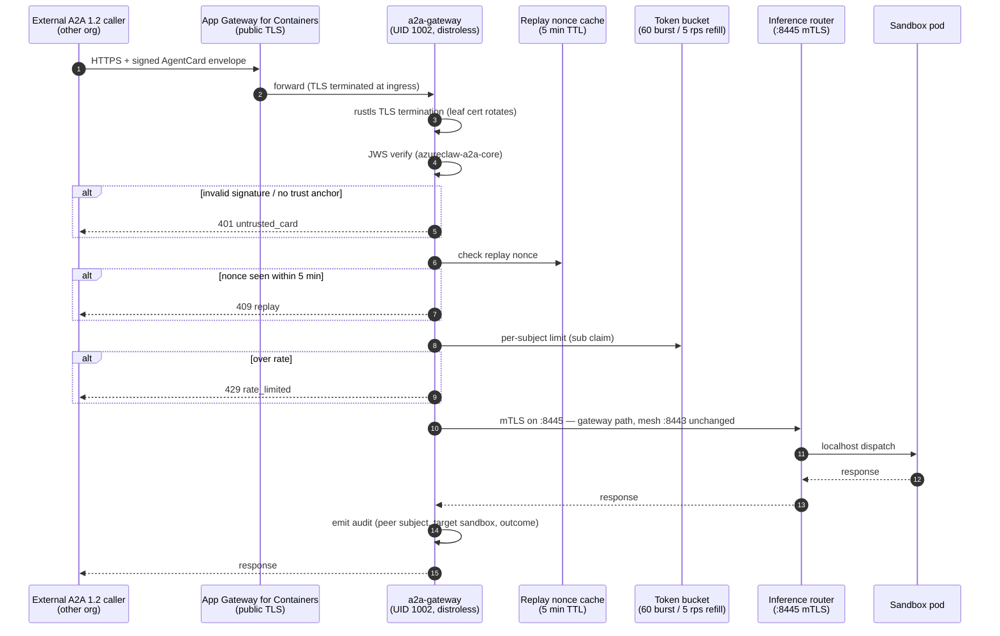

# A2A public-ingress gateway

## Why this component exists

Before this component existed the inference router exposed A2A
endpoints on the cluster-internal mesh only. [ADR-0001](../adr/0001-a2a-ingress-front-edge.md) required a
hardened public edge so external A2A 1.0.0 callers (other
organisations' agents reaching ours) terminate at a single, narrow
surface that:

1. Owns the public TLS certificate (rotated via Application Gateway
   for Containers / cert-manager).
2. Verifies inbound JWS-signed `AgentCard` envelopes against a pinned
   trust store.
3. Enforces per-subject rate limits keyed off the verified JWS
   `sub` claim.
4. Forwards over mTLS to the router on a dedicated port (8445), so
   the router's existing :8443 mesh listener stays unchanged.

## Data flow

The gateway runs as **UID 1002**, distroless static, read-only filesystem. Privileges drop on first request. The replay cache and rate-limit token bucket are RAM-only in `v1` (state survives a single pod, not a restart) — see [the operations runbook](../operations/a2a-gateway.md) for how this is monitored and what to consider when scaling out.

## Threat model

### What we mitigate

| Threat | Mitigation |
|---|---|
| Eavesdropping on the public path | TLS 1.2/1.3 via rustls. |
| Stolen TLS leaf | `notify::Watcher` triggers `Arc<ServerConfig>` swap on cert rotation; old sessions drain. |
| Forged AgentCard | JWS Ed25519 verify in `azureclaw_a2a_core::verify_inbound_card` against a pinned trust store; `alg` allow-list is hard-coded to `EdDSA`. The gateway today consumes the verified subject from the `X-A2A-Agent-Subject` header populated by the upstream Gateway API mTLS handshake; wiring the verifier directly as an axum layer is a v1.1 task. |
| Replay of a valid envelope | Nonce cache with 5 min TTL and 100k entry cap. |
| Untrusted gateway impersonating router | Router :8445 verifies client cert against the gateway-only CA bundle at `/etc/azureclaw/a2a-gateway-ca.pem`. |
| Burst flood from one subject | Per-subject token bucket (60 burst / 5 rps); over-budget calls return 429. |
| Container escape from the gateway | Distroless static base, read-only root FS, drop ALL caps, UID 1002, seccomp `azureclaw-strict.json`. |

### Known limitations (v1)

| Limitation | Notes |
|---|---|
| Cross-replica rate-limit sync | Helm value `a2aGateway.rateLimits.sharedRedisUrl` is reserved; impl is `unimplemented!()`. Replicas enforce in-memory only — the router's downstream limiter is the second line of defence. |
| SAN pinning beyond CA chain on :8445 | The gateway CA is single-purpose (issued only to gateway pods) so chain-of-trust is sufficient for v1. |
| Mandatory mTLS on :8443 | Out of scope — :8443 stays exactly as it is on the dev branch. |

## Code layout

The JWS verifier and agent-card schema live in a shared workspace crate so the router and the gateway use the same byte-for-byte implementation:

| Module | Crate | Purpose |
|---|---|---|
| `signature.rs` | `azureclaw-a2a-core` | RFC 7515 signing-input construction. |
| `agent_card.rs` | `azureclaw-a2a-core` | A2A §5.5 schema. |
| `card_signing.rs` | `azureclaw-a2a-core` | Ed25519 sign + verify. |
| `card_verifier.rs` | `azureclaw-a2a-core` | Inbound caller pin against the trust store. |
| `error.rs` | `azureclaw-a2a-core` | A2A §3.3.2 error codes. |

The router re-exports each module under its original path (`crate::a2a::signature::*`, etc.) so existing call sites keep compiling unchanged.

## Deployment sizing

Default Helm values target a small cluster (≤1k external A2A peers):

| Knob | Default | Rationale |
|---|---|---|
| `replicas` | 2 | HA pair; no shared state required in v1. |
| Per-subject burst | 60 | Comfortably covers card discovery + a few `tasks/send` calls. |
| Per-subject refill | 5 rps | Steady-state ceiling per peer. |
| `maxSubjects` | 50 000 | LRU-evicts when exceeded; bounds RAM at ~10 MB. |
| Resources | 100m / 128Mi → 500m / 256Mi | The gateway is forwarding-only; CPU spikes are TLS handshake-bound. |

For larger surfaces (tens of thousands of distinct peer subjects),
either raise `maxSubjects` or — once available — opt into shared
Redis sync. Both knobs are Helm values so no rebuild is required.

## See also

- `docs/operations/a2a-gateway.md` — operator runbook (enable, cert
  rotation, observability).
- `docs/adr/0001-a2a-ingress-front-edge.md` — the ADR.
