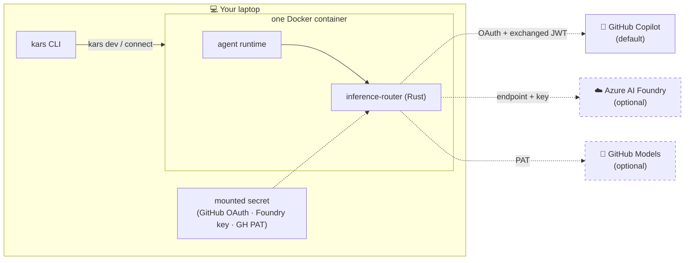
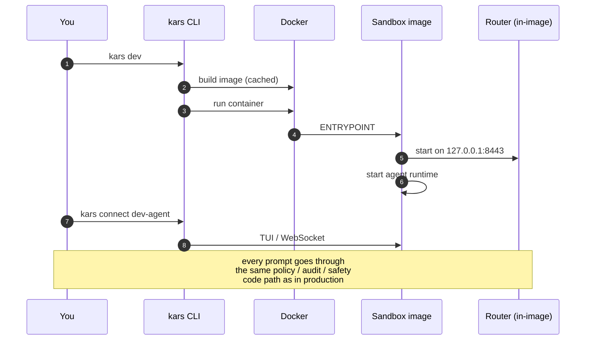

# Blueprint 01 — Developer inner loop

> *"I am on my laptop. I want to write an agent, change a tool policy, fix a router bug, and see the effect in seconds — without provisioning AKS, without paying for Azure, and without a different code path that 'will be replaced in production'."*

## Persona & intent

- **You are:** an agent author or kars maintainer.
- **You want:** seconds of feedback. Real router code. Real policy decisions. Real audit format. Real frontier-model output (Claude Opus, GPT-5, Gemini) with a single `gh auth login`. No Azure subscription, no Foundry resource, no Kubernetes.
- **You do not want:** to operate a kind cluster for every PR; to stand up Workload Identity locally; to maintain a parallel "dev mock" that drifts from production.

> **Need real Kubernetes locally?** If you're changing the controller, the Helm chart, the CRDs, or the inference router sidecar wiring, see [Blueprint 02 — Local Kubernetes dev loop](02-local-k8s-dev-loop.md). It runs the same controller + router images on a kind cluster, with a Headlamp dashboard. Pick `kars dev --target local-k8s` (or pick "Local Kubernetes" at the first-run prompt). For prompt-iteration and tool-policy work, this Docker loop is faster — start here.

## Topology

One Docker container. Same image as the sandbox, just with the router co-located inside instead of a separate pod.



## Trust boundary

The trust boundary is **deliberately weaker than production**, because there is one process sharing one network namespace inside one Docker container. There is no UID separation, no egress guard, no NetworkPolicy. Treat dev mode as a development surface, not a security surface.

| Property | Dev mode | Prod mode |
|---|---|---|
| Pod shape | one container | multi-container (agent + router + egress-guard) |
| UID separation | no | UID 1000 (agent) / UID 1001 (router) |
| Egress guard | no | iptables initContainer + NetworkPolicy |
| Identity | GitHub OAuth (Copilot) / GH PAT (Models) / Foundry key | Workload Identity (federated) |
| Content Safety | yes | yes |
| Governance + audit | yes | yes |
| Mesh available | yes (against a real relay if you point at one) | yes |

Everything yes/yes is the same code path in both modes. That is what makes a green dev-mode test meaningful.

## Primary flow



## What you provision

```bash
# clone + build (Node 22+, Rust 1.88+)
git clone https://github.com/Azure/kars.git
cd kars/cli && npm ci && npm run build && npm link

# run a sandbox locally — Docker only, no Azure, no Kubernetes
# (prompts for provider on first run, then for an agent name; default is `dev-agent`)
kars dev

# talk to it
kars connect dev-agent

# tail logs (router + agent)
kars logs dev-agent -f

# inspect / change policy
kars policy show dev-agent
kars policy apply ./my-tool-policy.yaml --sandbox dev-agent

# tear down
kars destroy dev-agent
```

On the first run you are prompted to pick an inference provider — **GitHub Copilot** (default), Azure AI Foundry, or GitHub Models — and the matching credential. For Copilot the CLI runs an interactive **device-code OAuth flow** (`https://github.com/login/device`) using the public Copilot client id; the router exchanges your OAuth token for a short-lived Copilot JWT at runtime, so you never see or manage the JWT yourself. **The credential you pick is the only one dev mode ever sees, and it never leaves your laptop.** If you skip the prompt, the sandbox starts with a stub model — useful for offline plugin / policy work.

## What is unique to this blueprint

- **One image, two sides.** The router and the agent share an image so the inner loop is `docker run` rather than `kubectl apply`. This is the only difference in deployment shape between dev and the rest of the blueprints.
- **Production-equal control logic.** The router is the same Rust crate. The policy engine is the same. The audit format is the same. A policy that allows a tool call locally allows it in prod; a policy that denies it locally denies it in prod.
- **Frontier models, zero infra.** With a Copilot seat you get Claude Opus / Sonnet, GPT-5, GPT-4.1, Gemini, and the o-series through the same router that enforces Foundry-grade governance. Claude requests use **native Anthropic-shape passthrough** (`/v1/messages`) — no lossy translation, full tool-calling fidelity. Sub-agents you spawn inherit your provider, model, and credentials automatically.
- **No Azure subscription required to start.** You can write plugins and iterate on `ToolPolicy` against the stub model. You only need an Azure OpenAI key when you specifically want Foundry-only features (Memory Store, agents, evaluations, inline Content Safety).

## When this is the wrong blueprint

- You want **multi-tenant isolation** — go to Blueprint 02.
- You want **hardware-isolated execution** for customer prompts — go to Blueprint 03.
- You want **two organisations to talk** — go to Blueprint 04.
- You want **air-gapped deployment** — go to Blueprint 05.

## References

- [`cli/src/commands/dev.ts`](../../cli/src/commands/dev.ts) — the implementation of `kars dev`.
- [`sandbox-images/`](../../sandbox-images/) — the per-runtime images dev mode uses.
- [Architecture — Two modes](../architecture.md#two-modes) — the canonical write-up of dev vs prod.
- [Getting started — Step 1](../getting-started.md#step-1--local-five-minutes) — the user-facing walkthrough.
