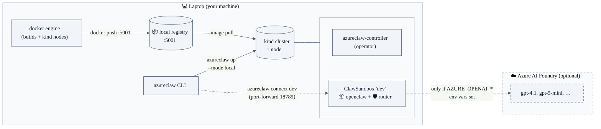
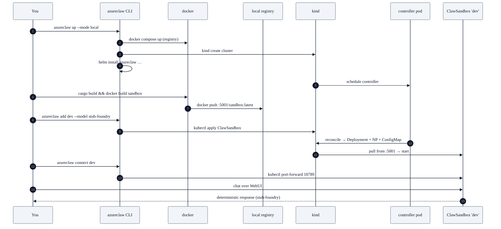

# Blueprint 01 — Developer inner-loop

> "I'm on my laptop. I want to iterate on AzureClaw — controller, router, sandbox image, plugin — without provisioning AKS, without paying for Azure, and without weakening the security model so much that what I test locally diverges from what runs in production."

## Persona & intent

- **You are:** an individual contributor or maintainer.
- **You want:** sub-minute reload of controller / router / CLI / plugin / sandbox image. Real Foundry calls *optional* (`stub-foundry` mode for offline). Real K8s reconciliation. Real seccomp + NetworkPolicy enforcement so a green local run means something.
- **You do not want:** to provision AKS for every PR; to share Azure credentials with experimental builds; to maintain a parallel "dev mock" code path that drifts from prod.

## Topology



## Trust boundary

The trust boundary is **identical to production**:

- Agent UID 1000 inside the sandbox pod can reach only `localhost` + DNS. The router on UID 1001 is the sole external path.
- The custom strict seccomp profile is loaded by kind (annotation: `localhostProfile: azureclaw-strict.json`).
- NetworkPolicy default-deny is enforced by Cilium-on-kind.
- Foundry calls go to the real Foundry endpoint via Workload Identity *only if* the user has configured one; otherwise the router runs in `--stub-foundry` mode and returns deterministic canned responses.

The only thing that's *not* like production is the host: `kind` instead of AKS, no Application Gateway, no Confidential Containers (kata + SEV-SNP) — Confidential mode silently degrades to standard mode in local-dev.

## Primary flow



## What you provision

```bash
# One-time
git clone https://github.com/Azure/azureclaw && cd azureclaw
make dev-prereqs                  # installs kind, helm, kubectl, cargo, node 22

# Every-loop
make build                        # cargo build + cli npm run build
make images                       # docker build for controller, router, sandbox
azureclaw up --mode local         # spins kind + local registry + helm install
azureclaw add dev --model stub-foundry --governance
azureclaw connect dev             # port-forward to WebUI on :18789

# When you change Rust code:
make build images && azureclaw push --only sandbox --apply

# Tear down:
azureclaw down --mode local       # kind delete + docker compose down
```

For the cross-runtime mesh path (Blueprint 04 reduced to one machine), the same stack supports:

```bash
azureclaw mesh promote --port-forward      # exposes registry+relay on :18080/:18765
azureclaw pair generate --name laptop-self # mints a token you can paste back into a NemoClaw also running locally
```

## What's unique to this blueprint

- **Real reconciliation, fake cloud.** The controller does real K8s API calls against a real apiserver; only Foundry is optionally stubbed. No mock controllers, no in-memory K8s clients.
- **Same image, same seccomp, same NP.** What you test locally is what gets pushed to AKS — modulo Confidential mode and Application Gateway.
- **No Azure credentials anywhere on the laptop** in stub-foundry mode. Safe to run on shared / personal machines, in CI, in dependabot autoruns.

## What this blueprint is NOT

- Not a production deployment. `kind` is a single-node cluster on your laptop; if your laptop dies, your sandbox dies.
- Not a security-audited environment. Local-dev disables some isolation features that require real AKS (Confidential Containers, Application Gateway WAF, Foundry-side Prompt Shields when in stub-foundry).
- Not a substitute for the [conformance + compat suites](../conformance-suite.md) — those need a real cluster.

## References

- `cli/src/commands/up.ts` (`--mode local` branch)
- `docker-compose.dev.yml` (local registry + helm-install harness)
- `Makefile` (`dev-prereqs`, `build`, `images`, `images-load`)
- `tests/e2e/` (kind-based e2e harness, same shape as this blueprint)
