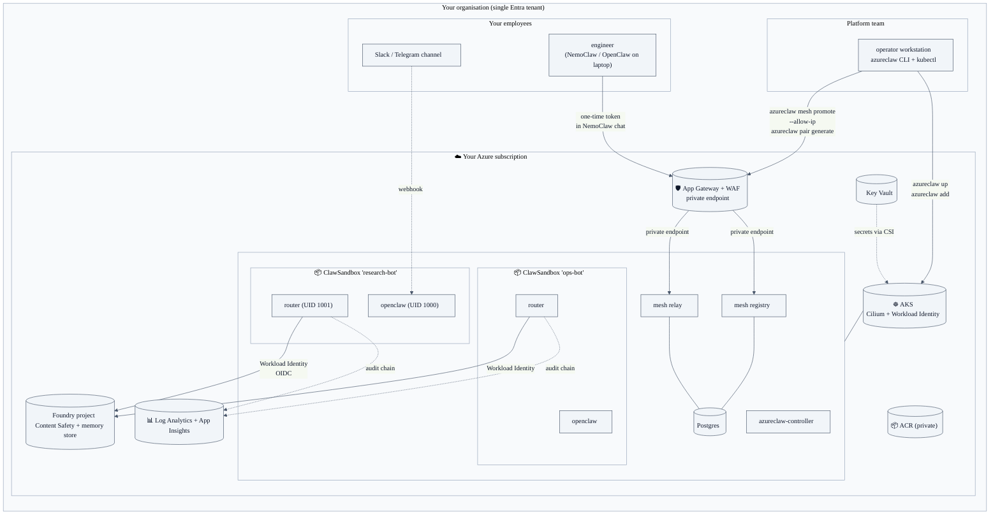
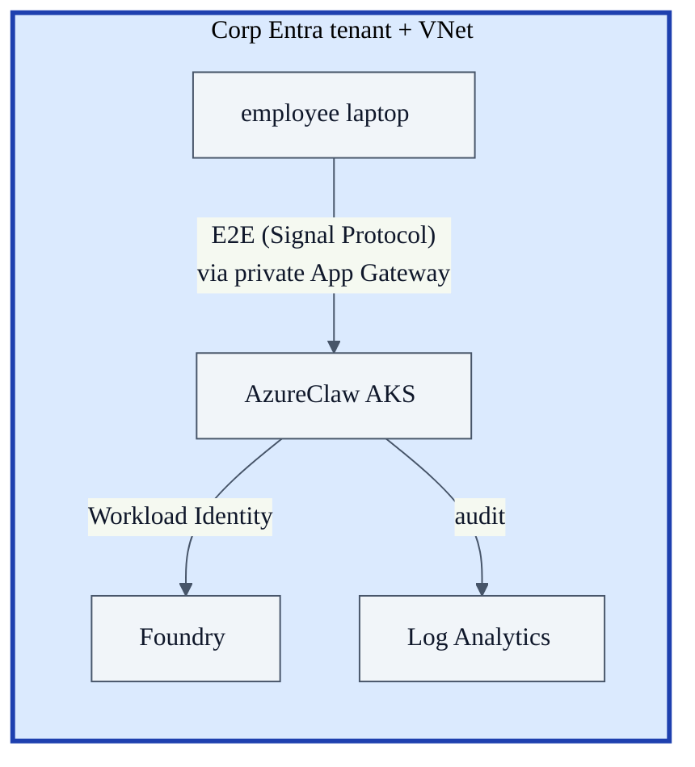
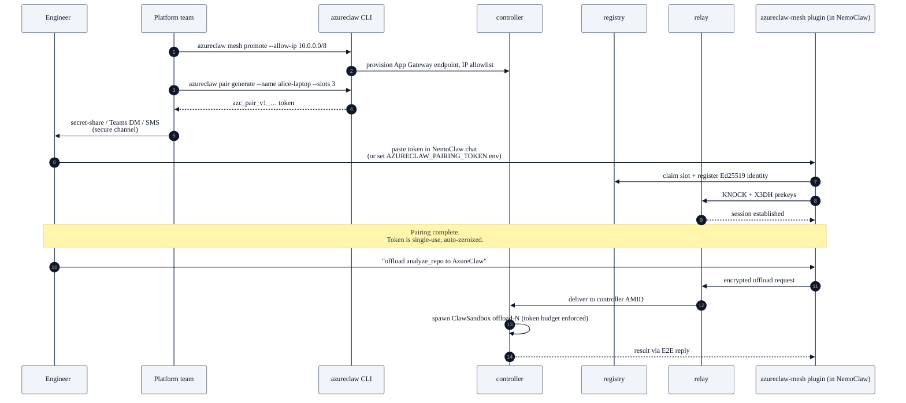

# Blueprint 02 — Enterprise self-hosted cluster

> "I'm a platform team inside one organisation. I want to give my engineers and product teams a hardened, governed AI agent runtime on AKS that I own end-to-end — same Entra tenant, same network island, same audit destination, no third-party SaaS in the data path."

## Persona & intent

- **You are:** the platform / infra / SRE team inside one company. You own an Azure subscription, an Entra tenant, and a security-approved Azure AI Foundry project.
- **You want:** to run AzureClaw as a single-tenant cluster for *your own* employees and *your own* services. Anyone consuming agents is inside the same Entra tenant or paired in via your operator-managed pairing tokens.
- **You do not want:** any agent traffic to leave your VNet. Any provider you can't audit in the data path. Any plaintext in the relay.

## Topology



## Trust boundary



- **Single trust domain.** Everything inside the Entra tenant.
- **No cleartext at rest** — pairing token hashes only, audit chain hash-chained, mesh sessions Double-Ratchet keyed.
- **No cleartext in flight** — App Gateway private endpoint terminates corp TLS; relay traffic remains Signal-protocol-encrypted end-to-end *inside* the TLS tunnel.

## Primary flow — onboarding a new employee laptop



## What you provision

### CRDs in use

Blueprint 02 uses the full Phase 2 CRD stack. Apply these in the sandbox namespace (`azureclaw-<name>`) before creating the `ClawSandbox`:

| CRD | Role in this blueprint |
|---|---|
| `InferencePolicy` | Token budget per sandbox / per team; content-safety floor; model-preference fallback order. Referenced by `ClawSandbox.spec.inferenceRef.name`. |
| `ToolPolicy` | Per-tool rate limits, AP2 commerce spend caps, human-in-the-loop approval channels. Referenced by `ClawSandbox.spec.governance.toolPolicyRef.name`. |
| `McpServer` | Declare private internal MCP tool servers (e.g., `ticketing.corp.example`, `code-search.corp.example`). OAuth 2.1 gated in production mode. |
| `A2AAgent` | Publish an A2A 1.2 agent card for cross-org callers. See Blueprint 04 for federation use. |
| `ClawMemory` | Bind a sandbox to a Foundry Memory Store for persistent per-agent or per-scope memory. |
| `ClawEval` | Schedule regression eval runs via Foundry Evals; threshold-based pass/fail surfaced as `EvalsPassed` condition. |

### Multi-runtime selection

Enterprise teams often have existing agent code in Python or .NET. `spec.runtime.kind` selects the adapter without changing the router, governance, or audit chain:

| `kind` | Use case | Tier |
|---|---|---|
| `OpenClaw` | Default. AzureClaw plugin + OpenClaw framework. | Tier-1 |
| `OpenAIAgents` | Python teams using the OpenAI Agents SDK. Bring OCI image or git URL. | Tier-1 |
| `MicrosoftAgentFramework` | Python or .NET teams on the Microsoft Agent Framework. | Tier-1 |
| `SemanticKernel`, `LangGraph`, `Anthropic` | Schema shipped; adapters landing in a future phase (`RuntimeReady=False/AdapterMissing` until then). | Tier-2 |
| `BYO` | Any container declaring the `org.azureclaw.runtime.contract` OCI label. | Tier-1 |

```yaml
# Example: enterprise team migrating from Python OpenAI Agents SDK
apiVersion: azureclaw.azure.com/v1alpha1
kind: InferencePolicy
metadata:
  name: research-bot-policy
  namespace: azureclaw-research-bot
spec:
  tokenBudget:
    dailyTokens: 2000000
    monthlyTokens: 40000000
  contentSafety:
    requirePromptShields: true
---
apiVersion: azureclaw.azure.com/v1alpha1
kind: ClawSandbox
metadata:
  name: research-bot
  namespace: azureclaw-research-bot
spec:
  runtime:
    kind: OpenAIAgents
    openaiAgents:
      agentCode:
        oci:
          image: myacr.azurecr.io/research-agent:latest
  inferenceRef:
    name: research-bot-policy   # ref form (S13); never inline
  governance:
    enabled: true
    toolPolicyRef:
      name: research-bot-tools
  networkPolicy:
    allowlistRef:                # production path: signed OCI artifact (see below)
      registry: myacr.azurecr.io
      repository: azureclaw-policy/research-bot-egress
      digest: sha256:…
      artifactType: application/vnd.azureclaw.egress-allowlist.v1+yaml
```

### Signed OCI egress allowlist (production path)

Inline `allowedEndpoints` lists are practical for inner-loop iteration, but production clusters should use signed allowlist artifacts as the authoritative egress policy. This enables GitOps-managed, supply-chain-auditable network policy:

```
┌─ build host (CI) ────────────────────────────────────────┐
│  1. azureclaw egress sign                                │
│     --allowlist egress.yaml                             │
│     --push myacr.azurecr.io/azureclaw-policy/bot-egress │
│     --mode keyless   # or: oidc-token | kms             │
│  → emits OCI artifact + cosign signature                 │
└──────────────────────────────────────────────────────────┘
            ↓ digest pinned in ClawSandbox.spec.networkPolicy.allowlistRef
┌─ controller ─────────────────────────────────────────────┐
│  2. Fetch artifact from ACR on every reconcile          │
│  3. Verify signature against SignerPolicy ConfigMap     │
│     (Fulcio issuer + SAN allowlist, namespace-pinned)   │
│  4. If verify fails → AllowlistVerified=False           │
│     + sandbox stays in current (safe) state (fail-closed)│
│  5. If verify passes → AllowlistVerified=True           │
│     + NetworkPolicy updated atomically                   │
└──────────────────────────────────────────────────────────┘
```

**Signing modes:**

| Mode | How it works | When to use |
|---|---|---|
| `keyless` (default) | Sigstore / Fulcio: identity bound to OIDC token; no long-lived key material. | GitHub Actions, Azure Pipelines with OIDC. |
| `oidc-token` | Explicit OIDC token exchanged for Fulcio short-lived cert. | Workload Identity environments. |
| `kms` | Azure KMS (Key Vault) signing key. Brings your own key hierarchy. | Air-gap pre-staging or regulatory key custody. |

Install the `SignerPolicy` ConfigMap once per cluster to pin which signer identity is authoritative:

```yaml
apiVersion: v1
kind: ConfigMap
metadata:
  name: azureclaw-signer-policy
  namespace: azureclaw-system
data:
  policy.yaml: |
    fulcioIssuers:
      - https://token.actions.githubusercontent.com
    sanPatterns:
      - "^https://github\\.com/myorg/myrepo/.*"
```

A malformed or absent `SignerPolicy` surfaces as `AllowlistVerified=False/SignerPolicyMissing` on all sandboxes that use `allowlistRef`. The controller **never silently falls back** to allowing all signers.

### CLI commands

```bash
# One-time per cluster
azureclaw up                                      # AKS + ACR + Foundry + Key Vault + initial sandboxes
azureclaw operator                                # live TUI for the cluster

# Per agent
azureclaw add research-bot --model gpt-4.1 --governance --learn-egress
azureclaw add ops-bot --model gpt-5-mini --governance
azureclaw credentials update research-bot --telegram-token "<bot-token>"

# Sign and push egress allowlist artifact (CI / GitOps step)
azureclaw egress sign \
  --allowlist research-bot-egress.yaml \
  --push myacr.azurecr.io/azureclaw-policy/research-bot-egress \
  --mode keyless

# Onboard a NemoClaw / OpenClaw user (no AzureClaw CLI on their laptop)
azureclaw mesh promote --allow-ip 10.0.0.0/8      # one-time, exposes registry+relay over private App Gateway
azureclaw pair generate --name alice-laptop --slots 3 --capabilities offload,handoff

# Day-2 ops
azureclaw policy allow research-bot api.example.com
azureclaw model set research-bot gpt-5-mini
azureclaw egress research-bot --learned
azureclaw trace research-bot --network
```

## What's unique to this blueprint

- **Single tenant, single audit destination.** Everything an employee or a CI job does flows into your Log Analytics + audit chain. No third party.
- **Workload Identity instead of API keys.** The router binds to a federated K8s ServiceAccount → Entra workload identity. Foundry sees the request as your tenant.
- **Pairing replaces VPN-for-agents.** Employees don't need a VPN tunnel to AzureClaw — they get a one-time token that scopes them to one slot of one capability set with one budget cap. Lost laptop = revoke one Pairing CR.
- **Multi-runtime, single governance plane.** Teams can run `OpenClaw`, `OpenAIAgents`, or `MicrosoftAgentFramework` agents side-by-side on the same cluster with identical `InferencePolicy` + `ToolPolicy` governance and the same audit chain. Switch runtimes by changing `spec.runtime.kind`.
- **Signed OCI egress allowlist as the production network policy path.** Inline `allowedEndpoints` are fine for day-0; sign and pin allowlist artifacts in CI for auditable, GitOps-managed network policy. The `SignerPolicy` ConfigMap in `azureclaw-system` pins the authoritative signer identity; the controller fails closed if the policy is absent or the signature doesn't match.
- **You can scale Confidential Containers in.** AKS supports kata + AMD SEV-SNP node pools today. Set `ClawSandbox.spec.sandbox.isolation: confidential` per-agent for sensitive workloads; sub-agents inherit and cannot downgrade.
- **CNCF Kubernetes AI Conformance v1.35+.** The cluster and all eight CRDs pass the CNCF AI Conformance suite (`tests/cncf-conformance/`). This gives you a reproducible, vendor-neutral benchmark and audit evidence for your security reviewers.

## Operator polish

The Phase 2 controller ships production-grade operator hygiene relevant to enterprise deployments:

- **Leader election.** The controller Deployment runs two replicas (`replicas: 2`) with a `coordination.k8s.io/v1` Lease (`azureclaw-leader-election`). Exactly one pod reconciles at a time; leadership loss triggers a pod restart and immediate re-election. Opt out with `LEADER_ELECTION_ENABLED=false` for single-replica dev clusters.
- **Jittered requeue.** Every error-requeue duration carries ±20% multiplicative jitter (module `controller::backoff`). This prevents thundering-herd API-server bursts when many CRs fail simultaneously (e.g., after a Foundry outage).
- **Prometheus metrics on `:9091`.** The controller pod exposes `azureclaw_controller_reconcile_errors_total{crd_kind,error_class}` and `azureclaw_controller_reconcile_retries_total{crd_kind}` on `http://<pod>:9091/metrics`. Wire a `ServiceMonitor` or `PodMonitor` to scrape it; add to your SLO dashboards. Override bind address with `CONTROLLER_METRICS_ADDR` (e.g., `127.0.0.1:9091` to restrict to localhost).

## What this blueprint is NOT

- Not a multi-tenant SaaS. If you serve external customers, see Blueprint 03.
- Not a federation pattern. If you collaborate with another org's AzureClaw, see Blueprint 04.
- Not air-gapped. If your network can't reach Foundry, see Blueprint 05.

## References

- `cli/src/commands/up.ts` (Bicep + Helm provisioning)
- `controller/src/reconciler/mod.rs` (sandbox composition)
- `controller/src/pairing.rs` + `cli/src/commands/pair.ts` (token issuance)
- `controller/src/leader_election.rs` + `controller/src/backoff.rs` (HA + jitter)
- `controller/src/metrics.rs` + `controller/src/metrics_server.rs` (`:9091` scrape)
- `controller/src/policy_fetcher.rs` (signed OCI allowlist fetch + verify)
- `inference-router/src/auth.rs` (Workload Identity OIDC exchange)
- `deploy/helm/azureclaw/values.yaml` (Helm contract)
- `docs/api/crd-reference.md` (all 8 CRDs)
- `docs/policy-canonical-format.md` (egress allowlist format + signing modes)
- `docs/sigs-agent-sandbox-compat.md` (CNCF K8s AI Conformance v1.35+)
- ADR-0001 — A2A ingress front-edge (`docs/adr/0001-a2a-ingress-front-edge.md`)
