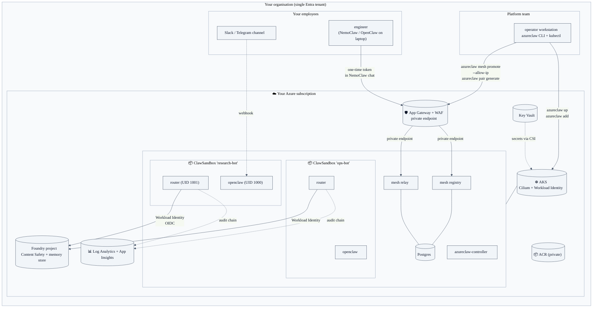
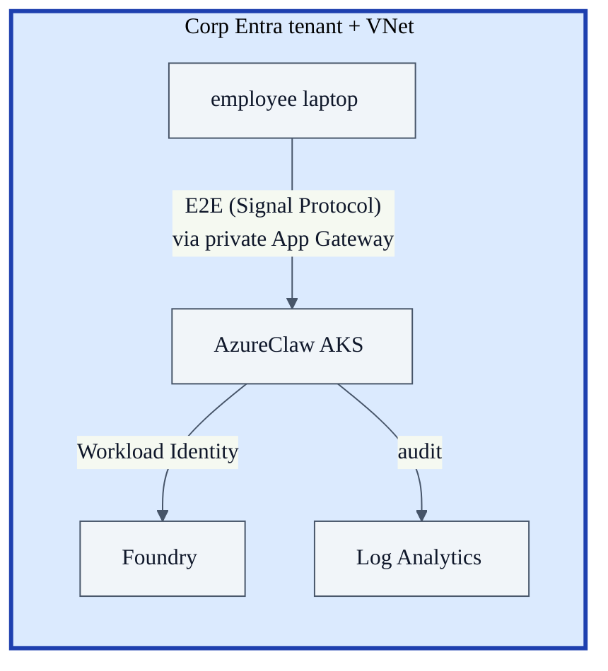
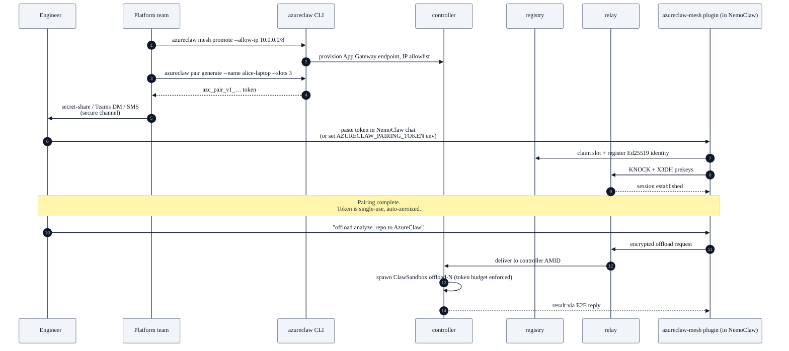

# Blueprint 02 — Enterprise self-hosted cluster

> "I'm a platform team inside one organisation. I want to give my engineers and product teams a hardened, governed AI agent runtime on AKS that I own end-to-end — same Entra tenant, same network island, same audit destination, no third-party SaaS in the data path."

## Persona & intent

- **You are:** the platform / infra / SRE team inside one company. You own an Azure subscription, an Entra tenant, and a security-approved Azure AI Foundry project.
- **You want:** to run AzureClaw as a single-tenant cluster for *your own* employees and *your own* services. Anyone consuming agents is inside the same Entra tenant or paired in via your operator-managed pairing tokens.
- **You do not want:** any agent traffic to leave your VNet. Any provider you can't audit in the data path. Any plaintext in the relay.

## Topology



## Trust boundary



- **Single trust domain.** Everything inside the Entra tenant.
- **No cleartext at rest** — pairing token hashes only, audit chain hash-chained, mesh sessions Double-Ratchet keyed.
- **No cleartext in flight** — App Gateway private endpoint terminates corp TLS; relay traffic remains Signal-protocol-encrypted end-to-end *inside* the TLS tunnel.

## Primary flow — onboarding a new employee laptop



## What you provision

```bash
# One-time per cluster
azureclaw up                                      # AKS + ACR + Foundry + Key Vault + initial sandboxes
azureclaw operator                                # live TUI for the cluster

# Per agent
azureclaw add research-bot --model gpt-4.1 --governance --learn-egress
azureclaw add ops-bot --model gpt-5-mini --governance
azureclaw credentials update research-bot --telegram-token "<bot-token>"

# Onboard a NemoClaw / OpenClaw user (no AzureClaw CLI on their laptop)
azureclaw mesh promote --allow-ip 10.0.0.0/8      # one-time, exposes registry+relay over private App Gateway
azureclaw pair generate --name alice-laptop --slots 3 --capabilities offload,handoff

# Day-2 ops
azureclaw policy allow research-bot api.example.com
azureclaw model set research-bot gpt-5-mini
azureclaw egress research-bot --learned
azureclaw trace research-bot --network
```

## What's unique to this blueprint

- **Single tenant, single audit destination.** Everything an employee or a CI job does flows into your Log Analytics + audit chain. No third party.
- **Workload Identity instead of API keys.** The router binds to a federated K8s ServiceAccount → Entra workload identity. Foundry sees the request as your tenant.
- **Pairing replaces VPN-for-agents.** Employees don't need a VPN tunnel to AzureClaw — they get a one-time token that scopes them to one slot of one capability set with one budget cap. Lost laptop = revoke one Pairing CR.
- **You can scale Confidential Containers in.** AKS supports kata + AMD SEV-SNP node pools today. Set `ClawSandbox.spec.isolation: confidential` per-agent for sensitive workloads; sub-agents inherit and cannot downgrade.

## What this blueprint is NOT

- Not a multi-tenant SaaS. If you serve external customers, see Blueprint 03.
- Not a federation pattern. If you collaborate with another org's AzureClaw, see Blueprint 04.
- Not air-gapped. If your network can't reach Foundry, see Blueprint 05.

## References

- `cli/src/commands/up.ts` (Bicep + Helm provisioning)
- `controller/src/reconciler/mod.rs` (sandbox composition)
- `controller/src/pairing.rs` + `cli/src/commands/pair.ts` (token issuance)
- `inference-router/src/auth.rs` (Workload Identity OIDC exchange)
- `deploy/helm/azureclaw/values.yaml` (Helm contract)
- ADR-0001 — A2A ingress front-edge (`docs/adr/0001-a2a-ingress-front-edge.md`)
