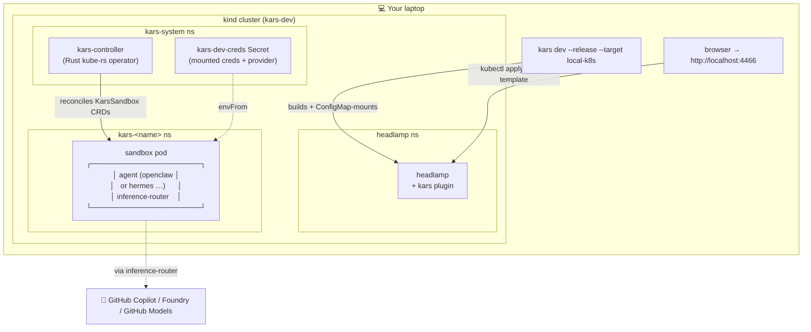
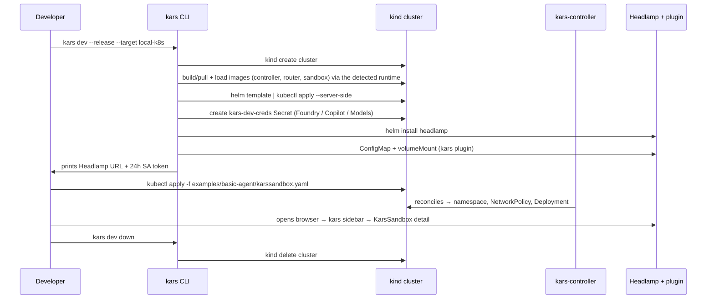

# Blueprint 02 — Local Kubernetes dev loop

> *"I'm on my laptop. I want production-shaped infrastructure — kind cluster, CRDs, controller, sidecar router, NetworkPolicies, Headlamp dashboard — without standing up AKS. When I'm done, one command tears it all down."*

## Persona & intent

- **You are:** a kars maintainer working on the controller, the inference router, the CRD schema, or the Headlamp plugin. Or an agent author who wants to see exactly what AKS will do to your `KarsSandbox` before you push to AKS.
- **You want:** the same Helm chart, the same CRDs, the same controller image, the same router image — running locally on a kind cluster — with a dashboard that shows you everything in one place.
- **You do not want:** to maintain a separate "Docker dev" code path that drifts from the K8s code path.

This blueprint is the **K8s-shaped** developer loop and the **recommended primary dev flow** for kars: it reproduces the production pod shape, `NetworkPolicy`, UID split, and the controller reconciliation loop, so what's green here is green in AKS. For the lighter-weight single-Docker-container fast inner loop, see [Blueprint 01](01-developer-inner-loop.md). Both are first-class — start in local-k8s for anything you intend to ship, and drop to Docker only for quick prompt or tool-policy iteration.

The **Headlamp plugin** is the operational UX for this loop: a browser dashboard (`http://localhost:4466`) with a dedicated **kars sidebar** that surfaces every `KarsSandbox` and its sibling CRDs, live reconciliation status, pod health, and events — so you watch the controller do its work instead of polling `kubectl`.

## Topology



## Trust boundary

The trust boundary is **identical to AKS in all respects except node isolation**:

- ✅ Sidecar router as the only egress path.
- ✅ NetworkPolicy isolating sandbox namespace.
- ✅ ServiceAccount + RBAC per sandbox.
- ✅ Strict seccomp profile from the chart (Linux + macOS arm64 / amd64).
- ✅ Same `kars-controller` and `kars-inference-router` images that AKS runs (just locally built and `kind load`-ed).
- ⚠️ **Single-node kind cluster** — no cross-node isolation. The control-plane node is labelled `kars.azure.com/pool=sandbox` so sandboxes schedule, with **no NoSchedule taint** (the lone node has to host everything).
- ⚠️ **No Workload Identity.** Credentials are mounted from the dev secret (api-key mode for Foundry, GitHub PAT for Copilot/Models). Production AKS uses IMDS-exchanged tokens.

## Primary flow



## What you provision

```bash
# 1. Build images locally (one-time per change to controller / router / sandbox).
make image-controller image-inference-router
make sandbox-image  # or `kars push --only sandbox` against a local registry

# 2. Bring everything up (~2 min first run, ~30 s on re-runs).
kars dev --release --target local-k8s

# 3. Apply a sandbox CR.
kubectl apply -f examples/basic-agent/karssandbox.yaml -n kars-system

# 4. Watch reconciliation in Headlamp's kars → Sandboxes view.

# 5. When done.
kars dev down                      # delete cluster + kill port-forward
kars dev down --keep-cluster       # only stop port-forward
```

The CLI handles:

- Kind cluster create (idempotent — re-runs reuse).
- Cross-arch image load (kind load → fallback `<runtime> save | ctr images import`).
- Container runtime auto-detection (docker → podman → nerdctl, in order of preference). Override with `KARS_DEV_RUNTIME=docker|podman|nerdctl`. kind is invoked with `KIND_EXPERIMENTAL_PROVIDER` set automatically when needed.
- Node label `kars.azure.com/pool=sandbox` so sandboxes schedule on the single node.
- Helm chart render with a per-run overlay containing the dev secret name.
- Headlamp install via official chart.
- Build + ConfigMap-mount the kars Headlamp plugin.
- Detached `kubectl port-forward` for Headlamp on `:4466` (survives CLI exit).
- Browser open + 24h ServiceAccount token print.

## What is unique

| Property | This blueprint | Blueprint 01 (Docker dev) | Blueprint 03 (AKS) |
|---|---|---|---|
| Runtime | kind cluster | Single Docker container | Managed AKS |
| CRDs / controller | ✅ Real | ❌ Skipped (CLI generates equivalent config inline) | ✅ Real |
| NetworkPolicy / RBAC | ✅ Real | ❌ One process, one netns | ✅ Real |
| Inference router | Sidecar pod | Co-located in same container | Sidecar pod |
| Auth mode | API key from dev secret | API key from dev secret | Workload Identity (IMDS) |
| Dashboard | Headlamp + kars plugin | `kars connect` (gateway port-forward) | Azure Portal + Headlamp |
| Teardown | `kars dev down` | `kars destroy <name>` | `kars destroy <name>` |

The point is: this blueprint validates **the K8s glue** (controller reconciliation, CRD admission, helm chart, NetworkPolicy) before you ever touch AKS. If `kars dev --release --target local-k8s` is green, the AKS bring-up is almost guaranteed to be green too.

## References

- Implementation: `cli/src/commands/dev/local-k8s.ts`
- Headlamp plugin: `tools/headlamp-plugin/`
- Helm chart overlay: `deploy/helm/kars/values-local-dev.yaml`
- CRDs: `deploy/helm/kars/templates/crd-*.yaml`
- Strict seccomp profile: `deploy/helm/kars/files/kars-strict.json`

---

_Last tested with kars `v0.1.18` on 2026-06-26._
