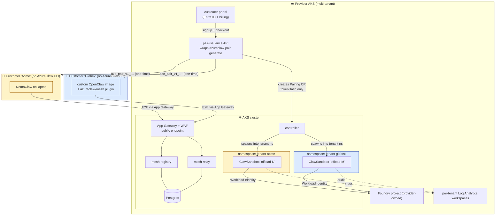
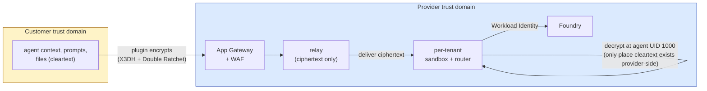
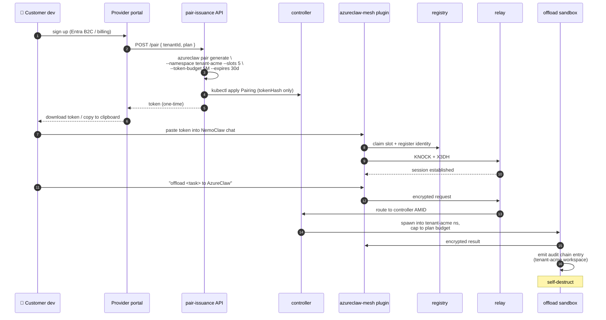

# Blueprint 03 — Managed public offload service

> "I'm a SaaS provider. I want to run AzureClaw as a managed offload service for many external customers — each one a different Entra tenant, none of them with kubectl access, all of them onboarded by token, all of them isolated from each other at every layer."

## Persona & intent

- **You are:** the SaaS provider running an AzureClaw cloud. Your customers run OpenClaw / NemoClaw / any-OpenClaw on their laptops, in their offices, in their own clusters — anywhere — and offload heavy or sensitive tasks to your AKS.
- **You want:** a single AKS cluster (or a few regional clusters) hosting many tenants. Self-service onboarding via your portal. Per-tenant token budgets, slot caps, capability scopes. Provider-side observability without ever decrypting customer mesh traffic.
- **You do not want:** to ever hold customer-side LLM context in cleartext. To require customers to install your CLI. To leak one tenant's audit chain to another.

## Topology



## Trust boundary



The trust boundary lives **at the sandbox pod**, not at the App Gateway:

- The relay sees only ciphertext.
- The customer's prompts + files exist as cleartext only inside one ephemeral sandbox pod, in one tenant namespace, for the duration of one offload, fronted by Foundry-side Content Safety.
- The pairing token is single-use, scoped to one Pairing CR (one tenant namespace, one slot count, one token budget, one capability list, one expiration).

## Primary flow — customer signs up + offloads a task



## What you provision

The CRDs and CLI are identical to Blueprint 02; the difference is **scale + automation + per-tenant scoping**.

```bash
# Per regional cluster (one-time):
azureclaw up --multi-tenant --regions eastus,westeurope
azureclaw mesh promote                    # public endpoint, NOT --allow-ip
helm install provider-portal …            # your portal + billing on the same AKS

# Per tenant onboarding (automated by your portal, not a human):
kubectl create namespace tenant-acme
kubectl apply -f tenant-acme-rbac.yaml    # ServiceAccount + Workload Identity
azureclaw pair generate \
  --name acme-prod \
  --namespace tenant-acme \
  --slots 5 \
  --token-budget 5000000 \
  --expires 30d \
  --capabilities offload,handoff,a2a

# Day-2:
azureclaw operator --tenant tenant-acme   # operator TUI scoped to one tenant
```

## What's unique to this blueprint

- **Customers don't install your CLI.** Customer-side install is the OpenClaw plugin, which is upstreamed. Your portal hands them a token; that's the entire onboarding UX.
- **Per-tenant namespace + per-tenant audit destination.** AzureClaw already namespaces every sandbox by name; the SaaS pattern just stamps a tenant prefix. Audit chains land in per-tenant Log Analytics workspaces (one workspace per Pairing CR's `tenantId` annotation).
- **Pairing tokens are commerce-aware.** `--token-budget`, `--slots`, `--expires`, `--capabilities` map directly to your billing plan. Plan upgrade = new Pairing CR with bigger limits; old token revoked.
- **Provider observability without decryption.** You can see *that* tenant `acme` exchanged 142 mesh frames in the last hour and consumed 1.2M Foundry tokens. You cannot see *what was in those frames*.
- **Future:** managed AP2 (Agent Payments Protocol) lets your customers spend their token budget through signed mandates with audit. Today: schema present; mounting deferred to a future phase.

## What this blueprint is NOT

- Not a deployment customers run themselves. For that, see Blueprint 02 — they get the same controller and CRDs in their own subscription.
- Not a substitute for tenant-level WAF / DDoS controls — App Gateway + Front Door are still your job.
- Not a model marketplace. The Foundry project remains provider-side; if a customer wants their own model, route to a tenant-bound Foundry connection (`azureclaw model set --tenant`).

## Operational guardrails

- **Cross-tenant escape is treated as a P0.** NetworkPolicy default-deny + per-tenant namespace scoping + per-tenant ServiceAccount token audience + sandbox UID isolation collectively block the obvious paths. The fuzz/conformance suite covers cross-tenant token spoofing.
- **Pairing-token revocation must be immediate.** `kubectl delete pairing acme-prod` synchronously evicts active mesh sessions for that tenant; the registry refuses new connects.
- **Foundry quota is per-tenant.** Either issue per-tenant Foundry projects or use Foundry's quota policies; the router enforces a soft cap via `--token-budget` regardless.

## References

- `controller/src/pairing.rs` (multi-tenant `Pairing.spec.namespace` field)
- `inference-router/src/auth.rs` (per-namespace Workload Identity selection)
- `cli/src/commands/pair.ts` (`--namespace`, `--capabilities`, `--token-budget`)
- ADR-0001 (A2A ingress front-edge, identical pattern for A2A 1.0.0 inbound)
- `docs/use-cases.md` Scenario 2 (the customer-side experience)
