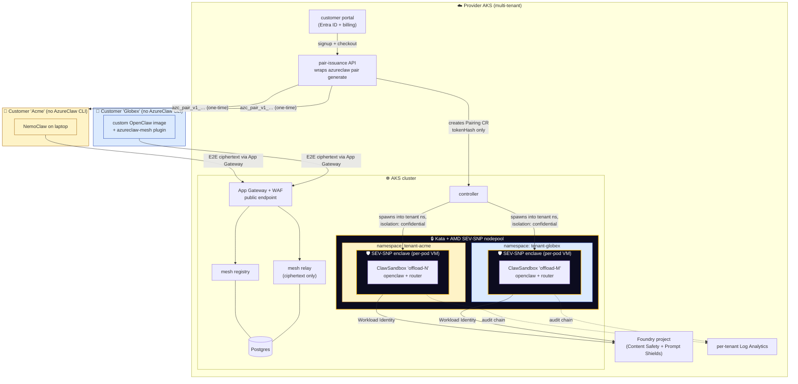
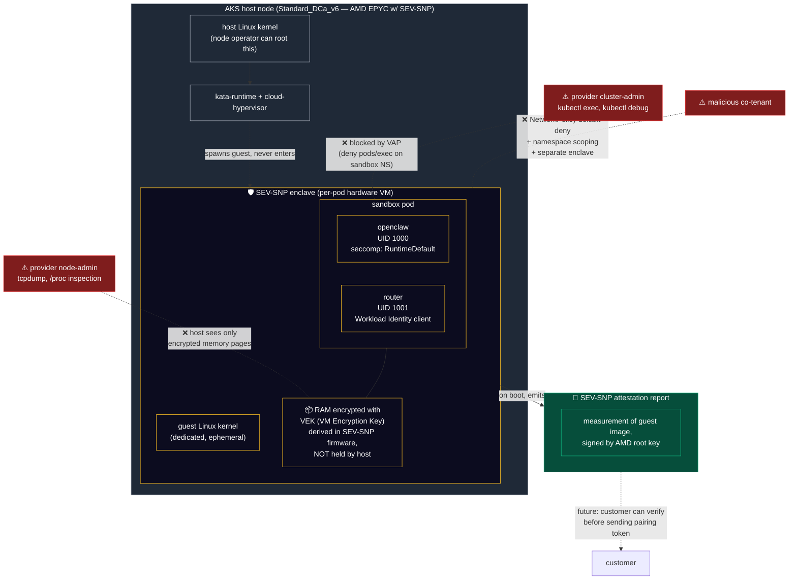
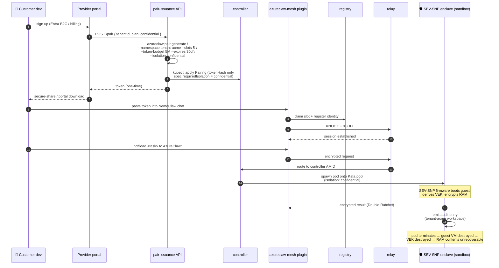

# Blueprint 03 — Managed public offload service

> "I'm a SaaS provider. I want to run AzureClaw as a managed offload service for many external customers — each one a different Entra tenant, none of them with kubectl access, all of them onboarded by token, all of them isolated from each other and from me at every layer, including the host kernel."

> **Status: ✅ Runtime shipping. 🚧 SaaS productization in progress.** The hardware-isolated sandbox runtime, the pairing protocol, the per-tenant namespace + Workload Identity scoping, the confidential-mode Kata VM + AMD SEV-SNP nodepool, the audit chain, and the Foundry-side Content Safety are all validated end-to-end on live AKS today (see [`docs/security-validation.md`](../security-validation.md)). What's "🚧" is the *SaaS wrapper* around it: portal + billing + automated onboarding + per-tenant Foundry-quota sharding. The scary parts (isolation + crypto) are not the parts that need productizing.

## Why this blueprint matters

This is the use case where AzureClaw's threat model earns its complexity. In every other blueprint, you (the operator) and the agent user are in the same trust domain — you'd both lose if a sandbox escaped. Here, **the provider is one of the parties the customer is defending against**: a malicious or compromised provider operator could otherwise tail a customer's prompts, exfiltrate their files, or impersonate them to upstream services.

AzureClaw makes that attack mathematically infeasible by stacking three independent isolation primitives:

1. **Signal-Protocol mesh** — the relay sees only ciphertext (X3DH + Double Ratchet). The provider can't read what the customer sent over the wire even with a `tcpdump` on the cluster ingress.
2. **Confidential Containers (Kata + AMD SEV-SNP)** — the sandbox pod runs in a hardware-isolated lightweight VM with its own kernel. Pod memory is encrypted by the CPU with a key the host doesn't have. The provider's cluster-admin cannot `kubectl exec` into the pod (VAP blocks it) and cannot read the pod's RAM from the host (SEV-SNP enforces it).
3. **Foundry-side Content Safety + audit chain** — the only cleartext path is sandbox → Foundry over Workload Identity, with `Microsoft.DefaultV2` Prompt Shields on every inference and a tamper-evident audit chain on the customer's own Log Analytics workspace.

Net effect: the customer's cleartext exists for ~milliseconds, only inside an SEV-SNP enclave, only when their own task is being executed, and any access — even by the provider's cluster-admin — is either physically prevented (SEV-SNP) or detected (audit chain).

## Persona & intent

- **You are:** the SaaS provider running an AzureClaw cloud. Your customers run OpenClaw / NemoClaw / any-OpenClaw on their laptops, in their offices, in their own clusters — anywhere — and offload heavy or sensitive tasks to your AKS.
- **You want:** a single AKS cluster (or a few regional clusters) hosting many tenants. Self-service onboarding via your portal. Per-tenant token budgets, slot caps, capability scopes. Provider-side observability without ever decrypting customer mesh traffic.
- **You do not want:** to ever hold customer-side LLM context in cleartext on a host you control. To require customers to install your CLI. To leak one tenant's audit chain to another. To have a cluster-admin compromise read customer prompts in flight.

## Topology



## The hardware-isolated sandbox (where the magic is)



**What each defence is for:**

| Threat | Defence | Mechanism |
|---|---|---|
| Customer prompt sniffed by provider on the wire | **Signal-Protocol mesh** | Relay routes ciphertext only. Decryption key never leaves either endpoint. |
| Customer prompt read by provider operator on disk / RAM | **Kata VM + AMD SEV-SNP** | Per-pod dedicated guest kernel; RAM encrypted by CPU with a key derived in SEV-SNP firmware. Host can dump pages — they're ciphertext. |
| Customer command-execed-into by provider cluster-admin | **VAP (ValidatingAdmissionPolicy)** | `deny-pod-exec` VAP rejects `pods/exec`, `pods/attach`, `pods/portforward` on sandbox namespaces, even from a cluster-admin token. |
| Co-tenant lateral movement | **Per-tenant namespace + NetworkPolicy default-deny + per-pod enclave** | Each tenant gets a separate K8s namespace with its own NetworkPolicy. Each sandbox pod gets its own SEV-SNP enclave — co-tenants don't share a guest kernel. |
| Sub-agent isolation downgrade | **Isolation-inheritance VAP** | Sub-agent spawn requests must inherit the parent's isolation level; downgrade to `enhanced` or `standard` is admission-denied. The controller and the inference router both refuse downgrades; the VAP is the third independent enforcement point. |
| Image substitution (provider serves a tampered sandbox image) | **SEV-SNP attestation report (roadmap)** | The guest emits a measurement signed by the AMD root key on boot. Customers can refuse to send their pairing token until the measurement matches the published image hash. *Today*: cosign-signed sandbox images verified at admission. *Roadmap*: end-to-end remote attestation. |

## Trust boundary

```mermaid
flowchart LR
  subgraph Cust["Customer trust domain"]
    UserCtx["agent context, prompts,<br/>files (cleartext)"]
  end
  subgraph Wire[" mesh wire (ciphertext) "]
    Frame["Signal Protocol envelope<br/>X3DH + Double Ratchet"]
  end
  subgraph Provider["Provider trust domain"]
    Edge["App Gateway<br/>+ WAF"]
    Relay["relay<br/>(ciphertext only)"]
  end
  subgraph Enclave["🛡 SEV-SNP enclave (per-pod)"]
    direction TB
    Sandbox["sandbox + router<br/>(only place cleartext exists)"]
  end
  subgraph FoundryDom["Foundry trust domain"]
    Foundry["Foundry + Content Safety"]
  end

  UserCtx -->|"plugin encrypts"| Wire
  Wire --> Edge
  Edge --> Relay
  Relay -->|"deliver ciphertext"| Sandbox
  Sandbox -->|"Workload Identity"| Foundry

  classDef cust fill:#fef3c7,stroke:#a16207;
  classDef prov fill:#dbeafe,stroke:#1e40af;
  classDef enc fill:#0c0c1f,stroke:#fbbf24,color:#fff;
  classDef fnd fill:#dcfce7,stroke:#16a34a;
  class Cust cust;
  class Provider prov;
  class Enclave enc;
  class FoundryDom fnd;
```



The crucial property: **the provider's trust domain (the AKS cluster, the relay, App Gateway) and the SEV-SNP enclave domain (the sandbox pod) are different domains**, even though the enclave runs on a node in the provider's cluster. The provider operates the host; the enclave operates the guest. The host cannot read into the guest.

## Primary flow — customer signs up + offloads a confidential task



## What you provision

The CRDs and CLI are identical to Blueprint 02; the difference is **scale + automation + per-tenant scoping + confidential-by-default**.

```bash
# Per regional cluster (one-time):
azureclaw up --multi-tenant --regions eastus,westeurope \
  --kata-pool-min 3 --kata-pool-vm-size Standard_DC4as_v6   # SEV-SNP-capable AMD EPYC
azureclaw mesh promote                                       # public endpoint (App Gateway + WAF)
helm install provider-portal …                               # your portal + billing on the same AKS

# Per tenant onboarding (automated by your portal, not a human):
kubectl create namespace tenant-acme
kubectl apply -f tenant-acme-rbac.yaml         # ServiceAccount + Workload Identity
azureclaw pair generate \
  --name acme-prod \
  --namespace tenant-acme \
  --slots 5 \
  --token-budget 5000000 \
  --expires 30d \
  --capabilities offload,handoff,a2a \
  --required-isolation confidential            # admission-deny anything weaker

# Day-2:
azureclaw operator --tenant tenant-acme        # operator TUI scoped to one tenant
```

## What's unique to this blueprint

- **Customers don't install your CLI.** Customer-side install is the OpenClaw plugin, which is upstreamed. Your portal hands them a token; that's the entire onboarding UX.
- **Confidential by default for offload sandboxes.** Pairing CRs can carry `spec.requiredIsolation: confidential` so the controller refuses to spawn anything weaker than a Kata + SEV-SNP pod for that tenant's offloads. Customers shopping for a SaaS that won't read their prompts have a one-bit answer.
- **Per-tenant namespace + per-tenant audit destination.** AzureClaw already namespaces every sandbox by name; the SaaS pattern just stamps a tenant prefix. Audit chains land in per-tenant Log Analytics workspaces (one workspace per Pairing CR's `tenantId` annotation).
- **Pairing tokens are commerce-aware.** `--token-budget`, `--slots`, `--expires`, `--capabilities`, `--required-isolation` map directly to your billing plan. Plan upgrade = new Pairing CR with bigger limits; old token revoked.
- **Provider observability without decryption.** You can see *that* tenant `acme` exchanged 142 mesh frames in the last hour and consumed 1.2M Foundry tokens. You cannot see *what was in those frames* — neither in flight (Signal Protocol) nor at rest in the sandbox (SEV-SNP).
- **Future:** managed AP2 (Agent Payments Protocol) lets your customers spend their token budget through signed mandates with audit. Schema present today; mounting deferred to a future phase.

## Productization checklist (the "🚧" part)

The runtime is shipping; what wraps around it for SaaS is the productization track:

- [ ] Customer portal (Entra B2C signup + billing + token issuance UX, copy-to-clipboard, secure-share fallback)
- [ ] Per-tenant Foundry quota sharding (per-Pairing-CR Foundry quota bucket; soft + hard caps in router)
- [ ] Multi-region failover (App Gateway → Front Door, regional registry/relay pairs, RPO/RTO targets)
- [ ] Tenant-scoped operator TUI (`azureclaw operator --tenant <id>` already works; SaaS portal mirror is what's missing)
- [ ] Status page + customer-visible metrics (mesh frames, sandbox count, audit-chain hash head)
- [ ] SEV-SNP attestation report exposure (a `/.well-known/attestation/<sandbox>` JSON the customer can verify before trusting a sandbox enclave)
- [ ] SOC 2 / ISO 27001 audit pack (the runtime's audit chain + threat model are most of what's needed; the rest is policy + process)

None of these change the trust model. They change the customer-facing UX around it.

## What this blueprint is NOT

- Not a deployment customers run themselves. For that, see Blueprint 02 — they get the same controller and CRDs in their own subscription.
- Not a substitute for tenant-level WAF / DDoS controls — App Gateway + Front Door are still your job.
- Not a model marketplace. The Foundry project remains provider-side; if a customer wants their own model, route to a tenant-bound Foundry connection (`azureclaw model set --tenant`).
- Not a guarantee against AMD platform-level vulnerabilities. AzureClaw inherits the SEV-SNP threat model; if AMD ships a TCB update, you patch your nodes.

## Operational guardrails

- **Cross-tenant escape is treated as a P0.** NetworkPolicy default-deny + per-tenant namespace scoping + per-tenant ServiceAccount token audience + sandbox UID isolation + per-pod SEV-SNP enclave collectively block the obvious paths. The fuzz/conformance suite covers cross-tenant token spoofing.
- **Pairing-token revocation must be immediate.** `kubectl delete pairing acme-prod` synchronously evicts active mesh sessions for that tenant; the registry refuses new connects.
- **Foundry quota is per-tenant.** Either issue per-tenant Foundry projects or use Foundry's quota policies; the router enforces a soft cap via `--token-budget` regardless.
- **Posture VAPs are tenant-defended.** The Phase 1 VAP set denies isolation downgrade, seccomp removal, `readOnlyRootFilesystem: false`, and `pods/exec|attach|portforward` on sandbox namespaces. Even a cluster-admin compromise cannot ratchet a tenant's posture down.

## References

- `controller/src/pairing.rs` (multi-tenant `Pairing.spec.namespace`, `requiredIsolation` field)
- `controller/src/reconciler/mod.rs` (Kata runtime class selection on `isolation: confidential`)
- `inference-router/src/auth.rs` (per-namespace Workload Identity selection)
- `cli/src/commands/pair.ts` (`--namespace`, `--capabilities`, `--token-budget`, `--required-isolation`)
- `deploy/helm/azureclaw/templates/vap*.yaml` (admission policies enforcing posture invariants)
- `docs/security-validation.md` (live-AKS validation of all 9 defence-in-depth layers, including Kata VM)
- `docs/multi-tenant.md` (per-namespace tenant isolation patterns)
- `docs/security.md` § Layer 2 (Kata VM Isolation)
- `docs/use-cases.md` Scenario 2 (the customer-side experience)
- ADR-0001 (A2A ingress front-edge, identical pattern for A2A 1.0.0 inbound)
