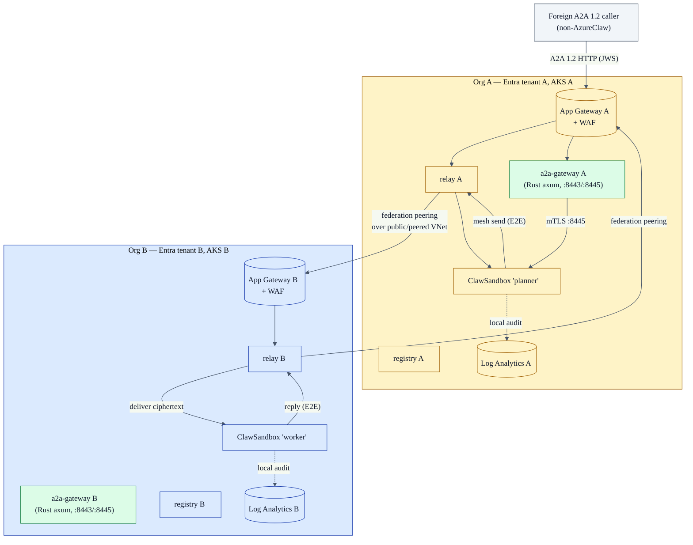
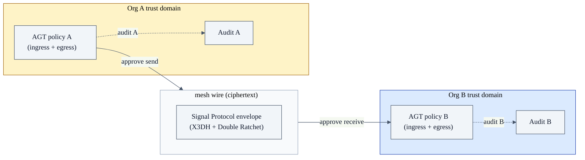
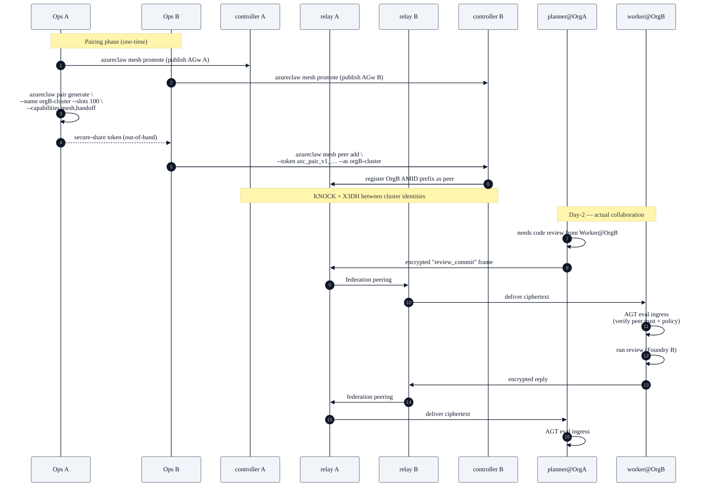

# Blueprint 04 — Cross-org federation

> "We're two organisations who want our agents to collaborate. Each side runs their own AzureClaw cluster. Neither side trusts the other's network, the other's Foundry quota, or the other's audit destination. We want E2E-encrypted, mutually-policy-evaluated agent-to-agent collaboration without merging trust domains."

## Persona & intent

- **You are:** the platform team in *one* of two collaborating organisations. The other org also runs their own AzureClaw — Blueprint 02 in their tenant.
- **You want:** named agents on either side to exchange messages, hand off tasks, and run sub-agents on each other's substrate, with both sides' AGT policies enforced on every hop.
- **You do not want:** to share kubeconfigs. To share Foundry quotas. To share Entra tenants. To trust the other side's audit chain to alibi misbehaviour from your own agents.

## Topology



## Trust boundary



The crucial property: **every mesh frame is policy-evaluated twice**:

- Org A's `PolicyEngine` says "yes, planner is allowed to message worker about commit reviews".
- Org B's `PolicyEngine` says "yes, we accept code-review tasks from planner@OrgA at trust tier 'verified'".

Neither side relies on the other's audit chain. Both sides write their own.

## Primary flow — pairing two clusters, then a handoff



## What you provision

```bash
# Once per cluster (both sides do this):
azureclaw up
azureclaw mesh promote                            # exposes registry+relay through AGw

# Pairing (one side mints, one side accepts):
# Org A:
azureclaw pair generate \
  --name peer-orgB-cluster \
  --slots 100 \
  --token-budget 50000000 \
  --capabilities mesh,handoff \
  --expires 365d
# … secure-share to Org B …
# Org B:
azureclaw mesh peer add \
  --token "azc_pair_v1_…" \
  --as peer-orgA

# Day-2 — name a cross-org agent in chat just like any other peer:
@worker@orgB-cluster please review commit abc123
```

## A2A gateway — cross-org public A2A path

The AgentMesh relay handles authenticated cross-org traffic between AzureClaw clusters. For interoperability with non-AzureClaw agents that speak only **A2A 1.2 HTTP**, the `azureclaw-a2a-gateway` is a Rust axum binary (distroless static image) that sits in front of your sandboxes.

### Architecture

```
Foreign A2A 1.2 caller
         │
         │  POST /.well-known/agent.json  (agent card discovery)
         │  POST /a2a/v1/tasks           (task dispatch, JWS-signed)
         ▼
  App Gateway + WAF  (public, L7 WAF)
         │
         ▼
  azureclaw-a2a-gateway  (ClusterIP :8443)
         │   JWS Ed25519 verify (EdDSA, azureclaw_a2a_core::card_verifier)
         │   Replay cache (5-min TTL, 100k cap, oldest-expiry eviction)
         │   Per-subject rate limit (60 burst / 5 rps token bucket)
         │   VAP: denies Ingress/LoadBalancer exposure of inference router
         │
         │  mTLS (:8445, ClusterIP-only — never LoadBalancer)
         ▼
  inference-router (per-sandbox, :8443)
         │
         ▼
  ClawSandbox pod  (sandboxed agent process)
```

### Enable the gateway (Helm)

Both values must be set — `a2aGateway.enabled` deploys the gateway; `inferenceRouter.a2aMtls.enabled` opens the mTLS port on the router:

```yaml
# deploy/helm/azureclaw/values.yaml overrides:
a2aGateway:
  enabled: true
  replicas: 2
  image:
    repository: mcr.microsoft.com/azureclaw/a2a-gateway
    tag: latest

inferenceRouter:
  a2aMtls:
    enabled: true   # opens :8445 on inference-router pods
```

### Declare the A2A agent card (ClawSandbox opt-in)

Per-sandbox opt-in is required; sandboxes without `spec.a2a.enabled: true` are invisible to the gateway:

```yaml
apiVersion: azureclaw.azure.com/v1alpha1
kind: A2AAgent
metadata:
  name: planner-a2a
  namespace: azureclaw-planner
spec:
  sandboxRef:
    name: planner
  capabilities:
    - tasks/send
    - tasks/get
    - tasks/cancel
  card:
    name: "Planner Agent"
    description: "Breaks down user goals into executable sub-tasks."
    version: "1.0.0"
---
apiVersion: azureclaw.azure.com/v1alpha1
kind: ClawSandbox
metadata:
  name: planner
  namespace: azureclaw-planner
spec:
  inferenceRef:
    name: planner-policy
  a2a:
    enabled: true          # opt-in: gateway routes to this sandbox
    agentRef:
      name: planner-a2a    # controller links A2AAgent → gateway routing table
  networkPolicy:
    allowlistRef:
      registry: myacr.azurecr.io
      repository: azureclaw-policy/planner-egress
      digest: sha256:…
      artifactType: application/vnd.azureclaw.egress-allowlist.v1+yaml
```

### Signed OCI allowlist for A2A-reachable sandboxes

A2A-reachable sandboxes have a higher attack surface (foreign callers can influence the agent's prompt context). Sign the egress allowlist artifact and pin it in `spec.networkPolicy.allowlistRef`:

```bash
# Build + sign the egress allowlist for this sandbox (CI step):
azureclaw egress sign \
  --allowlist planner-egress.yaml \
  --push myacr.azurecr.io/azureclaw-policy/planner-egress \
  --mode keyless
# → pushes OCI artifact + cosign signature; update spec.networkPolicy.allowlistRef.digest
```

The controller verifies against the `azureclaw-signer-policy` ConfigMap in `azureclaw-system` and sets `AllowlistVerified=True` or `AllowlistVerified=False/SignerPolicyMissing` accordingly. The gateway admission VAP (`phase1/a2a-vap-no-public-router-exposure`) blocks any Ingress or LoadBalancer resource in sandbox namespaces, keeping the inference-router off the public internet.

## What's unique to this blueprint

- **Two policy boundaries on every frame.** Both sides' AGT decides on ingress AND egress; this is the only way two organisations can collaborate without merging trust.
- **Two audit chains.** Both sides have a verifiable, hash-chained record of what their agents said and what was said to them. Disputes are decidable from each org's own logs.
- **Mesh peering is *cluster-scoped*, not agent-scoped.** Once Org A and Org B are peered, any number of agents on either side can address each other (subject to per-agent AGT policy). This is fundamentally different from Blueprint 03 where each customer is a Pairing slot.
- **No shared identity provider.** No need for cross-tenant Entra B2B, no need to share Workload Identity audiences. Each side authenticates the other through Ed25519 mesh identities + the federation pairing.
- **A2A 1.2 gateway for non-AzureClaw callers.** The `azureclaw-a2a-gateway` (Rust axum + rustls, distroless static image) accepts A2A 1.2 HTTP from foreign agents, verifies JWS Ed25519 signatures, enforces replay-cache and per-subject rate limits, and forwards to sandboxes over mTLS `:8445`. Per-sandbox opt-in; VAP blocks inference-router exposure to the internet.

## Hardening checklist (cross-org reality)

- [ ] Trust tier for the peer cluster is set to **`verified`** (not `trusted`) — peer agents must pass per-message policy.
- [ ] Inbound `mesh.handoff` capability is **disabled by default** unless your `PolicyEngine` explicitly lists peer agent IDs that may spawn sub-agents on your substrate.
- [ ] Foundry token budget on inbound handoffs is capped per-peer (`Pairing.spec.tokenBudget`).
- [ ] Outbound prompt-shield evaluation runs on egress as well as ingress (so your agent can't be used as a side-channel to leak data to the peer org).
- [ ] App Gateway WAF rules block known prompt-injection payloads at L7.

## What this blueprint is NOT

- Not a single-cluster pattern — a single cluster's agents-talking-to-agents is just regular `azureclaw pair` between two `ClawSandbox`es (Use Case 3).
- Not a SaaS pattern — federation assumes both sides have ops teams. If one side is a self-service customer, you want Blueprint 03.
- Not a substitute for a contract / DPA. AzureClaw enforces *what's technically possible*; what's *commercially permitted* is still legal-team work.

## References

- `controller/src/mesh_peer/` (federation peer reconciler)
- `cli/src/commands/mesh.ts` (`peer`, `promote`, `unpair`, `security`, `status`)
- `inference-router/src/governance.rs` (ingress policy evaluation)
- `inference-router/src/a2a_gateway/` (A2A gateway binary — tls, mtls, verify, proxy, rate_limit, metrics, health modules)
- `azureclaw_a2a_core::card_verifier` (JWS Ed25519 verifier, EdDSA hard-coded)
- `deploy/helm/azureclaw/values.yaml` lines ~263–300 (`a2aGateway.*` + `inferenceRouter.a2aMtls.enabled`)
- `docs/api/crd-reference.md` (`A2AAgent` CRD spec, `ClawSandbox.spec.a2a.*`)
- `docs/internal/e2e-encryption-proof.md` (the cryptographic proof for cross-org E2E)
- `docs/internal/policy-canonical-format.md` (signed OCI egress allowlist + SignerPolicy format)
- ADR-0001 (front-edge architecture for non-mesh ingress; relevant for A2A 1.2 cross-org path)
