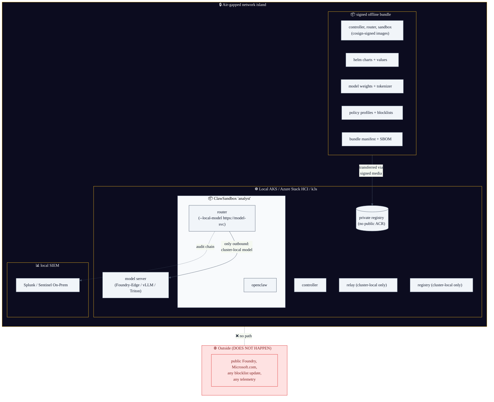
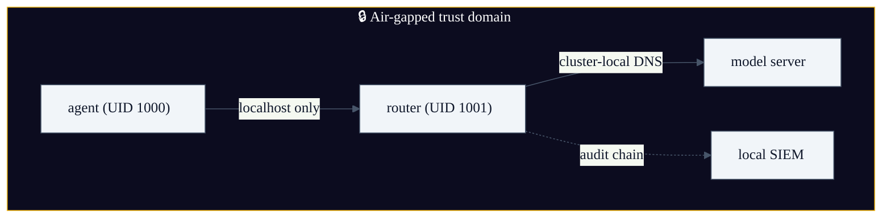
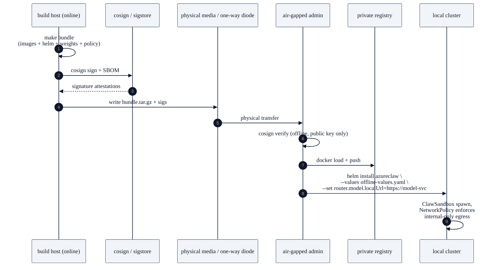

# Blueprint 05 — Sovereign / air-gapped

> "We run regulated, classified, sovereign-cloud, or fully air-gapped workloads. There is no public internet. There is no commercial Foundry endpoint. There is no Microsoft-hosted MCP catalogue. We still want AzureClaw's isolation + governance + audit guarantees, on locally-hosted models, with everything reproducible from a signed bundle."

> **Status: 🚧 Patterns documented; reproducible-bundle tooling on roadmap.** Today this blueprint is achievable by hand using the standard CRDs + a private model endpoint; the goal is a one-command `azureclaw bundle` that emits a signed, reproducible offline kit.

## Persona & intent

- **You are:** a defence, intelligence, regulator, financial-services, or sovereign-cloud operator. Or an enterprise that has chosen to self-host LLMs.
- **You want:** AzureClaw's threat model, but with the model running on private hardware (e.g. Foundry-Edge, vLLM, llama.cpp, ONNX Runtime, an on-prem Triton) and zero traffic crossing the network island.
- **You do not want:** any default outbound destination — every domain in the blocklist, the Foundry SDK, Application Insights, and the audit sink — to be assumed reachable.

## Topology



## Trust boundary



The trust boundary is the **network island**. Nothing inside it talks to anything outside it; nothing outside it talks to anything inside it. The router's allow-list is configured to a single internal model service DNS name; the blocklist is irrelevant because the egress NetworkPolicy denies *everything else* by default.

## Primary flow — bundle build, transfer, install



## What you provision

```bash
# On the (online) build host:
make bundle                                       # 🚧 roadmap; today: assemble manually
cosign sign-blob ./bundle.tar.gz \
  --key cosign.key \
  --output-file bundle.sig

# Physical / diode transfer.

# On the air-gapped admin host:
cosign verify-blob ./bundle.tar.gz \
  --key cosign.pub \
  --signature ./bundle.sig
docker load < bundle.tar.gz
docker push private-registry.local/azureclaw/{controller,router,sandbox}:vX

helm install azureclaw deploy/helm/azureclaw \
  --values offline-values.yaml \
  --set image.repository=private-registry.local/azureclaw \
  --set router.model.provider=local-openai-compat \
  --set router.model.endpoint=https://model-svc.ml.svc.cluster.local \
  --set audit.sink=splunk-hec://siem.local

azureclaw add analyst --model llama-3.1-70b --governance \
  --egress-policy deny-all-except=model-svc.ml.svc.cluster.local
```

## What's unique to this blueprint

- **Local-model adapter.** The router has an OpenAI-compatible local-model adapter (`router.model.provider=local-openai-compat`) so any model server speaking that wire format slots in. No code change to the agent; the same `gpt-4.1`-style interface is preserved.
- **Egress NetworkPolicy is the primary control,** not the 51k-domain blocklist. The blocklist is irrelevant when default-deny is enforced and only one internal DNS name is allowed.
- **Audit chain stays local.** The default `AuditSink` writes to a configurable destination (App Insights, Log Analytics, Splunk HEC, file). For sovereign deployments, a Splunk HEC or local file backend is the typical choice; the hash chain is preserved either way.
- **No telemetry leaks.** All Microsoft-hosted telemetry (App Insights, Microsoft Defender for Cloud) is off-by-default and replaced by your local SIEM.
- **Cosign-signed bundle.** The reproducible bundle is the only authenticated trust root; the air-gapped side has only a public key.

## What this blueprint is NOT

- Not "regular AzureClaw with no internet." Foundry, the blocklist refresh, and several telemetry paths assume reachability and must be deliberately disabled or replaced.
- Not a substitute for cross-domain solutions (CDS) — this blueprint covers the runtime; data ingestion / sanitisation across the boundary is your CDS team's problem.
- Not a fast onramp. Building a verified bundle, transferring it, and standing up a local cluster is multi-step. The reward is reproducibility.

## Bundle contents (current target)

```
bundle.tar.gz
├── manifest.yaml                    # bundle version + signed SBOM
├── images/
│   ├── controller-vX.tar
│   ├── router-vX.tar
│   └── sandbox-vX.tar
├── helm/
│   └── azureclaw-vX.tgz
├── policy-profiles/
│   ├── seccomp/azureclaw-strict.json
│   └── agt/{policy,trust,audit,rate-limit}.yaml
├── blocklists/
│   └── domains.txt                  # snapshot, since auto-refresh is off
├── values/
│   └── offline-values.yaml
└── attestations/
    ├── sbom.cdx.json                # CycloneDX SBOM
    └── cosign.sig
```

## References

- `inference-router/src/foundry.rs` (provider switch incl. `local-openai-compat` mode)
- `deploy/helm/azureclaw/values.yaml` (`audit.sink`, `router.model.provider`)
- `cli/profiles/` (offline-portable policy bundle)
- `Makefile` `bundle` target (🚧 to be added)
- `docs/security.md` § "Air-gapped operating mode"
