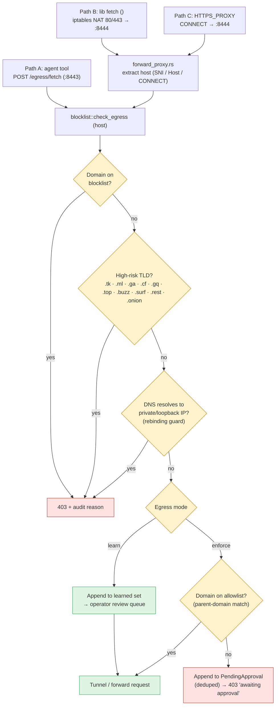

# Network Egress & Proxy

## Where the policy lives

Egress policy is **not its own CRD**. It's a sub-block of the `ClawSandbox`
spec, alongside everything else that scopes to a single agent:

```yaml
apiVersion: azureclaw.azure.com/v1alpha1
kind: ClawSandbox
metadata:
  name: my-agent
spec:
  networkPolicy:
    egressMode: Learn                # Learn | Strict (default: Learn)
    allowedEndpoints:                # inline allowlist (current source of truth)
      - api.telegram.org
      - api.openai.com
    allowlistRef:                    # optional: cosign-signed OCI artifact
      registry: myacr.azurecr.io     # advisory today; authoritative mode tracked in the roadmap
      repository: policy/egress-allowlist/my-agent
      digest: sha256:abc123…
```

The controller compiles this into **one enforcement point with one safety net**:

- **Router-side allowlist** (the **policy point**) — L7 host-header / SNI
  matching on every outbound HTTP request, served from `inference-router`
  shared state and reloaded on `ClawSandbox` updates. This is where egress
  policy is actually decided.
- **Kubernetes `NetworkPolicy`** (a **safety net**) — L3/L4 egress to peer
  pods, cluster DNS, and the explicit pod-IP allowlist generated from
  `allowedEndpoints`. Only matters if the router process itself is bypassed
  or compromised. Don't rely on it as the policy layer.

`allowlistRef` is an _advisory_ second source today (cosign-signed OCI artifact
for supply-chain integrity); when set, the controller verifies it on every
reconcile and surfaces `AllowlistVerified` / `AllowlistDrift` conditions on the
`ClawSandbox`. Inline `allowedEndpoints` remains the runtime source of truth
until the authority flip lands — tracked in [`roadmap.md`](roadmap.md). See
**Signed OCI egress allowlist** below.

## How outbound traffic actually leaves a sandbox

A sandbox pod has **two containers** and **three outbound paths**. Knowing which
path a piece of traffic takes is the key to debugging egress.

| Path | Triggered by | Listener | Mechanism | Used for |
|---|---|---|---|---|
| **A. Inference / tools** | Plugins talking to the local inference-router | `127.0.0.1:8443` | Direct HTTPS to the router | LLM calls, Foundry tools, `/egress/fetch`, Content Safety, AGT relay/registry |
| **B. Transparent (catch-all)** | Any library that does plain `fetch()` on `:80`/`:443` and ignores `HTTPS_PROXY` | `127.0.0.1:8444` | iptables `NAT REDIRECT` of UID-1000 traffic | Unwitting SDKs, third-party libraries, anything Node 22 `fetch()` issues |
| **C. Explicit forward proxy** | Code honouring `HTTPS_PROXY` (set by `proxy-bootstrap.js` for Node 22 fetch) | `127.0.0.1:8444` | HTTP `CONNECT` tunnel via undici dispatcher | Same listener as B, just reached via app-level proxy CONNECT instead of NAT |

The inference-router (UID 1001) runs **two listeners** in the same process:

- `:8443` — main HTTPS API (inference, governance, Foundry, AGT, **plus** `/egress/*` JSON endpoints)
- `:8444` — `forward_proxy::start()` — transparent + CONNECT-style HTTP proxy that all UID-1000 traffic reaches via the iptables NAT redirect

All three paths resolve to the **same** `blocklist::check_egress()` decision
function — there is no policy-bypass route.

## Layer 1: iptables egress-guard (safety net)

> The router is the policy point — see "Layer 2" below. The iptables rules
> described here are a **safety net** that contains blast radius if the
> router process is compromised or bypassed. Do not treat them as
> policy.

An init container (`egress-guard`) runs at pod startup with `NET_ADMIN`/`NET_RAW`
and installs the rules below for the agent container (UID 1000 / `openclaw`).
The inference-router (UID 1001) is **not** subject to these rules.

**Filter chain (`OUTPUT`)** — what UID 1000 may do at all:

| Rule | Effect |
|---|---|
| `-m owner --uid-owner 1000 -o lo -j ACCEPT` | Allow loopback (reach `:8443` and `:8444`) |
| `-m owner --uid-owner 1000 -p udp --dport 53 -j ACCEPT` | Allow DNS over UDP |
| `-m owner --uid-owner 1000 -p tcp --dport 53 -j ACCEPT` | Allow DNS over TCP |
| `-m owner --uid-owner 1000 -m conntrack --ctstate ESTABLISHED,RELATED -j ACCEPT` | Reply packets for inbound connections (WebUX, Telegram, A2A ingress) |
| `-m owner --uid-owner 1000 -j DROP` | **Drop everything else** |

**NAT chain (`OUTPUT`)** — pull HTTP/HTTPS into the proxy:

| Rule | Effect |
|---|---|
| `-t nat -A OUTPUT -m owner --uid-owner 1000 ! -o lo -p tcp --dport 80 -j REDIRECT --to-port 8444` | TCP/80 → transparent proxy |
| `-t nat -A OUTPUT -m owner --uid-owner 1000 ! -o lo -p tcp --dport 443 -j REDIRECT --to-port 8444` | TCP/443 → transparent proxy |

The NAT redirect happens **before** the filter table is consulted, so the
redirected packet now has destination `127.0.0.1:8444`, which then matches the
loopback `ACCEPT` in the filter chain. Net effect: any TCP/80 or TCP/443
attempt by the agent container — no matter what library issued it — lands at
the forward proxy.

This denies, by construction:

- **IMDS credential theft** (`169.254.169.254`) from the agent container
- **Direct data exfiltration** to any external host
- **Lateral movement** to other pods (NetworkPolicy adds belt-and-braces)

Source: `controller/src/reconciler/mod.rs::1356–1369` (egress-guard init container).

## Layer 2: Forward proxy (the policy point)

> This is where egress policy is **actually enforced**: every L7 destination
> is matched against the allowlist before bytes leave the router.
> The iptables layer above and the K8s `NetworkPolicy` below it are
> safety nets, not policy.

`inference-router/src/forward_proxy.rs` listens on `:8444` and handles **both**
paths B and C:

- **Path B (transparent):** packets arrive via NAT REDIRECT. The original
  destination is recovered from the kernel's `SO_ORIGINAL_DST` and the SNI is
  read from the TLS ClientHello.
- **Path C (CONNECT):** the client speaks HTTP `CONNECT host:port` first
  (Node's undici dispatcher does this when `HTTPS_PROXY=http://127.0.0.1:8444`).
  This is what `proxy-bootstrap.js` enables for Node 22, whose built-in
  `fetch()` ignores `HTTPS_PROXY` by itself.

Both feed the same decision pipeline below.

## Layer 3: `/egress/fetch` (explicit JSON tool)

Tools that need a request/response shape rather than a tunnel use the
`http_fetch` tool, which `POST`s JSON to `127.0.0.1:8443/egress/fetch` (path A).
The router executes the call, applies the same allowlist/blocklist/learn-mode
logic, and returns the response body to the agent — no tunnel is ever opened
from the agent container's network namespace.

## Decision pipeline (shared by all three paths)



Verified against `inference-router/src/forward_proxy.rs` and
`inference-router/src/blocklist.rs` (`check_egress`, the high-risk TLD list,
the parent-domain allowlist match, the DNS rebinding guard, and
`PendingApproval` deduplication).

## Learn → enforce lifecycle

```mermaid
stateDiagram-v2
  state "Learn mode" as Learn
  state "Operator review" as Review
  state "Enforce mode" as Enforce
  [*] --> Learn
  note right of Learn
    azureclaw add <name>
    All domains logged
    Blocklist still enforced
  end note
  note right of Review
    azureclaw egress <name> --learned
    operator approves / denies per domain
  end note
  note right of Enforce
    azureclaw egress <name> --no-learn
    Only allowlisted domains pass
    New domains → PendingApproval
  end note
  Learn --> Review: operator inspects learned set
  Review --> Review: approve / deny
  Review --> Enforce: --enforce / --no-learn
  Enforce --> Learn: --learn (rare; debugging only)
```




## Operator Workflow

### 1. Deploy with Learn Mode (default)

Learn mode is enabled by default (`network_policy.learn_egress = true` in the
sandbox spec). The blocklist is still enforced — learn mode only affects
unknown, non-malicious domains.

### 2. Review Discovered Domains

```bash
azureclaw egress <name>           # Show status + summary
azureclaw egress <name> --learned # Detailed list of discovered domains
```

### 3. Approve Trusted Domains

```bash
azureclaw egress <name> --approve api.telegram.org
```

Approving a parent domain (e.g., `telegram.org`) covers all subdomains
(e.g., `api.telegram.org`).

### 4. Lock Down

```bash
azureclaw egress <name> --no-learn
```

After disabling learn mode, only explicitly allowlisted domains are reachable.
Any new domain the agent tries to reach will be denied and added to the pending
approval queue.

## CLI Reference

| Command | Description |
|---------|-------------|
| `azureclaw egress <name>` | Show egress status (blocklist, learn mode, counts) |
| `azureclaw egress <name> --pending` | Show domains pending operator approval |
| `azureclaw egress <name> --approve <domain>` | Approve a domain for egress |
| `azureclaw egress <name> --deny <domain>` | Deny and remove a pending domain request |
| `azureclaw egress <name> --allowlist` | Show currently approved domains |
| `azureclaw egress <name> --learned` | Show domains discovered during learn mode |
| `azureclaw egress <name> --learn` | Enable learn mode |
| `azureclaw egress <name> --no-learn` | Disable learn mode |
| `azureclaw egress <name> --status` | Show blocklist and learn mode status |
| `azureclaw egress <name> --namespace <ns>` | Target a specific Kubernetes namespace |

The CLI discovers the running pod via `kubectl get pods` and executes `curl`
commands inside the `inference-router` container to interact with the router API.

## API Endpoints (Router)

All endpoints are served by the inference router on `127.0.0.1:8443`.

| Endpoint | Method | Description |
|----------|--------|-------------|
| `/egress/fetch` | POST | Proxy an HTTP request (blocklist → allowlist → learn/pending) |
| `/egress/pending` | GET | List pending approval requests |
| `/egress/approve` | POST | Approve a domain (`{"domain": "..."}`) |
| `/egress/deny` | POST | Deny and remove a pending request (`{"domain": "..."}`) |
| `/egress/allowlist` | GET | List approved domains |
| `/egress/learned` | GET | List domains discovered in learn mode |
| `/egress/learned/clear` | POST | Clear learned domains (after export/review) |
| `/blocklist/status` | GET | Blocklist status (enabled, domain count, learn mode) |
| `/blocklist/check` | POST | Check if a domain is blocklisted |

### `/egress/fetch` Request/Response

**Request:**
```json
{
  "url": "https://api.telegram.org/bot.../sendMessage",
  "method": "POST",
  "headers": {"Content-Type": "application/json"},
  "body": "{\"chat_id\": 123, \"text\": \"Hello\"}"
}
```

**Success (200):**
```json
{
  "status": 200,
  "headers": {"content-type": "application/json", "...": "..."},
  "body": "{\"ok\": true, \"result\": {...}}"
}
```

**Denied (403):**
```json
{
  "error": "Domain 'evil.com' not on allowlist — pending operator approval",
  "url": "https://evil.com/exfil",
  "action": "Run 'azureclaw egress <name> --pending' to see pending requests, then 'azureclaw egress <name> --approve <domain>' to allow."
}
```

## Blocklist

The blocklist engine combines multiple layers of threat intelligence:

| Source | Description | Update Frequency |
|--------|-------------|-----------------|
| **Seed file** | Curated domain list loaded from ConfigMap at startup | On pod restart |
| **OISD** | Community-maintained blocklist (50k+ domains) | Every 6 hours |
| **URLhaus** | abuse.ch malware URL database (hostfile format) | Every 6 hours |
| **High-risk TLDs** | `.tk`, `.ml`, `.ga`, `.cf`, `.gq`, `.top`, `.buzz`, `.surf`, `.rest`, `.onion` | Static |
| **Bare IP blocking** | URLs with IP addresses instead of domains | Static |

Key properties:
- Stored in `Arc<RwLock<HashSet<String>>>` — lock-free reads, rare write locks
- Parent domain matching: blocking `example.com` also blocks `sub.example.com`
- Max 500,000 domains per feed (memory safety limit)
- **Always enforced**, even when learn mode is on

### Auto-Refresh

The blocklist stays current through multiple refresh mechanisms:

| Mechanism | Frequency | Source |
|-----------|-----------|--------|
| Router background task | Every 6 hours | Fetches latest feeds from [OISD](https://oisd.nl/) and [URLhaus](https://urlhaus.abuse.ch/) |
| K8s CronJob | Every 6 hours | Updates the ConfigMap mounted at `/etc/azureclaw/blocklist/domains.txt` |
| GitHub Actions CI | Daily | Refreshes the seed file in the repository (≤ 24h old) |

**Safe refresh:** If all upstream feeds fail, the previous entries are preserved — no wipe-on-failure. The router logs a warning and retries on the next cycle.

## Agent Integration

Agents use the `http_fetch` tool to make external HTTP requests. The tool
is implemented as a `POST` to the local inference router:

```json
{
  "url": "https://api.telegram.org/bot.../sendMessage",
  "method": "POST",
  "headers": {"Content-Type": "application/json"},
  "body": "{\"chat_id\": 123, \"text\": \"Hello\"}"
}
```

The agent never has direct network access — every request is audited, checked
against the blocklist, and subject to the allowlist/learn-mode policy. All
decisions are recorded in the governance audit log.

## Source Files

| File | Description |
|------|-------------|
| `inference-router/src/blocklist.rs` | Blocklist engine, allowlist, pending approvals, learn mode |
| `inference-router/src/routes/egress.rs` | HTTP handlers for `/egress/*` endpoints |
| `cli/src/commands/egress.ts` | CLI `azureclaw egress` command |
| `controller/src/reconciler/mod.rs` | iptables init container + NetworkPolicy generation |

## Signed OCI egress allowlist

This adds supply-chain integrity for egress allowlists.
The `--sign` flag seals the current allowlist as a content-addressed,
cosign-signed OCI artifact and wires the digest into the `ClawSandbox` CRD
so the controller can verify it on every reconcile.

### Signing an allowlist

```bash
azureclaw egress <name> --enforce --sign \
  --registry myacr.azurecr.io \
  [--repository policy/egress-allowlist/<name>] \
  [--sign-mode keyless|identity-token|keyed] \
  [--sign-key azurekms://...]
```

`--sign` must be combined with `--enforce` or `--approve` — using it alone is
an error.

**What happens (in order):**

1. CLI reads `ClawSandbox.spec.networkPolicy.allowedEndpoints` +
   `metadata.generation`.
2. Builds a byte-stable canonical YAML (`buildCanonicalAllowlist`): keys
   sorted, no trailing whitespace, LF line endings, `generation` and the
   AMID list baked in.
3. Pushes the artifact to the registry via `oras` (`buildOrasPushArgv`).
4. Signs the OCI manifest with `cosign` (`buildCosignSignArgv`).
5. Patches `spec.networkPolicy.allowlistRef` with the resulting
   `<registry>/<repo>@sha256:<digest>` reference (`buildPatchArgv`).
6. If `oras push` or `cosign sign` fails, the patch is skipped — no orphan
   `allowlistRef` ever lands on a `ClawSandbox`.

### Sign-mode auto-detection

| Environment | Auto-detected mode | Trigger condition |
|-------------|--------------------|-------------------|
| Interactive TTY | `keyless` | No `SIGSTORE_ID_TOKEN` / `OIDC_TOKEN`, TTY attached |
| GitHub Actions / CI | `identity-token` | `SIGSTORE_ID_TOKEN` or `OIDC_TOKEN` set |
| Explicit KMS | `keyed` | `--sign-mode keyed --sign-key azurekms://...` |

Override with `--sign-mode` if auto-detection picks the wrong mode.

### Controller verification

When `spec.networkPolicy.allowlistRef` is set the controller verifies the
artifact on every reconcile using the `SignerPolicy` ConfigMap.

**`SignerPolicy` ConfigMap wire shape** (name: `azureclaw-signer-policy`,
namespace: `azureclaw-system`):

```yaml
apiVersion: v1
kind: ConfigMap
metadata:
  name: azureclaw-signer-policy
  namespace: azureclaw-system
data:
  fulcioIssuers: |
    https://token.actions.githubusercontent.com
    https://accounts.google.com
  sanPatterns: |
    https://github.com/Azure/azureclaw/*
    *.microsoft.com
```

Both keys are required and must contain at least one non-comment line.
A malformed or empty ConfigMap sets `SignerPolicyMalformed` condition and
blocks verification — there is no silent fallback to permissive defaults.
If the ConfigMap is absent, the controller falls back to the
`AZURECLAW_SIGNER_FULCIO_ISSUERS` / `AZURECLAW_SIGNER_SAN_PATTERNS`
environment variables as an emergency operator override.

### Status conditions on `ClawSandbox`

| Condition | Value | Meaning |
|-----------|-------|---------|
| `AllowlistVerified` | `True / Verified` | Artifact fetched, signature verified, allowlist applied |
| `AllowlistVerified` | `False / VerifyFailed` | Signature check failed — sandbox stays on last-known-good |
| `AllowlistDrift` | `True / InlineDiffersFromArtifact` | `spec.networkPolicy.allowedEndpoints` diverges from the signed artifact |
| `AllowlistDrift` | `False / InSync` | Inline and artifact are identical |

These conditions are only emitted when `spec.networkPolicy.allowlistRef` is
set. An unset `allowlistRef` leaves both conditions absent.

**Fail-closed behaviour:** if no last-known-good (LKG) allowlist is cached
and verification fails, `status.failClosedNoLkg` is set to `true` and
the sandbox NetworkPolicy blocks all egress until a valid artifact is
reachable.

### Status

| Mode | Behaviour |
|-------|-----------|
| **Advisory** (current) | Non-authoritative — inline `spec.networkPolicy.allowedEndpoints` is still the source of truth. Signed artifact is advisory. |
| **Authoritative** (on roadmap) | Signed artifact becomes the only source of truth; inline field is read-only. |

### GitOps mode (`--emit-manifest`)

To produce a Kubernetes manifest instead of patching live:

```bash
azureclaw egress <name> --enforce --sign \
  --registry myacr.azurecr.io \
  --emit-manifest ./egress-allowlist-<name>.yaml
```

The emitted manifest is a `ClawSandbox` patch fragment with
`spec.networkPolicy.allowlistRef` pre-filled. Commit it to Git;
apply with `kubectl apply -f`. The YAML is deterministic (same input
→ same bytes) to enable diff-based drift detection in CI.

### Required tools

| Tool | Purpose |
|------|---------|
| `oras` | Push OCI artifacts to ACR |
| `cosign` | Sign + verify OCI manifests |

Both must be in `$PATH`.

### Source files

| File | Role |
|------|------|
| `cli/src/commands/egress/sign.ts` | Producer: `buildCanonicalAllowlist`, `buildOrasPushArgv`, `buildCosignSignArgv`, `buildPatchArgv`, `buildEmitManifestYaml`, `autoDetectSignMode` |
| `controller/src/signer_policy.rs` | `SignerPolicy` ConfigMap watcher, `SharedSignerPolicy` state, `SignerPolicyState` |
| `controller/src/policy_fetcher.rs` | `AllowlistVerified` / `AllowlistDrift` conditions, fail-closed logic |

## Ephemeral approvals — `EgressApproval` CR

Sometimes an agent needs to reach a host *just once* — debugging, a
short-lived API key validation, a one-shot data import. Editing the
baseline `ClawSandbox.spec.networkPolicy.allowedEndpoints` for these is
poor hygiene: the change persists indefinitely, ripples through GitOps,
and pollutes audit history. **`EgressApproval`** is the explicit, ephemeral,
auditable grant lane.

### Shape

```yaml
apiVersion: azureclaw.azure.com/v1alpha1
kind: EgressApproval
metadata:
  name: debug-stripe-2026-05-14
  namespace: azureclaw-system   # same namespace as the sandbox
spec:
  sandbox: my-agent             # name of the sibling ClawSandbox
  hosts:                        # 1..16 entries (small scoped grants only)
    - host: api.stripe.com
      port: 443
    - host: hooks.stripe.com
  reason: "INC-4421 debug pipe"  # 1..512 chars, no ASCII control bytes
  ticket: "INC-4421"             # optional, 1..128 chars
  ttl: PT2H                      # ISO 8601, ≤ 7 days (helm-tunable ceiling)
```

### Lifecycle

```
                           ┌──────────────────┐
                           │     Pending      │
                           │ BlockedOnSandbox │  ← sibling sandbox not Ready yet
                           └────────┬─────────┘
                                    │ sandbox reaches phase=Ready
                                    ▼
                           ┌──────────────────┐
                           │     Pending      │
                           │ AwaitingRouter   │  ← merged-allowlist CM written,
                           └────────┬─────────┘    router hasn't echoed digest yet
                                    │ router POSTs loaded digest matching merged
                                    ▼
                           ┌──────────────────┐
                           │      Active      │   ← grant is LIVE on data plane
                           │ RouterConfirmed  │
                           └────────┬─────────┘
                                    │ now ≥ status.expiresAt
                                    ▼
                           ┌──────────────────┐
                           │     Expired      │   ← terminal; CM file removed,
                           │     Expired      │      finalizer dropped
                           └──────────────────┘
```

The controller computes a merged-allowlist sha256 digest (baseline
`allowedEndpoints` ∪ all approval hosts, length-prefixed canonical
encoding) and writes per-approval files into a sibling ConfigMap
`clawsandbox-<sandbox>-egress-approvals`. The inference-router mounts
this CM, unions the entries with the baseline allowlist, and POSTs the
loaded digest back to `controller/internal/policy-status`. **The
controller only promotes `phase=Pending → Active` when the loaded digest
exactly matches the compiled merged digest** — the same `Ready ⇔
router echo` invariant used by `ToolPolicy`, `InferencePolicy`, and
`ClawMemory`.

On TTL expiry the reconciler:

1. removes the per-approval file from the sibling CM,
2. recomputes the merged digest,
3. stamps `phase=Expired` (terminal),
4. drops the finalizer so the API server can garbage-collect the CR.

### CLI (operator surface)

```bash
# Grant
azureclaw egress allow-extra <sandbox> \
  --host api.stripe.com:443 \
  --host hooks.stripe.com \
  --reason "INC-4421 debug pipe" \
  --ticket INC-4421 \
  --ttl PT2H

# List active + pending grants for a sandbox
azureclaw egress approvals <sandbox>

# Revoke early (before TTL elapses)
azureclaw egress revoke debug-stripe-2026-05-14
```

`allow-extra` builds an `EgressApproval` CR and applies it via `kubectl
apply -f -`. `approvals` filters by `spec.sandbox`. `revoke` deletes the
CR — the finalizer takes care of tearing down the merged-allowlist file
and recomputing the digest.

### Headlamp panel

The AzureClaw Headlamp plugin registers `EgressApproval` in the sidebar
(list view, CR detail page). Every `ClawSandbox` detail page also renders
an **Egress Approvals** card listing all approvals scoped to that sandbox
with columns: NAME, PHASE, HOSTS, TTL, EXPIRES, REASON, MERGED-DIGEST.

### Why a separate CRD instead of a `ClawSandbox` field?

| Concern | Inline field | Separate CR |
|---------|--------------|-------------|
| TTL / expiry | Operator-tracked, error-prone | Built into reconciler |
| Audit trail | Mixed with baseline edits in Git | Standalone resource, distinct audit events |
| Finalizer cleanup on expiry | n/a | Reconciler removes file, drops finalizer |
| Cross-team review | Touching the agent spec | Touching just the grant |
| Revoke | Edit + apply baseline | `kubectl delete egressapproval <name>` |
| Multi-grant composition | Manual list management | Each grant is an independent resource |

Inline `allowedEndpoints` remains the durable baseline. `EgressApproval`
is the short-lived overlay. The router computes the union and enforces
that on every outbound request.

### Status conditions

| Type | Status | Reason | Meaning |
|------|--------|--------|---------|
| `Ready` | `True` | `RouterConfirmed` | Grant is live on the data plane. |
| `Ready` | `False` | `BlockedOnSandbox` | Sibling `ClawSandbox` is not yet `phase=Ready`. |
| `Ready` | `False` | `AwaitingRouterEcho` | Merged CM written; router hasn't echoed digest yet. |
| `Ready` | `False` | `ReasonInvalid` | `spec.reason` violated server-side validation. |
| `Ready` | `False` | `Expired` | Terminal — TTL elapsed; grant is no longer in effect. |
| `Progressing` | `False` | `Active` / `Expired` | Reconciler is idle. |
| `Progressing` | `True` | (other) | Reconciler is currently working toward the goal. |

`status` also exposes `effectiveAt`, `expiresAt`, `mergedDigest`,
`hostCount`, and `usageCount` for operator visibility.

### TTL ceiling

Hard ceiling is 7 days (`604800s`). Helm chart defaults to 24h via
`EGRESS_APPROVAL_MAX_TTL_SECONDS` on the controller deployment. Set
`controller.egressApproval.maxTtlSeconds` to tighten.

### Audit

Every approval emits a Kubernetes Event on each phase transition. For
production audit, watch the controller's structured logs for
`event=egress_approval_state_change` (includes `sandbox`, `name`,
`phase`, `reason`, `mergedDigest`, `hostCount`, `ttlSeconds`,
`ticket?`, `effectiveAt`, `expiresAt`).
