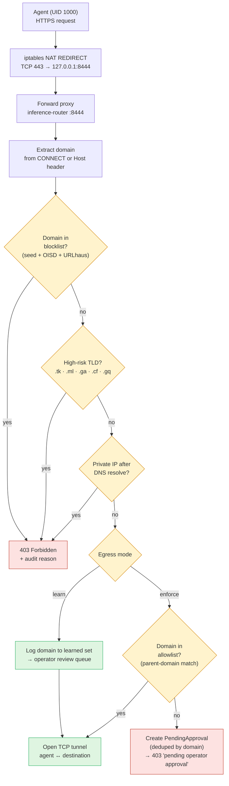

# Network Egress & Proxy

## Overview

AzureClaw enforces strict outbound network control for every sandboxed agent.
No agent can reach the internet directly — all external HTTP traffic is mediated
by a two-layer egress system that combines kernel-level iptables rules with an
application-level proxy inside the inference router.

## How It Works

### Layer 1: iptables (Kernel Level)

An init container (`egress-guard`) runs at pod startup and installs iptables
rules that restrict the agent container (UID 1000 / `openclaw`) to:

| Rule | Effect |
|------|--------|
| `-o lo -j ACCEPT` | Allow localhost (reach inference-router on `127.0.0.1:8443`) |
| `-p udp --dport 53 -j ACCEPT` | Allow DNS resolution |
| `-p tcp --dport 53 -j ACCEPT` | Allow DNS over TCP |
| `--ctstate ESTABLISHED,RELATED -j ACCEPT` | Allow reply packets for inbound connections (WebUX, Telegram) |
| `-j DROP` | **Drop everything else** |

The inference router (UID 1001) is **not** restricted — it has full
network access to Azure OpenAI, Foundry, Content Safety, and approved egress
destinations.

This blocks:
- **IMDS credential theft** (`169.254.169.254`) from the agent container
- **Data exfiltration** to any external host
- **Lateral movement** to other pods in the cluster

### Layer 2: Forward Proxy (Explicit Mode)

The sandbox uses `proxy-bootstrap.js` (preloaded via `NODE_OPTIONS="--require ..."`) to set undici's `EnvHttpProxyAgent` as the global fetch dispatcher. This ensures all outbound HTTP/HTTPS requests from the Node.js process honor `HTTPS_PROXY` and `NO_PROXY` environment variables — providing an explicit (forward) proxy path through the inference-router.

This complements the iptables transparent proxy rules (which redirect UID 1000 traffic on ports 80/443 to `localhost:8444`). Both paths enforce the same blocklist, allowlist, and learn-mode policies.

### Layer 3: Egress Proxy (Application Level)

When an agent needs to make an external HTTP request, it uses the `http_fetch`
tool which sends a `POST` to `localhost:8443/egress/fetch`. The inference-router
then checks the request through the egress decision pipeline:

1. **Blocklist check** — Is the domain on the threat intelligence blocklist?
2. **Allowlist check** — Is the domain explicitly approved (including parent domains)?
3. **Learn mode check** — If learn mode is on, allow and log the domain.
4. **Pending approval** — Deny the request and create a pending approval entry.

### Decision Flow



Verified against `inference-router/src/forward_proxy.rs` (handler) and `inference-router/src/blocklist.rs` (`check_egress`, the high-risk TLD list, the parent-domain allowlist match, `PendingApproval` deduplication).

### Learn → Enforce lifecycle

```mermaid
stateDiagram-v2
  [*] --> Learn: azureclaw add &lt;name&gt;<br/>(default; blocklist still enforced)
  Learn: 🔍 Learn mode\nAll domains logged\nBlocklist still enforced
  Review: 📋 Operator review\nazureclaw egress &lt;name&gt; --learned
  Enforce: 🔒 Enforce mode\nOnly approved domains pass\nNew domains → PendingApproval

  Learn --> Review: operator inspects learned set
  Review --> Review: approve / deny per domain
  Review --> Enforce: azureclaw egress --enforce
  Enforce --> Learn: azureclaw egress --learn (rare)
```


## Operator Workflow

### 1. Deploy with Learn Mode (default)

Learn mode is enabled by default (`network_policy.learn_egress = true` in the
sandbox spec). The blocklist is still enforced — learn mode only affects
unknown, non-malicious domains.

### 2. Review Discovered Domains

```bash
azureclaw egress <name>           # Show status + summary
azureclaw egress <name> --learned # Detailed list of discovered domains
```

### 3. Approve Trusted Domains

```bash
azureclaw egress <name> --approve api.telegram.org
```

Approving a parent domain (e.g., `telegram.org`) covers all subdomains
(e.g., `api.telegram.org`).

### 4. Lock Down

```bash
azureclaw egress <name> --no-learn
```

After disabling learn mode, only explicitly allowlisted domains are reachable.
Any new domain the agent tries to reach will be denied and added to the pending
approval queue.

## CLI Reference

| Command | Description |
|---------|-------------|
| `azureclaw egress <name>` | Show egress status (blocklist, learn mode, counts) |
| `azureclaw egress <name> --pending` | Show domains pending operator approval |
| `azureclaw egress <name> --approve <domain>` | Approve a domain for egress |
| `azureclaw egress <name> --deny <domain>` | Deny and remove a pending domain request |
| `azureclaw egress <name> --allowlist` | Show currently approved domains |
| `azureclaw egress <name> --learned` | Show domains discovered during learn mode |
| `azureclaw egress <name> --learn` | Enable learn mode |
| `azureclaw egress <name> --no-learn` | Disable learn mode |
| `azureclaw egress <name> --status` | Show blocklist and learn mode status |
| `azureclaw egress <name> --namespace <ns>` | Target a specific Kubernetes namespace |

The CLI discovers the running pod via `kubectl get pods` and executes `curl`
commands inside the `inference-router` container to interact with the router API.

## API Endpoints (Router)

All endpoints are served by the inference router on `127.0.0.1:8443`.

| Endpoint | Method | Description |
|----------|--------|-------------|
| `/egress/fetch` | POST | Proxy an HTTP request (blocklist → allowlist → learn/pending) |
| `/egress/pending` | GET | List pending approval requests |
| `/egress/approve` | POST | Approve a domain (`{"domain": "..."}`) |
| `/egress/deny` | POST | Deny and remove a pending request (`{"domain": "..."}`) |
| `/egress/allowlist` | GET | List approved domains |
| `/egress/learned` | GET | List domains discovered in learn mode |
| `/egress/learned/clear` | POST | Clear learned domains (after export/review) |
| `/blocklist/status` | GET | Blocklist status (enabled, domain count, learn mode) |
| `/blocklist/check` | POST | Check if a domain is blocklisted |

### `/egress/fetch` Request/Response

**Request:**
```json
{
  "url": "https://api.telegram.org/bot.../sendMessage",
  "method": "POST",
  "headers": {"Content-Type": "application/json"},
  "body": "{\"chat_id\": 123, \"text\": \"Hello\"}"
}
```

**Success (200):**
```json
{
  "status": 200,
  "headers": {"content-type": "application/json", "...": "..."},
  "body": "{\"ok\": true, \"result\": {...}}"
}
```

**Denied (403):**
```json
{
  "error": "Domain 'evil.com' not on allowlist — pending operator approval",
  "url": "https://evil.com/exfil",
  "action": "Run 'azureclaw egress <name> --pending' to see pending requests, then 'azureclaw egress <name> --approve <domain>' to allow."
}
```

## Blocklist

The blocklist engine combines multiple layers of threat intelligence:

| Source | Description | Update Frequency |
|--------|-------------|-----------------|
| **Seed file** | Curated domain list loaded from ConfigMap at startup | On pod restart |
| **OISD** | Community-maintained blocklist (50k+ domains) | Every 6 hours |
| **URLhaus** | abuse.ch malware URL database (hostfile format) | Every 6 hours |
| **High-risk TLDs** | `.tk`, `.ml`, `.ga`, `.cf`, `.gq`, `.top`, `.buzz`, `.surf`, `.rest`, `.onion` | Static |
| **Bare IP blocking** | URLs with IP addresses instead of domains | Static |

Key properties:
- Stored in `Arc<RwLock<HashSet<String>>>` — lock-free reads, rare write locks
- Parent domain matching: blocking `example.com` also blocks `sub.example.com`
- Max 500,000 domains per feed (memory safety limit)
- **Always enforced**, even when learn mode is on

### Auto-Refresh

The blocklist stays current through multiple refresh mechanisms:

| Mechanism | Frequency | Source |
|-----------|-----------|--------|
| Router background task | Every 6 hours | Fetches latest feeds from [OISD](https://oisd.nl/) and [URLhaus](https://urlhaus.abuse.ch/) |
| K8s CronJob | Every 6 hours | Updates the ConfigMap mounted at `/etc/azureclaw/blocklist/domains.txt` |
| GitHub Actions CI | Daily | Refreshes the seed file in the repository (≤ 24h old) |

**Safe refresh:** If all upstream feeds fail, the previous entries are preserved — no wipe-on-failure. The router logs a warning and retries on the next cycle.

## Agent Integration

Agents use the `http_fetch` tool to make external HTTP requests. The tool
is implemented as a `POST` to the local inference router:

```json
{
  "url": "https://api.telegram.org/bot.../sendMessage",
  "method": "POST",
  "headers": {"Content-Type": "application/json"},
  "body": "{\"chat_id\": 123, \"text\": \"Hello\"}"
}
```

The agent never has direct network access — every request is audited, checked
against the blocklist, and subject to the allowlist/learn-mode policy. All
decisions are recorded in the governance audit log.

## Source Files

| File | Description |
|------|-------------|
| `inference-router/src/blocklist.rs` | Blocklist engine, allowlist, pending approvals, learn mode |
| `inference-router/src/routes.rs` | HTTP handlers for `/egress/*` endpoints |
| `cli/src/commands/egress.ts` | CLI `azureclaw egress` command |
| `controller/src/reconciler.rs` | iptables init container + NetworkPolicy generation |

## Signed OCI egress allowlist

This adds supply-chain integrity for egress allowlists.
The `--sign` flag seals the current allowlist as a content-addressed,
cosign-signed OCI artifact and wires the digest into the `ClawSandbox` CRD
so the controller can verify it on every reconcile.

### Signing an allowlist

```bash
azureclaw egress <name> --enforce --sign \
  --registry myacr.azurecr.io \
  [--repository policy/egress-allowlist/<name>] \
  [--sign-mode keyless|identity-token|keyed] \
  [--sign-key azurekms://...]
```

`--sign` must be combined with `--enforce` or `--approve` — using it alone is
an error.

**What happens (in order):**

1. CLI reads `ClawSandbox.spec.networkPolicy.allowedEndpoints` +
   `metadata.generation`.
2. Builds a byte-stable canonical YAML per `docs/internal/policy-canonical-format.md`
   (`buildCanonicalAllowlist`).
3. Pushes the artifact to the registry via `oras` (`buildOrasPushArgv`).
4. Signs the OCI manifest with `cosign` (`buildCosignSignArgv`).
5. Patches `spec.networkPolicy.allowlistRef` with the resulting
   `<registry>/<repo>@sha256:<digest>` reference (`buildPatchArgv`).
6. If `oras push` or `cosign sign` fails, the patch is skipped — no orphan
   `allowlistRef` ever lands on a `ClawSandbox`.

### Sign-mode auto-detection

| Environment | Auto-detected mode | Trigger condition |
|-------------|--------------------|-------------------|
| Interactive TTY | `keyless` | No `SIGSTORE_ID_TOKEN` / `OIDC_TOKEN`, TTY attached |
| GitHub Actions / CI | `identity-token` | `SIGSTORE_ID_TOKEN` or `OIDC_TOKEN` set |
| Explicit KMS | `keyed` | `--sign-mode keyed --sign-key azurekms://...` |

Override with `--sign-mode` if auto-detection picks the wrong mode.

### Controller verification

When `spec.networkPolicy.allowlistRef` is set the controller verifies the
artifact on every reconcile using the `SignerPolicy` ConfigMap.

**`SignerPolicy` ConfigMap wire shape** (name: `azureclaw-signer-policy`,
namespace: `azureclaw-system`):

```yaml
apiVersion: v1
kind: ConfigMap
metadata:
  name: azureclaw-signer-policy
  namespace: azureclaw-system
data:
  fulcioIssuers: |
    https://token.actions.githubusercontent.com
    https://accounts.google.com
  sanPatterns: |
    https://github.com/Azure/azureclaw/*
    *.microsoft.com
```

Both keys are required and must contain at least one non-comment line.
A malformed or empty ConfigMap sets `SignerPolicyMalformed` condition and
blocks verification — there is no silent fallback to permissive defaults.
If the ConfigMap is absent, the controller falls back to the
`AZURECLAW_SIGNER_FULCIO_ISSUERS` / `AZURECLAW_SIGNER_SAN_PATTERNS`
environment variables as an emergency operator override.

### Status conditions on `ClawSandbox`

| Condition | Value | Meaning |
|-----------|-------|---------|
| `AllowlistVerified` | `True / Verified` | Artifact fetched, signature verified, allowlist applied |
| `AllowlistVerified` | `False / VerifyFailed` | Signature check failed — sandbox stays on last-known-good |
| `AllowlistDrift` | `True / InlineDiffersFromArtifact` | `spec.networkPolicy.allowedEndpoints` diverges from the signed artifact |
| `AllowlistDrift` | `False / InSync` | Inline and artifact are identical |

These conditions are only emitted when `spec.networkPolicy.allowlistRef` is
set. An unset `allowlistRef` leaves both conditions absent.

**Fail-closed behaviour:** if no last-known-good (LKG) allowlist is cached
and verification fails, `status.failClosedNoLkg` is set to `true` and
the sandbox NetworkPolicy blocks all egress until a valid artifact is
reachable.

### Status

| Mode | Behaviour |
|-------|-----------|
| **Advisory** (current) | Non-authoritative — inline `spec.networkPolicy.allowedEndpoints` is still the source of truth. Signed artifact is advisory. |
| **Authoritative** (planned, v1.1) | Signed artifact becomes the only source of truth; inline field is read-only. |

### GitOps mode (`--emit-manifest`)

To produce a Kubernetes manifest instead of patching live:

```bash
azureclaw egress <name> --enforce --sign \
  --registry myacr.azurecr.io \
  --emit-manifest ./egress-allowlist-<name>.yaml
```

The emitted manifest is a `ClawSandbox` patch fragment with
`spec.networkPolicy.allowlistRef` pre-filled. Commit it to Git;
apply with `kubectl apply -f`. The YAML is deterministic (same input
→ same bytes) to enable diff-based drift detection in CI.

### Required tools

| Tool | Purpose |
|------|---------|
| `oras` | Push OCI artifacts to ACR |
| `cosign` | Sign + verify OCI manifests |

Both must be in `$PATH`. See `docs/internal/security-audits/` for the full threat model.

### Source files

| File | Role |
|------|------|
| `cli/src/commands/egress/sign.ts` | Producer: `buildCanonicalAllowlist`, `buildOrasPushArgv`, `buildCosignSignArgv`, `buildPatchArgv`, `buildEmitManifestYaml`, `autoDetectSignMode` |
| `controller/src/signer_policy.rs` | `SignerPolicy` ConfigMap watcher, `SharedSignerPolicy` state, `SignerPolicyState` |
| `controller/src/policy_fetcher.rs` | `AllowlistVerified` / `AllowlistDrift` conditions, fail-closed logic |
