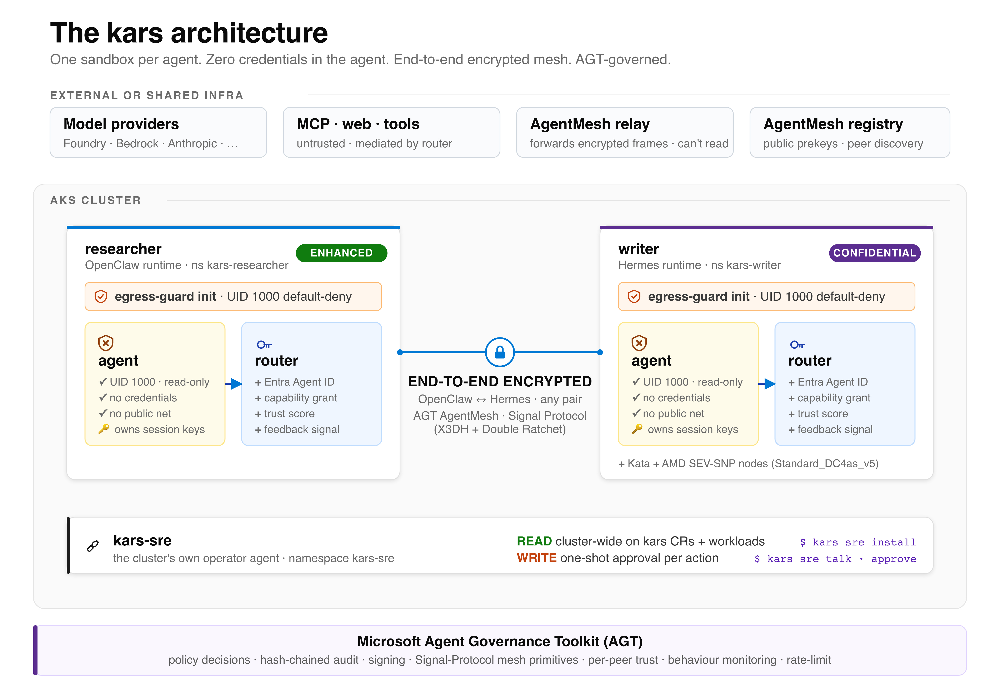

# Introducing *kars* — the Agent Reference Stack for Azure

By **Pal Lakatos-Toth**

*launch · v0.1.0 · open source · MIT · AKS*

*kars* is a Kubernetes-native runtime for AI agents on Azure. It treats every agent as untrusted code: per-pod kernel isolation, zero credentials in the agent process, end-to-end encrypted inter-agent mesh, and native consumption of the [Microsoft Agent Governance Toolkit](https://microsoft.github.io/agent-governance-toolkit/). v0.1.0 ships today on AKS, on the Azure Linux family, MIT-licensed.

This builds on the foundation Brendan Burns described last month — [From open source to agentic systems](https://opensource.microsoft.com/blog/2026/05/18/from-open-source-to-agentic-systems-microsoft-at-open-source-summit-north-america-2026/): a hardened Azure Linux substrate (Azure Linux 4.0 + Azure Container Linux), an open agentic stack (Agent Framework, AGT, A2A), and the Agentic AI Foundation. *kars* is the K8s-native runtime that composes these primitives into a single, deployable stack you can drop into AKS.

### TL;DR

- **What:** Kubernetes operator + per-agent inference router + end-to-end encrypted inter-agent mesh, on AKS. One sandbox per agent.
- **Why:** agent code is partially generated at runtime by untrusted sources (prompt injection works in practice). The trust model has to be closer to *running customer-submitted code* than to *running a service you wrote*.
- **How:** consumes [AGT](https://microsoft.github.io/agent-governance-toolkit/) for governance, runs on the Azure Linux family, opt-in [AKS Pod Sandboxing](https://learn.microsoft.com/en-us/azure/aks/use-pod-sandboxing) (Kata + AMD SEV-SNP) is one CRD field. Eight first-class agent frameworks supported.
- **Unique today:** end-to-end encrypted inter-*runtime* messaging — agents written in OpenClaw, Hermes, MAF, LangGraph, etc. talk on the same Signal-Protocol mesh; the broker sees only ciphertext. No other K8s-native agent runtime ships this.
- **Try it:** `kars dev` runs a governed agent on your laptop in minutes (Docker by default, or a kind cluster via `--target local-k8s`); `kars up` provisions the full stack on AKS.
- **Source:** [github.com/Azure/kars](https://github.com/Azure/kars) · MIT · contributions welcome.

### Try it

```bash
# 1. Install the CLI (Node 22+)
npm install -g @kars/cli

# 2. Try it on your laptop. Docker by default (fast); add
#    --target local-k8s to run on a kind cluster that mirrors the
#    AKS layout. kars dev prompts for the runtime and model provider.
kars dev

# 3. Open a chat with your governed agent
kars connect dev-agent --local
```

Going to production? `kars up` provisions the AKS cluster, controller and your first sandbox; `kars add <name> --runtime <kind>` adds agents on any of the eight runtimes (`openclaw`, `hermes`, `openai-agents`, `microsoft-agent-framework`, `langgraph`, `anthropic`, `pydantic-ai`, `byo`); `kars connect <name>` opens the chat. Full path in the [getting-started guide](https://github.com/Azure/kars/blob/main/docs/getting-started.md).

## The architecture, in one picture



**Figure 1** — Two sandboxes running different agent runtimes (**researcher** on OpenClaw in `enhanced` isolation; **writer** on Hermes in `confidential` = Kata + AMD SEV-SNP on `Standard_DC4as_v5`) talk to each other over the AgentMesh — OpenClaw, Hermes, MAF, LangGraph and the other adapters all share one Signal-Protocol wire format. The Signal session lives inside the agent processes — each agent owns its own session keys; the relay only forwards opaque ciphertext and cannot decrypt. The per-pod router holds the Entra Agent ID and the AGT governance the agent consults on every peer message (trust, capability, policy, audit). **kars-sre** is the cluster's own operator agent — same sandbox shape, but with cluster-wide read and gated writes. AGT is consumed for governance.

## Why this design

Three convictions shaped kars. Each is opinionated; each rejects an assumption I see repeated in the agentic-AI conversation.

### 1. The agent is untrusted code, not a microservice.

An agent's instructions are partially generated at runtime by the model output, the tool response, the previous turn's context, an MCP server you do not control. The threat model is closer to *running customer-submitted code* than to *running a service you wrote*. The agent process must therefore hold no secrets, have no ambient network reach, and be isolated at the kernel — not just at the network policy.

### 2. Governance is the workload, not a wrapper.

Policy, audit, trust scoring, rate limiting cannot be bolted on later. The right move is to consume a real governance engine — for us that is [AGT](https://microsoft.github.io/agent-governance-toolkit/) — through stable provider seams from day one. kars's [AGT Boundary](https://github.com/Azure/kars/blob/main/docs/architecture/agt-boundary.md) document says explicitly what kars never builds: no custom Signal primitives, no standalone audit chain, no parallel trust engine. Overlap is treated as a bug.

### 3. Inter-agent messaging needs broker-out-of-trust-set, not just A2A.

The [A2A protocol](https://a2aproject.dev/) standardises message shape; it does not, by itself, remove the broker from the trust set. kars uses an end-to-end Signal-Protocol encrypted mesh where the relay routes ciphertext and cannot decrypt — and works across runtimes (OpenClaw, Hermes, MAF, LangGraph, …) on the same wire format. The structural difference from a service mesh is the same as HTTPS-through-a-proxy versus PGP-encrypted email. Both are valid; they are not equivalent.

## Spotlight — confidential agents in one CRD field

Some agentic workloads — financial research, clinical, sovereign deployments, classified evals — need more than a hardened namespace. They need a separate kernel per workload, attestable VM-level isolation, and a barrier between the agent and the host. kars wires this into [AKS Pod Sandboxing](https://learn.microsoft.com/en-us/azure/aks/use-pod-sandboxing).

#### What you write

```yaml
apiVersion: kars.azure.com/v1alpha1
kind: KarsSandbox
metadata:
  name: financial-research
spec:
  runtime:
    kind: OpenClaw
  isolation: confidential   # standard | enhanced | confidential
  #          └─ confidential = Kata + AMD SEV-SNP, scheduled on Standard_DC4as_v5
```

#### What the controller does

- Sets `runtimeClassName: kata-vm-isolation` on the pod spec ([controller/src/reconciler/mod.rs:87](https://github.com/Azure/kars/blob/main/controller/src/reconciler/mod.rs)).
- Adds a `nodeSelector` for the `sandbox-kata` nodepool.
- Schedules onto a Kata nodepool with `workloadRuntime: KataMshvVmIsolation`, AMD SEV-SNP capable VMs (`Standard_DC4as_v5`), `enableEncryptionAtHost: true` — auto-provisioned by Bicep or by `kars add <name> --isolation confidential`.
- Preserves all the other kars hardening (read-only rootfs, drop-ALL caps, default-deny egress, kars-strict seccomp).

#### What you get

- A dedicated lightweight VM per pod via Kata Containers on the Microsoft Hyper-V Hypervisor with the Cloud Hypervisor VMM. Separate kernel per workload.
- AMD SEV-SNP confidential computing: hardware-backed memory encryption and remote attestation, designed to protect guest memory from the host.
- A working example at [`examples/confidential-agent/`](https://github.com/Azure/kars/tree/main/examples/confidential-agent).

The trust boundary becomes: *the workload runs in its own hypervisor-protected VM with hardware attestation; the host kernel is not in the trust set*. Everything else about the agent — framework, model, policy bundle, mesh — works exactly the same. One field changes.

## What v0.1.0 ships

- **Identity** — Per-sandbox Microsoft Entra Agent ID via auth-sidecar (`--mesh-trust=entra`), or cluster Workload Identity in anonymous mode. No long-lived secrets on disk. *Why it matters: each agent is an addressable principal in Entra; audit logs name the sandbox.*
- **Egress** — iptables UID-1000 default-deny, K8s NetworkPolicy default-deny, router L7 allowlist on every CONNECT, OISD + URLhaus blocklist (daily refresh), `EgressApproval` CRD for time-boxed exceptions. *Why it matters: compromised agent code has no socket to the open internet.*
- **Container shape** — Read-only rootfs, drop-ALL caps, non-root, no privilege escalation, `kars-strict` seccomp (175 allowed / 41 explicit-deny), Landlock. Optional Kata + AMD SEV-SNP via `spec.isolation: confidential`. *Why it matters: kernel surface minimised; optional hypervisor isolation per pod.*
- **Governance** — AGT consumed through four provider traits: `PolicyDecisionProvider`, `AuditSink`, `SigningProvider`, `MeshProvider` (`agentmesh = "4.0.0"`). Hot-reloaded policy, hash-chained audit, per-peer trust, behaviour monitoring, rate-limit. *Why it matters: kars does not reimplement governance. Gap-closing PRs upstreamed: [#2090](https://github.com/microsoft/agent-governance-toolkit/pull/2090), [#2659](https://github.com/microsoft/agent-governance-toolkit/pull/2659), [#2719](https://github.com/microsoft/agent-governance-toolkit/pull/2719).*
- **Mesh** — End-to-end encrypted inter-agent messaging. Signal Protocol session in the agent process; router WS-bridges opaque ciphertext. Cross-runtime Hermes ↔ OpenClaw exercised on every push. *Why it matters: the relay is not in the trust set.*
- **Runtimes** — Eight first-class adapters: OpenClaw, Hermes, OpenAI Agents, MAF (Python), LangGraph (Py + TS), Anthropic Claude Agent SDK, Pydantic-AI. Documented BYO contract. *Why it matters: multi-framework adoption path; switching is a one-field change.*
- **A2A** — Public A2A gateway with mTLS-pinned `X-A2A-Agent-Subject` for cross-org inbound. In-binary `AgentCard` JWS verifier is library-complete; axum layer wiring is on the roadmap. *Why it matters: foreign agents over an open standard.*
- **Supply chain** — cosign keyless OIDC signatures + SPDX-JSON SBOM per image; Trivy + cargo-deny + RustSec advisory audit on every dependency-touching PR. *Why it matters: verifiable artifact provenance.*

Six end-to-end use cases are shipping and exercised by CI: kars-native OpenClaw on AKS, any-OpenClaw → kars cloud offload, kars ↔ kars mesh, multi-runtime hosting, A2A federation across organisations, and migration from [kagent](https://kagent.dev) or [`sigs/agent-sandbox`](https://github.com/kubernetes-sigs/agent-sandbox). See [docs/use-cases.md](https://github.com/Azure/kars/blob/main/docs/use-cases.md).

· · ·

## The honest scope statement — when kars is *not* for you

No tool is right for every situation. Here's an honest list of where kars probably isn't the call:

- **Single agent, single user, single team, no adversarial-code threat model, no scale.** Use a serverless function. Save yourself the operator overhead.
- **Pure cluster-edge LLM traffic governance, no per-agent isolation requirement.** Adopt [agentgateway](https://agentgateway.dev/) directly. It's the right tool for that job; kars composes with it, not against it.
- **No Kubernetes substrate.** If you operate on bare VMs or pure serverless, kars has no target there today.

None of this should stop you from *trying* it, though. `kars dev` brings the whole stack up locally — either as a plain Docker container or a kind cluster that mirrors the AKS layout — so anyone can play with the sandboxing, the encrypted mesh, and the governance on a laptop before deciding whether it belongs in production. The "not for you" list is about where it earns its keep, not about who's allowed to kick the tyres.

Note that *single-framework* shops still benefit from kars at scale — the per-pod kernel isolation, per-sandbox Entra Agent ID, audit chain, and K8s-native lifecycle have nothing to do with multi-runtime support. Multi-runtime is one of the seven things kars does well, not the reason kars exists.

## How kars fits the broader open agentic stack

It's a fair question, so here's the honest version: kars is a *consumer and composer* of the open primitives, not a competitor to them. The governance layer is the clearest example — kars doesn't reinvent policy, audit, signing, or the encrypted mesh. It plugs into Microsoft's [Agent Governance Toolkit](https://microsoft.github.io/agent-governance-toolkit/) through four stable seams (mesh, policy, audit, and signing; the mesh runs on AGT's `agentmesh = "4.0.0"` crate), and when we hit a gap we fix it upstream rather than fork — that's what PRs [#2090](https://github.com/microsoft/agent-governance-toolkit/pull/2090), [#2659](https://github.com/microsoft/agent-governance-toolkit/pull/2659) and [#2719](https://github.com/microsoft/agent-governance-toolkit/pull/2719) were. The [Microsoft Agent Framework](https://learn.microsoft.com/en-us/agent-framework/) already runs as a first-class kars runtime, and [A2A](https://a2aproject.dev/) is live as an inbound gateway with an mTLS-pinned subject for cross-org traffic.

This space is young and moving fast, and a lot of good work is happening in the open — Kubernetes SIG's [`sigs/agent-sandbox`](https://github.com/kubernetes-sigs/agent-sandbox), [kagent](https://kagent.dev), [agentgateway](https://agentgateway.dev/). Our stance is simple: move at pace now, align upstream over time. Today kars can already meet that work where it is — `kars convert` translates a `sigs/agent-sandbox` manifest into a KarsSandbox, and `kars migrate from-kagent` does the same for a kagent resource — and where a project is complementary rather than overlapping, like agentgateway sitting at the cluster edge, kars composes with it instead of replacing it. The long-term goal is genuine convergence on the shared open primitives, not a parallel stack. Underneath it all, the substrate is the Azure Linux family (ACL and AL4 distroless as they reach AKS-stable), and the plain Kubernetes baseline — Pod Security Admission, NetworkPolicy, seccomp, sidecars — is a hard requirement we never replace.

## What's planned

A few things high on the near-term roadmap:

- Per-agent **Autonomy Tiers (1..5)** with default policy bundles — closes the uniform-governance failure mode.
- **Multi-cloud LLM providers** + native guardrails (Anthropic, Bedrock, Vertex, Ollama, vLLM; Bedrock Guardrails, Model Armor, OpenAI Moderation).
- **Per-team virtual keys + unified action-cost ledger** (model + tool + MCP + mesh + spawn) with a Grafana dashboard.
- **`KarsKillSwitch` CRD + behavioural drift detection + SLO→AGT-quarantine** — one-CRD emergency pause; AGT does the actual termination.
- **Developer experience layer:** `KarsRecipe` + `KarsTask` CRDs, browser conversation ingress, Web UI.

## Come build with us

The codebase is at [github.com/Azure/kars](https://github.com/Azure/kars), MIT-licensed. The most useful contributions would be:

#### Where we want help

- Additional runtime adapters — CrewAI and Semantic Kernel particularly.
- A2A interop (the structured handshake from AgentMesh to external A2A peers).
- Behavioural-drift detection over the mesh + tool-call telemetry.
- Per-agent developer ingress for in-cluster chat / sessions / artifact retrieval.
- OWASP Agentic AI Top 10 and NIST AI RMF mapping artifacts.
- GKE / EKS deployment validation.
- Security review and red-team scenarios.

#### Some invariants are non-negotiable

- Credentials stay out of the agent process.
- The inference router stays in the pod.
- Inter-agent encryption remains end-to-end (the broker never enters the trust set).
- AGT primitives are consumed, not duplicated — see [AGT Boundary §4](https://github.com/Azure/kars/blob/main/docs/architecture/agt-boundary.md).
- No mocks, stubs, or TODO placeholders in production code.

Everything else is open.

· · ·

If you're evaluating how to take agentic AI from pilot to production on Kubernetes, I'd value the conversation. Open an [issue or discussion](https://github.com/Azure/kars/discussions) on the repository. The next 18 months of agentic AI will be decided less by model quality and more by production governance. I think the answer should be open source, K8s-native, and aligned with the upstream landscape. That's what *kars* is.

**Pal Lakatos-Toth** — Maintainer, *kars*. The views here are my own.

Repository [github.com/Azure/kars](https://github.com/Azure/kars) · MIT license · `v0.1.0` · Tested on AKS and kind. Cited works: [Brendan Burns — From open source to agentic systems](https://opensource.microsoft.com/blog/2026/05/18/from-open-source-to-agentic-systems-microsoft-at-open-source-summit-north-america-2026/) · [Agent Governance Toolkit](https://microsoft.github.io/agent-governance-toolkit/) · [AKS Pod Sandboxing](https://learn.microsoft.com/en-us/azure/aks/use-pod-sandboxing) · [Azure Container Linux](https://techcommunity.microsoft.com/blog/linuxandopensourceblog/introducing-azure-container-linux-acl/4523411) · [Azure Linux 4.0](https://techcommunity.microsoft.com/blog/linuxandopensourceblog/announcing-azure-linux-4-0-purpose-built-for-azure-now-in-public-preview/4524267) · [Agentic AI Foundation](https://aaif.io/) · [kars feature maturity](https://github.com/Azure/kars/blob/main/docs/maturity.md) · [AGT Boundary](https://github.com/Azure/kars/blob/main/docs/architecture/agt-boundary.md).

