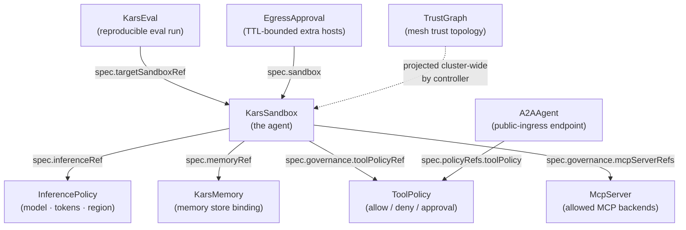

# Governance plane — nine CRDs that compose into a policy

Post 3 in the [kars blog series](README.md).

---

## The shape of the problem

You have an agent. The agent calls models, tools, MCP servers, memory stores, other agents. Each of those calls needs to be governed:

- Which model + region + token budget can this agent use?
- Which tools is it allowed to call, with which argument shapes?
- Which MCP backends? Which Foundry data-plane endpoints?
- Which memory store does it read/write?
- Which other agents may it talk to on the mesh?
- Which external hosts may it egress to, temporarily, with what TTL?

The naive answer is one giant policy file per agent. That works at N=1 and breaks at N=10 because the same policy gets duplicated across agents that should share it (the same `InferencePolicy` applies to every agent on the same model deployment; the same `ToolPolicy` applies to every agent with the same role). Edit-in-one-place becomes edit-in-fifty-places.

The kars answer is **decomposition into nine CRDs**, each owning one policy axis, composed by reference from `KarsSandbox`. The same `InferencePolicy` is referenced by every sandbox that should share it; one change updates them all.

---

## The nine CRDs



| CRD | Scope | What it controls | Lives in |
|---|---|---|---|
| `KarsSandbox` | namespaced | the agent itself (runtime, channels, isolation, references to all the policy CRDs) | `kars-system` |
| `InferencePolicy` | namespaced | model + region + token budget + content safety + model preferences | `kars-system` |
| `ToolPolicy` | namespaced | which tools the agent may call, allow/deny/approval rules, rate limits, AGT policy profile | `kars-system` |
| `KarsMemory` | namespaced | which Foundry memory store the agent reads/writes, lifecycle policy | `kars-system` |
| `McpServer` | namespaced | which MCP backend the agent may call (today singular; plural in a future slice) | `kars-system` |
| `A2AAgent` | namespaced | public-ingress endpoint for cross-org A2A traffic | `kars-system` |
| `EgressApproval` | namespaced | break-glass allowlist of extra egress hosts, TTL-bounded | `kars-system` |
| `KarsEval` | namespaced | reproducible eval run against a target sandbox | `kars-system` |
| `TrustGraph` | **cluster-scoped** | the mesh trust topology — who may peer with whom | cluster-wide |

Plus two infrastructure CRDs (`KarsAuthConfig` for cluster-wide auth config, and the controller-internal `KarsPairing`) that operators usually don't touch directly.

The smallest valid deployment is `KarsSandbox` + a sibling `InferencePolicy` (`spec.inferenceRef` is required — there is no inline fallback). The rest are opt-in.

---

## Why this many

The decomposition isn't arbitrary. The lifecycle of each axis is different:

- **`InferencePolicy`** changes when the platform team negotiates a new model deployment, swaps regions, or updates token budgets. Cadence: monthly-ish.
- **`ToolPolicy`** changes when a security review decides a tool needs an approval gate, or a team rolls out a new tool. Cadence: per-team, ad-hoc.
- **`KarsMemory`** changes when the agent gets a new memory store (rare).
- **`EgressApproval`** changes per-incident. An agent needs a new host *right now*, the operator grants a 4-hour approval, the policy auto-expires.
- **`TrustGraph`** changes when a new pair of agents needs to peer.

If you bundle all of these into one giant CRD, every change to *any* axis bumps the CR's `resourceVersion` and triggers a full reconcile of *every consumer* — including pod restarts in the worst case. With nine separate CRDs, each axis reconciles independently. Editing `EgressApproval` adds a host without restarting the pod.

The cost is more CRDs to learn. The benefit is composability and per-axis change isolation.

---

## How a policy actually enforces

Take `InferencePolicy`. Its spec looks like (simplified):

```yaml
apiVersion: kars.azure.com/v1alpha1
kind: InferencePolicy
metadata:
  name: research-inference
  namespace: kars-system
spec:
  upstream:
    azureOpenAI:
      endpoint: https://my-foundry.openai.azure.com/
      deployment: gpt-5.4
      apiVersion: 2025-04-01-preview
  tokenBudget:
    dailyTokens: 2_000_000
    perSessionTokens: 50_000
  contentSafety:
    requirePromptShields: true
  region: westeurope
```

When a `KarsSandbox` references this via `spec.inferenceRef.name: research-inference`, the controller's `InferencePolicy` reconciler:

1. Validates the spec (schema + cross-references).
2. **Compiles** the spec into a deterministic JSON document (insertion-order-preserved; see internal note in `Cargo.toml`). The compiled document's SHA-256 is the `compiledDigest`.
3. Writes the compiled document to a per-sandbox ConfigMap (`<sandbox>-inference-policy.json`).
4. Stamps `status.compiledDigest` + `status.bundleRefDigest` on both the `InferencePolicy` CR and the consuming `KarsSandbox` CR.

The sandbox pod's `inference-router` sidecar reads the ConfigMap at startup, validates that its digest matches what the apiserver advertises, and enforces the compiled policy on every request. If the digests disagree (e.g. operator changed the policy and the pod hasn't picked it up yet), the router can either fail-closed or hot-reload — controlled by the `ToolPolicy`'s `staleness` knob.

The deterministic byte layout matters because we sign the compiled bundle with cosign and the router verifies the signature on load. Any drift between "what was compiled" and "what was signed" would fail verification.

---

## Cosign-attested allowlists

For egress allowlists specifically (`spec.networkPolicy.allowedEndpoints` on `KarsSandbox`, or the standalone `EgressApproval` CRD), we ship two enforcement modes:

1. **Inline** — the allowlist is declared directly in the CR spec. The controller writes it to a ConfigMap, the router reads it. No external attestation. Operators can grep `kubectl describe karssandbox` to see what's allowed.
2. **Attested** — the allowlist is published as an OCI artifact, signed with cosign (keyless OIDC), and the `KarsSandbox` references it by digest. The router fetches the artifact, verifies the signature against the per-cluster Fulcio root, refuses to start if verification fails.

Why both modes? Inline is fine for dev/local-k8s and small teams. Attested is what enterprise / sovereign / federated deployments use, where the allowlist is published by a different team than the agent operator and there's a chain of custody to enforce. The `EgressAuthoritative=True` and `AllowlistVerified=True` conditions on the `KarsSandbox` status tell operators which mode is active.

---

## Per-axis worked example

A demo scenario from `tools/demo/act2/`:

```yaml
# A "research" agent that can call gpt-5.4, has Brave + Tavily as tools,
# binds to a memory store, and may egress only to telegram + foundry.
---
apiVersion: kars.azure.com/v1alpha1
kind: KarsSandbox
metadata:
  name: research
  namespace: kars-system
spec:
  runtime:
    kind: Hermes
  inferenceRef:           # → policies/research-inference.yaml
    name: research-inference
  memoryRef:              # → policies/research-memory.yaml
    name: research-memory
  governance:
    enabled: true
    toolPolicyRef:        # → policies/research-tools.yaml
      name: research-tools
    trustThreshold: 0
  networkPolicy:
    defaultDeny: true
    allowedEndpoints:
      - host: api.telegram.org
        port: 443
      - host: api.search.brave.com
        port: 443
      - host: api.tavily.com
        port: 443
```

Each `*Ref` is a same-namespace name. The controller does the cross-CR resolution at reconcile time and projects the composed policy into the per-sandbox ConfigMap that the router actually consumes.

Add a sibling `EgressApproval` to grant a 2-hour exception for a one-off scrape:

```yaml
apiVersion: kars.azure.com/v1alpha1
kind: EgressApproval
metadata:
  name: research-arxiv-2026q3
  namespace: kars-system
spec:
  sandbox:
    name: research
  hosts:
    - host: arxiv.org
      port: 443
    - host: export.arxiv.org
      port: 443
  ttlMinutes: 120
  reason: "Q3 literature review — auto-expires."
  approvedBy: "plakatos@microsoft.com"
```

After 120 minutes the controller GCs the approval; the next reconcile cycle drops arxiv from the merged allowlist; the router stops accepting outbound to arxiv. No human action needed to revoke.

This is the composability that makes nine CRDs worth it. Each one moves at its own cadence; each one has a focused enforcement loop; each one shows up cleanly in `kubectl get` for audit.

---

## What the controller actually does

When a `KarsSandbox` is created or updated:

1. **Reconcile the sandbox itself** — namespace, RBAC, Deployment, Service, NetworkPolicy, ConfigMap (governance profile), federated credentials (if `--mesh-trust=entra`).
2. **Reconcile each referenced policy CRD** — the `InferencePolicy` reconciler fires, the `ToolPolicy` reconciler fires, the `KarsMemory` reconciler fires. Each one validates + compiles + writes the per-sandbox ConfigMap + stamps `status.compiledDigest`.
3. **Wire the per-sandbox ConfigMap into the pod template** — the Deployment's `spec.template.spec.volumes` includes the compiled policy ConfigMaps; the router-sidecar's `volumeMounts` makes them readable at `/etc/kars/*`.
4. **Stamp `KarsSandbox.status.conditions`** — `Ready=True`, `Progressing=False`, `RuntimeReady=True`, `AllowlistAuthoritative={True if attested}`, `AllowlistVerified={True if attested+cosign-passed}`, etc. These are the operator-facing source of truth; documented in `docs/api/conditions.md`.

The reconciler is kube-rs flavored. Each CRD has its own reconciler module in `controller/src/`. Reconcile loops are independent — a `ToolPolicy` edit doesn't requeue every `KarsSandbox`, only the ones that reference it.

---

## What this is NOT

- **Not OPA / Rego.** Policy expressions are typed Rust structs, not embedded DSL. We pay a flexibility cost (you can't write arbitrary Rego predicates) for a correctness gain (the compiler enforces shapes; PR review catches schema regressions; everything is grep-able).
- **Not Kyverno / Gatekeeper.** Those tools admission-validate Kubernetes resources cluster-wide. The kars governance plane validates *agent behavior* at runtime in the sandbox-side router. The two layers compose — you can absolutely run Kyverno alongside kars to enforce, say, "no `KarsSandbox` may set `runAsRoot: true`" at admission time.
- **Not a service-mesh policy** (Istio AuthorizationPolicy, Cilium NetworkPolicy v2). Those operate at L4/L7 over the pod's *network*. Kars governance operates at the *application surface* — token budgets, content safety, tool argument schemas — things a service mesh fundamentally can't see.

---

## Where to look

- **CRD types in Rust:** `controller/src/crd/*.rs` (one file per CRD kind).
- **Per-CRD reconcilers:** `controller/src/*_reconciler.rs`.
- **Helm chart CRD YAMLs:** `deploy/helm/kars/crds/`. There's a `helm_drift` test that fails the build if the Helm-shipped schema ever drifts from the Rust-derived one.
- **Conditions reference:** `docs/api/conditions.md`.
- **CRD reference:** `docs/api/crd-reference.md` — every field of every CRD, with examples.

---

## Up next

- **Inter-agent comms?** → [AgentMesh deep-dive](02-agentmesh-deep-dive.md)
- **What it looks like in the sandbox pod?** → [Sandbox anatomy](06-sandbox-anatomy.md)
- **The autonomous SRE agent that uses these CRDs?** → [Autonomous SRE](04-autonomous-sre.md)
