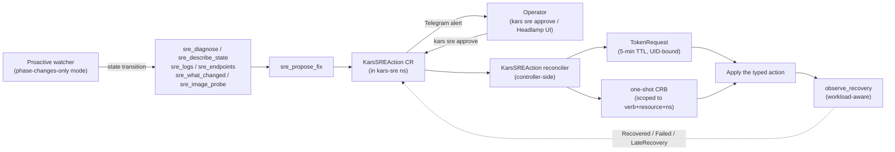

# The autonomous SRE agent — five minutes of trust per fix

Post 4 in the [kars blog series](README.md).

---

## What it is

An agent that watches the cluster, notices when other agents break, diagnoses the cause, proposes a fix, waits for a human to approve, then applies the fix with a one-shot 5-minute token — and observes that the workload actually came back.

It's a kars-native agent. Same sandbox shape, same router sidecar, same egress-guard, same governance plane. The privilege the SRE agent has is *not* in its container — it's in a `kars-sre/sre-writer` ServiceAccount that the agent cannot mint tokens for directly. The controller mints them, scoped exactly to the verb + resource + namespace the approved action needs, with a 5-minute lifetime.

---

## Why this exists

We have N agents from M teams running against the same cluster. Each agent's deployment can break in the boring K8s ways (image-pull failure, evicted pod, tight resource quota, NodeAffinity mismatch, ImageGC pressure) and the boring agent-platform ways (TokenBudget exhausted, governance profile syntax error, mesh registration timeout, missing model deployment).

The bottleneck used to be: someone with cluster admin sees the alert, decides whether to act, acts. That's a human in the loop for every incident. Most of these incidents have *deterministic* fixes — delete the offending ResourceQuota, scale a Deployment, restart a pod — and the human is mostly there to gate the action.

The SRE agent automates the diagnosis + the proposal. Humans only gate the *action*, not the *investigation*.

---

## The shape



There are four kars-shaped pieces here, all of which live in this repo:

1. **Diagnostic tools** in the SRE agent's plugin — `sre_describe_state`, `sre_diagnose`, `sre_logs`, `sre_describe_resource`, `sre_what_changed`, `sre_endpoints`, `sre_image_probe`, `sre_top`. All read-only. Scoped via the `kars-sre-reader` ClusterRoleBinding bound to the SRE pod's `sandbox` SA. They use the standard apiserver httpx client; the sandbox image has no `kubectl`.
2. **`sre_propose_fix`** — the agent's interface for proposing a typed action. Creates a `KarsSREAction` CR in `kars-sre` namespace with phase `Proposed`.
3. **`KarsSREAction` reconciler** in the controller — owns the Proposed→Approved→Applied→Recovered state machine. Validates the action against §7.7.1 protected-resource denylist. Mints the 5-min token. Creates the one-shot CRB. Executes. Tears the CRB down. Observes recovery.
4. **Proactive watcher** in the SRE agent — polls `KarsSandbox` CRs, computes a synthetic state (CR phase overlaid with workload availability), fires one Telegram message per real transition. Configurable mode: `events` (event firehose) or `phase-changes-only` (transitions only — the demo default, what most operators want).

---

## The state machine

```text
Proposed --(operator approves)--> Approved
Proposed --(operator rejects)---> Rejected     (terminal)
Proposed --(15 min elapsed)-----> Expired      (terminal)

Approved --(controller validates + mints token + executes typed action)--> Applied

Applied  --(workload available within 10 min)----> Recovered (terminal)
Applied  --(no recovery in 10 min)-----------> Failed
Failed   --(workload recovers within 30 min
            of appliedAt — LateRecovery)-----> Recovered (terminal)
```

The `Failed → Recovered` edge is the late-recovery healer. Real-world Kubernetes recovery (cold-cache image pulls, RS back-offs, congested nodes) routinely exceeds 10 minutes. Without the healer, a patch that worked at minute 11 leaves the operator's pager stuck on `Failed` while the cluster is healthy — directly eroding operator trust. The healer keeps observing for 30 minutes after `appliedAt` and flips the phase back to `Recovered` (with `reason=LateRecovery`) when reality catches up.

Pre-apply failures (validation, unsupported action, denylisted namespace, apply error) have no `appliedAt` and remain terminal. Late-recovery is opt-in by virtue of having reached `Apply`.

---

## Why 5 minutes of trust per fix

The instinct is to give the SRE agent a static `ClusterRole` covering "the K8s API verbs it needs to fix things". This is the wrong shape because:

1. **The action surface is open-ended.** Today the SRE may need to delete a ResourceQuota; tomorrow it may need to patch a Deployment image. A static ClusterRole would have to be a superset of every fix we might ever apply.
2. **Privilege escalation surface scales with role breadth.** A compromised SRE agent with `update deployments/*` cluster-wide is a *much* bigger problem than one with `delete resourcequota/platform-hardening-quota in namespace kars-research` for the next 5 minutes.
3. **Audit-trail granularity.** A token minted for a specific action with a specific expiry maps 1:1 onto a `KarsSREAction` CR. Every action has its own token, its own CRB name, its own audit-log event. Cluster admins can trace exactly which CR caused which apiserver mutation.

So we invert: the SRE agent has **no** static apiserver-write RBAC. The controller mints a fresh token for each approved action, bound to a one-shot CRB scoped to the verb + resource + namespace of *that specific action*, with a 5-minute TTL. After execution the CRB is deleted. The token is dead 5 minutes after issuance whether the action succeeded or not.

This is "just-in-time, just-enough" privilege as a default. The closest commodity analog is HashiCorp Vault's dynamic database credentials, but for the K8s API.

---

## The four-layer protection on which actions are even allowed

1. **Plugin compiler gate** (`sre_propose_fix`) — refuses to construct actions targeting protected namespaces (`kube-system`, `kars-system`, `kars-sre`, `agentmesh`, etc.). Defence in depth: failing earlier surfaces clearer errors to the LLM.
2. **Controller validation** (`validate_action()`) — enforces a closed set of `SUPPORTED_ACTIONS` (`DeleteResourceQuota`, `PatchDeploymentImage`, `ScaleDeployment`, `RolloutRestart`, `DeletePod`) and the same `DENYLISTED_NAMESPACES` list. Rejected actions never get a token.
3. **Authority split** — only the controller's SA can `create` on `serviceaccounts/token` for `sre-writer`. The SRE agent's SA has no `create-token` permission. Even a fully prompt-injected agent cannot mint the token directly.
4. **Two-step human approval** — `Proposed → Approved` requires a patch to `spec.approval.state` from an operator with the `kars:sre-approver` ClusterRole. The agent never approves itself. The operator approves via `kars sre approve <action-id>` or the Headlamp UI.

Net: even if every line of the SRE agent's code is compromised, the worst it can do is sit a `KarsSREAction` CR in `Proposed` state targeting a non-denylisted namespace and wait for a human to ignore or reject it.

---

## What an incident looks like end-to-end

(This is the canonical demo flow.)

1. Operator runs `tools/demo/act2/break.sh` against `kars-research`. The script applies a tight `ResourceQuota` (`requests.memory: 50Mi`) that the research agent's pod requests cannot satisfy, then evicts the running pod.
2. ReplicaSet tries to create a replacement pod. Apiserver rejects with `exceeded quota`. Pod count goes from 1 to 0.
3. Proactive watcher (poll: 10s, mode: `phase-changes-only`) observes `research: Running → WorkloadDown(0/1)` on its next iteration. Sends one Telegram message: `kars-sre: sandbox phase changes`.
4. Operator chats the SRE agent: "what's wrong?". Agent calls `sre_diagnose`, which now overlays workload availability on top of CR phase, and reports `research: WorkloadDown(0/1), workload_namespace: kars-research, workload_deployment: research`. Agent calls `sre_logs` and `sre_describe_resource` on the affected pod and ReplicaSet, finds the `FailedCreate: exceeded quota` event, identifies the `platform-hardening-quota` ResourceQuota as the cause.
5. Agent calls `sre_propose_fix` with `action_type: DeleteResourceQuota, target: {namespace: kars-research, name: platform-hardening-quota}`. The plugin gate accepts (kars-research is not denylisted). A `KarsSREAction` CR is created in `kars-sre` namespace, phase `Proposed`.
6. Operator sees the proposal in the Headlamp SRE Console (or via `kars sre list`). Reviews. Runs `kars sre approve <action-id>`. CR's `spec.approval.state` flips to `Approved`.
7. Controller's KarsSREAction reconciler sees the transition. Runs `validate_action` (passes). Mints a TokenRequest for `kars-sre/sre-writer` (TTL 5 min, audience `https://kubernetes.default.svc`). Creates a one-shot ClusterRoleBinding `kars-sre-write-<action-id>` granting `delete` on `resourcequotas` with `resourceNames: [platform-hardening-quota]` in namespace `kars-research`. Executes `DELETE` against the apiserver using the minted token. Tears the CRB down. Stamps `phase=Applied, appliedAt=<now>`.
8. ReplicaSet's next create attempt succeeds. Pod schedules. Image pulls (potentially slow on cold-cache clusters — this is the trap the late-recovery healer fixes).
9. Reconciler's recovery observer polls every 10s: `(no recent FailedCreate events) AND (every Deployment in kars-research has available >= desired)`. When both are true, stamps `phase=Recovered`. On the demo: recovery happened at ~6 min on a cold AKS cluster — past the original 5-min window, caught by the 10-min window (or, if it ever happens at minute 12, caught by the late-recovery healer that polls until 30 min after `appliedAt`).
10. Proactive watcher observes `research: WorkloadDown(0/1) → Running`. Sends one final Telegram message confirming recovery.

End-to-end: ~3 minutes if the human approves immediately. Most of that is the K8s controller-loop latencies (ReplicaSet wakeup + image pull + pod ready probe) — the agent's investigation + proposal is sub-second per `sre_*` call.

---

## What this does NOT cover

- **Cross-cluster SRE.** Today the SRE agent operates on the same cluster it lives in. Cross-account / cross-cluster remediation is out of scope for this slice.
- **Continuous learning.** The agent does not currently update its own playbook based on past incidents. We log the diagnosis trail to the CR's status block, so future LLMs can read prior cases as context — but there's no automated playbook synthesis yet.
- **Multi-action workflows.** Each `KarsSREAction` is a single typed action against a single target. Composite workflows (rollback Deployment + scale up + restart pods) require multiple sequential CRs, each approved separately. We considered batching but decided the per-action approval is the security property we want — bundling weakens human oversight.

---

## Where to look in the code

- **Reconciler:** `controller/src/kars_sre_action_reconciler.rs` — the state machine, validation, token minting, CRB lifecycle, recovery observer + late-recovery healer.
- **Agent tools:** `runtimes/hermes/src/kars_runtime_hermes/plugin/sre.py` — `sre_describe_state`, `sre_diagnose` (workload-availability cross-check), `sre_logs`, etc.
- **Proactive watcher:** `runtimes/hermes/src/kars_runtime_hermes/plugin/sre_watcher.py` — `_phase_change_loop()` with the workload-availability overlay; `_workload_state()` is where the synthesis happens.
- **CRD types:** `controller/src/kars_sre_action.rs` — `KarsSREActionSpec` and the typed `ActionSpec`.
- **Helm chart:** `deploy/helm/kars/templates/sre.yaml` — `kars-sre` namespace, `sandbox` + `sre-writer` SAs, the SRE `KarsSandbox` CR with `SRE_WATCHER_MODE=phase-changes-only`.
- **CLI surfaces:** `cli/src/commands/sre.ts` — `kars sre install`, `kars sre approve`, `kars sre list`, `kars sre show`.

---

## What's next

- ValidatingAdmissionPolicy on `KarsSREAction` CRs targeting protected namespaces (layer 3 of 3 per §7.7.1; today's enforcement is layers 1 + 2).
- Cross-cluster SRE via the federated-mesh substrate (out of scope this slice; tracked in the global-agentmesh roadmap).
- Playbook synthesis from past incidents (the data is already on the CR status; the synthesis is the open question).

If you want to see this run, the demo is `tools/demo/act2/break.sh` followed by chatting the SRE agent. It's the most-watched 3 minutes of a kars demo for a reason.
