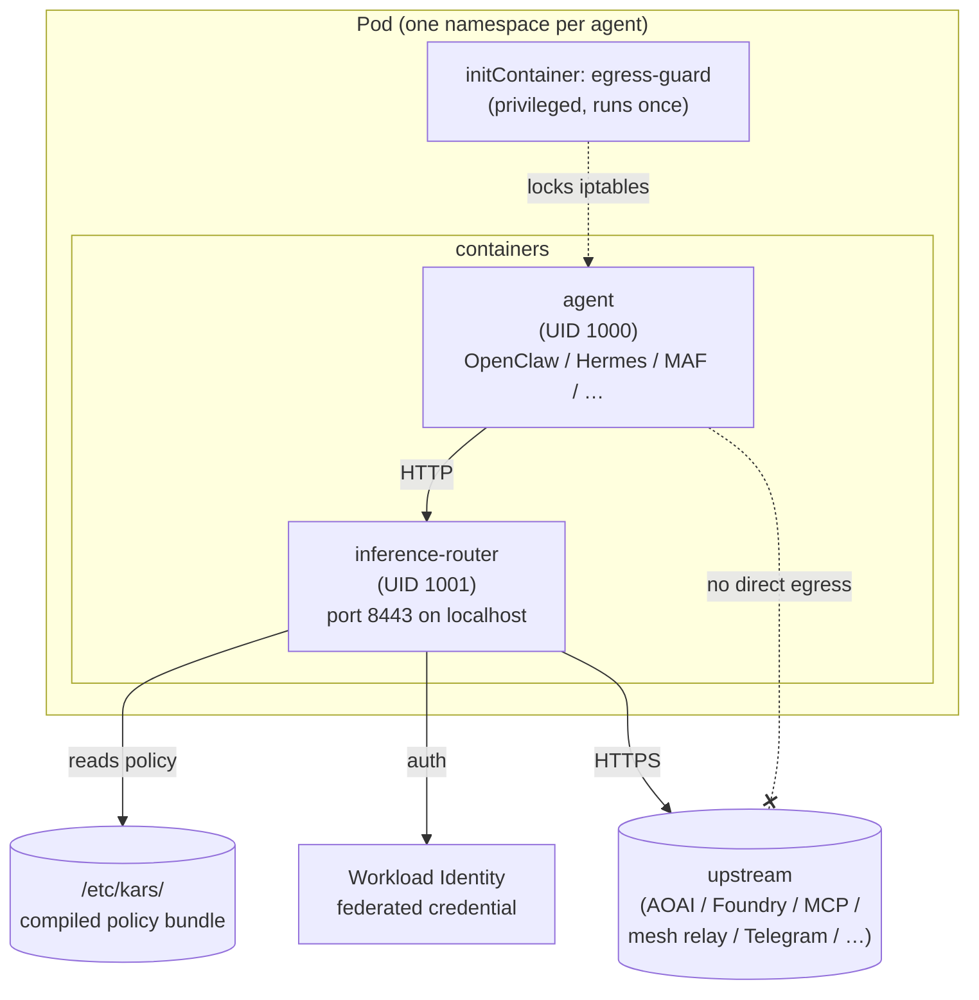
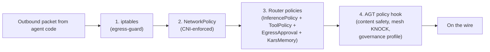

# Sandbox anatomy — what's inside one agent pod

Post 6 in the [kars blog series](README.md).

---

## The whole pod, in one diagram



One pod. Two long-lived containers + one init container. The agent runs as UID 1000 and the router runs as UID 1001 — that single UID difference is what the iptables rules pin against.

---

## What the init container does

The egress-guard runs first, with `CAP_NET_ADMIN` + `CAP_NET_RAW`, in privileged init mode. It does one job: install iptables rules that lock UID 1000 to loopback + DNS only. Then it exits.

Simplified version of what runs:

```bash
# Allow loopback (so the agent can call its own sidecar router on :8443)
iptables -A OUTPUT -o lo -j ACCEPT

# Allow DNS to the cluster DNS service (so the agent can resolve hostnames
# for the router to validate — DNS-rebinding mitigations are router-side)
iptables -A OUTPUT -m owner --uid-owner 1000 -p udp --dport 53 -j ACCEPT
iptables -A OUTPUT -m owner --uid-owner 1000 -p tcp --dport 53 -j ACCEPT

# For role=sre sandboxes, allow apiserver bypass (the SRE agent needs to
# read the K8s API directly; the router doesn't proxy K8s).
# This is gated by spec.runtime.hermes.extraEnv.KARS_ROLE=sre + clusterPortable
# apiserver detection from KUBERNETES_SERVICE_HOST/PORT_HTTPS env.
iptables -A OUTPUT -m owner --uid-owner 1000 \
  -d ${KUBERNETES_SERVICE_HOST} -p tcp --dport ${KUBERNETES_SERVICE_PORT_HTTPS:-443} \
  -j ACCEPT

# Drop everything else from UID 1000 — the agent can't reach the network.
iptables -A OUTPUT -m owner --uid-owner 1000 -j REJECT
```

UID 1001 (the router) has no egress restriction — it's free to call Azure OpenAI, Foundry, MCP servers, the mesh relay, whatever the policy ConfigMap allows. The split is the whole point: the *agent's* network is locked down; the *router's* network is the policy-governed path out.

This is layer 1 of the four-layer defense. The agent can compromise its own process completely and still cannot send a packet to anything except DNS + `127.0.0.1`.

---

## The agent container

This is where the model talks. Whatever runtime the operator picked (OpenClaw / Hermes / Anthropic / MAF / LangGraph / Pydantic AI / OpenAI Agents — see [post 5](05-multi-runtime.md)) runs here. It's a normal Python or Node process. It doesn't have privileged capabilities, it doesn't run as root, it doesn't see any model API keys (those live in the router's env).

What the agent container *does* see:
- `/etc/kars/` — read-only mount of the compiled policy bundle (so the runtime adapter can short-circuit calls the policy has already denied).
- `/sandbox/` — writable scratch directory for the agent's workspace, session memory, plugin cache.
- `/tmp/` — writable. Sized at 64Mi by default (configurable via `spec.sandbox.writablePaths`).
- Env vars: `SANDBOX_NAME`, `CLUSTER_NAME`, `OPENCLAW_MODEL`, `KARS_PROVIDER`, channel tokens (`TELEGRAM_BOT_TOKEN`, etc. if configured) — but **no model API keys**.

What the agent container does NOT see:
- The router's API keys / IMDS tokens (those never leave the router's process memory).
- The K8s ServiceAccount token (unless the agent is the SRE agent and explicitly opts into the apiserver-bypass path).
- Other pods in the cluster (NetworkPolicy + iptables).

The root filesystem is read-only (`readOnlyRootFilesystem: true`). `runAsNonRoot: true`. `allowPrivilegeEscalation: false`. `seccompProfile: kars-strict`. The container has zero capabilities — `securityContext.capabilities.drop: ["ALL"]`.

---

## The router sidecar

The router is the trust boundary. Every external call the agent wants to make goes through here. It is the *only* network path out.

What the router runs (top to bottom):

1. **HTTP server (axum)** on `127.0.0.1:8443`. Mutual TLS optional; loopback-only by default.
2. **Routes** for the surfaces the agent might call: `/v1/chat/completions`, `/v1/mcp/*`, `/v1/mesh/*`, `/sandbox/spawn`, `/v1/memory_stores/*`, `/foundry/*` data-plane proxy. Each route has its own policy module.
3. **Policy enforcement** — token budget, content safety (Prompt Shields), tool allow/deny, egress allowlist, model preference, region pinning. All read from `/etc/kars/`.
4. **Auth** — mints upstream auth tokens via IMDS / Workload Identity. The federated credential is attached to the pod's ServiceAccount; the router fetches an IMDS token, exchanges it for a target-resource token, caches with a TTL.
5. **Telemetry** — emits OpenTelemetry GenAI semantic-convention spans for every call. Operators get traces in Grafana / App Insights without the agent runtime knowing about telemetry.
6. **Recovery hints** — when an upstream returns 429/5xx, the router can retry on a configured fallback deployment (per `InferencePolicy.upstream.fallbacks`).

The router has its own SA + RBAC, distinct from the agent's. It needs:
- `secrets/get` on its own namespace (for ChannelTokens, MCP credentials).
- `configmaps/get,watch` on its own namespace (for the compiled policy bundle hot-reload).
- `tokens.serviceaccount/create` on its own SA (for federated identity token exchange).

It does NOT need apiserver write on anything in the agent's namespace.

---

## The four layers

This is the canonical defense diagram:



Each layer is owned by a different control point:

| Layer | Enforced by | Bypass means |
|---|---|---|
| 1. iptables | the kernel (init container set this up) | escape the container AND get CAP_NET_ADMIN AND rewrite the rules — would need a kernel privilege bug |
| 2. NetworkPolicy | the CNI (kindnet/Cilium/Calico) | escape the pod's network namespace — would need a CNI bug |
| 3. Router policies | the router process | trick the router into mis-classifying the request — policy bug |
| 4. AGT policy hook | the AGT runtime in the agent | be on the trust graph + earn a high enough score — would require legitimate operation |

To exfiltrate one byte, an attacker would have to bypass all four. The first two are kernel- and CNI-enforced (orthogonal to anything the agent's user-space can do). The third is a single-process trust boundary (no shared mutable state with the agent). The fourth is where most legitimate operations live; mesh KNOCK + trust scores make it socially costly to abuse.

If you ever see "kars is too complicated, why so many layers?" — this is the answer. Each layer is cheap to add and expensive for an attacker. Removing any one of them turns the next one into a single-point-of-failure.

---

## What an attacker has to do to escape

Concretely:

1. **Compromise the agent process** (e.g. prompt injection → RCE in a tool the LLM wrote a payload for). They are now UID 1000 inside the sandbox.
2. **Try to egress.** iptables drops the packet (Layer 1).
3. **Try to read the router's API keys.** Different process, different UID, no shared memory. They'd need a kernel exploit or a container-escape exploit.
4. **Try to talk to other pods.** NetworkPolicy denies (Layer 2).
5. **Try to call the router with an obviously-malicious request.** Router checks policy ConfigMap and denies (Layer 3).
6. **Try to call the router with a subtly-malicious request** (e.g. ask for a 100K-token completion to drain budget). Router enforces token budget per session/day, refuses past the cap. Telemetry records the attempt (Layer 3, but also gives the operator a signal).
7. **Try to talk to a peer agent on the mesh** to get them to do something malicious. Router proxies to AGT relay; the peer's KNOCK gate checks the sender's trust score; if low, refuses; if higher, accepts but only allows tool calls the peer's own policy permits (Layer 4).

There's no single bypass. The closest thing to a "skeleton key" attack would be a kernel exploit that lets you rewrite iptables — but at that point you've compromised the node, which is a much bigger problem than one agent.

---

## Defaults that operators should know

- **`readOnlyRootFilesystem: true`** by default. Agents that need writable areas declare them in `spec.sandbox.writablePaths`. The default is `["/sandbox", "/tmp"]`.
- **`runAsNonRoot: true`** by default. Bypass requires explicit operator opt-in (e.g. the egress-guard initContainer is the only privileged one).
- **`allowPrivilegeEscalation: false`** by default. setuid binaries inside the image cannot escalate.
- **`seccompProfile: kars-strict`** by default. Custom syscall allowlist; blocks most kernel-facing attack surface.
- **`isolation: standard`** by default. Confidential VMs (AMD SEV-SNP / Intel TDX) are a one-flag flip in `spec.sandbox.isolation`.
- **`networkPolicy.defaultDeny: true`** by default. Egress allowlist is opt-in per host:port.
- **`governance.enabled: true`** by default. Disabling means turning the router into a passthrough — only acceptable in dev mode.

---

## What this is NOT

- **Not a full container escape model.** Kars relies on the underlying kernel + CNI + container runtime being correctly configured. We layer additional defenses on top, but a kernel CVE that escapes all containers will affect kars too.
- **Not anti-LLM prompt injection.** Prompt injection in the LLM's output is *expected*. The defense is that even a successful injection only compromises the *agent process*, and the agent process can't egress. Defense in depth means accepting that the agent's behavior may be adversarial, not that we prevent the LLM from being prompted.
- **Not a hardware enclave by default.** Confidential VMs are an opt-in via `spec.sandbox.isolation: confidential`. The default is standard K8s isolation, which is enough for most threat models.

---

## Where to look

- **Egress-guard rules:** `controller/src/reconciler/mod.rs` around line 120 (`egress_guard_init_command`).
- **NetworkPolicy generation:** `controller/src/reconciler/mod.rs::network_policy_for_sandbox`.
- **Router policy modules:** `inference-router/src/routes/` (one file per surface).
- **seccomp profile:** `deploy/seccomp/kars-strict.json`.
- **Threat model deep-dive:** `docs/security/threat-model.md`.

---

## Up next

- **The router's policy plane?** → [Governance plane](03-governance-plane.md)
- **The mesh layer?** → [AgentMesh deep-dive](02-agentmesh-deep-dive.md)
- **How operators see all this?** → [Operator UX](07-operator-ux.md)
