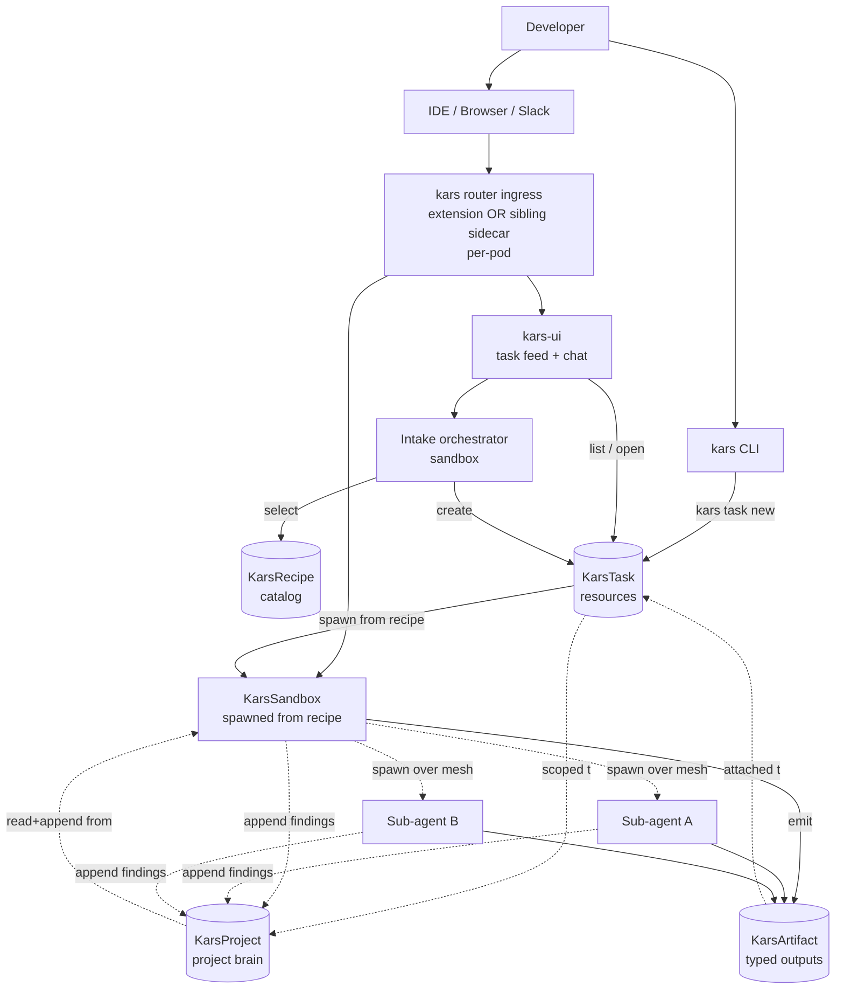

# Developer experience design note — task intake, agent recipes, conversation ingress

**Status:** internal design note, exploratory. Drives the next round of UX work.
**Authors:** Pal Lakatos, Copilot
**Date:** 2026-06-15

---

## The two gaps we are addressing

After the [agentgateway parity discussion](agentgateway-parity-plan.md), two structural gaps in kars's developer experience came into focus that none of our roadmap items today address.

### Gap A — "How do I talk to my running agents from where I work?"

Today, a developer who wants to check on a running kars agent has to:

1. Know the agent's K8s namespace + name.
2. Run `kars connect <agent>` or `kubectl port-forward` to the sandbox's gateway port.
3. Open the Headlamp SRE Console (or hit `localhost:18789` directly) for chat.
4. Repeat for every agent they spawn.

This is fine for an SRE-shaped operator. It is **terrible for a developer who wants to fire off several tasks per day and check on them as they progress**. There is no thread-style UI, no cross-task feed, no inbox of "agents waiting for your input", no equivalent of Slack threads. The shape we want is: "open the kars UI on your laptop, see all your in-flight tasks, click into any one to chat with the responsible agent (or its sub-agents)."

This is the place for an **ingress capability inside the kars router (or a kars-shipped sibling sidecar)** — same layer as today's egress trust boundary, just bidirectional. The router already knows what sandbox it lives in, which runtime is running, where the chat surface listens, the compiled policy bundle, and the sandbox's mesh DID + Entra Agent ID + WI binding. Adding an ingress port + per-sandbox chat-surface forwarder + ingress-side authz is materially the same shape as the egress side, inverted. See [agentgateway-vs-kars-router-analysis.md](agentgateway-vs-kars-router-analysis.md) for why agentgateway is the wrong layer for this (it would need kars-CRD awareness, which is a cross-project non-starter).

What this is NOT: a front-door endpoint that maps `/openai/v1/chat/completions` to the cluster. That was the category error we deliberately dropped. What this IS: a kars-native ingress path that routes "talk to agent X" requests from a developer's browser / IDE plugin to the chat surface of sandbox X.

### Gap B — "How do I know what kind of agent to spin up?"

A `KarsSandbox` CR today requires the author to know:

- **Runtime kind** — OpenClaw / Hermes / Anthropic SDK / MAF / LangGraph (Python or TS) / Pydantic AI / OpenAI Agents. Each has a different sweet spot (tool-heavy vs stateful TUI vs Azure-shaped DI vs graph-shaped workflows vs ...).
- **Model** — gpt-5.4 / Claude / Gemini / Bedrock / etc. Picking the right one is non-trivial: reasoning-heavy tasks reward bigger context windows; execution-heavy tasks reward smaller/faster/cheaper models.
- **Tool surface** — which MCP servers, which Foundry-native tools, which channel adapters, which mesh peers.
- **Autonomy level** — single-turn, iterative loop with N steps, iterative with human checkpoints, fully autonomous with TTL.
- **Artifact targets** — what does "done" look like? A PR? A markdown research brief? A JSON threat model? A patched ResourceQuota?
- **Governance profile** — `InferencePolicy`, `ToolPolicy`, `KarsMemory` binding, `EgressApproval` allowlists, mesh `TrustGraph` membership.

This is six interlocking expert-level decisions per agent. For an engineer who just wants to say "research the impact of X on Y" or "draft an implementation for feature Z and open a PR", it's an immense onboarding cliff.

Orka closes this gap with a "chat with the orchestrator" UX — the orchestrator interprets the task and decides the recipe. Kars needs something analogous, but **better than Orka's because our choices are auditable, policy-bound, and persistent as CRs** — not opaque to the agent.

---

## Proposed capability shape

### Capability 1 — `KarsRecipe` CRD: declarative agent task recipes

Today: every team's `KarsSandbox` CRs are bespoke. Tomorrow: most sandboxes are spawned from a shared, versioned, governance-attached recipe.

A `KarsRecipe` is a typed template for "the agent shape we use when we want to do X". It carries:

```yaml
apiVersion: kars.azure.com/v1alpha1
kind: KarsRecipe
metadata:
  name: research-brief
  namespace: kars-system
spec:
  taskKind: research               # research | coding | sre | data-analysis | threat-modeling | scan | ...
  description: |
    Investigate a topic and produce a markdown brief with citations.
    Good for "give me a survey of X" or "compare A vs B".
  runtime:
    kind: Hermes                   # Hermes for stateful + chat-style
  inferenceRef:
    name: research-inference       # gpt-5.4, larger context window
  toolPolicyRef:
    name: research-tools           # web_search, web_fetch, file_io, mesh peers
  memoryRef:
    name: research-memory          # the team's research memory store
  autonomy:
    # Formal autonomy taxonomy aligned with NIST AI RMF Agentic Profile +
    # the 2026 industry consensus (IEEE 7007 / ISO SC 42 / supervised-
    # autonomy literature). One field with deliberate semantics, not a
    # free-form mode string.
    #   Level 1 — Assistance (HITL): every step requires human approval
    #   Level 2 — Shared (Human-on-the-Loop): agent acts under continuous
    #             oversight, easy intervention
    #   Level 3 — Conditional: routine actions autonomous, exceptions to
    #             human (the "PR-Draft First" default for coding tasks)
    #   Level 4 — Supervised: autonomous with periodic checkpoints + audit
    #             (the default for research / long-running tasks)
    #   Level 5 — Full: no routine human oversight (TTL-bounded only)
    level: 4
    maxIterations: 25
    checkpointEvery: 5             # only meaningful at Level 4
    ttlAfterLastTask: 24h
    # Per-level default HITL gates (overrideable; see Capability 4):
    #   Level 1 ⇒ all tool calls require approval
    #   Level 2 ⇒ tool calls in deny-on-doubt list require approval
    #   Level 3 ⇒ only EgressApproval-covered actions require approval
    #   Level 4 ⇒ checkpoint approvals only
    #   Level 5 ⇒ no per-action gates; KarsKillSwitch is the only
    #             interruption mechanism
  artifacts:
    - kind: MarkdownBrief
      path: /sandbox/artifacts/brief.md
    - kind: CitationList
      path: /sandbox/artifacts/citations.json
  sandbox:
    isolation: standard
    seccompProfile: kars-strict
```

This is the kars-native equivalent of the SIG's `SandboxTemplate` for the agent-shape decision (their template is for the pod-shape decision; the two compose naturally — a `KarsRecipe` can reference a SIG `SandboxTemplate` as the underlying pod shape).

The `autonomy.level` field is **the same primitive that closes SOTA GAP-6 (autonomy tier classification, per [`sota-agentic-ai-capability-map.md`](sota-agentic-ai-capability-map.md))**. One field powers three things: (a) the NIST AI RMF GOVERN-extension obligation for autonomy-tier-aware oversight, (b) the recipe-defaulted UX behaviour (intake / approval / artifact-handover patterns), and (c) the per-level HITL gates that close SOTA GAP-5. Building it once across security + UX is materially cheaper than building two separate concepts.

The catalog of recipes is the team's institutional knowledge about "how we do agent work here". Reviewers approve recipes once; spawning from a recipe is a one-line action.

### Capability 2 — `KarsTask` CRD: the typed unit of work

A user (or an upstream system) creates a `KarsTask`:

```yaml
apiVersion: kars.azure.com/v1alpha1
kind: KarsTask
metadata:
  name: research-cilium-egress-2026q3
  namespace: <user-namespace>
spec:
  recipeRef:
    name: research-brief
  prompt: |
    Compare Cilium egress confinement on GKE Dataplane v2 vs iptables
    egress-guard for agent sandboxes. Focus on threat-model differences,
    operational tradeoffs, and the in-flight upstream PRs.
  inputs:
    - kind: WebUrl
      value: https://github.com/kubernetes-sigs/agent-sandbox/pull/967
  requestedBy: plakatos@microsoft.com
  approvedBy: plakatos@microsoft.com
```

The controller spawns the recipe-derived sandbox(es), threads the prompt + inputs in, and watches for completion. On completion, `KarsTask.status` carries:

- `state` (Proposed / Running / WaitingForHuman / Completed / Failed)
- `sandboxRefs` (the spawned sandboxes — primary + any sub-agents)
- `artifacts` (typed pointers to what the agent produced)
- `conversationUrl` (the ingress URL to chat with the responsible agent)
- `costLedger` (per-surface cost across model + tool + MCP + mesh + spawn — see [unified action-cost ledger](agentgateway-parity-plan.md))

Spawning a sub-agent (via mesh) creates a child `KarsTask` linked back to the parent. The task tree becomes the natural shape of "what's my agent fleet doing right now".

### Capability 3 — `kars` CLI + Web UI: task intake + thread feed

The CLI surface stays in the operator-shaped place:

```
$ kars task new research-brief "Compare Cilium egress on GKE..." \
    --input https://github.com/kubernetes-sigs/agent-sandbox/pull/967
✓ KarsTask research-cilium-egress-2026q3 created
✓ Spawning sandbox research-cilium-egress-2026q3 from recipe research-brief
✓ Open the conversation: https://kars.example.com/tasks/research-cilium-egress-2026q3
```

The web UI (served either via Headlamp plugin OR a standalone kars-ui Deployment for non-Headlamp users — see parity plan #U1) gives:

- **Task feed**: all `KarsTask` resources scoped to the current user's namespaces, ordered by recency / state. Slack-thread style — one row per task, status badge, artifact thumbnails, last-message preview.
- **Task detail**: click any task → the live conversation with the responsible agent. Markdown, code blocks, tool call traces, artifacts inline. Send a message → the agent replies. Pause / resume / kill from the UI.
- **Task tree**: for tasks that spawned sub-agents over mesh, see the tree; click any node to chat with that sub-agent.
- **Inbox**: tasks waiting for a human checkpoint (autonomy `iterative-with-checkpoints` and the agent has paused for approval).
- **Recipe browser**: browse the cluster's `KarsRecipe` catalog; one-click "spawn a task from this recipe".

The web UI sits behind agentgateway. agentgateway routes browser → recipe-spawned sandbox conversation by `task ID → namespace + sandbox name → sandbox chat surface`, applies external-edge auth (OIDC / Entra), and gives us request-level observability without us building any of it.

### Capability 4 — Recipe-selecting intake agent

For the "I don't know which recipe to pick" case, ship a kars-native **intake agent** (one more sandbox, with its own recipe `intake-orchestrator`) that:

- Listens on the cluster's primary intake channel (Slack / Telegram / web UI).
- Takes natural-language task descriptions.
- Selects (or proposes + asks the user to confirm) a recipe from the catalog. Selection is a model call — the intake agent reads the recipe's `description` field, the user's prompt, and the available `InferencePolicy` + `ToolPolicy` resources, and recommends.
- Creates the `KarsTask` resource on the user's behalf (subject to per-user authz on `kars.azure.com/tasks: create`).
- Returns the conversation URL.

The intake agent is itself a kars sandbox. It eats our own dog food — its `InferencePolicy` is auditable, its tool surface is policy-bound, its action-cost is in the same ledger as everyone else's. Compare to Orka's "orchestrator" which is opaque to the framework.

### Capability 5 — Typed artifacts with provenance

Today, "artifacts" in kars are ad-hoc files in `/sandbox/agent/`. Tomorrow:

- Each `KarsRecipe` declares `artifacts: [{kind, path}]`.
- On task completion, the controller scoops artifacts from the sandbox into a content-addressable `KarsArtifact` resource (or attaches blob refs to the task status — design TBD).
- Each artifact carries provenance: which task created it, which agent (DID), which model call chain produced it, signature.
- Cross-task references: a `coding-task` artifact (a PR) can carry a back-pointer to a `research-task` artifact (the brief that informed it). Provenance becomes the chain of evidence for review.

This is structurally the same shape as Orka's `ValidationArtifact` from their repository-scanning flow — we generalize it to all task kinds.

### Capability 6 — Standard recipe catalog (ship with the chart)

The Helm chart ships an opinionated starter catalog so new clusters don't begin empty:

| Recipe | Task kind | Runtime | Model | Tools | Autonomy | Artifacts |
|---|---|---|---|---|---|---|
| `research-brief` | research | Hermes | gpt-5.4 (large ctx) | web_search, web_fetch, file_io | iterative (25 steps) | MarkdownBrief, CitationList |
| `coding-task` | coding | OpenClaw | gpt-5.4 | file_io, code_exec, mcp:github | iterative-with-checkpoints | CodePatch, PRDescription |
| `threat-model` | threat-modeling | Hermes | gpt-5.4 | file_io, web_fetch | iterative (15 steps) | ThreatModelMd, FindingsJson |
| `data-analysis` | data-analysis | OpenClaw | Claude | code_exec, python_repl, file_io | iterative (20 steps) | Notebook, Chart, MarkdownReport |
| `repo-scan` | scan | Hermes | gpt-5.4 | mcp:github, mcp:semgrep, file_io | autonomous-ttl (24h) | ScanReport, ValidationArtifact, RemediationPRs |
| `sre-action` | sre | Hermes (existing SRE) | gpt-5.4 | sre_* | iterative-with-checkpoints | KarsSREAction CR |
| `chat-research` | research-light | Hermes | gpt-5.4 (small ctx) | web_search | single-turn | InlineAnswer |

These are starting points; teams clone and customize for their own contexts. The standard catalog answers "what should I show in the recipe browser when an engineer opens it for the first time" — Orka and agentgateway have nothing equivalent.

### Capability 7 — Per-task-kind UX patterns the recipe declares

The 2026 agentic-coding literature (Devin / Claude Code / Cursor UX studies) converges on **per-task-kind handover patterns** rather than one-size-fits-all chat. Coding tasks expect "PR-Draft First": the agent opens a draft PR with inline annotations, change summary, ownership transfer modal — *not* silent commits. Research tasks expect a brief-with-citations, scope-visualised before work starts. Data-analysis tasks expect a notebook + chart + summary bundle.

`KarsRecipe.spec` declares the **handover pattern** the recipe expects, and the web UI / CLI surface the matching UX:

```yaml
handover:
  pattern: pr-draft-first    # pr-draft-first | brief-with-citations |
                             # notebook-bundle | sre-action-cr | inline-answer
  ownershipTransfer: required # required | optional | none
  annotations: inline-rationale
  changeSummary: human-readable-diff
  feedbackLoop: chained       # the user can chain follow-ups without
                              # leaving the handover flow
  regretFreeUndo: true        # one-click undo + agent-emitted explanation
```

The pattern is the contract between recipe author and developer: the developer can trust that a `coding-task` recipe will hand back a draft PR (not a force-push to main), and a `research-brief` recipe will produce something reviewable inline. Sub-agents inherit their parent's handover pattern unless their own recipe overrides.

### Capability 8 — Cross-task project memory ("project brain")

The 2026 agentic-coding patterns include **persistent project memory** — Cursor's "project brain", Claude's session memory across handovers, Devin's reasoning trace. A new task in the same project should be able to read "last time we touched this module, the agent rejected approach A because of constraint C".

Kars's existing `KarsMemory` CRD is per-sandbox memory store binding. Project memory is **cross-task scope**: bound to a project (a namespace, a label selector, or an explicit `KarsProject` CR — TBD). New tasks spawned in the project inherit a read+append projection of the project's memory; cross-task provenance lets the developer see "this artifact in task T1 informed this decision in task T2".

This is also where mesh-distributed memory pays off: sub-agents A and B working on different parts of the same task can both write to the project brain and see each other's findings, without the parent doing manual context-merging.

### Capability 9 — Regret-free interactions: undo + explain across the action chain

One of the strongest patterns in the 2026 coding-agent UX studies is **regret-free commits**: every agent action carries enough provenance + reversibility metadata that a developer can one-click undo + see the explanation. Kars already has the substrate for this (per-call OTel + per-CR audit + `KarsSREAction.spec.approval`). What's missing is the *unified* surface that exposes it:

- Each agent action emits an `undoability` annotation: reversible / partially-reversible / irreversible-needs-manual-intervention.
- The web UI shows recent actions with the "undo" affordance where reversible, plus the agent-emitted reason for the action (so the developer can read "I deleted this file because X" before deciding).
- `KarsTask.status` carries a `lastReversibleAction` pointer and `irreversibleActionsCount` so escalation triggers (e.g., a Tier-4 autonomous task crossing 5 irreversible actions without checkpoint) fire automatically.

This is materially the same machinery as the SOTA GAP-6 (autonomy tiers) + GAP-5 (HITL framework) — undoability becomes the substrate that lets autonomy levels actually be meaningful.

---

## Architecture sketch



The agent runtime (sandboxes + mesh + governance) stays exactly as it is today. The new pieces (intake, recipes, tasks, project memory, artifacts, web UI, kars-native ingress) sit on top — they're CRDs + a UI + a chart-shipped catalog. Nothing in the existing trust-boundary or governance plane changes.

The **ingress is kars-native** (extension of the inference router or a sibling per-pod ingress sidecar). See [`agentgateway-vs-kars-router-analysis.md`](agentgateway-vs-kars-router-analysis.md) for why agentgateway is the wrong layer for this — it doesn't know about `KarsSandbox`, can't do per-sandbox session affinity, can't auto-discover newly spawned sandboxes, can't route across runtime-specific chat surfaces (Hermes 18789 vs OpenClaw vs MAF) without absorbing kars-CRD awareness (cross-project non-starter).

---

## Research validation — does the literature actually back this design

The capability shape proposed here is grounded in three independent sources from the 2026 literature:

**1. Agentic-coding UX studies** (Devin / Claude Code / Cursor / Continue patterns, 2026):
- Intent-Centric Dialogs with contextual scoping → answered by Capability 4 (intake orchestrator) + Capability 1 (recipes carry context per task-kind).
- PR-Draft First handover → answered by Capability 7 (per-task-kind handover pattern; `coding-task` recipe declares `pattern: pr-draft-first`).
- Editable work-plan acceptance before agents act → answered by Capability 4 (intake confirm-before-spawn default at Tier ≤ 3).
- Persistent project memory → answered by Capability 8 (`KarsProject` cross-task memory).
- Regret-free commits with undo & explain → answered by Capability 9.
- Multi-agent collaboration with real-time "who's working on what" → answered by Capability 3 (web UI task tree).
- Artifact bundling (code + tests + docs together) → answered by Capability 5 (`KarsRecipe.spec.artifacts` declares the bundle).

**2. Multi-agent orchestration framework comparison** (2026):
- The 2026 consensus is that **LangGraph wins on auditable enterprise flows, CrewAI wins on role-based prototyping, AutoGen wins on research/debate, MAF wins on Azure-DI shapes**. No single framework dominates. Recipes operationalize this — a `coding-task` recipe can reference an OpenClaw or LangGraph runtime; a `research-debate` recipe can reference AutoGen via MAF; an SRE recipe stays on Hermes. **Multi-runtime makes per-task framework selection a *deliberate UX choice*, not a lock-in.**

**3. Agent autonomy taxonomy** (IEEE 7007 + ISO/IEC JTC 1/SC 42 + NIST RMF Agentic Profile 2026):
- The five-level taxonomy (Manual → Assistance → Shared → Conditional → Supervised → Full) is now industry consensus. Capability 1 (`autonomy.level: 1..5`) adopts it directly. This is *the same primitive* that closes SOTA GAP-6, GAP-5, and GAP-8 from the security capability map. **Building it once across security + UX makes both stronger than building two separate concepts.**

The combined effect: the design is not speculative invention — it's the **agentic-AI workflow consensus** put behind kars's governance and trust-boundary substrate. The cited references (industry framework comparisons, agentic-coding UX patterns, autonomy taxonomies) are the same ones any serious evaluator will check against.

---

## What this gives us that no one else has

| Capability | kars | agentgateway | Orka | agent-sandbox SIG |
|---|---|---|---|---|
| Task intake from natural language | (proposed) | ✗ | ✓ (opaque) | ✗ |
| Recipes as governance-attached CRDs | (proposed) | ✗ | ✗ (in-memory) | ✓ SandboxTemplate (pod-shape only) |
| Typed artifacts with provenance | (proposed) | ✗ | ✓ for security scans only | ✗ |
| Per-task multi-agent task tree | (proposed) | ✗ | ✗ | ✗ |
| Cross-task artifact provenance chain | (proposed) | ✗ | ✗ | ✗ |
| Per-pod kars-native conversation ingress | (proposed) | ✗ (not its layer) | ✗ | ✗ |
| Intake choices auditable as CRs | (proposed) | ✗ | ✗ (model-internal) | ✗ |
| Standard opinionated recipe catalog with per-task-kind handover patterns | (proposed) | ✗ | ✗ | ✗ |
| Formal autonomy taxonomy (Level 1–5) wired through governance + UX + HITL | (proposed) | ✗ | ✗ | ✗ |
| Cross-task project memory ("project brain") | (proposed) | ✗ | ✓ (namespace-scoped recall) | ✗ |
| Regret-free undo + agent-emitted explanation per action | (proposed) | ✗ | ✗ | ✗ |
| Multi-runtime per-task framework selection (LangGraph for audit, AutoGen for debate, OpenClaw for tool-heavy, Hermes for stateful chat) | ✓ (today, via runtime adapters) | ✗ | ✗ | (plan) |

**This is the developer surface that makes kars more than "K8s for agents". It is "the platform for running, governing, and humanly interacting with AI work at scale."** That's a positioning we can defend.

---

## What this is NOT

- **Not a workflow engine.** Tasks are sandboxes with prompts; agents loop internally. We do not implement a graph orchestrator (Temporal, Argo Workflows, LangGraph-the-platform). Those compose on top if a customer wants them; the intake-recipe-task shape stays minimal.
- **Not a no-code agent builder.** Recipes are still YAML CRDs (or kars-CLI commands); not drag-and-drop UI. The CRD authority model is essential to the governance story.
- **Not a marketplace.** Recipes are per-team catalogs. We do not host a community marketplace (and probably shouldn't — see supply-chain implications).
- **Not a chat product.** The web UI is a thin shell around the existing sandbox chat surfaces. We don't compete with Slack / Teams / Discord for chat UX; we surface the agent conversation to wherever the developer already is.

---

## Sequencing

This is sized for ~18–24 engineer-weeks across Q4 2026 and Q1 2027, after the [parity plan Phase 1 items](agentgateway-parity-plan.md) (provider matrix + guardrails + SIG `SandboxTemplate`) ship. The right order:

| Phase | Items | Why this order |
|---|---|---|
| **DX-0** (2 weeks) | Autonomy Level 1–5 schema on `KarsSandbox` + per-level default HITL gates (closes SOTA GAP-6) | Foundational primitive. Required by every other DX phase + closes SOTA gap. Build once. |
| **DX-1** (3 weeks) | `KarsRecipe` CRD + reconciler + standard catalog + per-task-kind handover patterns (Capability 7) | Recipes give value standalone (consistent sandbox shapes across the team) before the intake/UI lands. Depends on DX-0. |
| **DX-2** (2 weeks) | `KarsTask` CRD + reconciler + `kars task new` CLI | Enables CLI-driven "spawn from recipe with prompt". |
| **DX-3** (2 weeks) | Kars-native ingress: extend inference-router OR sibling per-pod ingress sidecar + cluster-wide path-router for `/agents/<ns>/<sandbox>/chat` | The "developer talks to running agent" capability the user originally asked for. See [`agentgateway-vs-kars-router-analysis.md`](agentgateway-vs-kars-router-analysis.md). |
| **DX-4** (3 weeks) | Web UI: task feed + chat thread + recipe browser + task tree, served by `kars-ui` Deployment | Engineer-facing UX layer. Depends on DX-2 + DX-3. |
| **DX-5** (2 weeks) | `KarsArtifact` CRD + typed artifact handling + per-recipe artifact bundling | Closes the loop on "what did the agent produce". |
| **DX-6** (3 weeks) | `KarsProject` CRD + cross-task project memory ("project brain") + mesh-distributed append | Long-lived project context across tasks. |
| **DX-7** (3 weeks) | Intake orchestrator agent (its own sandbox + recipe) | The "I don't know which recipe to pick" answer. Depends on DX-1 + DX-2 + DX-4. |
| **DX-8** (2 weeks) | Regret-free undo + agent-emitted explanation surface (Capability 9) | Cross-cutting; final polish that makes the autonomy levels meaningful. |

After DX-8 we will have shipped the most differentiated developer surface in the agent-K8s category. The features are individually small; together they reshape what kars is.

---

## Risks and open questions

1. **Does this expand kars's scope too much?** Recipes + tasks + artifacts + UI is a lot. The mitigation is sequencing — each capability ships independently and provides value standalone.
2. **Recipe selection is a model call. What happens when it picks wrong?** Intake agent should always show its proposed recipe to the user before spawning (autonomy = `iterative-with-checkpoints` with one checkpoint at the start). Default to confirm-before-spawn until we have confidence.
3. **agentgateway ingress: who owns the auth?** Either the cluster's existing IDP integration (OIDC / Entra) or the user's K8s SA token. Decision deferred but bias toward Entra in MSFT shops + K8s SA elsewhere.
4. **Artifact storage scale?** Per-cluster object store? PVC-backed? Cloud blob? Likely a pluggable provider with a default of "PVC mounted into a `kars-artifacts` Deployment".
5. **How does this interact with SIG `SandboxClaim` semantics?** A `KarsTask` could spawn through a `SandboxClaim` against a SIG `SandboxWarmPool` for fast cold-start. Worth a slice once warm-pool integration is on the SIG side (PR #911, #913).
6. **Multi-tenancy of recipes?** Per-namespace recipes vs cluster-wide? Probably both, with namespace overriding cluster.

---

## Decision asks

Before this lands in the public roadmap:

1. **Agree the developer-surface gap is the right priority** after parity-plan Phase 1 (provider matrix + guardrails + SIG alignment). My read: yes; this is the highest-leverage UX work.
2. **Agree the `KarsRecipe` + `KarsTask` shape is the right primitive** (vs e.g. an in-memory orchestrator with no CRDs, which is what Orka does). My read: yes; the auditability + governance integration are the whole point.
3. **Agree to use agentgateway as the conversation ingress** rather than building our own. My read: yes; aligns with the broader composition strategy.
