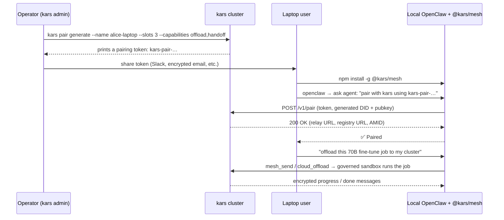

# `@kars/mesh` — the local-OpenClaw companion plugin (`mesh-plugin/`)

`@kars/mesh` is an **independently published npm package** that turns any local OpenClaw install into a mesh-federated client of a kars cluster. You install it on your laptop, pair it once to a kars cluster with a token, and from then on your local agent can:

1. Delegate heavy / long-running tasks to a governed cloud sandbox (GPU, Foundry, Content Safety, AGT — all the kars guarantees)
2. Send end-to-end-encrypted messages to other agents on the kars mesh (Signal Protocol)
3. Read its encrypted inbox
4. Discover sibling agents by name or capability

| Property | Value |
|---|---|
| **Plugin ID** | `kars-mesh` (manifest: `mesh-plugin/openclaw.plugin.json`) |
| **npm package** | `@kars/mesh` |
| **Source** | `mesh-plugin/src/` |
| **Required environment** | OpenClaw (vanilla or `nemoclaw`); Node.js 22+ |
| **No Azure account required on the laptop** | Pairing token comes from the kars cluster's operator. |

This is **not** the same as the [kars OpenClaw plugin](openclaw-plugin.md), which lives **inside** every kars-managed sandbox. `@kars/mesh` lives **outside** kars, on the user's local OpenClaw.

---

## Registered tools (8)

The plugin registers 8 tools on the local OpenClaw via `api.registerTool({...})` (source: `mesh-plugin/src/index.ts:267-485`):

| Tool | What it does |
|---|---|
| `mesh_pair` | One-time pairing: consume a `kars-pair-…` token (issued by `kars pair generate` on the operator side), generate an Ed25519 identity locally, register on the kars cluster's AgentMesh registry. After this, the local agent is a first-class mesh peer. |
| `cloud_offload` | Send the current task to a governed kars sandbox (specified by name or capability). Returns an `offload_id`. The remote sandbox executes the task under full AGT governance + Content Safety + audit chain. |
| `offload_status` | Poll the status of an in-flight offload (`pending` / `running` / `done` / `error`). |
| `offload_cancel` | Cancel an in-flight offload. |
| `mesh_send` | Send an end-to-end-encrypted message to any peer on the mesh. Signal Protocol session is owned by this plugin via its own X3DH + Double Ratchet implementation in `mesh-plugin/src/agt-transport.ts`. |
| `mesh_inbox` | Read incoming encrypted messages (decrypted plugin-side). |
| `mesh_await` | Block until a message arrives from a specific sender (with timeout). |
| `discover` | Lookup peers on the AgentMesh registry by name or capability. |

---

## Skill: `mesh-federation`

The plugin ships a single agent-facing skill at `mesh-plugin/skills/mesh-federation/SKILL.md`. The skill teaches the local LLM when to trigger offload/mesh-send/discover based on natural-language intents like:

- *"offload to the cloud"*, *"run this on Azure"*, *"ask my cluster to…"*
- *"send a message to agent X"*, *"check my inbox"*
- *"who is on the mesh"*, *"is my offload done"*

`metadata.openclaw.always: true` in the skill front-matter means OpenClaw exposes it in every session without requiring an explicit `--skill` flag.

---

## How it differs from the kars OpenClaw plugin

| Aspect | kars OpenClaw plugin (`runtimes/openclaw/`) | `@kars/mesh` (`mesh-plugin/`) |
|---|---|---|
| **Lives in** | Every kars-managed sandbox (UID 1000 inside the pod) | The user's **local** OpenClaw on a laptop / workstation |
| **Network** | Egress only via the in-pod inference router | Egress to the **kars cluster's** AgentMesh relay (over public/private endpoint depending on `kars mesh promote`) |
| **Tool set** | 24 tools (kars_*, foundry_*, http_fetch, channels) | 8 tools (pair/offload/mesh-send/discover) — a strict subset focused on outbound federation |
| **Mesh-session ownership** | Owns the local Signal session via `@microsoft/agent-governance-sdk` | Owns its own Signal session via `mesh-plugin/src/agt-transport.ts` |
| **Manifest ID** | `kars` | `kars-mesh` |
| **Installs into** | The sandbox image at build time | The user's `~/.openclaw-data/extensions/` via `npm install -g` or `npx kars-mesh` |
| **Auth** | Sandbox-level (Entra Agent ID via auth-sidecar) | One-time pairing token (`kars pair generate`) → local Ed25519 identity |

---

## Installation flow (operator + user)



For the operator-side cmds and trust-circle scope, see [Blueprint 05 — Cross-org federation](blueprints/05-cross-org-federation.md).

---

## Building and testing locally

```bash
cd mesh-plugin
npm install
npm run build       # tsc + copy skills/ + openclaw.plugin.json to dist/
npm test            # vitest (includes live agt-transport test gated on AGT_LIVE_TEST=1)
npm pack            # produces a publishable .tgz
```

A `nemoclaw` flavored build lives under `mesh-plugin/nemoclaw/` for NVIDIA NeMo / `nemoclaw` users — same TypeScript source, different policy presets, different `setup.sh` to fit the nemoclaw container shape.

---

## See also

- **[kars OpenClaw plugin](openclaw-plugin.md)** — the in-sandbox plugin (24 tools, 10 skills).
- **[Blueprint 05 — Cross-org federation](blueprints/05-cross-org-federation.md)** — the deployment shape that uses `@kars/mesh`.
- **[Runtimes → Local-OpenClaw-with-mesh pattern](runtimes.md)** — narrative around when to pick this vs. running OpenClaw inside a kars sandbox.
- **[Architecture → The mesh](architecture.md#the-mesh)** — Signal Protocol details (X3DH, Double Ratchet, relay-as-blind-router).
- **[CRD reference → KarsPairing](api/crd-reference.md)** — the pairing record the controller writes when a token is consumed.
