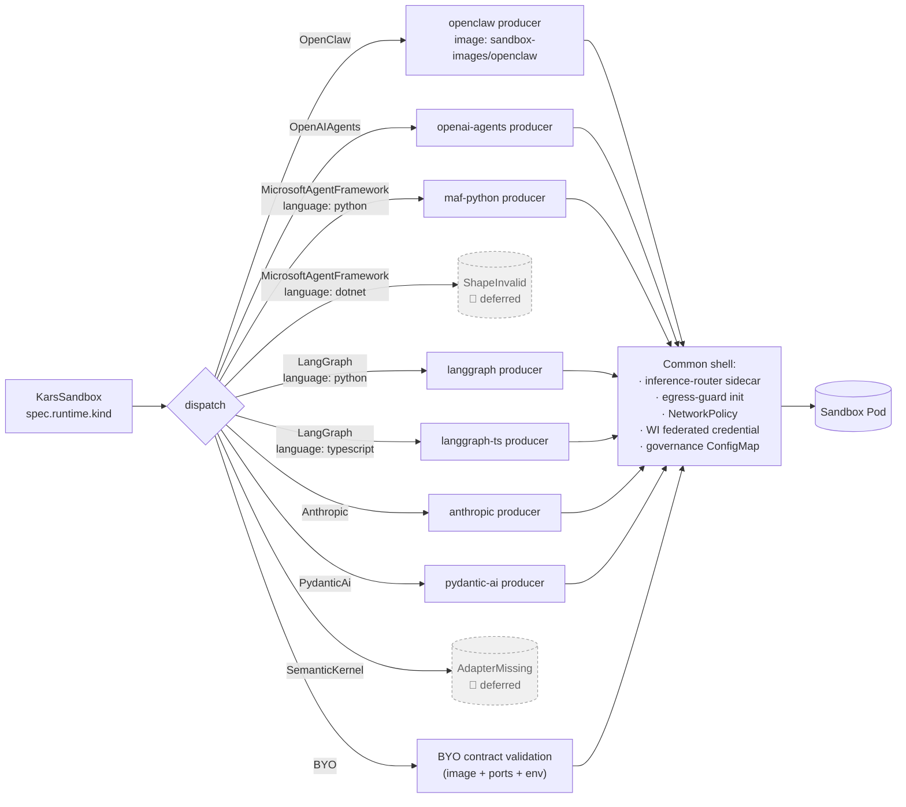

# Runtime catalog

Kars is a host for *agent runtimes*. The runtime is the framework your agent code is written against (OpenClaw, OpenAI Agents SDK, LangGraph, …) plus the small adapter that wires it to the Kars sandbox shape.

This page documents the first-class adapters that ship today and the **BYO** contract for bringing your own. The table below is the authoritative count — when a runtime is added or deferred, this table changes.

The same router, the same governance profile, the same audit chain, the same NetworkPolicy apply to all of them. Switching runtime is a one-field change in `KarsSandbox.spec.runtime.kind`.

## At a glance

| Kind | Language | Image dir | Adapter source | Status |
|---|---|---|---|---|
| `OpenClaw` | Python 3.12 | `sandbox-images/openclaw/` | `runtimes/openclaw/` | Shipping |
| `OpenAIAgents` | Python 3.12 | `sandbox-images/openai-agents/` | `runtimes/openai-agents/` | Shipping |
| `MicrosoftAgentFramework` (Python) | Python 3.12 | `sandbox-images/maf-python/` | `runtimes/maf-python/` | Shipping |
| `MicrosoftAgentFramework` (.NET) | — | — | — | **Deferred** — `language: dotnet` returns `ShapeInvalid` until the .NET AgentMesh SDK is available. |
| `LangGraph` (Python) | Python 3.12 | `sandbox-images/langgraph/` | `runtimes/langgraph/` | Shipping |
| `LangGraph` (TypeScript / Node) | Node 22 | `sandbox-images/langgraph-ts/` | `runtimes/langgraph-ts/` | Shipping |
| `Anthropic` | Python 3.12 | `sandbox-images/anthropic/` | `runtimes/anthropic/` | Shipping |
| `PydanticAi` | Python 3.12 | `sandbox-images/pydantic-ai/` | `runtimes/pydantic-ai/` | Shipping |
| `SemanticKernel` | — | — | — | **Deferred** — adapter image not built; controller emits `AdapterMissing`. |
| `BYO` | any | (your image) | (your code) | Shipping |

The CRD enum is the source of truth for which kinds exist; `controller/src/reconciler/runtime.rs` is the source of truth for which kinds resolve to a working pod.

### How dispatch works

When you `kubectl apply` a `KarsSandbox`, the reconciler reads `spec.runtime.kind` and calls a single `dispatch()` function that fans out to one producer per kind. Each producer returns a fully-formed pod plan; everything *outside* the runtime container — the inference router sidecar, the egress-guard init container, the `NetworkPolicy`, the WI federated credential — is identical across all kinds.



Verified against `controller/src/reconciler/runtime.rs:249-400` (`kind_str`, the dispatch match, and the producers for each kind). `SemanticKernel` returns `AdapterMissing` and `MicrosoftAgentFramework` with `language: dotnet` returns `ShapeInvalid` — both surface as `Degraded` conditions on the CR.

---

## Why each first-class adapter exists

A purpose-built adapter does three things you would otherwise have to do in BYO every time:

1. **Pin the model base URL to the router** — sets `OPENAI_BASE_URL`, `ANTHROPIC_BASE_URL`, etc., to `http://127.0.0.1:8443` so the SDK cannot talk to the public model endpoint directly.
2. **Replace the API key with a sentinel** — sets `OPENAI_API_KEY=ROUTED-VIA-KARS` (or equivalent). The router brokers the real credential on egress.
3. **Wire AAD broker + OTel + AgentMesh** — federated identity exchange, OpenTelemetry to your observability stack, mesh registration on bootstrap.

If your runtime SDK reads its model endpoint from one of the well-known env vars, a stock adapter is a small Python or Node entrypoint. The seven first-class adapters are short for exactly this reason.

### `OpenClaw`

Default. Uses the [OpenClaw](https://openclaw.ai) public plugin API + `tools.deny` config. **No OpenClaw source is modified, patched, or vendored.** Any upstream OpenClaw release is drop-in compatible. See **[Upstream alignment](upstream-alignment.md)** for the contract details.

The OpenClaw adapter ships two multi-agent helpers on top of the platform mesh:

- **Sub-agent inheritance.** `kars_spawn` propagates the parent's provider, model, upstream endpoint, and credential into the child container — siblings run on the same backend with no per-spawn wiring (see [architecture.md → data path](architecture.md#the-data-path-of-one-external-call)).
- **Peer roster.** Every spawn takes a `role` (e.g. `"data analyst"`, `"technical writer"`). Once two or more siblings exist the runtime auto-prepends a `Peer roster: name — role` block to every outbound `mesh_send` / `mesh_transfer_file`. Sub-agents resolve role references ("send the chart to the viz agent") against the roster instead of inventing names. Critical for `analyst → viz → writer`-style pipelines; agent-facing contract documented in `runtimes/openclaw/skills/kars-spawn/SKILL.md`.

### `OpenAIAgents`

OpenAI Agents Python SDK. The adapter pins `OPENAI_BASE_URL` to the router and substitutes a sentinel for `OPENAI_API_KEY`.

### `MicrosoftAgentFramework`

Microsoft Agent Framework (the unified successor to AutoGen v0.4). First-party AGT integration. `language: python` is wired; `language: dotnet` is deferred to a future release pending the .NET AgentMesh SDK.

### `LangGraph` (Python and TypeScript)

LangChain's stateful agent framework. The same `kind: LangGraph` covers both languages — the adapter switches on `spec.runtime.langGraph.language` (`python` or `typescript`) and selects the matching image. LangChain's model factories read `OPENAI_BASE_URL` (and provider-specific equivalents) at construction time; the adapter pins those to the router.

### `Anthropic`

Anthropic Claude Agent SDK. Pins `ANTHROPIC_BASE_URL` to the router. Foundry-side Claude tools are reachable via the platform MCP server at `/platform/mcp` since the Claude SDK supports MCP natively (`mcp_servers=[…]`).

### `PydanticAi`

Pydantic-AI is provider-agnostic; the adapter pins multiple LLM provider base URLs to the router at bootstrap. Useful when you want to unit-test agent code against a Pydantic model contract and run the same code in production.

---

## Bring your own (BYO) runtime

If your runtime is not in the list above, or you want to ship a custom container, use `kind: BYO`. You provide a container image; Kars provides the same sandbox shape, the same router, and the same policy enforcement as for the first-class runtimes.

```yaml
apiVersion: kars.azure.com/v1alpha1
kind: KarsSandbox
metadata:
  name: my-byo-agent
spec:
  runtime:
    kind: BYO
    byo:
      image: ghcr.io/me/my-agent:1.2.3
      command: ["/app/run.sh"]
      env:
        - name: MY_AGENT_CONFIG
          value: /etc/myagent/config.yaml
```

### The contract your image must satisfy

| Requirement | Why |
|---|---|
| **Run as UID 1000.** | The egress-guard initContainer assumes the agent runs as UID 1000; UID 1001 is reserved for the router. |
| **Make all external calls through `http://127.0.0.1:8443`.** | The egress-guard drops anything else. Direct calls to model endpoints, peers, or web hosts will fail. |
| **For LLM calls, use OpenAI-compatible API shape.** | The router's primary inbound surface is OpenAI-compatible (`/v1/chat/completions`, `/v1/embeddings`, …). Anthropic-shape requests are routed via `/v1/messages` if you set the right path. |
| **Honour the standard sandbox env vars.** | `KARS_ROUTER_URL`, `KARS_AGENT_NAME`, `KARS_TRUST_THRESHOLD`, `OTEL_EXPORTER_OTLP_ENDPOINT`. |
| **Do not bundle Azure credentials in the image.** | The router exchanges the projected SA token for an AAD token at request time. The agent never sees credentials. |
| **Listen on a non-privileged port if you expose anything.** | UID 1000 cannot bind <1024. |
| **No tini / supervisord magic that survives SIGTERM > 30s.** | Kubernetes will hard-kill the pod; the router will not be able to flush the audit buffer. |

### What you do *not* need to do

- You do not need to mint AAD tokens. The router does it.
- You do not need to call Content Safety. The router does it.
- You do not need to register with the AgentMesh registry. The controller does it.
- You do not need to expose anything publicly — the A2A gateway is the public face.

### Reference example

A reference BYO image (a tiny FastAPI agent) is in [`examples/byo-quickstart/`](../examples/byo-quickstart/). The README walks through building it locally, pushing it to a registry, and applying a `KarsSandbox` against it.

### Worked examples — full catalogue

Eight end-to-end examples ship under [`examples/`](../examples/README.md) — one per runtime, plus two multi-tenant attack-simulation demos:

| Example | Runtime | Shows |
|---|---|---|
| [`basic-agent`](../examples/basic-agent/) | OpenClaw | Minimal sandbox with default isolation |
| [`telegram-agent`](../examples/telegram-agent/) | OpenClaw | Channel-plugin wiring (Telegram bot) |
| [`confidential-agent`](../examples/confidential-agent/) | OpenClaw + Confidential Containers | CVM workers + attested boot |
| [`openai-agents-quickstart`](../examples/openai-agents-quickstart/) | OpenAIAgents | Unmodified OpenAI Agents SDK app |
| [`maf-quickstart`](../examples/maf-quickstart/) | MicrosoftAgentFramework | Unmodified MAF Python app |
| [`byo-quickstart`](../examples/byo-quickstart/) | BYO | Any container image under the BYO contract |
| [`demo-clawshield`](../examples/demo-clawshield/) | OpenClaw ×3 | Multi-tenant isolation proof (poisoned doc, two victim tenants) |
| [`lethal-trifecta-demo`](../examples/lethal-trifecta-demo/) | OpenClaw ×2 | Reproduces the Jan-2026 Claude Cowork file-exfiltration attack against vanilla OpenClaw vs. an Kars-managed agent — six independent layers each catch the attack. **Recommended launch demo.** |

---

## Choosing between BYO and a first-class adapter

| Reach for a first-class adapter when… | Reach for BYO when… |
|---|---|
| You are using OpenClaw, OpenAI Agents, MAF Python, LangGraph (Py/TS), Anthropic, or Pydantic-AI off the shelf. | Your runtime is something else (CrewAI, AutoGen 0.2 / 0.4 — though MAF is the unified successor — your own internal framework). |
| You want zero adapter code. | You need a custom entrypoint, custom tools, or a different language. |
| You will probably want first-class AGT / OTel / Workload-Identity wiring. | You are happy to call the router directly from your own code path. |

Both options give you the same isolation and the same governance — the difference is how much wiring you write yourself.

---

## Adding a new first-class adapter

If a runtime is popular enough that you find yourself maintaining a BYO image for it across multiple deployments, propose it as a first-class adapter. The pattern is small:

1. Add the kind to `RuntimeKind` and the per-kind config struct in `controller/src/crd.rs`.
2. Add CEL validation rules to the CRD template in `deploy/helm/kars/templates/crd.yaml`.
3. Add a default-image function and a `plan_<kind>` producer in `controller/src/reconciler/runtime.rs`.
4. Add a `runtimes/<kind>/` adapter and a `sandbox-images/<kind>/Dockerfile`.
5. Add tests; cover the kind in the manual E2E suite under `tests/e2e/`.

The existing adapters are the reference. CrewAI is tracked in the [roadmap](roadmap.md); AutoGen 0.2 is consciously not — MAF is its successor.

---

## Running OpenClaw locally and offloading to Kars (no in-cluster runtime)

The runtimes above describe agents that run **inside** an Kars sandbox pod. There is a second, complementary shape: a local OpenClaw (or OpenClaw variant, e.g. NVIDIA's `nemoclaw`) running on your laptop or a non-Kars host that uses the Kars **mesh-plugin** to delegate heavy work to a governed AKS sandbox over the encrypted mesh.

- **The local OpenClaw is not operated by Kars.** You install it yourself, configure it yourself, run it under your shell. Kars governs only the cloud-side environment that receives the offloaded task.
- **The mesh-plugin (`@kars/mesh`) installs into your local OpenClaw.** It registers the local agent on AGT, pairs to your Kars cluster with a one-time token, and exposes tools (`mesh_send`, `mesh_offload`, `mesh_transfer_file`, etc.) that your agent can call.
- **All traffic is E2E encrypted.** The relay sees only ciphertext (same Signal Protocol stack as in-cluster mesh, see [`architecture.md` → The mesh](architecture.md#the-mesh)).
- **Variants ship as flavored builds of the same plugin.** `mesh-plugin/` is the canonical `@kars/mesh` for stock OpenClaw; `mesh-plugin/nemoclaw/` is the NVIDIA NeMo / `nemoclaw` flavored build (policy presets + `setup.sh` that fits the nemoclaw container shape). The `sandbox-images/nemoclaw/Dockerfile` is the convenience image that bundles nemoclaw + the plugin together for users who want a pre-wired local container.

Setup, pairing, and troubleshooting for the local-OpenClaw-with-offload pattern live in **[`mesh-plugin/README.md`](../mesh-plugin/README.md)** — that is the operator-facing reference for this shape.

---

## See also

- **[CRD reference — `KarsSandbox`](api/crd-reference.md#karssandbox--the-agent)** — the spec field structure for each runtime.
- **[Architecture](architecture.md)** — what the router does that the runtime does not have to.
- **[Upstream alignment](upstream-alignment.md)** — how the OpenClaw integration stays drop-in compatible with upstream releases.
