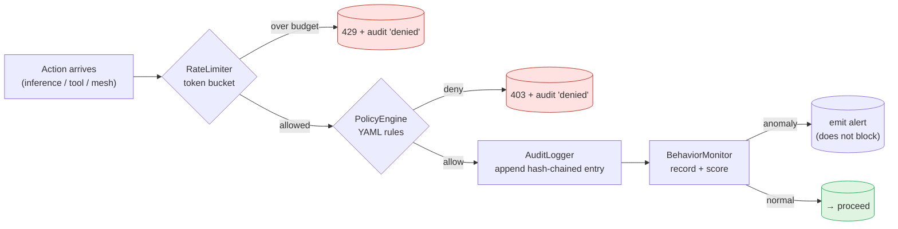

# Security model

AzureClaw is a layered control plane. Each layer enforces a specific property; together they bound the blast radius of a compromised agent. This page documents what each layer does, what it does not do, and where the relevant code lives.

For threat-model walkthroughs, see **[STRIDE](security/stride.md)** and the **[Red-team playbook](security/red-team.md)**. For the OWASP MCP Top 10 mapping, see **[`security-mcp-top10.md`](security-mcp-top10.md)**.

## The headline guarantees

1. **The agent does not see Azure credentials.** Period. Even if the model emits a perfect prompt-injection payload that exfils every byte the agent process can read, it cannot exfil an Azure key — there are none.
2. **The agent has no network of its own.** Every external call is mediated by the router, which is a different process under a different UID inside an iptables-restricted namespace.
3. **Inter-agent messages are E2E encrypted with forward secrecy.** Compromise of the AgentMesh relay does not expose any past or future message content.
4. **Every external call is audited in a tamper-evident chain.** Hash-chained, signed by the router. Any modification — including by the cluster operator — breaks the chain.

Everything below explains how those four guarantees are enforced and where the seams are.

---

## The nine layers

### Layer 0 — Azure infrastructure

- AKS API server restricted to authorised IP ranges.
- Network Security Groups on the AKS subnet.
- Azure DDoS Protection (platform).
- ACR Premium with content trust and network rules.

These are properties of the AKS deployment, not AzureClaw — but `azureclaw up` provisions them this way.

### Layer 1 — Node OS

- AKS nodes run Azure Linux (default AKS node image).
- SELinux enforcing.
- Automatic security patch updates via node image upgrades.
- No SSH access to nodes.

### Layer 2 — Pod isolation (optional VM)

For workloads that must withstand a compromised cluster operator, AzureClaw supports Kata + AMD SEV-SNP confidential containers. A `ClawSandbox` with `spec.isolation: confidential` is scheduled onto a `kata-vm-isolation` runtime class on a dedicated `katapool` node pool. Each pod runs in a lightweight VM with its own kernel; container escapes are trapped inside the VM boundary. **Sub-agents inherit isolation** — a confidential parent cannot spawn a non-confidential child.

The default isolation level is `enhanced` (no Kata; standard runc with seccomp + UID separation + egress-guard). `confidential` is opt-in.

### Layer 3 — Container hardening

Applied to every sandbox pod:

| Control | Setting |
|---|---|
| Root filesystem | Read-only (`readOnlyRootFilesystem: true`) |
| User | Non-root (`runAsNonRoot: true`) — agent UID 1000, router UID 1001 |
| Privilege escalation | Blocked (`allowPrivilegeEscalation: false`) |
| Capabilities | All dropped (`drop: [ALL]`) |
| Writable paths | `/sandbox` and `/tmp` only (emptyDir) |

### Layer 4 — Kernel confinement (seccomp)

| Isolation level | seccomp profile | Effect |
|---|---|---|
| `standard` | RuntimeDefault | Kernel default syscall filter. |
| `enhanced` (default) | Localhost `azureclaw-strict` | Custom strict allowlist. **Blocks** `mount`, `ptrace`, `bpf`, `unshare`, `setns`, `init_module`, `kexec_load`, `pivot_root`, `chroot`, `reboot`, `perf_event_open`, etc. |
| `confidential` | RuntimeDefault | Kata VM provides the boundary. |

The strict profile is installed on every node via a DaemonSet that writes `azureclaw-strict.json` to `/var/lib/kubelet/seccomp/profiles/`. The profile ships in the Helm chart at `deploy/helm/azureclaw/files/azureclaw-strict.json`.

`inotify_*` and `fsync` / `fdatasync` / `sync` are intentionally allowed — they are required by Node-based runtimes and SQLite WAL, and they are safe (filesystem permissions still govern reach).

### Layer 5 — Network segmentation

Three independent layers, by design.

1. **iptables UID-based egress guard** — the `init: egress-guard` container installs rules so that UID 1000 (agent) reaches only `localhost` + DNS, while UID 1001 (router) is unrestricted within the pod's NetworkPolicy. Even a kernel-level escape inside the agent container cannot reach arbitrary hosts.
2. **Kubernetes NetworkPolicy** — namespaced default-deny egress. Allowlist managed via `azureclaw policy allow/deny` (CRD merge patch → controller reconcile). DNS always allowed. IMDS (`169.254.169.254`) allowed for the router only.
3. **Inference-as-network-policy** — the router is the *only* code path for AI model calls. Even if the agent could reach Foundry directly (it cannot), it has no credentials. iptables + NetworkPolicy + zero credentials = three independent locks.

In addition, an auto-refreshing **domain blocklist** (OISD + URLhaus, refreshed every 6 h) blocks known-malicious destinations even from the router. Bare IP egress and high-risk TLDs (`.tk`, `.ml`, `.ga`, `.cf`, `.gq`) are blocked by default. See **[Egress proxy](egress-proxy.md)**.

### Layer 6 — Inference safety

| Control | Implementation | Default |
|---|---|---|
| Content filtering | Foundry guardrails (`Microsoft.DefaultV2`) | Always on. Server-side. |
| Jailbreak / Prompt Shield | Foundry-side | Always on. Server-side. |
| Token budgets | In-process router enforcement | Per-sandbox daily + per-request limits, HTTP 429 on overrun. |
| Audit | Prometheus metrics + signed audit chain | Always on. |

"Foundry-side" means: Content Safety is applied by the Azure AI Foundry model deployment. The router parses `prompt_filter_results` annotations from model responses and reports detected flags to the governance layer for trust scoring and audit.

### Layer 7 — Behavioural governance (AGT)

When `spec.governance.enabled: true`, AGT governance runs **natively inside the Rust router** — no sidecar, no external process. Five compiled-in modules:

| Module | What it does |
|---|---|
| `PolicyEngine` | Hot-reloaded YAML rules. Gates `exec_command`, `http_fetch`, sub-agent spawn, mesh send. |
| `TrustManager` | Ed25519 identities, 0–1000 trust score, 5 tiers, clamped ±200/update. |
| `AuditLogger` | SHA-256 hash-chained log. Tamper-detectable. Append-only. |
| `RateLimiter` | 500 req/sec global, 50/sec per-agent default. Token bucket with burst. |
| `BehaviorMonitor` | Burst detection (100/60s), failure tracking (20), denial tracking (10/60s). |

Sub-µs evaluation latency. Plugin-side AGT only handles E2E-encrypted mesh transport through `@microsoft/agent-governance-sdk`; every governance decision goes through the router.

The router exposes four provider seams (`PolicyDecisionProvider`, `AuditSink`, `SigningProvider`, `MeshProvider`), three with in-tree implementations and one (`MeshProvider`) by-design plugin-side. See **[Architecture — provider seams](architecture.md)** if you need to plug in a custom backend.

#### Per-request gate order

The governance modules don't fire as one giant blob — they run in a fixed order on every action that reaches the router (model inference, tool invocation, mesh send). Reading `Governance::evaluate_with_context` in `inference-router/src/governance/mod.rs`:



`TrustManager` is **not** on the per-request hot path — it is consulted at session establishment time on the mesh (see Layer 8) to decide whether to accept a KNOCK from a peer.

### Layer 8 — End-to-end encrypted mesh

Inter-agent communication uses [Signal Protocol](https://signal.org/docs/) (X3DH + Double Ratchet) over a small relay/registry that AzureClaw operates. The relay sees only ciphertext and routing metadata. KNOCK-gated session establishment evaluates per-peer trust score against `AGT_TRUST_THRESHOLD`.

Failed decrypt is a `security_event`, not a downgrade — there is no plaintext fallback. The cryptographic primitives are provided by the AGT mesh stack; AzureClaw no longer carries a forked AgentMesh SDK.

#### Trust tiers and the `api://agentmesh` prerequisite

`TrustManager` evaluates incoming KNOCKs against a 0–1000 score split into five tiers. Each agent registers with the AgentMesh registry under one of two tiers depending on whether it can present an Entra ID access token:

| Tier | Score floor | How the agent gets it |
|---|---|---|
| **Anonymous** | `0` | Default. No Entra token presented. Sandbox boots, registers, and operates normally — but every peer KNOCK is evaluated against score `0`. |
| **Verified** | `600` | Agent's pod identity exchanges its federated Workload Identity token for an Entra access token with audience `api://agentmesh/.default`. Registry verifies and tags the agent as Tier 1. |

To unlock the verified tier, a tenant administrator provisions an Entra app registration with `api://agentmesh` as an identifier URI and grants the AzureClaw managed identities the right to acquire tokens for it. This is a one-time, per-tenant operation. The fastest way is the AzureClaw CLI helper:

```bash
# Tenant admin runs once per tenant
azureclaw mesh setup-trust
```

It is idempotent — re-running on a tenant where the app reg already exists just prints the existing IDs and exits. See `docs/permissions.md` for the underlying `az ad app create` calls if you'd rather run them by hand.

**Until that registration exists, every sandbox runs as anonymous.** This is intentional — fail-open lets you stand up a cluster and explore the mesh without first negotiating an Entra app reg with your IT admin. The trade-off is that `AGT_TRUST_THRESHOLD` (default: `500` in production sandboxes) will reject every anonymous peer. For dev clusters or single-tenant pilots, you can either:

1. **Lower the threshold** — set `spec.governance.trustThreshold: 0` on the `ClawSandbox` to accept anonymous peers (suitable only for trusted dev environments).
2. **Provision the app registration** — the proper fix. Run `azureclaw mesh setup-trust` (idempotent; needs Application Administrator at tenant scope), or follow the manual `az` calls in `docs/permissions.md`.
3. **Use `AGT_SKIP_ENTRA=1`** — short-circuits the token-exchange retry loop entirely. The controller injects this automatically on clusters where the operator has flagged the SP as not provisioned, so sandbox boot doesn't burn ~120 s on doomed retries.

The relevant log line you will see at sandbox start is one of:

```
[entrypoint] Entra ID token acquired after N attempt(s) — agent will register as verified tier
[entrypoint] Entra: api://agentmesh SP not provisioned in tenant — skipping retries, registering as anonymous tier
[entrypoint] AGT_SKIP_ENTRA=1 — Entra token exchange disabled by operator, registering as anonymous tier
```

None of these are errors. Pick the trust-threshold strategy that matches the tier your sandboxes can actually attain.

### Layer 9 — Engineering controls (CI gates)

The properties above are only as good as the CI that protects them. Every PR runs:

- `cargo deny` (supply-chain gate, `RUSTSEC` advisories).
- `cargo audit` (dependency CVEs).
- `cargo fmt --check` + `cargo clippy -D warnings`.
- Vendored-patch audit (`ci/vendored-patch-audit.sh`) — fails the build if a vendored fork's patches are not still present.
- Copyright-header gate (369 source files, every file requires the Microsoft + MIT header).
- Bicep / Helm / Dockerfile lint.
- Trivy + container image scan.
- Bench regression (criterion).
- Manual E2E suite + Kind E2E.
- Cosign keyless OIDC verify on releases.
- CodeQL (JavaScript / TypeScript).

The full CI surface is in `.github/workflows/`.

---

## Identity & access

| Principle | Implementation |
|---|---|
| Zero standing credentials | No API keys in images, env vars, or mounted secrets in AKS mode. |
| IMDS / Workload Identity | Router exchanges the projected SA token for an AAD bearer token. |
| Per-scope token caching | HashMap keyed by resource scope, auto-refresh on expiry. |
| Credential isolation | Only UID 1001 (router) can reach IMDS; UID 1000 (agent) is blocked by iptables. |

**Required Azure RBAC roles on the kubelet identity:**

| Role | Why |
|---|---|
| Cognitive Services User | Content Safety API access. |
| Cognitive Services OpenAI User | OpenAI inference API access. |
| AcrPull | Pull sandbox images from ACR. |
| Key Vault Secrets User | Read secrets from Key Vault (when used). |

## Pod Security Standards

| Label | Value | Reason |
|---|---|---|
| `pod-security.kubernetes.io/enforce` | `privileged` | egress-guard initContainer requires `NET_ADMIN`. |
| `pod-security.kubernetes.io/audit` | `restricted` | Audit violations for post-init containers. |
| `pod-security.kubernetes.io/warn` | `restricted` | Warn on violations. |

The init container runs as root with `NET_ADMIN` to install iptables rules, then exits. All runtime containers are non-root with all capabilities dropped.

---

## What we do *not* defend against

Honesty matters. AzureClaw does not — and cannot — protect against:

- **A compromised model provider.** If Azure AI Foundry is compromised, an attacker can change model output. Content Safety on the way out limits the damage but does not eliminate it. Use the confidential isolation level for workloads where this matters.
- **A compromised cluster operator who controls Kata-less nodes.** Without Kata + AMD SEV-SNP, a cluster operator can read pod memory. Move to confidential isolation if your threat model includes the cluster operator.
- **A compromised CI / supply chain.** We add gates and pinning, but ultimately you trust your builders. See **[`docs/internal/threat-model.md`](../docs/internal/threat-model.md)** for the per-route walkthrough.
- **The model knowing your API surface.** Prompt injection is real. Treat any output from the model as untrusted; the router enforces this assumption, but you must too in your tools and plugins.
- **Inline prompt-shield filtering on GitHub Copilot (`provider: "github-copilot"`) and GitHub Models (`azureclaw dev --github-token` / `provider: "github-models"`).** Neither provider returns Foundry's `prompt_filter_results` in responses, so the router cannot enforce inline Content Safety actions on completions from either backend. Use Foundry / Azure OpenAI in any environment where inline prompt-shield is part of your threat model. The CLI logs and `~/.azureclaw/config.json` make the chosen provider explicit so this is auditable.

---

## See also

- **[Architecture](architecture.md)** — how the layers fit together.
- **[STRIDE](security/stride.md)** — the threat model.
- **[Red-team playbook](security/red-team.md)** — adversarial scenarios.
- **[Security validation](security-validation.md)** — what CI verifies.
- **[MCP top-10](security-mcp-top10.md)** — OWASP MCP Top 10 mapping.
- **[Upstream alignment](upstream-alignment.md)** — the OpenClaw extension contract.
- **[Egress proxy](egress-proxy.md)** — outbound network controls.
