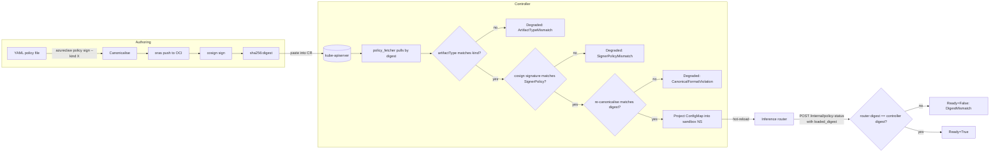

# CRD trust model

This page is the threat model and proof for AzureClaw's signed-CRD surface. The schema and per-CRD details are in **[CRD reference → Signing and verification](../api/crd-reference.md#signing-and-verification)**. This page answers three questions an SRE or security reviewer will ask:

1. **What does the signing actually defend against?**
2. **How do I prove, on a live cluster, that the runtime is enforcing what the YAML says?**
3. **What does it look like when it fails?**

The model is deliberately small. Six policy kinds use the same OCI + cosign + canonical-bytes pipeline. Two more (`A2AAgent`, `TrustGraph`) carry Ed25519 material inline. Everywhere a digest appears, the controller's compiled value must equal the router's loaded value before the CR is `Ready`. That's the entire trust contract.

## Threat model

The signing surface protects against a specific, named set of threats. It does **not** replace platform-level controls (RBAC, network policy, seccomp, the iptables egress-guard, the router L7 allow-list) — it composes with them.

| Threat | Defended by | Out of scope (defended elsewhere) |
|---|---|---|
| Attacker with **CR write access** in a tenant namespace edits the policy YAML to weaken it | OCI digest pin + cosign + `SignerPolicy` identity check. The attacker can change `bundleRef.digest`, but the controller will refuse any digest signed by an identity that does not match `SignerPolicy`. The previously-verified bundle stays in place; the router keeps enforcing it. | Stealing the signer's identity (covered by Fulcio / Sigstore / your CI's OIDC chain). |
| Attacker with **registry write access** swaps the bytes at an existing tag | Pull is **by digest**, not by tag. The registry serves whatever bytes hash to the digest — there is no swap to perform. | Compromised registry that can also forge cosign signatures (covered by `SignerPolicy` — the attacker would also need the signer's OIDC identity). |
| Attacker pushes a **valid signature from a non-trusted identity** | `SignerPolicy.identities[]` pins acceptable Fulcio issuer + SAN/subject patterns. Signature-valid + identity-mismatch fails closed with `SignerPolicyMismatch`. | Compromise of an allow-listed identity (rotate the entry in `SignerPolicy`). |
| Attacker forges the **canonical bytes** to encode a different intent than the YAML the human reviewed | The CLI's canonicalisation is **lossy and one-way** (sorted keys, normalised whitespace, kind-specific rules). The controller re-canonicalises on pull and verifies byte-equality with the manifest digest. Any drift fails `CanonicalFormatViolation`. | A canonicaliser bug that loses semantic intent (covered by the per-kind round-trip tests in `policy-canonical-format.md`). |
| Attacker with **node-level access** swaps the projected ConfigMap bytes | The router POSTs `/internal/policy-status` with the digest it just loaded; the controller compares to its compiled digest and flips `Ready=False` on mismatch. The CR will not stay `Ready` while the bytes are tampered. | Compromise of both the node and the router process (defence in depth: WI scopes, AKS audit). |
| Attacker with **runtime tool-call access** tries to bypass enforcement | The router is the only egress hop. The signed allow-list (egress / tools / inference / memory / MCP) is loaded **into the router**; ConfigMap bytes never reach the agent process. The agent cannot weaken its own policy. | Compromise of the router process (defence in depth: seccomp, iptables egress-guard, WI scopes, content safety). |
| **Old, since-revoked** policy bytes get re-served from a stale ConfigMap | Hot-reload: the router watches the ConfigMap and re-validates on every reload. There is no "trust on first load". The controller updates the projection whenever a digest, a `SignerPolicy`, or a CR `bundleRef` changes. | Operator-side tooling that bypasses kube-apiserver to write ConfigMaps directly (RBAC). |

The signing surface does **not** claim to protect against:

* A compromised signer identity that is currently listed in `SignerPolicy`.
* A bug in the canonicaliser or the router's deserialiser.
* An operator who has full cluster-admin and disables the controller.
* An attacker who can replace the controller image.

For those, see the platform-level controls in `docs/security/stride.md` and the red-team writeups in `docs/security/red-team.md`.

## The verification loop in one picture



Two crypto checks (signature + canonical bytes) and one operational check (router echo) must all pass before the CR is `Ready`. Any failure stamps a specific reason on the CR's `Degraded` / `Ready=False` condition; the previously-verified bundle stays in place.

## The operator-authoring half

The trust loop is symmetric: every digest the controller verifies has to be **produced and signed by an operator** somewhere. Two CLI surfaces cover all six signed kinds; pick the one that matches the artifact you already have.

| You have… | Use | What it does |
|---|---|---|
| A live `ClawSandbox` whose `allowedEndpoints` you want to seal (or have just edited with `--approve` / `--enforce`) | `azureclaw egress <sandbox> --enforce --sign` (or `--approve <host> --sign`) | Reads the inline allowlist, builds the canonical YAML for you, pushes via `oras`, signs with `cosign`, and patches `spec.networkPolicy.allowlistRef` in-place. Auto-detects sign mode (TTY → `keyless`, CI → `identity-token`, KMS key → `keyed`). |
| A pre-built canonical bundle on disk (any of the 6 kinds) | `azureclaw policy sign --kind <k> --file <path> --registry <r> --repository <repo>` | Pushes the bytes as the kind's pinned `artifactType`, signs the manifest digest with `cosign`, and (`--print-bundle-ref`) emits the YAML snippet for you to paste into the consuming CRD's `bundleRef`. |

Both paths end in the same place — a cosign-signed OCI artifact whose digest you (or your CI) record on the CR. Everything downstream of that digest is what the verification loop above walks.

**Operator approve-and-sign in one command (egress example):**

```bash
# After reviewing pending domains, grant one and seal the resulting allowlist
# in a single operator gesture. The CLI does canonicalise → oras push →
# cosign sign → patch ClawSandbox.spec.networkPolicy.allowlistRef.
azureclaw egress my-agent --approve api.github.com
# (--sign is implicit with --approve; pass --no-sign only for explicit
#  dry-runs — the controller refuses unsigned artifacts in authoritative mode.)
```

The same `--sign-mode` / `--sign-key` flags accepted by `policy sign` are accepted here. CI runs should pass `--sign-mode identity-token` (the workflow's OIDC token is picked up automatically when `SIGSTORE_ID_TOKEN` / `OIDC_TOKEN` is set); production usually pins a KMS key (`--sign-mode keyed --sign-key azurekms://…`).

See [docs/cli-reference.md → `azureclaw policy sign`](../cli-reference.md#azureclaw-policy) and [docs/egress-proxy.md → Signed OCI egress allowlist](../egress-proxy.md#signed-oci-egress-allowlist) for the full flag and behaviour reference.

## Proof on a live cluster

The two values that must agree are the controller's `status.bundleRefDigest` and the router's `/internal/policy-status` echo. Pick any signed-CR-backed sandbox and run:

```bash
NS=azureclaw-<sandbox>
SANDBOX=<sandbox>

# 1. The CR says it's Ready
kubectl get inferencepolicy -n "$NS" -o json \
  | jq '.items[] | {name: .metadata.name,
                    ready: (.status.conditions[]? | select(.type=="Ready") | .status),
                    digest: .status.bundleRefDigest}'

# 2. The router agrees on the digest it actually loaded
TOKEN=$(kubectl get secret router-admin-token -n "$NS" -o jsonpath='{.data.token}' | base64 -d)
kubectl exec deploy/"$SANDBOX" -n "$NS" -c inference-router -- \
  curl -sf -H "Authorization: Bearer $TOKEN" \
  http://localhost:8443/internal/policy-status \
  | jq '.policies | with_entries(.value |= {loaded_digest, source})'
```

Expected output (abbreviated):

```json
{
  "name": "shared-inference",
  "ready": "True",
  "digest": "sha256:9af1d2…"
}
{
  "inference":    { "loaded_digest": "sha256:9af1d2…", "source": "bundleRef" },
  "egress":       { "loaded_digest": "sha256:1c5e8b…", "source": "allowlistRef" },
  "tools":        { "loaded_digest": "sha256:7f30a1…", "source": "bundleRef" },
  "memory":       { "loaded_digest": "sha256:b22fee…", "source": "bundleRef" }
}
```

The pair that matters is `status.bundleRefDigest` == `policies.inference.loaded_digest`. If those agree, the bytes the cosign-verified signer signed are the bytes the router is enforcing. If they don't agree, the CR will not be `Ready` — the controller doesn't allow that state to persist.

## Negative test — what failure looks like

Failure modes are deliberately observable. Three short experiments:

### 1. Identity mismatch

Push a bundle signed by an identity that is not in `SignerPolicy.identities[]`, then point a CR at its digest:

```bash
kubectl patch inferencepolicy shared-inference -n "$NS" --type=merge \
  -p '{"spec":{"bundleRef":{"digest":"sha256:<unsigned-by-trusted-identity>"}}}'
kubectl get inferencepolicy shared-inference -n "$NS" \
  -o jsonpath='{.status.conditions[?(@.type=="Ready")]}'
```

Expected:

```json
{
  "type": "Ready",
  "status": "False",
  "reason": "SignerPolicyMismatch",
  "message": "cosign verify: no identity in SignerPolicy matched the bundle's signing identity"
}
```

The router keeps enforcing the previously-verified bundle. No traffic was ever subject to the un-trusted bytes.

### 2. Canonical-format drift

Edit the bytes between `oras push` and `cosign sign` (e.g. inject an extra field that the canonicaliser drops). The CLI will refuse to sign drifted bytes; if you bypass the CLI and craft this state by hand:

```json
{
  "type": "Ready",
  "status": "False",
  "reason": "CanonicalFormatViolation",
  "message": "re-canonicalised bytes hash to sha256:<other>; manifest digest was sha256:<orig>"
}
```

### 3. Stale router

Stop the router from reaching `/internal/policy-status` (e.g. block the bearer token). The controller will leave the CR at `Ready=Unknown` with reason `RouterEchoTimeout`, then flip to `Ready=False` after the grace window. The previously-projected bundle stays mounted; the agent keeps running against the last verified bytes; the operator is told, loudly, that the loop is broken.

## What signing does *not* fix

Two operational points it's worth being explicit about:

1. **Inline CR fields are not OCI-signed.** Most CRDs accept either a `bundleRef` or inline content (e.g. `InferencePolicy.spec.tokenBudget`, `ToolPolicy.spec.tools`). Inline content is governed by Kubernetes RBAC alone — whoever can write the CR can write the policy. The signed path is for tenants who want stronger separation of authorship (the policy bytes live in CI, signed by an OIDC identity, and the tenant only pastes the digest). Both are first-class. Pick the one whose threat model matches your team.

2. **`EgressApproval` overlays are not separately signed.** They're sibling overlays on a `ClawSandbox`'s baseline allowlist; the baseline is the signed thing. The overlay is short-lived (TTL-bounded), namespace-scoped, RBAC-gated, and its merged digest is also subject to the `Ready ⇔ router echo` rule — but the overlay itself doesn't go through OCI. This is intentional: the overlay's value is its low-friction, time-bounded shape, and putting cosign in that path would make it useless. The baseline is what carries the long-lived trust.

## See also

* **[CRD reference → Signing and verification](../api/crd-reference.md#signing-and-verification)** — the schema and per-CRD details.
* **[Policy canonical format](../api/policy-canonical-format.md)** — the per-kind canonicalisation rules.
* **[Signed CRD bundles](../architecture/crd-versioning.md)** — the OCI artifact layout and why `cosign --registry-referrers-mode=legacy`.
* **[STRIDE model](stride.md)** — the broader threat model.
* **[Red team writeups](red-team.md)** — adversarial findings from internal exercises.
