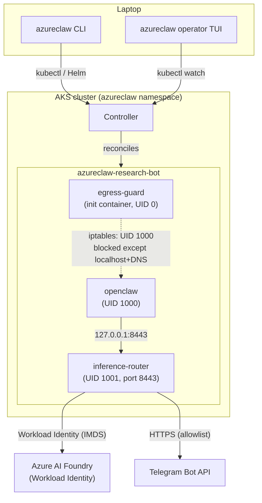
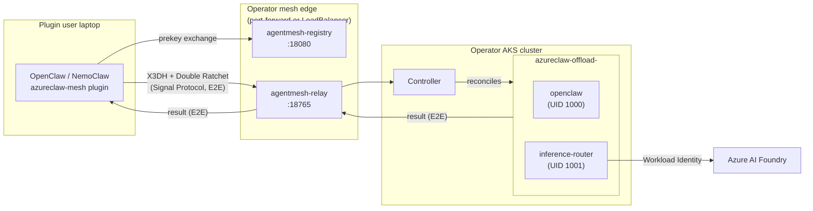
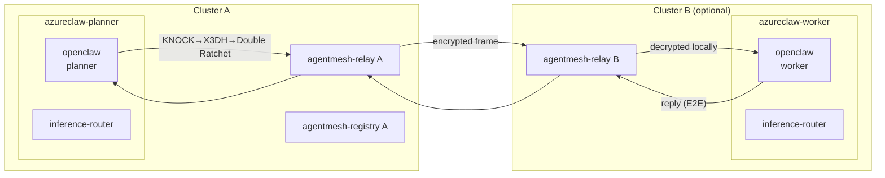
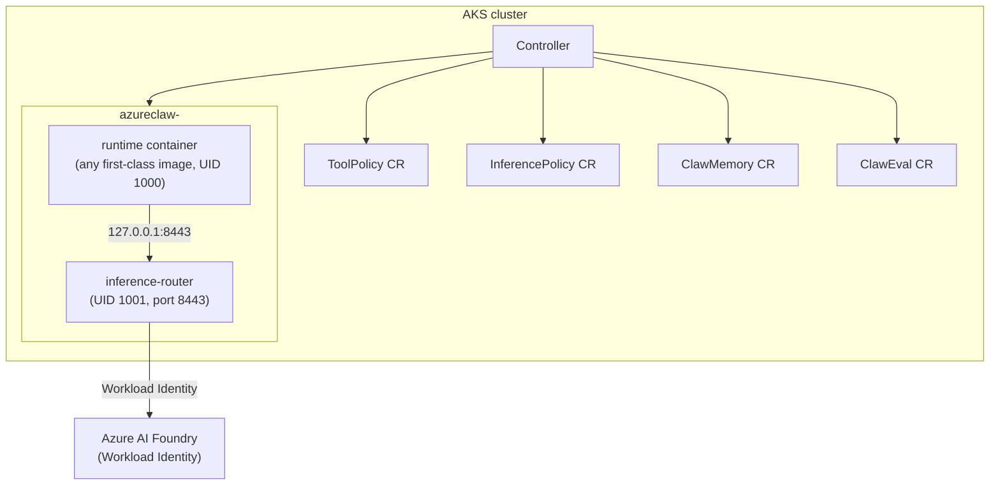
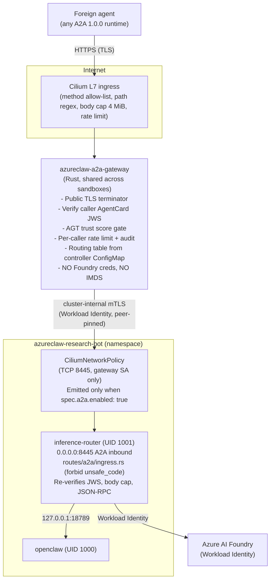
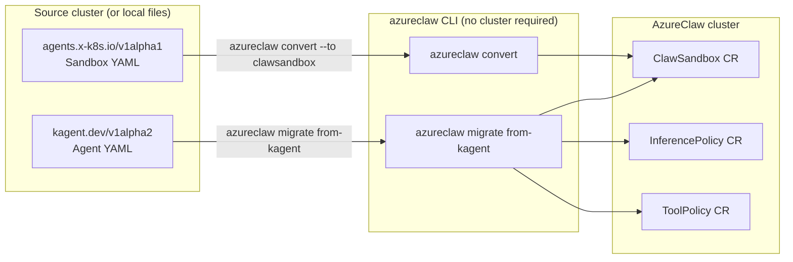

# AzureClaw Use Cases

Six fully-shipped use cases covering every deployment pattern from laptop inner-loop to cross-organisation A2A federation. All six are implemented end-to-end and exercised by the compat / conformance / e2e harness before any merge.

> **Looking for a concrete deployment recipe?** See [`docs/blueprints/`](blueprints/00-index.md) for five end-to-end deployment shapes (developer inner-loop, enterprise self-hosted, managed public offload, cross-org federation, sovereign / air-gapped) — each with topology, trust-boundary, and flow Mermaid diagrams.

| # | Scenario | Where the user runs | Network shape | Status | Reference |
|---|---|---|---|---|---|
| 1 | **AzureClaw-native agents (OpenClaw)** | AKS (operator owns the cluster) | Cluster-internal | ✅ Shipping | [`docs/architecture.md`](architecture.md) |
| 2 | **Any-OpenClaw → AzureClaw cloud offload** | Laptop / NemoClaw / any OpenClaw host (no AzureClaw CLI required) | Host ↔ AKS via AgentMesh relay (E2E-encrypted) | ✅ Shipping | See § 2 below |
| 3 | **AzureClaw ↔ AzureClaw mesh** | Two AKS-hosted agents, single or multiple clusters | Cluster ↔ cluster via AgentMesh relay (E2E-encrypted) | ✅ Shipping | See § 3 below |
| 4 | **Multi-runtime hosting** | AKS (same operator, different agent stacks) | Cluster-internal per sandbox | ✅ Shipping (OpenClaw, OpenAIAgents, MAF Python, LangGraph Py+TS, Anthropic, PydanticAi, BYO) | [`docs/runtimes.md`](runtimes.md) |
| 5 | **A2A federation across organisations** | Foreign agent anywhere; inbound via public a2a-gateway | Internet → A2A gateway → per-sandbox router (mTLS-pinned) | ✅ Shipping | [`docs/adr/0001-a2a-ingress-front-edge.md`](adr/0001-a2a-ingress-front-edge.md) |
| 6 | **Migration from kagent or `sigs/agent-sandbox`** | Source cluster (any) → AzureClaw cluster | Translate + apply | ✅ Shipping | See § 6 below |

All use cases share the same trust boundary:

- The agent process (UID 1000) **never** sees Azure credentials.
- All external traffic flows through the per-sandbox **inference router** (UID 1001).
- All inter-agent traffic flows through the **AgentMesh relay** (Signal Protocol — X3DH + Double Ratchet); the relay sees only ciphertext.
- Every tool call, inference, mesh message, and handoff is policy-evaluated by **AGT** (`PolicyDecisionProvider`) and persisted to the **audit chain** (`AuditSink`). See [§Provider seams](architecture.md#four-seam-provider-architecture).
- All 9 CRDs (`ClawSandbox`, `A2AAgent`, `McpServer`, `ToolPolicy`, `InferencePolicy`, `ClawMemory`, `ClawEval`, `TrustGraph`, `EgressApproval`) are first-class and visible in the operator TUI. `TrustGraph` is v1alpha1 reconciler-only today — see the [API reference §TrustGraph](api/crd-reference.md#trustgraph--mesh-trust-topology) for what is and isn't yet enforced at the router.

---

## 1. AzureClaw-native agents (OpenClaw)

> "I run AKS. Give me a hardened, governed AI agent I can talk to from Telegram
> or a TUI, with all access mediated by Azure AI Foundry."

### What the operator wants

A single-tenant AKS cluster running one or more OpenClaw agents in fully isolated namespaces. The operator wants the developer inner-loop (`azureclaw up`, `azureclaw add`, `azureclaw connect`) plus an operational dashboard (`azureclaw operator`) covering all 9 CRDs.

### Topology



### CLI walkthrough

```bash
# 1. Bootstrap — provisions AKS, ACR, Key Vault, Foundry, and first sandbox
azureclaw up --name research-bot --model gpt-4.1 --governance \
  --isolation enhanced

# 2. Add a second agent with a daily token budget
azureclaw add analyst --model gpt-4.1 --governance \
  --token-budget-daily 100000 --isolation enhanced

# 3. Wire Telegram to research-bot
azureclaw credentials update research-bot \
  --telegram-token "<bot-token>"

# 4. Connect (opens OpenClaw TUI via port-forward)
azureclaw connect research-bot

# 5. Operator dashboard — shows all 9 CRDs live
azureclaw operator

# 6. Learn, review, and enforce egress for analyst
azureclaw add analyst --learn-egress
azureclaw egress analyst --learned
azureclaw egress analyst --approve api.github.com
azureclaw egress analyst --enforce          # signs + patches allowlistRef

# 7. Hot-swap model; no pod restart
azureclaw model set research-bot gpt-4.1-mini

# 8. eBPF trace to confirm egress invariants
azureclaw trace research-bot --network
```

### Example `ClawSandbox` YAML

```yaml
apiVersion: azureclaw.azure.com/v1alpha1
kind: ClawSandbox
metadata:
  name: research-bot
  namespace: azureclaw-research-bot
spec:
  runtime:
    kind: OpenClaw
    openclaw:
      config:
        channels:
          telegram:
            enabled: true
  inferenceRef:
    name: research-bot-inference
  sandbox:
    isolation: enhanced
    readOnlyRootFilesystem: true
    runAsNonRoot: true
  governance:
    enabled: true
    toolPolicyRef:
      name: research-bot-policy
    trustThreshold: 500
  networkPolicy:
    defaultDeny: true
    egressMode: Strict
    allowlistRef:
      registry: azureclawacr.azurecr.io
      repository: policy/egress-allowlist/research-bot
      digest: sha256:abcdef1234567890abcdef1234567890abcdef1234567890abcdef1234567890
      artifactType: application/vnd.azureclaw.egress-allowlist.v1+yaml
  agent:
    instructions: "You are a research assistant with access to web search and code execution."
    tools:
      - web_search
      - code_interpreter
```

### Key behaviors

- One pod: **init `egress-guard`** → installs UID-1000 iptables egress block; **`openclaw`** (UID 1000) agent; **`inference-router`** (UID 1001) sole external path.
- Read-only rootfs, drop ALL caps, non-root, no privilege escalation.
- Custom strict seccomp profile (175 allowed / 41 explicit-deny syscalls).
- NetworkPolicy default-deny + 51k-domain blocklist auto-refreshed every 6 h.
- Foundry `Microsoft.DefaultV2` Content Safety + Prompt Shields on every inference.
- AGT governance: `PolicyEngine`, `TrustManager`, `AuditLogger`, `RateLimiter`, `BehaviorMonitor` (native Rust, in-process, <1 µs eval latency).
- Optional `confidential` isolation — Kata VM on AMD SEV-SNP; per-pod dedicated kernel.
- Signed OCI egress allowlists (`spec.networkPolicy.allowlistRef`) — the controller refuses unsigned artifacts when a `SignerPolicy` is configured.
- Operator TUI (`azureclaw operator`) renders all 9 CRDs in real time.

### Cross-links

| Resource | Reference |
|---|---|
| Blueprint | [Blueprint 01 — Developer inner-loop](blueprints/01-developer-inner-loop.md), [Blueprint 02 — Enterprise self-hosted](blueprints/02-enterprise-self-hosted.md) |
| CRD fields | [`spec.runtime.openclaw`](api/crd-reference.md#spcruntimeopenclaw-sub-table), [`spec.sandbox`](api/crd-reference.md#spec-fields--specsandbox), [`spec.networkPolicy.allowlistRef`](api/crd-reference.md#spec-fields--specnetworkpolicy) |
| CLI commands | [`azureclaw up`](cli-reference.md#azureclaw-up), [`azureclaw add`](cli-reference.md#azureclaw-add), [`azureclaw operator`](cli-reference.md#azureclaw-operator), [`azureclaw egress`](cli-reference.md#azureclaw-egress) |
| Architecture | [`docs/architecture.md`](architecture.md) |

---

## 2. Any-OpenClaw → AzureClaw cloud offload

> "I run OpenClaw on my laptop (or NemoClaw, or any other OpenClaw host).
> A heavy or sensitive task came in; I want to offload it to a hardened
> AKS sandbox without sharing my local credentials or installing anything
> cloud-specific."

### What the operator wants

The defining property of this scenario is that **the plugin user does not install AzureClaw**. They install the `azureclaw-mesh` plugin into their existing OpenClaw host. An AzureClaw operator runs the AKS cluster, mints a one-time pairing token, and sends it to the user over any secure channel. The walkthrough below covers the host-side pairing flow end to end.

### Topology



### CLI walkthrough — operator side (once per user)

```bash
# Expose the cluster's relay and registry to the operator's workstation
azureclaw mesh promote --port-forward

# Generate a one-time pairing token (copy-paste to the plugin user)
azureclaw pair generate \
  --name alice-laptop \
  --slots 3 \
  --expires 90d \
  --capabilities offload,handoff

# Monitor active offload sandboxes
azureclaw mesh list

# Revoke a pairing if compromised
azureclaw pair revoke alice-laptop
```

### What the plugin user does (no AzureClaw CLI)

1. Install the `azureclaw-mesh` plugin in their OpenClaw host.
2. Set `AZURECLAW_PAIRING_TOKEN=azc_pair_v1_…` **or** paste the token into chat once.
3. The plugin calls `azureclaw_pair`; performs X3DH handshake; the token is single-use and auto-zeroized.
4. Say: *"Offload `analyze_repo("/big-codebase")` to AzureClaw cloud."*

### Example `ClawSandbox` YAML (offload sub-agent — controller-generated)

The controller generates this automatically when processing an offload request. Shown here for reference:

```yaml
apiVersion: azureclaw.azure.com/v1alpha1
kind: ClawSandbox
metadata:
  name: offload-a1b2c3d4
  namespace: azureclaw-offload-a1b2c3d4
  labels:
    azureclaw.io/offload: "true"
    azureclaw.io/pairing: alice-laptop
spec:
  runtime:
    kind: OpenClaw
  inferenceRef:
    name: offload-a1b2c3d4-inference
  sandbox:
    isolation: enhanced
  governance:
    enabled: true
    toolPolicyRef:
      name: offload-a1b2c3d4-policy
  networkPolicy:
    defaultDeny: true
```

### Why this matters

- The plugin user **never** holds Azure credentials, never installs a cloud CLI, never sees a kubeconfig. Onboarding is "paste a string once."
- The token is single-use, expiring, slot-bounded, budget-bounded, and capability-bounded.
- The relay sees only ciphertext.
- Both sides emit AGT audit chain entries.
- The host's local data scope is unchanged: only what was sent in the offload task descriptor leaves the laptop.

### Cross-links

| Resource | Reference |
|---|---|
| Blueprint | [Blueprint 03 — Managed public offload](blueprints/03-managed-public-offload.md) |
| CLI commands | [`azureclaw mesh`](cli-reference.md#azureclaw-mesh), [`azureclaw pair`](cli-reference.md#azureclaw-pair) |
| CRD fields | [`ClawPairing`](api/crd-reference.md#clawpairing), [`spec.governance`](api/crd-reference.md#spec-fields--specgovernance) |

---

## 3. AzureClaw ↔ AzureClaw mesh

> "I have multiple AzureClaw agents — in one cluster, or two. I want them to
> coordinate end-to-end-encrypted, with policy + trust + audit on every hop."

### What the operator wants

Intra-org multi-agent workflows where each hop is E2E encrypted and policy-gated. For inter-org collaboration without sharing the AgentMesh relay, see [Scenario 5 (A2A federation)](#5-a2a-federation-across-organisations).

### Topology



### CLI walkthrough — single cluster

```bash
# Option A: two agents in one cluster
azureclaw add planner --model gpt-4.1 --governance
azureclaw add worker  --model gpt-4.1 --governance

# Pair them (one-shot; controller creates a ClawPairing for each direction)
azureclaw pair planner worker

# Verify trust state
azureclaw mesh status

# Connect to planner and send a message to worker
azureclaw connect planner
# In the TUI: @worker can you review this commit?
```

### CLI walkthrough — cross-cluster

```bash
# On Cluster A: expose the registry so Cluster B can see it
azureclaw up --expose-registry              # AGIC Ingress + WAF in front of registry

# Enable controller federation peer mode on both clusters
azureclaw mesh peer enable

# Generate a cross-cluster pairing token on Cluster A
azureclaw pair generate --name cluster-b-worker --slots 5 --expires 30d

# On Cluster B: consume the token
AZURECLAW_PAIRING_TOKEN=azc_pair_v1_… azureclaw mesh auth
```

### Example `ClawSandbox` YAML (peer agent)

```yaml
apiVersion: azureclaw.azure.com/v1alpha1
kind: ClawSandbox
metadata:
  name: worker
  namespace: azureclaw-worker
spec:
  runtime:
    kind: OpenClaw
  inferenceRef:
    name: worker-inference
  sandbox:
    isolation: enhanced
  governance:
    enabled: true
    toolPolicyRef:
      name: worker-policy
    trustThreshold: 500
    registryMode: global          # enables cross-cluster mesh
  networkPolicy:
    defaultDeny: true
```

### Security properties

- **No plaintext fallback.** Failed decryption drops the message and emits a `security_event`.
- **Trust scoring is queryable.** `azureclaw mesh status`, `GET /agt/trust`, operator TUI.
- **A2A 1.0.0 parallel ingress path.** When `spec.a2a.enabled: true`, the router serves a signed `/.well-known/agent.json` and accepts JSON-RPC `message/send` / `tasks/get` / `tasks/cancel` for inter-agent traffic that doesn't use the AgentMesh relay. See ADR-0001 and Scenario 5 for the public-internet variant.

### Cross-links

| Resource | Reference |
|---|---|
| Blueprint | [Blueprint 04 — Cross-org federation](blueprints/04-cross-org-federation.md) |
| CLI commands | [`azureclaw mesh`](cli-reference.md#azureclaw-mesh), [`azureclaw pair`](cli-reference.md#azureclaw-pair), [`azureclaw up --expose-registry`](cli-reference.md#azureclaw-up) |
| CRD fields | [`ClawPairing`](api/crd-reference.md#clawpairing), [`spec.governance.registryMode`](api/crd-reference.md#spec-fields--specgovernance) |
| ADR | [`docs/adr/0001-a2a-ingress-front-edge.md`](adr/0001-a2a-ingress-front-edge.md) |

---

## 4. Multi-runtime hosting

> "I'm not running OpenClaw. I'm running OpenAI Agents SDK, Microsoft Agent
> Framework, or a hand-rolled runtime. Can I get the same governance,
> isolation, and audit as OpenClaw?"

### What the operator wants — now SHIPPED

Today the platform supports seven first-class runtimes and a BYO contract for everything else. The same `ClawSandbox` CRD shape, the same `InferencePolicy` / `ToolPolicy` / `A2AAgent` / `ClawMemory` / `ClawEval` CRDs, and the same operator TUI apply regardless of runtime kind.

| `spec.runtime.kind` | Status |
|---|---|
| `OpenClaw` | ✅ |
| `OpenAIAgents` | ✅ |
| `MicrosoftAgentFramework` (Python) | ✅ (`.NET` deferred) |
| `LangGraph` (Python or TypeScript) | ✅ |
| `Anthropic` | ✅ |
| `PydanticAi` | ✅ |
| `BYO` | ✅ |
| `SemanticKernel` | 🚧 Schema reserved; adapter image not yet built (`AdapterMissing`). |

### Topology (same for all first-class runtimes)



### CLI walkthrough — OpenAI Agents SDK

```bash
# Add an OpenAI Agents runtime sandbox (OCI image carrying agent code)
azureclaw add oai-researcher \
  --runtime openai-agents \
  --model gpt-4.1 \
  --governance \
  --isolation enhanced

# Dry-run to preview the ClawSandbox YAML
azureclaw add oai-researcher --runtime openai-agents --dry-run
```

### CLI walkthrough — Microsoft Agent Framework (Python)

```bash
azureclaw add maf-support-bot \
  --runtime microsoft-agent-framework \
  --maf-language python \
  --model gpt-4.1 \
  --governance \
  --isolation enhanced
```

### CLI walkthrough — BYO runtime

```bash
# The image MUST declare the OCI label org.azureclaw.runtime.contract=v1
azureclaw add custom-agent \
  --runtime byo \
  --byo-image myacr.azurecr.io/my-agent:latest \
  --byo-contract-version v1 \
  --governance \
  --isolation enhanced
```

### Example `ClawSandbox` YAML — OpenAI Agents SDK

```yaml
apiVersion: azureclaw.azure.com/v1alpha1
kind: ClawSandbox
metadata:
  name: oai-researcher
  namespace: azureclaw-oai-researcher
spec:
  runtime:
    kind: OpenAIAgents
    openaiAgents:
      pythonVersion: "3.12"
      agentCode:
        oci:
          image: myacr.azurecr.io/oai-researcher:latest
  inferenceRef:
    name: oai-researcher-inference
  sandbox:
    isolation: enhanced
  governance:
    enabled: true
    toolPolicyRef:
      name: oai-researcher-policy
    trustThreshold: 500
  networkPolicy:
    defaultDeny: true
```

### Example `ClawSandbox` YAML — Microsoft Agent Framework (Python)

```yaml
apiVersion: azureclaw.azure.com/v1alpha1
kind: ClawSandbox
metadata:
  name: maf-support-bot
  namespace: azureclaw-maf-support-bot
spec:
  runtime:
    kind: MicrosoftAgentFramework
    microsoftAgentFramework:
      language: python
      agentCode:
        git:
          url: https://github.com/my-org/support-bot.git
          ref: main
          path: agent/
  inferenceRef:
    name: maf-support-bot-inference
  sandbox:
    isolation: enhanced
  governance:
    enabled: true
    toolPolicyRef:
      name: maf-support-bot-policy
  networkPolicy:
    defaultDeny: true
```

### Example `ClawSandbox` YAML — BYO runtime

```yaml
apiVersion: azureclaw.azure.com/v1alpha1
kind: ClawSandbox
metadata:
  name: custom-agent
  namespace: azureclaw-custom-agent
spec:
  runtime:
    kind: BYO
    byo:
      image: myacr.azurecr.io/my-agent:latest
      contractVersion: v1
      command: ["/app/agent"]
      args: ["--mode", "production"]
  inferenceRef:
    name: custom-agent-inference
  sandbox:
    isolation: enhanced
  governance:
    enabled: true
    toolPolicyRef:
      name: custom-agent-policy
  networkPolicy:
    defaultDeny: true
```

> **BYO contract requirement:** the image label `org.azureclaw.runtime.contract=v1` must be present. Images without this label are rejected at admission. See [`docs/runtimes.md`](runtimes.md) for the full contract specification.

### What you get regardless of runtime

- Same egress isolation (egress-guard init container + UID-1000 iptables rules).
- Same inference router — `InferencePolicy`, Content Safety, token budgets, Workload Identity auth.
- Same AGT governance — `ToolPolicy`, `TrustManager`, `AuditLogger`, `RateLimiter`.
- Same `ClawMemory` (Foundry Memory Store binding) and `ClawEval` CRDs.
- Same operator TUI — all 9 CRDs visible regardless of runtime kind.
- `RuntimeReady` condition reflects per-runtime health; runtime kinds without a shipped adapter stamp `False/AdapterMissing` (currently `SemanticKernel`).

### Cross-links

| Resource | Reference |
|---|---|
| CRD fields | [`spec.runtime`](api/crd-reference.md#spec-fields--specruntime), [`InferencePolicy`](api/crd-reference.md#inferencepolicy), [`ToolPolicy`](api/crd-reference.md#toolpolicy), [`ClawMemory`](api/crd-reference.md#clawmemory), [`ClawEval`](api/crd-reference.md#claweval) |
| CLI commands | [`azureclaw add --runtime`](cli-reference.md#azureclaw-add), [`azureclaw add --byo-image`](cli-reference.md#azureclaw-add) |
| BYO contract | [`docs/runtimes.md`](runtimes.md) |
| Conditions | [`RuntimeReady`, `AdapterMissing`](api/crd-reference.md#conditions-emitted) |

---

## 5. A2A federation across organisations

> "A foreign agent (LangChain, Google ADK, OpenAI Agents, AWS Bedrock) wants
> to call one of my AzureClaw sandboxes as a tool surface. I want that
> collaboration to be audited, rate-limited, and revocable without exposing
> the router to the internet."

### What the operator wants

Inbound A2A 1.0.0 traffic from external (cross-org) agents, routed through a single shared `azureclaw-a2a-gateway`, with the sandbox router **never** on the public internet. Per ADR-0001, a2a-gateway is the only public TLS endpoint; sandbox exposure is opt-in, time-bounded, and revocable in < 30 seconds.

### Topology (from ADR-0001)



### CLI walkthrough

```bash
# 1. azureclaw up deploys the a2a-gateway as part of the Helm chart (always)
azureclaw up --name research-bot --model gpt-4.1 --governance

# 2. Check the A2A schema this cluster will publish
azureclaw a2a schema

# 3. Enable inbound A2A for a specific sandbox via CRD patch (--dry-run first)
kubectl patch clawsandbox research-bot \
  -n azureclaw-research-bot \
  --type=merge \
  --dry-run=server \
  -p '{
    "spec": {
      "a2a": {
        "enabled": true,
        "allowedCallers": [
          {
            "jwsThumbprint": "sha256:abcd1234...",
            "displayName": "partner-planner",
            "issuer": "https://partner.example.com/.well-known/agent.json"
          }
        ],
        "expiresAt": "2026-05-30T00:00:00Z",
        "advertisedSkills": [
          {"name": "search.web", "description": "Web search via Bing grounding"},
          {"name": "summarize.text", "description": "Summarise documents"}
        ],
        "minimumTrustScore": 700,
        "rateLimit": {"rpm": 30, "burst": 5},
        "bodyCapBytes": 1048576,
        "sessionMaxSeconds": 60
      }
    }
  }'

# 4. Apply (no --dry-run)
kubectl patch clawsandbox research-bot \
  -n azureclaw-research-bot \
  --type=merge \
  -p '{ ... same payload ... }'

# 5. Verify exposure posture at a glance
azureclaw a2a list-exposed

# 6. Revoke: flip enabled to false — controller tears down Service + CNP
#    + gateway routing entry within one reconcile loop (< 30 s target)
kubectl patch clawsandbox research-bot \
  -n azureclaw-research-bot \
  --type=merge \
  -p '{"spec":{"a2a":{"enabled":false}}}'
```

### Example `ClawSandbox` YAML (with A2A exposure enabled)

```yaml
apiVersion: azureclaw.azure.com/v1alpha1
kind: ClawSandbox
metadata:
  name: research-bot
  namespace: azureclaw-research-bot
spec:
  runtime:
    kind: OpenClaw
  inferenceRef:
    name: research-bot-inference
  sandbox:
    isolation: enhanced
  governance:
    enabled: true
    toolPolicyRef:
      name: research-bot-policy
    trustThreshold: 500
  networkPolicy:
    defaultDeny: true
  a2a:
    enabled: true
    allowedCallers:
      - jwsThumbprint: "sha256:abcd1234abcd1234abcd1234abcd1234abcd1234abcd1234abcd1234abcd1234"
        displayName: partner-planner
        issuer: "https://partner.example.com/.well-known/agent.json"
    expiresAt: "2026-05-30T00:00:00Z"          # max 30 days; admission rejects longer windows
    advertisedSkills:
      - name: search.web
        description: Web search via Bing grounding
      - name: summarize.text
        description: Summarise documents
    minimumTrustScore: 700
    rateLimit:
      rpm: 30
      burst: 5
    bodyCapBytes: 1048576                        # 1 MiB; hard ceiling 4 MiB
    sessionMaxSeconds: 60
    allowStreaming: false
```

### Security invariants (all from ADR-0001)

- **Router never on the public internet.** The sandbox router's A2A bind (`0.0.0.0:8445`) is gated by a `CiliumNetworkPolicy` permitting TCP 8445 **only from the gateway's ServiceAccount**. A `ValidatingAdmissionPolicy` rejects any sandbox-namespace `Ingress`, `LoadBalancer` Service, or `NetworkPolicy.ingress.from.ipBlock`.
- **Module-level secret isolation.** `routes/a2a/ingress.rs` is `forbid(unsafe_code)` and structurally prohibited from importing `crate::auth::ImdsToken` or any `*Credential*` type. Enforced by `ci/a2a-module-isolation.sh`.
- **Opt-in, time-bounded, revocable.** `spec.a2a.enabled: false` tears everything down within one reconcile loop. `expiresAt` is mandatory and capped at 30 days.
- **Blast radius bounds.** A compromised foreign caller cannot reach any other sandbox, call any tool not in `advertisedSkills`, exceed `rateLimit`, or persist past `expiresAt`.
- **Audit.** Every inbound A2A call emits an audit event: caller subject, caller thumbprint, caller AGT trust score, target sandbox-id, RPC method, payload SHA-256, gateway and router latency, and decision.

### Cross-links

| Resource | Reference |
|---|---|
| Blueprint | [Blueprint 04 — Cross-org federation](blueprints/04-cross-org-federation.md) |
| ADR | [`docs/adr/0001-a2a-ingress-front-edge.md`](adr/0001-a2a-ingress-front-edge.md) |
| CRD fields | [`spec.a2a`](api/crd-reference.md#spec-fields--speca2a), [`AllowlistVerified` condition](api/crd-reference.md#conditions-emitted) |
| CLI commands | [`azureclaw a2a list-exposed`](cli-reference.md#azureclaw-a2a), [`azureclaw a2a schema`](cli-reference.md#azureclaw-a2a) |
| Architecture | [`docs/architecture/a2a-gateway.md`](architecture/a2a-gateway.md) |

---

## 6. Migration from kagent or `sigs/agent-sandbox`

> "My team already uses `kagent.dev/v1alpha2 Agent` YAMLs or
> `agents.x-k8s.io/v1alpha1 Sandbox` manifests. I want to run them on
> AzureClaw without rewriting YAML from scratch."

### What the operator wants

A translator that converts existing agent manifests into AzureClaw resource bundles, with explicit warnings for lossy fields and a dry-run path. The full field-mapping table and the three compatibility modes (`Native`, `Translate`, `Overlay`) are documented in the translator source under `cli/src/commands/migrate/`.

### Topology — migration flow



### CLI walkthrough — migrate from kagent

```bash
# Dry run first — see what would be emitted and any lossy warnings
azureclaw migrate from-kagent agent.yaml --dry-run

# Translate with enhanced isolation, write to a manifests/ directory
azureclaw migrate from-kagent agent.yaml \
  --isolation enhanced \
  --out-dir ./manifests

# From stdin (pipe from kubectl get)
kubectl get agent my-agent -n kagent-system -o yaml \
  | azureclaw migrate from-kagent -

# Allow lossy translation (fields with no AzureClaw analog are dropped with warnings)
azureclaw migrate from-kagent agent.yaml \
  --allow-lossy \
  --out-dir ./manifests

# Apply the generated manifests
kubectl apply -f ./manifests/

# Verify the sandbox came up
azureclaw status my-agent
```

### CLI walkthrough — convert from `sigs/agent-sandbox`

```bash
# Convert an upstream Sandbox YAML to a ClawSandbox (no cluster required)
azureclaw convert -f sandbox.yaml --to clawsandbox > clawsandbox.yaml

# Review diff preamble for lossy fields (mesh, policy, inference budget default to disabled)
head -20 clawsandbox.yaml

# Convert a ClawSandbox to upstream format (for cluster comparison)
azureclaw convert -f clawsandbox.yaml --to upstream-sandbox --allow-lossy

# Overlay mode: AzureClaw adds governance over an existing upstream-controller-owned pod
azureclaw convert -f sandbox.yaml --to overlay --sandbox-ref=prod/web-agent

# Switch a live sandbox to overlay mode
azureclaw migrate to-overlay my-agent --upstream-ref upstream-sandbox

# Revert to native AzureClaw (controller resumes full ownership)
azureclaw migrate to-native my-agent --dry-run
azureclaw migrate to-native my-agent
```

### Example `ClawSandbox` YAML (generated by `migrate from-kagent`)

```yaml
apiVersion: azureclaw.azure.com/v1alpha1
kind: ClawSandbox
metadata:
  name: my-agent                    # preserved from kagent Agent metadata.name
  namespace: azureclaw-my-agent     # standard AzureClaw namespace convention
  annotations:
    azureclaw.io/migrated-from: kagent.dev/v1alpha2/Agent
    azureclaw.io/migration-date: "2026-04-30"
spec:
  runtime:
    kind: OpenClaw                  # kagent-native runtimes map to OpenClaw
  inferenceRef:
    name: my-agent-inference        # emitted as a separate InferencePolicy CR
  sandbox:
    isolation: enhanced             # default from --isolation flag
    readOnlyRootFilesystem: true
    runAsNonRoot: true
  governance:
    enabled: true                   # emitted; toolPolicyRef points to generated ToolPolicy
    toolPolicyRef:
      name: my-agent-policy
  networkPolicy:
    defaultDeny: true
  upstreamCompatibility:
    sigsAgentSandbox: "off"         # Native mode; use "overlay" for co-existence
```

### Compatibility modes

| Mode | What AzureClaw does | When to use |
|---|---|---|
| `Native` (default) | AzureClaw owns all objects. No upstream CR involved. | Fresh migrations; kagent YAML fully converted. |
| `Translate` (opt-in) | AzureClaw emits an upstream `Sandbox` CR as a subresource. | Co-existence with an existing upstream controller. |
| `Overlay` (opt-in) | AzureClaw adds only governance overlay; upstream CR owns the pod. | Upstream controller must remain; add governance without pod re-ownership. |
| `Observe` | AzureClaw mirrors status of an upstream CR without overlay. | Read-only integration for auditing. |

### What is lossy

The inverse translation (`Sandbox → ClawSandbox`) drops fields with no AzureClaw analog:
- Inter-agent mesh membership
- Tool governance / policy decisions
- A2A agent-card publication
- Inference budget policy
- Confidential runtime attestation surface

All dropped fields default to `disabled` (dev-only label applied automatically) and the CLI warns the user to re-configure.

### Cross-links

| Resource | Reference |
|---|---|
| CLI commands | [`azureclaw migrate from-kagent`](cli-reference.md#azureclaw-migrate), [`azureclaw migrate to-overlay`](cli-reference.md#azureclaw-migrate), [`azureclaw convert`](cli-reference.md#azureclaw-convert) |
| CRD fields | [`spec.upstreamCompatibility`](api/crd-reference.md#spec-fields--specupstreamcompatibility) |
| Blueprint | [Blueprint 02 — Enterprise self-hosted](blueprints/02-enterprise-self-hosted.md) |

---

## What's NOT a use case

- AzureClaw is **not** a model router. Model selection sits in Foundry; `InferencePolicy` is a budget / guardrail CR, not a router.
- AzureClaw is **not** a memory backend. `ClawMemory` is a Foundry Memory Store binding CR, never an in-cluster store.
- AzureClaw is **not** a managed-MCP host for the public Microsoft-managed catalog. `McpServer` is for **AKS-hosted private/custom** tool servers; the publicly managed MCP surface stays with Foundry.
- AzureClaw is **not** a SaaS agent author. Agent authoring lives in Microsoft 365 Agent Framework / Copilot Studio. AzureClaw is the AKS runtime substrate; M365 Copilot Studio agents can invoke AzureClaw-hosted MCP servers as a tool surface.
- AzureClaw ships first-class adapters for `OpenClaw`, `OpenAIAgents`, `MicrosoftAgentFramework` (Python), `LangGraph` (Python and TypeScript), `Anthropic`, `PydanticAi`, plus `BYO`. `SemanticKernel` and `MicrosoftAgentFramework` (`language: dotnet`) are in the schema but the adapters are not yet built — the controller stamps `RuntimeReady=False/AdapterMissing` (or `ShapeInvalid` for the .NET variant) so the operator knows immediately rather than silently booting broken sandboxes. See [Runtime catalog](runtimes.md).
