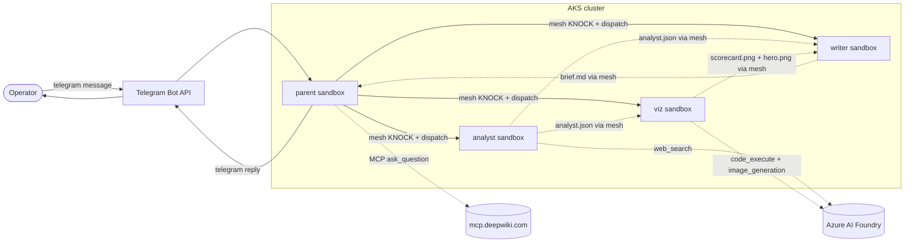
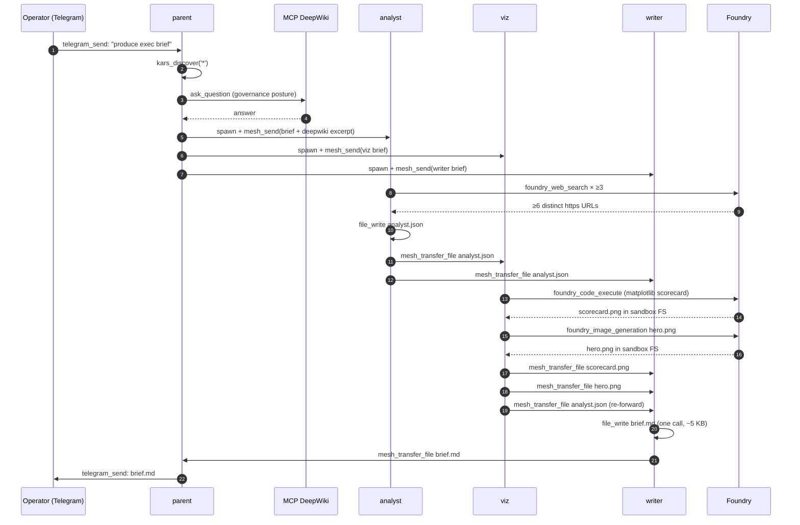

# Exec-brief walkthrough — a four-agent showcase

This page walks a real, reproducible end-to-end scenario: **one parent agent orchestrates three sub-agents to produce a two-page executive brief on the 2026 state of agentic AI runtimes.** It exists for one reason: when somebody asks "what does kars actually do, and what is it enforcing for me?", this is the answer you can point at, run, and observe.

The scenario lives at [`tools/e2e-harness/scenarios/exec-brief/`](https://github.com/Azure/kars/tree/main/tools/e2e-harness/scenarios/exec-brief). It currently runs on AKS. The platform matrix below is honest about what works where today.

## Scenario in one sentence

A `parent` agent receives a prompt, spawns three sub-agents (`analyst`, `viz`, `writer`), each does its slice (web search + JSON build, chart + hero image, two-page markdown brief), files flow over the encrypted mesh, and the writer's output is sent back to the parent which delivers it via Telegram.

The pipeline exercises, on purpose, every enforcement layer worth talking about: signed CRDs, the iptables egress-guard, the router L7 allow-list, content safety, mesh E2E encryption, Foundry hosted-tool calls, MCP, the seccomp profile, and the per-sandbox NetworkPolicy.

## What you see at the top



Every arrow that leaves a sandbox box is enforced by the runtime. Section "Per-layer proof" below shows the artefacts.

## The four agents and what each one calls

| Agent | Tools used | Output |
|---|---|---|
| `parent` | `kars_discover`, `kars_spawn`, `kars_mesh_send`, `kars_mesh_await`, MCP `ask_question` (DeepWiki), `telegram_send_message` | Dispatch + final delivery |
| `analyst` | `foundry_web_search` × ≥3 queries, `file_write`, `kars_mesh_transfer_file` × 2 | `analyst.json` (≤4 KB) with trends, control categories, runtimes, metrics |
| `viz` | `kars_mesh_await`, `file_read`, `foundry_code_execute` (matplotlib), `foundry_image_generation`, `kars_mesh_transfer_file` × 3 | `scorecard.png` (1024×640 grouped bar chart), `hero.png` (1024×1024 generated image) |
| `writer` | `kars_mesh_await`, `file_read`, `file_write`, `kars_mesh_transfer_file` × 1 | `brief.md` (~700–800 words, two pages) |

The choice of tools is deliberate: the scenario is meant to make at least one of each category fire (MCP, web search, sandboxed code execution, hosted image generation, sandbox FS, encrypted mesh, channel egress). The harness's [`verify.py`](https://github.com/Azure/kars/blob/main/tools/e2e-harness/verify.py) checks all nine acceptance conditions and exits non-zero if any layer is silent.

## The 4-agent sequence



Each `mesh_send` and `mesh_transfer_file` is an X3DH KNOCK + Double-Ratchet message via the AgentMesh relay; the relay only sees encrypted blobs. The parent is the only agent with Telegram channel access; the sub-agents have none.

## Per-layer proof

The point of the showcase is not "look, the agents talked to each other". The point is: **every claim kars makes about defence in depth shows up as an artefact you can read.** For each enforcement layer below, the proof is a concrete command you run and what you see.

### 1. Signed CRDs — what's enforced is what's signed

```bash
# Pick any signed-CRD-backed policy and check the Ready/Reason/Message triple.
# The controller flips Ready=True only after every referencing sandbox's
# inference-router has echoed back the digest it actually loaded.
kubectl get inferencepolicy execbrief-inference -n kars-system -o json \
  | jq '{name: .metadata.name,
         ready:   (.status.conditions[]|select(.type=="Ready")|.status),
         reason:  (.status.conditions[]|select(.type=="Ready")|.reason),
         message: (.status.conditions[]|select(.type=="Ready")|.message)}'
```

<details><summary>Live output from this scenario</summary>

```json
{
  "name": "execbrief-inference",
  "ready": "True",
  "reason": "RouterEnforcing",
  "message": "all 4 referencing sandbox router(s) confirmed inference-policy digest"
}
```

Same shape for the `ToolPolicy`:

```json
{
  "name": "execbrief-toolpolicy",
  "ready": "True",
  "reason": "RouterEnforcing",
  "message": "all 4 referencing sandbox router(s) confirmed agt-profile digest"
}
```

`RouterEnforcing` is the success terminal — the controller's compiled bytes match the router's `/internal/policy-status` echo on every one of the 4 sandboxes referencing this policy. If those drift, the condition flips to `Ready=False` with `reason=DigestMismatch` and the previously-verified bundle stays mounted.
</details>

`status.bundleRefDigest` equals `policies.inference.loaded_digest` on each sandbox's router — see **[CRD trust model](../security/crd-trust-model.md)** for the full verification loop and negative tests. If those drift, the CR will not be `Ready`. Inline-spec policies (no `bundleRef`) follow the same controller-→-router echo path — only the supply-chain provenance differs.

The producer half of the loop is just as concrete. Each sandbox's egress allowlist was sealed by the operator with a single command before enforcement turned on; the same `--enforce --sign` / `--approve --sign` shape works for incremental updates:

```bash
# Author + sign the analyst's allowlist in one gesture (canonicalise →
# oras push → cosign sign → patch KarsSandbox.spec.networkPolicy.allowlistRef).
kars egress execbrief-analyst --enforce \
  --registry myacr.azurecr.io \
  --repository policy/egress-allowlist/execbrief-analyst
# Auto-detects sign mode (TTY → keyless, CI → identity-token,
# add --sign-mode keyed --sign-key azurekms://... for production).
```

The four other signed kinds (`ToolPolicy`, `InferencePolicy`, `KarsMemory`, `McpServer`, `KarsEval`) follow the generic surface — see [CRD trust model → operator-authoring half](../security/crd-trust-model.md#the-operator-authoring-half).

### 2. iptables egress-guard — kernel-level outbound firewall

Every sandbox pod has an `egress-guard` init container that installs iptables rules restricting UID 1000 (the agent process) to loopback + DNS + a NAT-redirect of TCP/80,443 → `127.0.0.1:8444`. The agent process **cannot** open a direct TCP connection to anything else — the kernel drops it. (Exec into the agent container itself is blocked by a `ValidatingAdmissionPolicy`, so the proof is the init-container spec; the rules in `command` are what actually got applied.)

```bash
kubectl get pod -n kars-analyst \
  -l kars.azure.com/sandbox=analyst \
  -o json | jq '.items[0].spec.initContainers[]
                | select(.name=="egress-guard")
                | {securityContext, command: .command[2]}'
```

<details><summary>Live output from this scenario</summary>

```json
{
  "securityContext": {
    "capabilities": { "add": ["NET_ADMIN", "NET_RAW"], "drop": ["ALL"] },
    "runAsNonRoot": false,
    "runAsUser": 0,
    "seccompProfile": { "type": "Unconfined" }
  },
  "command": "iptables -A OUTPUT -m owner --uid-owner 1000 -o lo -j ACCEPT && iptables -A OUTPUT -m owner --uid-owner 1000 -p udp --dport 53 -j ACCEPT && iptables -A OUTPUT -m owner --uid-owner 1000 -p tcp --dport 53 -j ACCEPT && iptables -A OUTPUT -m owner --uid-owner 1000 -m conntrack --ctstate ESTABLISHED,RELATED -j ACCEPT && iptables -A OUTPUT -m owner --uid-owner 1000 -j DROP && iptables -t nat -A OUTPUT -m owner --uid-owner 1000 ! -o lo -p tcp --dport 80 -j REDIRECT --to-port 8444 && iptables -t nat -A OUTPUT -m owner --uid-owner 1000 ! -o lo -p tcp --dport 443 -j REDIRECT --to-port 8444 && echo 'egress-guard: UID 1000 → transparent proxy on :8444 (learn + enforce)'"
}
```

The init container is short-lived and privileged on purpose — it installs the filter + NAT chain and exits. From that point on, the long-running `openclaw` container runs unprivileged at UID 1000 and is subject to the rules. The exact `OUTPUT` filter chain (DNS/loopback ACCEPT, everything else DROP) plus the `nat OUTPUT` REDIRECT to `:8444` are visible in the `command` string above.
</details>

This layer is independent of the K8s NetworkPolicy and the L7 allow-list. The agent runs at UID 1000; no amount of in-process trickery can route around iptables.

### 3. Router L7 allow-list — by-hostname forward proxy

The redirected traffic lands at the inference-router on `127.0.0.1:8444`. The router checks the destination hostname against the projected allow-list ConfigMap (the same OCI + cosign pipeline as everything else when `allowlistRef` is set; inline `allowedEndpoints` in this scenario):

```bash
# Parent — has Telegram + DeepWiki
kubectl get configmap karssandbox-execbrief-egress-allowlist \
  -n kars-execbrief -o jsonpath='{.data.allowlist\.json}' | jq

# Analyst — no Telegram, no DeepWiki
kubectl get configmap karssandbox-analyst-egress-allowlist \
  -n kars-analyst -o jsonpath='{.data.allowlist\.json}' | jq
```

<details><summary>Live output from this scenario</summary>

```json
// parent (execbrief)
{
  "schemaVersion": 1,
  "endpoints": [
    {"host": "api.telegram.org",  "port": 443},
    {"host": "mcp.deepwiki.com", "port": 443}
  ]
}

// analyst
{
  "schemaVersion": 1,
  "endpoints": []
}
```

`analyst`'s endpoint list is **empty** — everything outbound goes through Foundry hosted tools (the inference-router authenticates as its Workload Identity; the agent never sees an API key), so no direct host needs to be allowed. The parent has exactly two: `api.telegram.org` (its only channel) and `mcp.deepwiki.com` (its single declared MCP server). Any other host the agent's plugin tries to dial returns a 403 from the router with `egress.deny` in the audit log.
</details>

The `analyst`'s allow-list does **not** include `api.telegram.org` — only `parent`'s does. So even if `analyst` were compromised, it could not directly post to Telegram; it would have to route the message through `parent` via the mesh, and `parent`'s `ToolPolicy` decides whether `telegram_send_message` is exposed. This is a textbook capability split.

### 4. K8s NetworkPolicy — ingress isolation

```bash
kubectl get netpol sandbox-policy -n kars-analyst -o json \
  | jq '.spec | {policyTypes, ingress, podSelector}'
```

<details><summary>Live output from this scenario</summary>

```json
{
  "policyTypes": ["Ingress"],
  "podSelector": {
    "matchLabels": {
      "kars.azure.com/component": "sandbox"
    }
  },
  "ingress": [
    {
      "from": [{"namespaceSelector": {"matchLabels": {"kars.azure.com/role": "sandbox"}}}],
      "ports": [
        {"port": 8443,  "protocol": "TCP"},
        {"port": 18789, "protocol": "TCP"},
        {"port": 18791, "protocol": "TCP"}
      ]
    },
    {
      "from": [{"namespaceSelector": {"matchLabels": {
        "app.kubernetes.io/component": "system",
        "app.kubernetes.io/name":      "kars"
      }}}],
      "ports": [{"port": 8443, "protocol": "TCP"}]
    }
  ]
}
```

Two ingress sources, no `egress` clause (egress is controlled by the iptables guard + the router L7 allow-list in layers 2 + 3, not duplicated here): peer **sandbox** namespaces may reach inference (`8443`) + OpenClaw gateway (`18789`) + mesh listener (`18791`); the **operator** namespace `kars-system` may reach `8443` for the controller's `/internal/policy-status` echo. The policy is enforced by Cilium on AKS and by `kindnet` on local-k8s.
</details>

It is enforced by the Cilium dataplane on AKS clusters labelled `kubernetes.azure.com/network-policy: cilium`. *(Egress was historically dropped in field-ownership drift; the [NP-egress fix](https://github.com/Azure/kars/pull/336) consolidated this into a single SSA.)*

### 5. Mesh E2E encryption — relay sees ciphertext only

The four sandboxes register with the AgentMesh registry, exchange X3DH key bundles, and run a Double Ratchet for every message. The relay only forwards encrypted blobs. Proof:

```bash
# Relay's /health surfaces counters but no plaintext.
kubectl exec -n agentmesh deploy/relay -- \
  sh -c 'curl -sf http://localhost:8083/health' | jq
```

<details><summary>Live output from this scenario</summary>

```json
{
  "status": "healthy",
  "service": "agentmesh-relay",
  "connected_agents": 6,
  "stats": {
    "messages_routed":   511,
    "messages_stored":   0,
    "messages_delivered": 0
  }
}
```

`connected_agents: 6` is the 4 exec-brief sandboxes + 2 background test agents; the relay knows their DIDs and current ratchet state, but every byte it has routed has been ciphertext. `messages_routed: 511` includes KNOCK + X3DH + `mesh_send` + 30 s heartbeats; `messages_stored: 0` means no delivery was deferred (everyone was online); `messages_delivered: 0` is the offline-replay counter — irrelevant in a healthy cluster.
</details>

The KNOCK handler on the receiver decides whether to accept based on the `TrustGraph` projection and the sandbox's `governance.trustThreshold`. Sub-agents inherit the parent's spawn relationship as a baseline affinity boost; siblings are not auto-trusted.

### 6. Foundry hosted tools — workload-identity, no API keys

`foundry_web_search`, `foundry_code_execute`, and `foundry_image_generation` are dispatched by the router using the per-sandbox Workload Identity. The agent process never sees a Foundry API key — only the router does. Proof comes from the pod spec (exec into the `openclaw` container is blocked by `ValidatingAdmissionPolicy/kars-sandbox-exec-ban`, so we read the spec):

```bash
# agent (openclaw) container — must NOT contain a key
kubectl get pod -n kars-viz -l kars.azure.com/sandbox=viz -o json \
  | jq -r '.items[0].spec.containers[]
           | select(.name=="openclaw")
           | .env[]?
           | select(.name|test("AZURE_OPENAI_API_KEY|OPENAI_API_KEY|FOUNDRY_KEY"))
           | .name' | sort -u
# (empty above = openclaw has no Foundry credential)

# router (inference-router) container — IS the credential holder
kubectl get pod -n kars-viz -l kars.azure.com/sandbox=viz -o json \
  | jq -r '.items[0].spec.containers[]
           | select(.name=="inference-router")
           | .env[]?
           | select(.name|test("AZURE_OPENAI|FOUNDRY"))
           | .name' | sort -u
```

<details><summary>Live output from this scenario</summary>

```text
# agent (openclaw):
(empty — no API_KEY-bearing env var)

# router (inference-router):
AZURE_OPENAI_API_KEY
AZURE_OPENAI_DEPLOYMENT
AZURE_OPENAI_ENDPOINT
FOUNDRY_ENDPOINT
FOUNDRY_PROJECT_ENDPOINT
```

Both containers see the **endpoint** (URL only — needed for OTel attributes on the agent side); only the router sees `AZURE_OPENAI_API_KEY`. The router is the credential boundary. On AKS the API key is replaced by an IMDS-acquired Workload Identity token whose audience is `https://ai.azure.com/`; the local-k8s scenario above uses a static key for dev convenience but the split between agent and router is identical.
</details>

The router signs every Foundry call with an IMDS-acquired token whose audience is `https://ai.azure.com/`. The Memory Store + Content Safety floor + per-request token budget all fire on the router side, before the bytes leave the cluster.

### 7. seccomp profile — syscall blast-radius

Each agent container runs unprivileged with all capabilities dropped, a read-only root filesystem, and `allowPrivilegeEscalation: false`. The pod-level seccomp profile is `RuntimeDefault` (set on the PodSpec; per-container override is `nil`, so they all inherit).

```bash
kubectl get pod -n kars-analyst -l kars.azure.com/sandbox=analyst -o json \
  | jq '.items[0].spec
        | {podSeccompProfile: .securityContext.seccompProfile,
           agentSecurityContext: (.containers[]|select(.name=="openclaw")|.securityContext)}'
```

<details><summary>Live output from this scenario</summary>

```json
{
  "podSeccompProfile": { "type": "RuntimeDefault" },
  "agentSecurityContext": {
    "allowPrivilegeEscalation": false,
    "capabilities":            { "drop": ["ALL"] },
    "readOnlyRootFilesystem":  true,
    "runAsUser":               1000
  }
}
```

`RuntimeDefault` blocks the kernel's blast-radius syscalls (`mount`, `ptrace`, `unshare`, `bpf`, `module_*`, `keyctl`, `kexec_*`, `init_module`, `delete_module`, `personality`, etc.) by default. `capabilities.drop: ["ALL"]` revokes every Linux capability (so even if a privesc bug surfaced, there's nothing to escalate **to**). `readOnlyRootFilesystem: true` removes the most common persistence vector. The agent runs as UID 1000 (the same UID the iptables guard binds its rules to — these two layers compose).
</details>

### 8. MCP — only what's declared

`parent`'s `McpServer/execbrief-deepwiki` declares the DeepWiki endpoint and OAuth issuer. The router exposes its tools as `execbrief_deepwiki.ask_question` etc.; any other MCP host the agent tries to dial is denied at the router. The sub-agents have **no** `mcpServerRefs` — they cannot call MCP at all. (`analyst`'s prompt explicitly says "Do NOT attempt any MCP tools — they are not available in your sandbox; web_search is sufficient.")

```bash
kubectl get karssandbox execbrief -n kars-system \
  -o jsonpath='{"parent: "}{.spec.governance.mcpServerRefs}{"\n"}'
kubectl get karssandbox analyst -n kars-system \
  -o jsonpath='{"analyst: ["}{.spec.governance.mcpServerRefs}{"]\n"}'
```

<details><summary>Live output from this scenario</summary>

```text
parent:  [{"name":"execbrief-deepwiki"}]
analyst: []
```

The parent has exactly one MCP server declared. The analyst has **none** — there is no shape of agent-side prompt injection that could make it call an MCP tool, because the router has nothing wired up to dispatch to. The same is true for `viz` and `writer`.
</details>

### 9. Telegram channel — only the parent

`parent` has the `telegram-credentials` Secret mounted; the sub-agents do not. The `telegram_send_message` tool is registered only in `parent`'s plugin set. This is enforced by the controller's pod-spec generation (Secret `envFrom` is conditional on the channel flag), not just by convention.

```bash
for ns in kars-execbrief kars-analyst kars-viz kars-writer; do
  printf '%-22s' "$ns"
  kubectl get secret telegram-credentials -n "$ns" \
    -o jsonpath='{.metadata.name}{"\n"}' 2>&1 \
    | sed 's/^Error from server.*/(none)/'
done
```

<details><summary>Live output from a Telegram-wired cluster</summary>

```text
kars-execbrief    telegram-credentials
kars-analyst      (none)
kars-viz          (none)
kars-writer       (none)
```

Only the parent has the Secret mounted, which means only the parent's `inference-router` and `openclaw` containers see `TELEGRAM_BOT_TOKEN`. The `entrypoint.sh` auto-config logic short-circuits the Telegram channel registration when that env var is unset, so the sub-agents' plugin sets do not even list `telegram_send_message`. The capability is structurally absent — not just denied at policy evaluation time. *(On a cluster without Telegram wired at all, every namespace shows `(none)` and the parent's plugin set drops the Telegram tool too.)*
</details>

## Platform support — what runs where today

This scenario has been validated **9/9 PASS on both AKS and local-k8s**. The platform matrix below is honest about what already works on each platform and what's pending.

| Layer | AKS | `local-k8s` (kind + controller) | `docker` (single-host) |
|---|---|---|---|
| Signed-CRD verification (controller + router echo) | ✅ | ✅ (same controller image, same cosign chain) | n/a (no CRDs; router still loads signed bundles from disk) |
| iptables egress-guard (init container) | ✅ | ✅ | ✅ (requires NET_ADMIN on the container — granted by `kars dev`) |
| Router L7 allow-list | ✅ | ✅ | ✅ (mounted from disk, same allow-list shape) |
| K8s NetworkPolicy ingress | ✅ (Cilium dataplane) | ✅ (kindnet enforces NetworkPolicy — verified via PodMonitor allow-list) | n/a |
| Mesh E2E encryption | ✅ (cluster-internal relay) | ✅ (local relay + registry in the kind cluster) | ✅ (local relay + registry as docker containers) |
| Foundry hosted tools | ✅ (Workload Identity) | ⚠ (works if you wire an Azure connection string; no WI inside kind) | ⚠ (same — works with an env-var key for dev only) |
| seccomp profile | ✅ | ✅ | ⚠ (depends on docker's default seccomp; matches AKS for `RuntimeDefault`) |
| Telegram + other channels | ✅ | ✅ | ✅ |
| Observability (Prometheus + Grafana + Headlamp plugin) | ⚠ (Azure Monitor managed Prometheus — wiring pending) | ✅ (bundled with `kars dev`) | n/a |

The reproducible end-to-end harness now runs on **AKS** and **local-k8s** (kind + controller). The `docker` platform is scaffolded in `tools/e2e-harness/platforms/docker.sh` and pending its first 9/9 validation run.

## What you can see while it runs (Headlamp + Grafana)

The four sub-agents and their inter-agent traffic are observable end-to-end without any extra setup on local-k8s — `kars dev` installs Prometheus + Grafana + the kars Headlamp plugin on first run.

| View | URL (after `kars dev`) | Shows |
|---|---|---|
| Headlamp → kars → **Overview** | `http://localhost:4466/` | Cluster-wide rollup: sandbox count, aggregate token budget vs spend, AGT decisions over time. |
| Headlamp → kars → **Mesh Topology** | same | Parent → sub-agent hierarchy as a live SVG. Edge thickness ∝ mesh-message rate; two-direction animated pulses (yellow=sent, light-blue=received) show real KNOCK + X3DH + `mesh_send` + heartbeat traffic; node labels show lifetime `↑sent ↓recv` counts. Controllers are decorated with `N children · M trust` from the AGT trust graph. |
| Headlamp → any **KarsSandbox** | same | Per-sandbox detail page with the embedded Grafana ops dashboard filtered to that sandbox, plus a Token Budget card backed by `kars_tokens_total` and `TOKEN_BUDGET_DAILY`. Dark-mode aware. |
| Grafana — "kars — Agent Fleet Operations" | `http://localhost:3000/d/kars-ops` | Enterprise NOC layout: fleet health (req/sec, error rate, P95, 24h tokens, est. cost), token & cost economy, latency SLO heatmap, AGT decisions over time with color-coded allow/deny/approval/rate-limit, bundle health matrix. |
| Grafana — "kars — Sandbox Fleet Overview" | `http://localhost:3000/d/kars-fleet` | Simpler 10-panel quick fleet view. |
| Prometheus | `http://localhost:19091/` | Ad-hoc PromQL — `kars_tokens_total`, `kars_mesh_messages_{sent,received}_total`, `kars_agt_policy_evaluations_total{decision}`, `agentmesh_relay_*`. |

The mesh traffic counters (`kars_mesh_messages_sent_total` / `kars_mesh_messages_received_total`) are emitted by the router and count KNOCK + X3DH + `mesh_send` + 30s heartbeats. They exclude WS Ping/Pong by design — see [`.github/skills/agt-e2e-encryption/SKILL.md`](../../.github/skills/agt-e2e-encryption/SKILL.md) for the full counter semantics. On AKS the same metrics flow via Azure Monitor managed Prometheus (wiring pending).

## Running it yourself

`kars dev` on **local-k8s** brings up the whole stack — controller + sandbox + AGT relay + Headlamp + Prometheus + Grafana — and the exec-brief harness can then be pointed at the running cluster:

```bash
# from repo root
kars dev --target local-k8s        # ~3-4 min on first run (kube-prometheus-stack image pulls)
# observe at http://localhost:4466/ (Headlamp), http://localhost:3000/ (Grafana)

cd tools/e2e-harness
SCENARIO=exec-brief PLATFORM=local-k8s ./run.sh
```

For **AKS**, prerequisites: an AKS cluster with kars installed (`make install`), a Telegram bot token, and an Azure AI Foundry project with web-search + code-execute + image-generation enabled. Then:

```bash
cd tools/e2e-harness
SCENARIO=exec-brief PLATFORM=aks ./run.sh
# (run.sh chains monitor + drive + verify)
```

A passing run looks like `9/9 PASS` on stdout and `verify.json` with each check's evidence. The full transcript, JSONL trace, and any artifacts the agents produced are in `out/<timestamp>/`. While the run is in progress, the Headlamp Mesh Topology view animates the parent→sub-agent traffic in real time.

## See also

* **[CRD reference](../api/crd-reference.md)** — the schema for every CRD this scenario uses.
* **[CRD trust model](../security/crd-trust-model.md)** — the threat model and verification proof for the signed CRDs above.
* **[Architecture](../architecture.md)** — the prose explanation of how the controller, router, and runtime fit together.
* **[AGT boundary](../architecture/agt-boundary.md)** — what the runtime delegates to the Agent Governance Toolkit and what stays in kars.
* **[Security overview](../security.md)** — the catalog of layered controls this scenario exercises.
